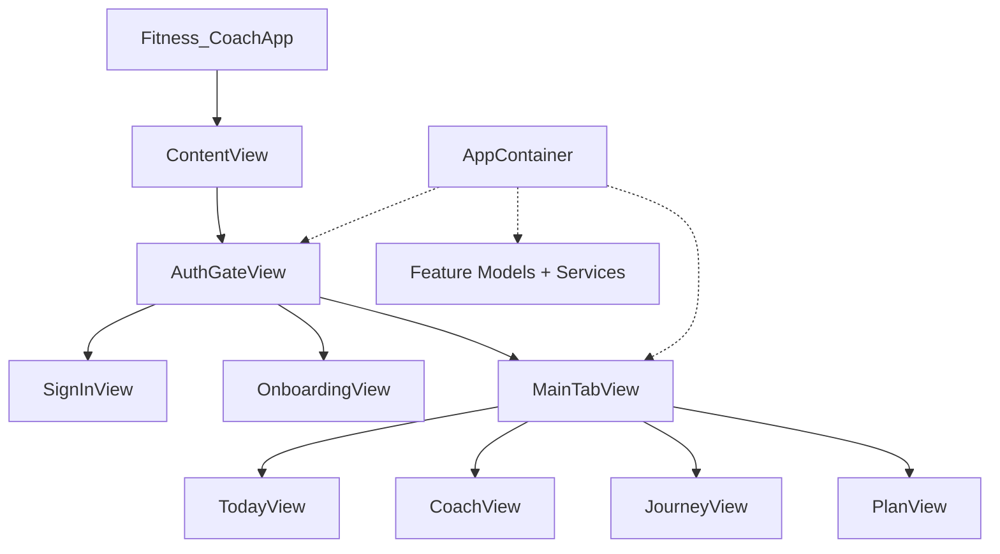

# Forma iOS — Architecture

This document describes how the Forma iOS app is composed today and the layering conventions established by the maintainability migration (Phases 1–6).

**Related:** [JourneyArchitecture.md](./JourneyArchitecture.md) — Journey tab product contract; [FormaCalculationSpec.md](./FormaCalculationSpec.md) — canonical plan-target formulas.

---

## 1. Current App Composition

### Entry point

```
Fitness_CoachApp
  └── ContentView(container:)
        └── AuthGateView(container:)
```

- **`Fitness_CoachApp`** (`Fitness Coach/App/Fitness_CoachApp.swift`) — `@main` entry; configures Firebase, constructs `AppContainer`, hosts `ContentView`.
- **`ContentView`** — thin pass-through to `AuthGateView`. Exists mainly for previews and a stable root view type.

### AppContainer

**Location:** `App/AppContainer.swift`

`AppContainer` is the manual composition root. It constructs and exposes:

| Dependency | Role |
|------------|------|
| `modelContainer` / `store` | SwiftData persistence |
| `userProfileService`, `targetService` | Profile and plan targets |
| `dailyLogService`, `foodLogService`, `waterLogService`, `weightLogService`, `workoutLogService` | Day-scoped logging |
| `reviewService` | Daily review generation |
| `actionCenter` (`FitnessActionCenter`) | Canonical mutation layer for logs and plan edits |
| `authManager` | Firebase auth session |
| `cloudUserProfileStore`, `profileBootstrapService` | Cloud profile sync and bootstrap |
| `llmClient`, `aiService` | AI gateway (debug: local backend or mock) |
| `refreshCenter` (`AppRefreshCenter`) | Cross-tab refresh signaling |
| `healthTrainingService`, `trainingInsightsStore`, `trainingInsightsModel` | Apple Health training integration |

Factory methods wire feature models:

- `makeTodayModel()`, `makeCoachModel()`, `makeJourneyModel()`, `makePlanModel()`
- `makeRootModel()`, `makeOnboardingModel(onCompletion:)`
- `makeTodayActionCoordinator()`, `makeJourneyAnalyticsCoordinator()`

### AuthGate

**Location:** `Features/Auth/`

The auth-first shell is split into a thin SwiftUI entry (`AuthGateView`), route rendering (`AuthGateRouteView`), and orchestration (`AuthGateCoordinator`).

```
AuthGateView
  └── AuthGateRouteView(coordinator:)
        ├── PublicWelcomeView / ExistingUserSignInView / …
        ├── AuthGateOnboardingShellView
        ├── AuthGateProfilePlanConflictHost
        └── MainTabView
```

Pure routing helpers (testable without SwiftUI) live in `App/Routing/`:

- `AppRouteResolver` — maps auth + root state → `AppShellRoute`
- `AuthGateRoutingPolicy` — onboarding session overlays on base route
- `RootProfileRouteResolver` — profile bootstrap → onboarding vs main
- `ProfileBootstrapCoordinator` — signed-in reconcile decisions
- `AuthGateCoordinator` — session state, cloud bootstrap, conflict resolution, analytics

On onboarding completion, `AuthGateView` saves the profile to cloud via `profileBootstrapService` before transitioning to main.

### MainTabView

**Location:** `App/MainTabView.swift`

After auth and profile bootstrap, the signed-in shell is a four-tab `TabView`:

| Tab enum | UI label | Feature folder | Feature model | Primary question |
|----------|----------|----------------|---------------|----------------|
| `.today` | Today | `Features/Today` | `TodayModel` | Am I on track today? |
| `.coach` | Coach | `Features/Coach` | `CoachModel` | Log, edit, ask — mutations entry point |
| `.journey` | Journey | `Features/Journey` | `JourneyModel` | What is my fitness story? |
| `.plan` | Plan | `Features/Plan` | `PlanModel` | What strategy am I following? |

**Environment objects** injected at tab level:

- `AppRefreshCenter` — notifies tabs to reload after mutations
- `TrainingInsightsStore` — HealthKit authorization / connection state
- `TrainingInsightsModel` — aggregated workout insights for sheets

**Journey tab:** See [JourneyArchitecture.md](./JourneyArchitecture.md) for section order, baseline rules, XP, analytics, and read-only contract.

**Legacy note:** The former Training tab (`AppTab.legacyTrainingTabID = "training"`) was demoted. Persisted tab selection migrates from `training` / `progress` → `.journey` and `profile` → `.plan`. `TrainingView` remains in the codebase for future push navigation but is not in the tab bar.

### Feature tabs (responsibilities)

#### Today (read-mostly)

- Displays daily calories, macros, water, meals, focus items, and coach prompts.
- Does **not** own mutations; shortcuts route to Coach via `onOpenCoach`.
- Reads through log services directly (`TodayModel`); refreshes on `AppRefreshCenter` and pull-to-refresh.

#### Coach (mutation hub)

- Primary write path for food, water, weight, workouts (via `FitnessActionCenter`).
- AI chat, local command parsing, intent routing (`Application/UseCases/Coach/Pipeline/`), food confirmation sheets.
- `CoachModel` (~450 lines) owns `@Published` UI state and wires handlers; decomposition:

```
CoachModel (Features/Coach/Model/)
  ├── CoachMutationExecutor           — Application/UseCases/Coach/
  ├── CoachPendingConfirmationPresenter
  ├── CoachAIRouteHandler
  └── CoachMealPhotoAnalyzer
```

- Dashboard assembly: `Application/StateBuilders/Coach/` (`CoachResponseBuilder`, context builders).

#### Journey (read-only fitness story)

Long-horizon narrative: transformation, weekly consistency, milestones, timeline, habit insight, attribution, records, level/XP, and collapsible detailed analytics.

- **Docs:** [JourneyArchitecture.md](./JourneyArchitecture.md)
- `JourneyView` + `JourneyModel` assemble `JourneyDashboardState` from services.
- `JourneyDashboardBuilder` + per-section `Journey*Builder` types in `Application/StateBuilders/Journey/`; `JourneyBaselineResolver` owns baseline/chart/progress %.
- `JourneyDashboardContent` renders `JourneyProductLayout.sectionOrder`.
- CTAs route to Coach / Plan; no mutations on this tab.
- Apple Health training via `TrainingInsightsStore` + `JourneyTrainingSummaryBuilder`.

#### Plan / Profile (strategy)

- Displays plan rationale, targets, about-you, training integration entry.
- Plan edits and settings via `PlanEditWizard`, `SettingsRootView`.
- Mutations for plan changes go through `FitnessActionCenter` (with one known exception — see cleanup areas).

#### Onboarding (pre-main)

- First-run profile creation; not a tab — shown inside `AuthGateView` when no local profile exists.
- `OnboardingModel` + `OnboardingFormState` generate initial targets via `TargetService`.

#### Training Insights (sheet, not a tab)

- Apple Health workout aggregation surfaced from Plan, Today, and Journey.
- `TrainingInsightsView` / `TrainingInsightsConnectedView` presented as sheets.
- Manual workout logging UI (`TrainingModel`, `TrainingView`) exists but is orphaned from the tab bar.

### Composition diagram



---

## 2. Current Architectural Layers

Source lives under `Fitness Coach/` in layer folders (~625 Swift files). The Xcode target is still named **Fitness Coach**; Swift type names use **Forma** prefixes for infrastructure and design-system types (Phase 6).

```
Fitness Coach/
├── App/                 # Composition root, routing, tab shell (18)
├── Application/         # Services, use cases, state builders (68)
├── Data/                # Repositories + DTOs (19)
├── DesignSystem/        # Tokens, components, theme (56)
├── Domain/              # Models, calculations, copy (127)
├── Features/            # SwiftUI views + feature models (258)
├── Infrastructure/      # Persistence, cloud, health, AI clients (78)
└── TestingSupport/      # Preview/test stubs in app target (1)
```

### App (`App/` — 18 files)

Composition root, shell routing, and entry point.

| Path | Purpose |
|------|---------|
| `AppContainer.swift` | Dependency wiring, service construction, model factories |
| `MainTabView.swift` | Tab shell, environment object injection |
| `RootModel.swift` | Onboarding vs main state after sign-in |
| `AppRefreshCenter.swift` | Cross-feature refresh token |
| `LocalAIBackendConfiguration.swift` | Debug AI backend URL resolution |
| `ReleaseAIBackendConfiguration.swift` | Release AI backend URL resolution |
| `Fitness_CoachApp.swift` / `ContentView.swift` | `@main` entry and root view |
| `Routing/` | `AppRouteResolver`, `AuthGateRoutingPolicy`, `ProfileBootstrapCoordinator`, … |

### Application (`Application/` — 68 files)

Orchestration, mutations, coach execution, and dashboard assembly.

| Area | Path | Purpose |
|------|------|---------|
| **Services** | `Application/Services/` | `TargetService`, `TrainingInsightsStore`, `AIService`, `ServiceError`, … |
| **Auth** | `Application/Services/Auth/` | `AuthManager`, `AuthState`, sign-in support |
| **Use cases** | `Application/UseCases/` | `FitnessActionCenter`, `ProfileBootstrapService` |
| **Coach** | `Application/UseCases/Coach/` | Handlers + `Pipeline/` (routing, intent, confirmation policy) |
| **Commands** | `Application/UseCases/Commands/` | `LocalCommandParser` and command types |
| **Queries** | `Application/Queries/` | `HealthActivityQueryService` (Apple Health workout/step counts) |

### Features (`Features/` — 258 files)

SwiftUI views, feature models (`*Model`), view state, formatters, and feature-local components.

| Folder | Notes |
|--------|-------|
| `Coach` | Views, model shell, formatting, components |
| `Today` | Daily dashboard |
| `Journey` | Journey tab UI (`JourneyView`, `JourneyModel`) |
| `Plan` | Plan tab UI (`PlanView`, `PlanModel`) |
| `Onboarding` | First-run flow |
| `Auth` | Gate and sign-in |
| `Settings` | Plan settings screens |
| `TrainingInsights` | Health insights sheets (split from demoted Training tab) |

Features may import Application and Domain; they must not import Infrastructure directly.

### Domain (`Domain/` — 127 files)

Shared business concepts not tied to a single feature screen.

| Area | Path | Purpose |
|------|------|---------|
| **Models** | `Domain/Models/` | `UserProfile`, `DailyLog`, `FoodEntry`, enums, etc. |
| **Plan calculation** | `Domain/PlanCalculation/` | `FormaCalculationEngine`, pace/macro/energy math |
| **Analytics** | `Domain/Analytics/` | Streaks, trends, projections |
| **Onboarding** | `Domain/Onboarding/` | Onboarding domain logic and copy builders |
| **Training** | `Domain/Training/` | `TrainingInsightsAggregator`, integration copy |
| **Reviews** | `Domain/Reviews/` | `DailyReviewSummary` model + formatter |
| **Copy / Legal** | `Domain/Copy/`, `Domain/Legal/` | Product strings |

Pure calculation and policy types stay in Domain; dashboard assembly lives in `Application/StateBuilders/`.

### Data (`Data/` — 19 files)

Repository facades and input DTOs — no platform adapters.

| Area | Path | Role |
|------|------|------|
| **Repositories** | `Data/Repositories/` | `FoodLogService`, `DailyLogService`, `UserProfileService`, … |
| **DTOs** | `Data/DTOs/` | `FoodDraft`, `WaterDraft`, `UserProfileDraft`, onboarding drafts |

### Infrastructure (`Infrastructure/` — 78 files)

Platform and external system adapters. Must not import SwiftUI.

| Area | Path | Contents |
|------|------|----------|
| **Persistence** | `Infrastructure/Persistence/SwiftData/` | Entities, mappings, `SwiftDataStore`, `FormaModelContainer` |
| **Cloud** | `Infrastructure/Cloud/` | Firestore profile sync |
| **Health** | `Infrastructure/Health/` | HealthKit authorization, workout/step readers |
| **AI** | `Infrastructure/AI/` | LLM clients, AI contracts, parsers, prompts |
| **Diagnostics** | `Infrastructure/Diagnostics/` | `FormaPipelineTracer`, analytics loggers |

### Design system (`DesignSystem/` — 56 files)

| Layer | Role |
|-------|------|
| `FormaTokens.swift`, `Components/` | Canonical colors, spacing, shared SwiftUI components |
| `Layout/FormaFeatureLayout.swift`, `FormaMainTabLayout.swift` | Shared horizontal padding and tab scroll insets |
| `Theme/` | Forma palette + app appearance preferences (`AppThemePreferences`, `ThemeResolver`, …) |
| `Coach/`, `Onboarding/` | Feature-specific design tokens |

### TestingSupport (`TestingSupport/` — 1 file)

Preview and test stubs that must live in the app target (`StubTrainingIntegrationProvider`). Test fixtures remain in `Fitness CoachTests/` for now.

### Tests (`Fitness CoachTests/` — 25+ files)

Unit tests at repo root. Fixtures: `FormaCalculationTestFixtures.swift`, `TestingSupport/` subdirectory.

---

## 3. Ownership Rules

These are the conventions the codebase should follow. Violations are tracked in [Known cleanup areas](#5-known-cleanup-areas).

### SwiftUI views should not own business formulas

- Views layout and bind state; they call feature models or builders for numbers.
- **Allowed in views:** formatting via `*Formatter`, navigation, sheet presentation, `FormaTokens` styling.
- **Not allowed in views:** calorie/macro math, streak logic, plan target derivation, HealthKit aggregation.
- **Current violations:** `PlanCalculationDetailsSheet` uses `PlanCalculationBridge` inline; `TodayView` resolves HealthKit workout counts. Move to models/builders.

### Infrastructure clients should not know SwiftUI

- Types under `Infrastructure/` must not `import SwiftUI`.
- HealthKit readers, LLM clients, Firestore stores, and SwiftData entities return domain models or DTOs only.
- **Current violations:** preview-only stubs in Training views construct `HealthTrainingService` inline (previews only, but sets a bad precedent).

### Persistence should be accessed through services (repositories)

- Feature models and views must not import SwiftData or construct `ModelContext` directly.
- Reads/writes go through `Core/Services/*` or `FitnessActionCenter`.
- **Target:** introduce repository protocols behind services; not implemented yet.
- **Current violations:** `PlanModel.createDefaultProfile()` calls `userProfileService` directly instead of `FitnessActionCenter`; `AuthGateView` calls `profileBootstrapService` for cloud save.

### Design tokens should come from the Forma design system

- New UI uses `FormaTokens` and shared `DesignSystem/Components` primitives.
- Avoid hard-coded colors, spacing, or ad-hoc card styles in feature views.
- `OnboardingTheme` and `CoachDesignTokens` remain feature-scoped — new shared chrome belongs in `FormaTokens` / `FormaCardChrome`, not a fourth parallel theme.

### Feature-specific state stays inside the feature unless shared

- Tab-scoped models (`TodayModel`, `CoachModel`, …) live in their feature folder.
- Cross-tab refresh uses `AppRefreshCenter`, not shared mutable singletons.
- Shared UI used by multiple features belongs in `Core/Design` or `Features/Shared` — not copied.
- App-wide integration state (`TrainingInsightsStore`) is constructed in `AppContainer` and injected; document new global state here before adding.

### Mutation ownership

| Data | Canonical owner |
|------|-----------------|
| Food / water / weight logs | `FitnessActionCenter` (Coach + capture flows) |
| Workouts | `FitnessActionCenter` (Training flow) |
| Plan targets / profile baseline | `FitnessActionCenter` (`updatePlan`, `applyPlanTargets`) |
| Journey / Today | Read-only — no mutations |

---

## 4. Target Architecture

**Status:** Phases 5–8 complete (2026-06-30). Folder layout, primary type renames, Health reader injection, and design-system consolidation are in place. Xcode target name (`Fitness Coach`) and `@main` struct (`Fitness_CoachApp`) remain for toolchain compatibility.

```
Forma/
├── App/                    # Composition root, routing, tab shell
├── DesignSystem/           # FormaTokens + shared SwiftUI components
├── Domain/
│   ├── Models/
│   ├── PlanCalculation/    # FormaCalculationEngine (from Core/FormaCalculation)
│   ├── Analytics/          # Streaks, trends, projections
│   ├── Nutrition/          # Macro remaining, food draft rules
│   └── Protocols/          # Repository and reader interfaces
├── Data/
│   ├── Repositories/       # SwiftData-backed implementations
│   └── DTOs/               # Drafts, updates (from Core/Drafts)
├── Application/
│   ├── Services/           # Orchestration (current Core/Services)
│   ├── UseCases/           # FitnessActionCenter, bootstrap, coach execution
│   └── StateBuilders/      # Today/Journey/Plan dashboard assembly
├── Infrastructure/
│   ├── Persistence/        # SwiftData entities + store
│   ├── Cloud/              # Firestore
│   ├── Health/             # HealthKit
│   └── AI/                 # LLM gateway
├── Features/
│   ├── Today/
│   ├── Coach/
│   ├── Journey/            # Journey tab (types: JourneyView, JourneyModel)
│   ├── Plan/               # rename from Profile
│   ├── Onboarding/
│   ├── TrainingInsights/   # split from demoted Training/
│   └── Auth/
├── TestingSupport/         # Fixtures, mocks, test builders
    └── Docs/
    ├── Architecture.md     # this file
    ├── JourneyArchitecture.md
    └── FormaCalculationSpec.md
```

### Target dependency direction

```
Features → Application → Domain
              ↓
           Data → Infrastructure
DesignSystem → (no upward deps)
App → everything (composition only)
```

Features must not import Infrastructure directly.

### Mapping from legacy to current (Phase 5 complete)

| Legacy | Current |
|--------|---------|
| `FitPilot/App/` | `App/` |
| `FitPilot/Core/Services/`, `FitnessActionCenter` | `Application/Services/`, `Application/UseCases/` |
| `FitPilot/Core/AI/` (contracts) | `Infrastructure/AI/` |
| `FitPilot/Core/AI/AIService` | `Application/Services/` |
| `FitPilot/Core/Auth/` | `Application/Services/Auth/` |
| `FitPilot/Core/Drafts/` | `Data/DTOs/` |
| `FitPilot/Core/Diagnostics/` | `Infrastructure/Diagnostics/` |
| `FitPilot/Infrastructure/LLM/` | `Infrastructure/AI/` |
| `Data/SwiftData/` | `Infrastructure/Persistence/SwiftData/` |
| `Data/Health/`, `Data/Firebase/` | `Infrastructure/Health/`, `Infrastructure/Cloud/` |
| `Core/Design/` + theme wrappers | `DesignSystem/` |
| `Core/Models/`, `Core/FormaCalculation/`, calculators | `Domain/` |
| Feature `*Builder` dashboard assembly | `Application/StateBuilders/` |
| `Features/Coach/Handlers/`, `Pipeline/` | `Application/UseCases/Coach/` |
| `Domain/Routing/` | `App/Routing/` |
| `Domain/Theme/` | `DesignSystem/Theme/` |
| `Fitness CoachTests/*Fixtures*` | `TestingSupport/` (partial — app-target stubs only) |

---

## 5. Known Cleanup Areas

Tracked for later stages. **Do not treat as blockers for feature work** — but new code should not worsen these.

### Calculation engine

- **Canonical plan math:** `Domain/PlanCalculation/FormaCalculationEngine` via `PlanCalculationBridge` and `TargetService`. Well-tested; see `FormaCalculationSpec.md`.
- **Runtime dashboard math:** `DailyNutritionSummaryBuilder` is the single read-model for macro/calorie/water state. It delegates to `MacroCalculator` and `WaterTargetCalculator`.
- **Consumers:** `TodayDashboardNutritionMapper`, `TodayAISummaryMapper`, `DailyReviewSummaryBuilder`, `CoachResponseBuilder`, `DailyBriefBuilder`.
- **Legacy / dead:** `CalorieTargetCalculator`, `MaintenanceCalculator`, `AIFoodEstimator` — removed.

### Coach pipeline

- `CoachModel` delegates mutations, AI routing, and pending confirmations to `Application/UseCases/Coach/`.
- Pipeline: `Application/UseCases/Coach/Pipeline/` (`CoachRouteDecider`, `CoachIntentRouter`, `CheapLLMIntentClassifier`, `LocalNutritionEstimator`).
- `CoachResponseBuilder` (in `Application/StateBuilders/Coach/`) duplicates macro summary logic.
- **Action:** keep `CoachRoutingTests` as safety net; optional further colocation under Application.

### FitPilot → Forma naming (Phase 6 complete)

- ~~Source folder: `FitPilot/`~~ — removed in Phase 5
- ~~Types: `FitPilotModelContainer`, `FitPilotScreenStyle`, …~~ — renamed to `Forma*` (Phase 6)
- ~~Tab types: `Progress*` / `Profile*`~~ — renamed to `Journey*` / `Plan*` (Phase 6)
- Env vars: prefer `FORMA_*`; legacy `FITPILOT_*` still accepted via `FormaEnvironment`
- **Remaining:** Xcode target / scheme `Fitness Coach`, `@main` `Fitness_CoachApp` struct

### Training demotion / Health integration

- Training tab removed; legacy manual workout **write** APIs retired (`WorkoutLogService.addWorkout`, `FitnessActionCenter.logWorkout`).
- Apple Health surfaced via `TrainingInsightsStore` + `TrainingInsightsModel` on Plan, Today, and Journey.
- **Phase 8 (2026-06-30):** `HealthTrainingReaderFactory` + `AppContainer` own `HealthKitWorkoutReading` / `HealthKitStepReading` instances. `HealthActivityQueryService` (`Application/Queries/`) centralizes workout/step counts for Today. `JourneyModel`, `PlanModel`, and `TrainingInsightsModel` receive injected readers — no feature-model `SystemHealthKit*` construction.

### Design system consolidation (Phase 7 complete)

- **Phase 7 (2026-06-30):** `FormaScreenStyle` removed. Screen metrics (`screenSectionSpacing`, `settingsRowVertical`, `settingsRowInsets`) added to `FormaTokens`. `FormaPlanCard`, `FormaSettingsRows`, `FormaScreenChrome`, and `FormaCardChrome` moved to `DesignSystem/Components/`. `FormaFeatureLayout` centralizes horizontal padding and scroll-bottom metrics for `TodayLayout`, `PlanLayout`, `JourneyLayout`, and `TrainingLayout`.

### Duplicated card/row styles

- ~~`FormaScreenStyle` legacy wrapper~~ — removed in Phase 7; `FormaPlanCard`, `FormaScreenChrome`, and screen metrics live under `DesignSystem/Components/` and `FormaTokens`.
- `OnboardingTheme` vs `CoachDesignTokens` — feature-scoped; keep isolated from main-tab chrome.
- Tab dashboards use shared `FormaScreenErrorView` / `FormaScreenLoadingView`; Coach keeps inline `CoachErrorView`; auth bootstrap keeps `AuthGateProfileErrorView` (onboarding shell).
- Feature `*Layout` enums (`TodayLayout`, `PlanLayout`, `JourneyLayout`, `TrainingLayout`) source shared padding from `FormaFeatureLayout`.
- **Remaining:** optional `FormaCard` unification (`FormaPlanCard` + `FormaFormCard` + `FormaEmptyStateCard`); onboarding/auth loading views stay feature-themed.

### Dead previews / unused components

High-confidence orphans (grep shows no production references):

| Item | Notes |
|------|-------|
| `PlanAdaptiveCoachSection` | Never referenced |
| `PlanSettingsSection` | Never referenced |
| `PlanLifestyleSection` | Never referenced |
| `GoalSettingsView`, `ActivitySettingsView` | Preview-only |
| `TrainingView`, `TrainingConnectedDashboard` | Removed (legacy training cluster) |
| `WeeklyReview` model + entity | Schema only; no service |
| `ChatMessageEntity` | Schema only; Coach keeps messages in memory |
| `CalorieTargetCalculator`, `MaintenanceCalculator`, `AIFoodEstimator` | Removed |

**Action:** verify with full-text search + build, then remove in a dead-code pass.

---

## Uncertain Areas (later audit)

Items that need confirmation before deletion or large refactors:

| Area | Question |
|------|----------|
| `ChatMessageEntity` | Intentional schema for future chat persistence, or safe to remove from `FormaModelContainer`? |
| `WeeklyReview` | Planned feature vs abandoned scaffold? |
| `TrainingView` / manual workout UI | Archive vs future push navigation from Coach? |
| `UnitSettingsView` vs `UnitsSettingsScreen` | Merge into one component or keep wizard vs settings variants? |
| `ContentView` | Fold into `Fitness_CoachApp` or keep for previews? |
| `functions/` (Firebase TS) | Document backend contract alongside iOS Architecture or separate doc? |
| Repository introduction | Per-entity repos vs single `SwiftDataStore` facade? |

---

## Document history

| Date | Change |
|------|--------|
| 2026-06-30 | Phase 7: `FormaScreenStyle` removed; tokens + `FormaCardChrome` / `FormaFeatureLayout` consolidate design primitives |
| 2026-06-30 | Phase 8: Health reader injection via `AppContainer`; `HealthActivityQueryService` replaces Today resolvers |
| 2026-06-30 | Phase 6: `FitPilot*` → `Forma*` types; `Progress*`/`Profile*` tab types → `Journey*`/`Plan*`; `FORMA_*` env vars with legacy fallback |
| 2026-06-30 | Phase 5: folder migration complete — `App/`, `Application/`, `Infrastructure/`, `Data/DTOs/`; `FitPilot/` removed |
| 2026-06-30 | Phase 4: `CoachModel` decomposed into focused handlers under `Application/UseCases/Coach/` |
| 2026-06-30 | Phase 3: `AuthGateCoordinator` extracted; `AuthGateView` thinned to shell wiring |
| 2026-06-30 | Phase 2: `DailyNutritionSummaryBuilder` consolidated as runtime nutrition SSOT |
| 2026-06-30 | Phase 1 dead-code pass: orphan views, deprecated aliases, retired workout write APIs |
| 2026-06-28 | Journey section: link to `JourneyArchitecture.md`; fix `Features/Journey` path; replace stale `JourneyStateBuilder` / hidden-milestones notes |
| 2026-06-27 | Initial architecture doc (Stage 1 audit) |
