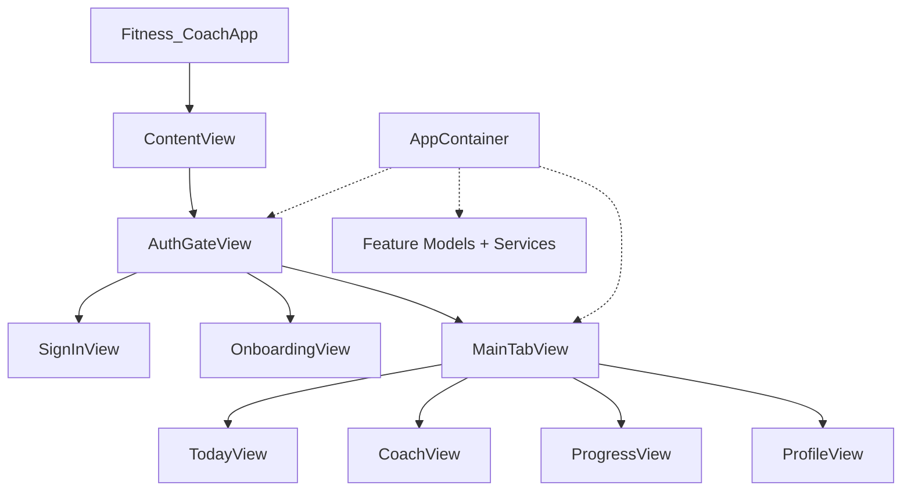

# Forma iOS — Architecture

This document describes how the Forma iOS app is composed today, the layering conventions we are moving toward, and known cleanup areas from the maintainability audit (Stage 1 — documentation only; no code moves yet).

**Related:** [FormaCalculationSpec.md](./FormaCalculationSpec.md) — canonical plan-target formulas.

---

## 1. Current App Composition

### Entry point

```
Fitness_CoachApp
  └── ContentView(container:)
        └── AuthGateView(container:)
```

- **`Fitness_CoachApp`** (`Fitness Coach/Fitness_CoachApp.swift`) — `@main` entry; configures Firebase, constructs `AppContainer`, hosts `ContentView`.
- **`ContentView`** — thin pass-through to `AuthGateView`. Exists mainly for previews and a stable root view type.

### AppContainer

**Location:** `FitPilot/App/AppContainer.swift`

`AppContainer` is the manual composition root. It constructs and exposes:

| Dependency | Role |
|------------|------|
| `modelContainer` / `store` | SwiftData persistence |
| `userProfileService`, `targetService` | Profile and plan targets |
| `dailyLogService`, `foodLogService`, `waterLogService`, `weightLogService`, `workoutLogService` | Day-scoped logging |
| `reviewService` | Daily review generation |
| `actionCenter` (`FitnessActionCenter`) | Canonical mutation layer for logs and plan edits |
| `authManager` | Firebase auth session |
| `cloudUserProfileStore`, `profileBootstrapService` | Cloud profile sync and bootstrap |
| `llmClient`, `aiService` | AI gateway (debug: local backend or mock) |
| `refreshCenter` (`AppRefreshCenter`) | Cross-tab refresh signaling |
| `healthTrainingService`, `trainingInsightsStore`, `trainingInsightsModel` | Apple Health training integration |

Factory methods wire feature models:

- `makeTodayModel()`, `makeCoachModel()`, `makeProgressModel()`, `makeProfileModel()`
- `makeRootModel()`, `makeOnboardingModel(onCompletion:)`
- `makeTrainingModel()`, `makeTrainingInsightsView()` (Training surfaces outside the tab bar)

### AuthGate

**Location:** `FitPilot/Features/Auth/AuthGateView.swift`

`AuthGateView` is the auth-first shell gate. Routing is driven by `AuthManager.authState` and `RootModel.state`:

```
AuthGateView
├── authState.unknown          → LaunchLoadingView
├── authState.signedOut / .signingIn / .failed → SignInView
└── authState.signedIn
      ├── rootModel.loading    → LaunchLoadingView
      ├── rootModel.onboarding → OnboardingView
      ├── rootModel.main       → MainTabView
      └── rootModel.error      → inline error + retry
```

Pure routing helpers (testable without SwiftUI):

- `AppRouteResolver` — maps auth + root state → `AppShellRoute`
- `RootProfileRouteResolver` — profile bootstrap → onboarding vs main
- `RootModel` — loads profile via `ProfileBootstrapService` after sign-in

On onboarding completion, `AuthGateView` saves the profile to cloud via `profileBootstrapService` before transitioning to main.

### MainTabView

**Location:** `FitPilot/App/MainTabView.swift`

After auth and profile bootstrap, the signed-in shell is a four-tab `TabView`:

| Tab enum | UI label | Feature folder | Feature model | Primary question |
|----------|----------|----------------|---------------|----------------|
| `.today` | Today | `Features/Today` | `TodayModel` | Am I on track today? |
| `.coach` | Coach | `Features/Coach` | `CoachModel` | Log, edit, ask — mutations entry point |
| `.progress` | Journey | `Features/Progress` | `ProgressModel` | How is my transformation going? |
| `.profile` | Plan | `Features/Profile` | `ProfileModel` | What strategy am I following? |

**Environment objects** injected at tab level:

- `AppRefreshCenter` — notifies tabs to reload after mutations
- `TrainingInsightsStore` — HealthKit authorization / connection state
- `TrainingInsightsModel` — aggregated workout insights for sheets

**Legacy note:** The former Training tab (`AppTab.legacyTrainingTabID = "training"`) was demoted. Persisted selection migrates to Journey (`.progress`). `TrainingView` remains in the codebase for future push navigation but is not in the tab bar.

### Feature tabs (responsibilities)

#### Today (read-mostly)

- Displays daily calories, macros, water, meals, focus items, and coach prompts.
- Does **not** own mutations; shortcuts route to Coach via `onOpenCoach`.
- Reads through log services directly (`TodayModel`); refreshes on `AppRefreshCenter` and pull-to-refresh.

#### Coach (mutation hub)

- Primary write path for food, water, weight, workouts (via `FitnessActionCenter`).
- AI chat, local command parsing, intent routing (`Features/Coach/Pipeline/`), food confirmation sheets.
- `CoachModel` is the largest feature model (~900+ lines).

#### Journey / Progress (read-only analytics)

- Long-horizon weight trends, consistency, milestones, training summaries.
- `JourneyStateBuilder` assembles dashboard state from services + `TrainingInsightsStore`.
- Can deep-link prompts to Coach.

#### Plan / Profile (strategy)

- Displays plan rationale, targets, about-you, training integration entry.
- Plan edits and settings via `PlanEditWizard`, `SettingsRootView`.
- Mutations for plan changes go through `FitnessActionCenter` (with one known exception — see cleanup areas).

#### Onboarding (pre-main)

- First-run profile creation; not a tab — shown inside `AuthGateView` when no local profile exists.
- `OnboardingModel` + `OnboardingFormState` generate initial targets via `TargetService`.

#### Training Insights (sheet, not a tab)

- Apple Health workout aggregation surfaced from Plan, Today, and Journey.
- `TrainingInsightsView` / `TrainingInsightsConnectedView` presented as sheets.
- Manual workout logging UI (`TrainingModel`, `TrainingView`) exists but is orphaned from the tab bar.

### Composition diagram



---

## 2. Current Architectural Layers

Source lives under `Fitness Coach/FitPilot/` (~360 Swift files). The repo root and Xcode target are still named **Fitness Coach**; the on-disk folder is still **FitPilot** (legacy).

### App (`FitPilot/App/` — 6 files)

Composition root and shell routing.

| File | Purpose |
|------|---------|
| `AppContainer.swift` | Dependency wiring, service construction, model factories |
| `MainTabView.swift` | Tab shell, environment object injection |
| `AppRouteResolver.swift` | Pure auth/root routing |
| `RootModel.swift` | Onboarding vs main state after sign-in |
| `AppRefreshCenter.swift` | Cross-feature refresh token |
| `LocalAIBackendConfiguration.swift` | Debug AI backend URL resolution |

### Features (`FitPilot/Features/` — ~182 files)

SwiftUI views, feature models (`*Model`), view state, formatters, and feature-local builders.

| Folder | Files | Notes |
|--------|------:|-------|
| `Profile` | 40 | Plan tab UI (folder name ≠ tab label) |
| `Coach` | 37 | Includes `Pipeline/` and `Design/` subfolders |
| `Onboarding` | 27 | First-run flow |
| `Today` | 27 | Daily dashboard |
| `Training` | 25 | Health insights + demoted manual training UI |
| `Progress` | 22 | Journey tab UI |
| `Auth` | 3 | Gate and sign-in |
| `Shared` | 1 | `JourneyTimelineView` |

Features may import Core and (today, inconsistently) reach toward Infrastructure in views or models.

### Domain / calculations (`FitPilot/Core/` — ~125 files)

Shared business concepts not tied to a single feature screen.

| Area | Path | Purpose |
|------|------|---------|
| **Models** | `Core/Models/` | `UserProfile`, `DailyLog`, `FoodEntry`, enums, etc. |
| **Plan calculation** | `Core/FormaCalculation/` | `FormaCalculationEngine`, pace/macro/energy math, `PlanCalculationBridge` |
| **Runtime calculators** | `Core/Calculators/` | `MacroCalculator`, `StreakCalculator`, `WeightTrendCalculator`, workout calories |
| **Drafts** | `Core/Drafts/` | Input DTOs (`FoodDraft`, `UserProfileUpdate`, …) |
| **Commands** | `Core/Commands/` | `LocalCommandParser` and command types |
| **AI** | `Core/AI/` | `AIService`, `AICommandParser`, contracts, prompts |
| **Coaching** | `Core/Coaching/` | `DailyBriefBuilder` |
| **Reviews** | `Core/Reviews/` | `DailyReviewSummary`, `DailyReviewSummaryBuilder` |
| **Training domain** | `Core/Training/` | `TrainingInsightsAggregator`, integration copy, `HealthWorkoutRecord` |
| **Auth** | `Core/Auth/` | `AuthManager`, auth state, sign-in support |
| **Copy** | `Core/Copy/` | `FormaProductCopy` user-facing strings |
| **Legal** | `Core/Legal/` | `FitPilotLegalCopy` (legacy name) |
| **Diagnostics** | `Core/Diagnostics/` | `FitPilotPipelineTracer`, trace persistence |

**Note:** Domain logic also appears inside Features (e.g. `JourneyStateBuilder`, `CoachRouteDecider`, `LocalNutritionEstimator`). This is a boundary inconsistency to resolve over time.

### Data / persistence

Persistence is split across Infrastructure entities and Core services — there is no separate `Data/` folder yet.

| Layer | Location | Role |
|-------|----------|------|
| **Entities** | `Infrastructure/SwiftData/Entities/` | `@Model` types |
| **Mapping** | `Infrastructure/SwiftData/Mapping/` | Entity ↔ domain model |
| **Store** | `Infrastructure/SwiftData/Store/` | `SwiftDataStore`, `FitPilotModelContainer` |
| **Services** | `Core/Services/` | `FoodLogService`, `DailyLogService`, `UserProfileService`, etc. |
| **Mutation facade** | `Core/Services/FitnessActionCenter.swift` | Canonical write API for features |
| **Cloud** | `Infrastructure/Firestore/` | Profile document sync |

Services talk to `SwiftDataStore` directly today; repository protocols are a target, not yet present.

### Infrastructure (`FitPilot/Infrastructure/` — 47 files)

Platform and external system adapters. Must not import SwiftUI.

| Area | Contents |
|------|----------|
| **SwiftData** | Entities, mappings, store (28 files) |
| **HealthKit** | Authorization, workout reading, mocks, formatters (11 files) |
| **LLM** | `FitPilotAIBackendClient`, fallback/mock clients (6 files) |
| **Firestore** | Cloud profile store (5 files) |

### Design system

| Layer | Location | Role |
|-------|----------|------|
| **Canonical tokens** | `Core/Design/FormaTokens.swift` | Colors, spacing, typography, radius |
| **Shared components** | `Core/Design/Forma*.swift` | Form cards, fields, pickers, brand mark |
| **Plan/settings chrome** | `Features/Profile/FitPilotScreenStyle.swift` | `FitPilotPlanCard`, settings rows (legacy FitPilot name) |
| **Onboarding theme** | `Features/Onboarding/OnboardingTheme.swift` | Onboarding-specific wrappers over `FormaTokens` |
| **Coach theme** | `Features/Coach/Design/CoachDesignTokens.swift` | Coach layout tokens |
| **Per-feature layout** | `*Layout.swift` in Profile, Today, Progress, Training | Section spacing constants |

`FormaTokens` is the intended single source of truth; other theme files are compatibility layers pending consolidation.

### Tests (`Fitness CoachTests/` — 25 files)

Unit tests colocated at repo root. Fixtures: `FormaCalculationTestFixtures.swift`, `TrainingStrategyTestSupport.swift`. No dedicated `TestingSupport/` package yet.

---

## 3. Ownership Rules

These are the conventions the codebase should follow. Violations are tracked in [Known cleanup areas](#5-known-cleanup-areas).

### SwiftUI views should not own business formulas

- Views layout and bind state; they call feature models or builders for numbers.
- **Allowed in views:** formatting via `*Formatter`, navigation, sheet presentation, `FormaTokens` styling.
- **Not allowed in views:** calorie/macro math, streak logic, plan target derivation, HealthKit aggregation.
- **Current violations:** `PlanCalculationDetailsSheet` uses `PlanCalculationBridge` inline; `TodayView` resolves HealthKit workout counts. Move to models/builders.

### Infrastructure clients should not know SwiftUI

- Types under `Infrastructure/` must not `import SwiftUI`.
- HealthKit readers, LLM clients, Firestore stores, and SwiftData entities return domain models or DTOs only.
- **Current violations:** preview-only stubs in Training views construct `HealthTrainingService` inline (previews only, but sets a bad precedent).

### Persistence should be accessed through services (repositories)

- Feature models and views must not import SwiftData or construct `ModelContext` directly.
- Reads/writes go through `Core/Services/*` or `FitnessActionCenter`.
- **Target:** introduce repository protocols behind services; not implemented yet.
- **Current violations:** `ProfileModel.createDefaultProfile()` calls `userProfileService` directly instead of `FitnessActionCenter`; `AuthGateView` calls `profileBootstrapService` for cloud save.

### Design tokens should come from the Forma design system

- New UI uses `FormaTokens` and shared `Core/Design` components.
- Avoid hard-coded colors, spacing, or ad-hoc card styles in feature views.
- `FitPilotScreenStyle`, `OnboardingTheme`, and `CoachDesignTokens` are transitional wrappers — new work should extend `FormaTokens` / `Core/Design`, not add a fourth parallel theme.

### Feature-specific state stays inside the feature unless shared

- Tab-scoped models (`TodayModel`, `CoachModel`, …) live in their feature folder.
- Cross-tab refresh uses `AppRefreshCenter`, not shared mutable singletons.
- Shared UI used by multiple features belongs in `Core/Design` or `Features/Shared` — not copied.
- App-wide integration state (`TrainingInsightsStore`) is constructed in `AppContainer` and injected; document new global state here before adding.

### Mutation ownership

| Data | Canonical owner |
|------|-----------------|
| Food / water / weight logs | `FitnessActionCenter` (Coach + capture flows) |
| Workouts | `FitnessActionCenter` (Training flow) |
| Plan targets / profile baseline | `FitnessActionCenter` (`updatePlan`, `applyPlanTargets`) |
| Journey / Today | Read-only — no mutations |

---

## 4. Target Architecture

Future folder layout (not yet implemented). Code remains in `FitPilot/` until a later migration stage.

```
Forma/
├── App/                    # Composition root, routing, tab shell
├── DesignSystem/           # FormaTokens + shared SwiftUI components
├── Domain/
│   ├── Models/
│   ├── PlanCalculation/    # FormaCalculationEngine (from Core/FormaCalculation)
│   ├── Analytics/          # Streaks, trends, projections
│   ├── Nutrition/          # Macro remaining, food draft rules
│   └── Protocols/          # Repository and reader interfaces
├── Data/
│   ├── Repositories/       # SwiftData-backed implementations
│   └── DTOs/               # Drafts, updates (from Core/Drafts)
├── Application/
│   ├── Services/           # Orchestration (current Core/Services)
│   ├── UseCases/           # FitnessActionCenter, bootstrap, coach execution
│   └── StateBuilders/      # Today/Journey/Plan dashboard assembly
├── Infrastructure/
│   ├── Persistence/        # SwiftData entities + store
│   ├── Cloud/              # Firestore
│   ├── Health/             # HealthKit
│   └── AI/                 # LLM gateway
├── Features/
│   ├── Today/
│   ├── Coach/
│   ├── Journey/            # rename from Progress
│   ├── Plan/               # rename from Profile
│   ├── Onboarding/
│   ├── TrainingInsights/   # split from demoted Training/
│   └── Auth/
├── TestingSupport/         # Fixtures, mocks, test builders
└── Docs/
    ├── Architecture.md     # this file
    └── FormaCalculationSpec.md
```

### Target dependency direction

```
Features → Application → Domain
              ↓
           Data → Infrastructure
DesignSystem → (no upward deps)
App → everything (composition only)
```

Features must not import Infrastructure directly.

### Mapping from current to target

| Current | Target |
|---------|--------|
| `FitPilot/App/` | `App/` |
| `Core/Design/` + theme wrappers | `DesignSystem/` |
| `Core/Models/`, `Core/FormaCalculation/`, `Core/Calculators/` | `Domain/` |
| `Core/Services/`, `FitnessActionCenter`, feature `*Builder` | `Application/` |
| `Core/Drafts/` + `Infrastructure/SwiftData/` | `Data/` + `Infrastructure/Persistence/` |
| `FitPilot/Features/` | `Features/` (renamed subfolders) |
| `Fitness CoachTests/*Fixtures*` | `TestingSupport/` |

---

## 5. Known Cleanup Areas

Tracked for later stages. **Do not treat as blockers for feature work** — but new code should not worsen these.

### Calculation engine

- **Canonical plan math:** `Core/FormaCalculation/FormaCalculationEngine` via `PlanCalculationBridge` and `TargetService`. Well-tested; see `FormaCalculationSpec.md`.
- **Runtime dashboard math:** `Core/Calculators/MacroCalculator`, `WaterTargetCalculator`, `StreakCalculator` — duplicated call sites in `TodayModel`, `CoachResponseBuilder`, `CoachAIContextBuilder`, `DailyReviewSummaryBuilder`.
- **Legacy / dead:** `CalorieTargetCalculator` (deprecated, no callers), `MaintenanceCalculator` (no callers), `AIFoodEstimator` (no callers; `LocalNutritionEstimator` used instead).
- **Action:** extract `DailyNutritionSummaryBuilder`; retire legacy calculators after verification.

### Coach pipeline

- `CoachModel` (~940 lines) combines routing, AI, mutations, food editing, and error state.
- Pipeline split across `Core/Commands/LocalCommandParser` and `Features/Coach/Pipeline/` (`CoachRouteDecider`, `CoachIntentRouter`, `CheapLLMIntentClassifier`, `LocalNutritionEstimator`).
- `CoachResponseBuilder` duplicates macro summary logic.
- **Action:** decompose `CoachModel`; colocate pipeline under Application; keep `CoachRoutingTests` as safety net.

### Old FitPilot naming

- Source folder: `FitPilot/`
- Types: `FitPilotModelContainer`, `FitPilotScreenStyle`, `FitPilotPlanCard`, `FitPilotPipelineTracer`, `FitPilotAIBackendClient`, `FitPilotLegalCopy`
- Env vars: `FITPILOT_USE_MOCK_LLM`, `FITPILOT_AI_BACKEND_URL`, `FITPILOT_PIPELINE_TRACE*`
- Xcode target / app struct: `Fitness Coach`, `Fitness_CoachApp`
- Product copy already uses Forma (`FormaProductCopy`, `FormaTokens`).
- **Action:** rename in a dedicated stage; avoid mixing renames with behavior changes.

### Training demotion / Health integration

- Training tab removed; `TrainingView` / `TrainingConnectedDashboard` are preview-only.
- Apple Health surfaced via `TrainingInsightsStore` + `TrainingInsightsModel` on Plan, Today, and Journey.
- `TrainingInsightsModel` constructs `SystemHealthKitWorkoutReader` internally (Infrastructure leak into feature model).
- `TodayHealthWorkoutResolver` in Features/Today queries workouts for checklist.
- **Action:** consolidate under `TrainingInsights` feature + Application query layer; inject workout reader from `AppContainer`.

### Duplicated card/row styles

- `FormaTokens` + `Core/Design` vs `FitPilotScreenStyle` (`FitPilotPlanCard`, settings rows) vs `OnboardingTheme` vs `CoachDesignTokens`.
- Six near-identical `*ErrorView` and five `*LoadingView` files across features.
- Four `*Layout.swift` enums with overlapping spacing constants.
- **Action:** unify on `FormaTokens` + shared status views; rename `FitPilotScreenStyle` → `FormaScreenStyle`.

### Dead previews / unused components

High-confidence orphans (grep shows no production references):

| Item | Notes |
|------|-------|
| `PlanAdaptiveCoachSection` | Never referenced |
| `PlanSettingsSection` | Never referenced |
| `PlanLifestyleSection` | Never referenced |
| `GoalSettingsView`, `ActivitySettingsView` | Preview-only |
| `TrainingView`, `TrainingConnectedDashboard` | Preview-only; tab removed |
| `WeeklyReview` model + entity | Schema only; no service |
| `ChatMessageEntity` | Schema only; Coach keeps messages in memory |
| `CalorieTargetCalculator`, `MaintenanceCalculator`, `AIFoodEstimator` | No callers |

**Action:** verify with full-text search + build, then remove in a dead-code pass.

---

## Uncertain Areas (later audit)

Items that need confirmation before deletion or large refactors:

| Area | Question |
|------|----------|
| `ChatMessageEntity` | Intentional schema for future chat persistence, or safe to remove from `FitPilotModelContainer`? |
| `WeeklyReview` | Planned feature vs abandoned scaffold? |
| `TrainingView` / manual workout UI | Archive vs future push navigation from Coach? |
| `UnitSettingsView` vs `UnitsSettingsScreen` | Merge into one component or keep wizard vs settings variants? |
| `ContentView` | Fold into `Fitness_CoachApp` or keep for previews? |
| `functions/` (Firebase TS) | Document backend contract alongside iOS Architecture or separate doc? |
| Repository introduction | Per-entity repos vs single `SwiftDataStore` facade? |

---

## Document history

| Date | Change |
|------|--------|
| 2026-06-27 | Initial architecture doc (Stage 1 audit) |
