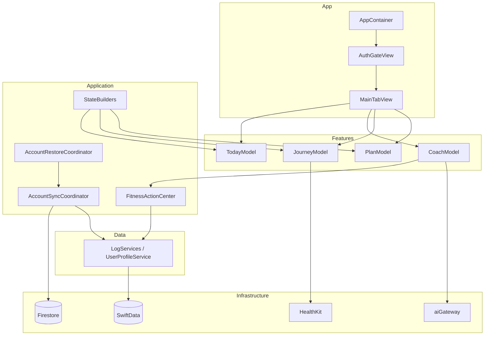

# App Architecture Overview

**Product:** Forma (Xcode target: Fitness Coach)  
**Last updated:** 2026-07-04  
**Audience:** Engineers scoping refactors, onboarding, and production readiness work  
**Related:** [../Architecture.md](../Architecture.md) (layering conventions), [../JourneyArchitecture.md](../JourneyArchitecture.md), [SourceOfTruthMap.md](./SourceOfTruthMap.md), [DependencyInjectionMap.md](./DependencyInjectionMap.md)

---

## 1. Purpose

This document describes **how the app is composed today**: major domains, layer boundaries, ownership, and the request/data flow from UI to persistence and cloud. It is the canonical pre-refactor map for PRDX v1 and later sprints.

**Claim tags:** **Confirmed** = evidenced in code; **Likely** = inferred; **Unknown** = not verified in CI/device.

---

## 2. Layer Model

Source lives under `Fitness Coach/` in layer folders (~1,100+ Swift files).

```
Fitness Coach/
├── App/                 # Composition root, routing, tab shell
├── Features/            # SwiftUI views + feature models (*Model)
├── Application/         # Use cases, coordinators, state builders, sync/restore/privacy
├── Domain/              # Pure models, calculations, protocols, analytics contracts
├── Data/                # Repository services + DTOs
├── Infrastructure/      # SwiftData, Firestore, HealthKit, AI clients, diagnostics
├── Health/              # HealthKit + Health Intelligence engines (domain-adjacent)
├── DesignSystem/        # Tokens, theme, shared components
└── Configuration/       # Feature flags (FormaAbTest)
```

### Dependency direction (target)

```
Features → Application → Domain
              ↓
           Data → Infrastructure
DesignSystem → (no upward deps)
App → everything (composition only)
```

**Rule:** Features must not import Infrastructure directly. Reads/writes go through Application services or repository protocols.

---

## 3. Entry and Shell

### Boot sequence (**Confirmed**)

```
Fitness_CoachApp (@main)
  ├── FirebaseApp.configure()
  ├── AppContainer()                    # DI root
  └── AuthGateView(container:)
        └── AuthGateRouteView
              ├── PublicWelcomeView / ExistingUserSignInView / restore & conflict views
              ├── OnboardingView          # pre-main profile wizard
              └── MainTabView             # signed-in four-tab shell
```

### Main tabs (**Confirmed** — `App/MainTabView.swift`)

| Tab | Feature folder | Model | Primary question | Mutations |
|-----|----------------|-------|------------------|-----------|
| Today | `Features/Today` | `TodayModel` | Am I on track today? | Read-mostly; shortcuts → Coach |
| Coach | `Features/Coach` | `CoachModel` | Log, edit, ask | **Canonical write path** via `FitnessActionCenter` |
| Journey | `Features/Journey` | `JourneyModel` | What is my fitness story? | Read-only |
| Plan | `Features/Plan` | `PlanModel` | What strategy am I following? | Edits via wizard → `FitnessActionCenter` |

**Environment objects at tab level:** `AppRefreshCenter`, `TrainingInsightsStore`, `TrainingInsightsModel`, `ThemeStore` (via root modifier).

---

## 4. Major App Domains

### 4.1 Auth and public entry

| Aspect | Detail |
|--------|--------|
| **Ownership** | `Features/Auth/`, `App/Routing/` |
| **Orchestration** | `AuthGateCoordinator` — session, bootstrap, restore gating, conflict resolution |
| **Policies** | `AuthGateRoutingPolicy`, `AppRouteResolver`, `ProfileBootstrapCoordinator` |
| **Persistence** | Firebase Auth (SDK keychain); profile in SwiftData + Firestore |
| **Key files** | `AuthManager.swift`, `ProfileBootstrapService.swift`, `AuthGateView.swift` |

### 4.2 Onboarding

| Aspect | Detail |
|--------|--------|
| **Ownership** | `Features/Onboarding/`, `Application/UseCases/Onboarding/` |
| **Model** | `OnboardingModel` + `OnboardingFormState` |
| **Persistence** | `OnboardingDraftStore` (UserDefaults); profile commit → SwiftData + cloud |
| **Flow** | 14-step wizard → plan generation → sign-in on save → `MainTabView` |

### 4.3 Today

| Aspect | Detail |
|--------|--------|
| **Ownership** | `Features/Today/`, `Application/StateBuilders/Today/` |
| **Model** | `TodayModel`, `TodayActionCoordinator` |
| **Reads** | `DailyLogReading`, `FoodLogReading`, `WeightLogReading`, `UserProfileReading` |
| **Builders** | `TodayPresentationBuilder`, mission/next-best-action/end-of-day engines |
| **Mutations** | Sheets exist but canonical path is Coach; coordinator uses `FitnessActionCenter` |

### 4.4 Coach

| Aspect | Detail |
|--------|--------|
| **Ownership** | `Features/Coach/`, `Application/UseCases/Coach/` |
| **Model** | `CoachModel` (~1,600 LOC) — chat UI, pipeline, mutations, images |
| **Pipeline** | `CoachRouteDecider`, `CoachIntentRouter`, `CoachMutationExecutor`, `CoachAIRouteHandler` |
| **AI** | `AIService` → `LLMClient` → Firebase `aiGateway` (Bearer ID token) |
| **Context** | `CoachContextPacketV2Builder` — ephemeral per request |
| **Persistence** | Chat transcript + timeline in SwiftData; pending images in-memory |

### 4.5 Journey

| Aspect | Detail |
|--------|--------|
| **Ownership** | `Features/Journey/`, `Application/StateBuilders/Journey/` |
| **Model** | `JourneyModel` |
| **Contract** | [../JourneyArchitecture.md](../JourneyArchitecture.md) — read-only narrative |
| **Weekly UX** | `JourneyWeeklyReviewBuilder` (rolling 7-day habit rows); optional HI `WeeklyReviewCard` |
| **Mutations** | None on tab; CTAs route to Coach/Plan |

### 4.6 Plan

| Aspect | Detail |
|--------|--------|
| **Ownership** | `Features/Plan/`, `Application/StateBuilders/Plan/`, `Domain/PlanCalculation/` |
| **Model** | `PlanModel` |
| **Math** | `FormaCalculationEngine` via `PlanCalculationBridge` — [../FormaCalculationSpec.md](../FormaCalculationSpec.md) |
| **Edits** | `PlanEditWizard` → `FitnessActionCenter.updatePlan` / `applyPlanTargets` |

### 4.7 Settings and privacy

| Aspect | Detail |
|--------|--------|
| **Ownership** | `Features/Settings/`, `Application/Privacy/` |
| **Surfaces** | Account, theme, units, macros, Apple Health, legal, deletion |
| **Deletion** | `AccountDeletionCoordinator` — remote Firestore → Auth delete → local wipe |
| **Export** | `AccountDataExportService` exists; **policy disabled** (`AccountDataExportPolicy`) |

### 4.8 Health Intelligence

| Aspect | Detail |
|--------|--------|
| **Ownership** | `Health/`, `Features/HealthIntelligence/` |
| **Stack** | HealthKit → `HealthDataRepository` → cache → engines → snapshot service → presentation builders |
| **Flags** | `HealthIntelligenceFeatureFlags` facade over `FormaAbTest` |
| **Release posture** | See [FeatureFlagRegistry.md](./FeatureFlagRegistry.md) — UI/weekly/remote sync documented as off for safe ship |

### 4.9 Account persistence (sync / restore / cross-device)

| Aspect | Detail |
|--------|--------|
| **Ownership** | `Application/Sync/`, `Application/Restore/`, `Infrastructure/Cloud/AccountData/` |
| **Local-first** | SwiftData is primary; outbox uploads to Firestore when signed in |
| **Phases** | 1–6 implemented — see [ACCOUNT_PERSISTENCE_IMPLEMENTATION_PLAN.md](../Archive/SprintReports/ACCOUNT_PERSISTENCE_IMPLEMENTATION_PLAN.md) |
| **Flags** | `AccountPersistenceFeatureFlags` (compile-time constants) |

### 4.10 Training insights

| Aspect | Detail |
|--------|--------|
| **Ownership** | `Features/TrainingInsights/`, `Infrastructure/Health/` |
| **Surface** | Sheet from Plan/Today/Journey — not a tab |
| **Source** | Apple Health via `HealthTrainingService`, `HealthActivityQueryService` |

### 4.11 Design system and theme

| Aspect | Detail |
|--------|--------|
| **Ownership** | `DesignSystem/` |
| **Runtime** | `ThemeStore` + `FormaRootThemeModifier` at app root |
| **Tokens** | `FormaTokens`, `FormaPaletteCatalog`, shared components |

### 4.12 Backend (Firebase Functions)

| Aspect | Detail |
|--------|--------|
| **Ownership** | `functions/src/` |
| **Exports** | `aiGateway` (HTTPS), `accountDataDeletion` |
| **Contracts** | [../BackendAPI.md](../BackendAPI.md) |

---

## 5. Ownership Boundaries

### What each layer may do

| Layer | May | Must not |
|-------|-----|----------|
| **Features** | SwiftUI, bind `*Model`, call Application | Import Infrastructure; embed business formulas in views |
| **Application** | Orchestrate use cases, coordinators, state builders | Import SwiftUI |
| **Domain** | Pure logic, protocols, copy contracts | Platform I/O |
| **Data** | Repository facades over `SwiftDataStore` | SwiftUI, Firestore direct from features |
| **Infrastructure** | Adapters (SwiftData, Firestore, HealthKit, AI) | SwiftUI |
| **App** | Wire dependencies, routing, tab shell | Feature-specific business rules |

### Mutation ownership (**Confirmed**)

| Data | Canonical owner |
|------|-----------------|
| Food / water / weight logs | `FitnessActionCenter` (Coach + Today coordinator) |
| Plan targets / profile baseline | `FitnessActionCenter` |
| Profile create (onboarding) | `OnboardingProfileCommitter` → `FitnessActionCenter.createProfile` |
| Journey / Today dashboards | **Read-only** |
| Cloud nutrition sync | `AccountSyncCoordinator` + outbox (signed-in) |
| Account delete | `AccountDeletionCoordinator` |

### Coordinator vs service vs repository

See [DependencyInjectionMap.md](./DependencyInjectionMap.md) §4 for full table. Summary:

- **Repository** (`*LogService`, `UserProfileService`): CRUD + queries on SwiftData; UID-scoped reads/writes; enqueues sync mutations.
- **Service** (`TargetService`, `AIService`, `ReviewService`): Domain orchestration without UI; may call repositories and AI.
- **Coordinator** (`AccountSyncCoordinator`, `AccountRestoreCoordinator`, `AuthGateCoordinator`, `CrossDeviceSyncCoordinator`): Multi-step lifecycle, flags, progress callbacks, cross-subsystem ordering.

---

## 6. Cross-Tab Refresh

`AppRefreshCenter` broadcasts refresh tokens after mutations. Tab models subscribe and reload dashboard state.

| Emitter | Typical consumers |
|---------|-------------------|
| `FitnessActionCenter` mutations | Today, Journey, Coach, Plan |
| `CrossDeviceSyncCoordinator` | Today, Journey, Plan (via event bus + policies) |
| Account restore complete | All tabs via `notifyBackgroundBackfillDidComplete` |

---

## 7. Architecture Diagram



---

## 8. Refactor Safety Rules (summary)

Full list: [TestStrategy.md](./TestStrategy.md) §6. Non-negotiable for PRDX v1:

1. No user-facing behavior change unless documented and approved.
2. No Coach pipeline / routing / context-packet behavior changes.
3. No Weekly Progress behavior changes (`JourneyWeeklyReviewBuilder`, HI weekly review paths).
4. Preserve account persistence phases 1–6 semantics and flag constants.
5. No destructive SwiftData migrations without dedicated migration tests.
6. One domain per PR; compiler + test coverage before broad renames.

---

## 9. Document Index

| Doc | Contents |
|-----|----------|
| [SourceOfTruthMap.md](./SourceOfTruthMap.md) | Per-domain SSOT, mirrors, sync/delete paths |
| [DependencyInjectionMap.md](./DependencyInjectionMap.md) | AppContainer construction, DI patterns |
| [FeatureFlagRegistry.md](./FeatureFlagRegistry.md) | All flags, runtime vs production intent |
| [LoggingAndPrivacyContract.md](./LoggingAndPrivacyContract.md) | Loggers, redaction, Release policy |
| [TestStrategy.md](./TestStrategy.md) | Test plans, commands, refactor gates |

---

## 10. Revision History

| Date | Change |
|------|--------|
| 2026-07-04 | Initial production architecture overview for PRDX v1 |
