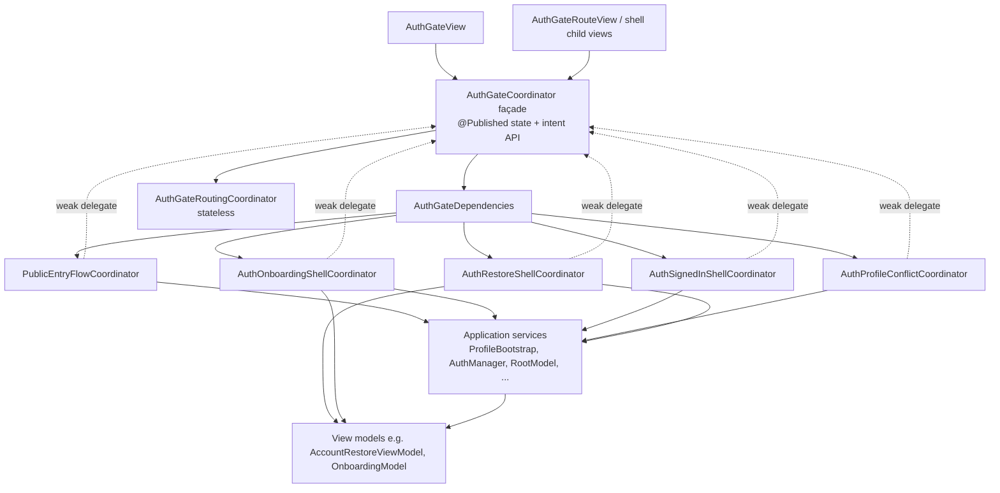

# Auth Gate Architecture

**Status:** Decomposition v1 (behavior-neutral)  
**Last updated:** 2026-07-05  
**Related:** [AppArchitectureOverview.md](./AppArchitectureOverview.md), [../Coach/CoachModelDecompositionV1.md](../Coach/CoachModelDecompositionV1.md)

---

## Purpose

`AuthGateCoordinator` remains the **single `ObservableObject` façade** for `AuthGateView` and auth shell child views. It owns all `@Published` shell state that SwiftUI binds to, exposes public intent methods, and wires child lifecycle coordinators through `AuthGateDependencies`.

Lifecycle orchestration — routing reactions, public entry, onboarding handoff, signed-in bootstrap, profile conflict, and account restore presentation — is delegated to focused coordinators. Child coordinators hold **weak** delegate references back to the façade; the façade owns the children strongly. State mutations flow child → delegate bridge extensions → `@Published` properties on `AuthGateCoordinator`.

`AuthGateView` binds façade state and calls façade intent methods (for example `activateShell()`, `signOutFromAccount`). It does **not** reference child coordinators directly.

---

## Before

On `main` before decomposition, `Fitness Coach/Features/Auth/Coordinator/AuthGateCoordinator.swift` was a **~1,331 LOC** god coordinator. A single type mixed:

- Route input assembly and `AppShellRoute` resolution
- Welcome / existing-user public entry flow and analytics
- Pre-auth and signed-in `OnboardingModel` lifecycle
- Post-sign-in bootstrap and auth/root state reactions
- Profile plan conflict and account mismatch orchestration
- Account restore routing and `AccountRestoreViewModel` lifecycle
- Sign-out, account deletion shell reset, and existing-user resolution

`AuthGateView` also carried inline lifecycle wiring (`.onChange` on `authManager.authState`, `rootModel.state`, `effectiveRoute`, and cloud upload failure notifier).

---

## After

### Coordinator map

| Component | Path | LOC (approx.) | Role |
|-----------|------|---------------|------|
| **AuthGateCoordinator** | `Fitness Coach/Features/Auth/Coordinator/AuthGateCoordinator.swift` | ~170 | Façade: `@Published` state, init/wiring, shared delegate bridges, routing surface |
| **AuthGateRoutingCoordinator** | `Fitness Coach/Features/Auth/Coordinator/AuthGateRoutingCoordinator.swift` | ~58 | Stateless `AuthGateRouteInputs` assembly and `baseRoute` / `effectiveRoute` resolution |
| **PublicEntryFlowCoordinator** | `Fitness Coach/Features/Auth/Coordinator/PublicEntryFlowCoordinator.swift` | ~359 | Welcome / returning-member sign-in entry flow and public-entry analytics |
| **AuthOnboardingShellCoordinator** | `Fitness Coach/Features/Auth/Coordinator/AuthOnboardingShellCoordinator.swift` | ~332 | `OnboardingModel` lifecycle and onboarding-to-sign-in handoff |
| **AuthSignedInShellCoordinator** | `Fitness Coach/Features/Auth/Coordinator/AuthSignedInShellCoordinator.swift` | ~463 | Post-sign-in bootstrap, auth/root reactions, reconcile, sign-out shell reset |
| **AuthProfileConflictCoordinator** | `Fitness Coach/Features/Auth/Coordinator/AuthProfileConflictCoordinator.swift` | ~407 | Profile plan conflict, account mismatch, cloud upload failure surfaces |
| **AuthRestoreShellCoordinator** | `Fitness Coach/Features/Auth/Coordinator/AuthRestoreShellCoordinator.swift` | ~108 | Account restore routing and `AccountRestoreViewModel` lifecycle |
| **AuthGateDependencies** | `Fitness Coach/Features/Auth/Coordinator/AuthGateDependencies.swift` | ~113 | Live and DEBUG test assembly of child coordinators |

### Façade extensions

Delegate bridges and intent forwarding live in extensions under `Fitness Coach/Features/Auth/Coordinator/`:

| File | Role |
|------|------|
| `AuthGateCoordinator+PublicEntryDelegate.swift` | `PublicEntryFlowCoordinatorDelegate` + public entry actions/analytics forwards |
| `AuthGateCoordinator+OnboardingDelegate.swift` | `AuthOnboardingShellCoordinatorDelegate` + onboarding lifecycle forwards |
| `AuthGateCoordinator+SignedInDelegate.swift` | `AuthSignedInShellCoordinatorDelegate` + signed-in/auth/root forwards |
| `AuthGateCoordinator+ProfileConflictDelegate.swift` | `AuthProfileConflictCoordinatorDelegate` + conflict forwards |
| `AuthGateCoordinator+RestoreDelegate.swift` | `AuthRestoreShellCoordinatorDelegate` + restore forwards |
| `AuthGateCoordinator+ShellLifecycle.swift` | `activateShell()`, environment accessors, internal Combine lifecycle reactions |

### Shell views

| View | Path | Uses |
|------|------|------|
| `AuthGateView` | `Fitness Coach/Features/Auth/AuthGateView.swift` | Façade only: `.task { coordinator.activateShell() }`, published alert bindings, environment via façade accessors |
| `AuthGateRouteView` | `Fitness Coach/Features/Auth/Views/AuthGateRouteView.swift` | `coordinator.effectiveRoute` switch; façade intent closures |
| `AuthGateOnboardingShellView` | `Fitness Coach/Features/Auth/Views/AuthGateOnboardingShellView.swift` | `coordinator.onboardingModel`, `coordinator.isUserSignedIn` |
| `AuthGateProfilePlanConflictHost` | `Fitness Coach/Features/Auth/Views/AuthGateProfilePlanConflictHost.swift` | Published conflict state + `coordinator.localProfileForPlanConflict()` |

`MainTabView` still receives `coordinator.container` (public on the façade). That is app composition, not a child lifecycle coordinator.

---

## Ownership table

### AuthGateCoordinator (façade)

| | |
|---|---|
| **Owns** | All `@Published` auth-shell state; `effectiveRoute` surface; `AuthGateDependencies` wiring; public intent API; shared delegate bridges (`currentUID()`, `signOutFromAuthManager()`, `clearOnboardingModel()`, `isUIDStillCurrent`); shell activation via `activateShell()` |
| **Does not own** | Route policy rules (`AuthGateRoutingPolicy`, `AppRouteResolver`); domain service implementations; child coordinator lifecycle logic; `OnboardingModel` internals; restore merge semantics |
| **Important tests** | `Fitness CoachTests/Auth/AuthGateCoordinatorDecompositionCharacterizationTests.swift`, `Fitness CoachTests/Auth/AuthGateCoordinatorRoutingCharacterizationTests.swift`, `Fitness CoachTests/Auth/AuthGateCharacterizationTestSupport.swift` |

### AuthGateRoutingCoordinator

| | |
|---|---|
| **Owns** | `AuthGateRouteInputs` struct; stateless `baseRoute(inputs:container:)` and `effectiveRoute(inputs:container:)` |
| **Does not own** | `@Published` state; lifecycle reactions; analytics |
| **Important tests** | `Fitness CoachTests/Auth/AuthGateCoordinatorRoutingCharacterizationTests.swift`, `Fitness CoachTests/AuthGateRoutingPolicyTests.swift` |

### PublicEntryFlowCoordinator

| | |
|---|---|
| **Owns** | Welcome → onboarding / existing-user sign-in navigation; `publicEntryDestination` mutations; public-entry and existing-user sign-in analytics; cold-start welcome logging; sign-out public-entry destination policy |
| **Does not own** | `OnboardingModel` creation/teardown (delegates via façade); signed-in reconcile; profile conflict resolution; `AuthManager` Firebase listener |
| **Important tests** | `Fitness CoachTests/PublicWelcomeRoutingTests.swift`, `Fitness CoachTests/PublicEntryEdgeCaseTests.swift`, `Fitness CoachTests/ExistingUserSignInTests.swift`, `Fitness CoachTests/ExistingUserSignInRoutingTests.swift`, `Fitness CoachTests/NoExistingProfileFoundTests.swift`, decomposition characterization tests (public entry sections) |

### AuthOnboardingShellCoordinator

| | |
|---|---|
| **Owns** | `OnboardingModel` lifecycle (create, clear, bootstrap-on-route); pre-auth onboarding preparation; onboarding completion sign-in handoff orchestration; onboarding sign-in failure reactions |
| **Does not own** | `OnboardingModel` step logic and form state; `ProfileBootstrapCoordinatorService.resolveOnboardingCompletion` implementation; conflict UI; restore routing (calls façade delegate methods that forward to other coordinators) |
| **Important tests** | `Fitness CoachTests/OnboardingCompletionSignInTests.swift`, `Fitness CoachTests/OnboardingAuthFlowTests.swift`, `Fitness CoachTests/WelcomeOnboardingHandoffTests.swift`, decomposition characterization tests (onboarding sections) |

### AuthSignedInShellCoordinator

| | |
|---|---|
| **Owns** | `handleAuthStateChange` / `handleRootStateChange` / `handleSignedOutTransition`; signed-in profile reconcile and existing-user resolution orchestration; `signedInSessionID` rotation; sign-out and account-deletion shell reset; wiring to `profileConflictCoordinator` and `restoreShellCoordinator` for downstream flows |
| **Does not own** | `AccountDeletionCoordinator` deletion execution; conflict resolution steps; `AccountRestoreViewModel` restore merge logic; `RootModel` state machine implementation |
| **Important tests** | `Fitness CoachTests/AuthRoutingTests.swift`, `Fitness CoachTests/LogoutRoutingTests.swift`, `Fitness CoachTests/AccountPersistenceAuthLifecycleTests.swift`, `Fitness CoachTests/AuthSignInRegressionTests.swift`, decomposition characterization tests (signed-in / sign-out sections) |

### AuthProfileConflictCoordinator

| | |
|---|---|
| **Owns** | Profile plan conflict presentation and resolution actions; account profile mismatch flow; cloud profile upload failure presentation and retry; conflict-related `@Published` flags on the façade |
| **Does not own** | `ProfileBootstrapCoordinatorService` cloud sync implementation; `ProfilePlanConflictView` UI; account deletion; restore VM internals |
| **Important tests** | `Fitness CoachTests/ProfilePlanConflictFlowTests.swift`, `Fitness CoachTests/AccountProfileMismatchTests.swift`, `Fitness CoachTests/CloudProfileUploadFailureTests.swift`, decomposition characterization tests (conflict sections) |

### AuthRestoreShellCoordinator

| | |
|---|---|
| **Owns** | `routeToMainWithAccountRestore`, `completeRouteToMain`, `scheduleRouteToMainWithAccountRestore`; `AccountRestoreViewModel` creation and teardown; `accountRestoreRouteTask` cancel/scheduling |
| **Does not own** | `AccountRestoreCoordinator` restore pipeline; `AccountInitialRestoreService` merge/download semantics; `AccountRestoreViewModel` retry implementation details beyond shell callbacks |
| **Important tests** | `Fitness CoachTests/AuthRestoreRoutingTests.swift`, `Fitness CoachTests/AccountRestoreViewModelTests.swift`, `Fitness CoachTests/AccountRestoreEndToEndTests.swift`, decomposition characterization tests (restore sections) |

### AuthGateDependencies

| | |
|---|---|
| **Owns** | Construction order and references for live (`static func live`) and DEBUG test (`static func testing`) coordinator graphs |
| **Does not own** | Runtime lifecycle, `@Published` state, or route resolution |
| **Important tests** | Used by `Fitness CoachTests/Auth/AuthGateCharacterizationTestSupport.swift` for injectable harness assembly |

---

## Data flow

**Typical intent flow:** view calls façade method → child coordinator executes → child mutates façade state via delegate bridge extension → SwiftUI re-renders from `@Published` properties and `effectiveRoute`.

**Typical reaction flow:** `activateShell()` subscribes to `authManager`, `rootModel`, façade publishers, and `ProfileCloudUploadFailureNotifier` → façade forwards to child `handle*` methods.

---

## Testing strategy

### Characterization tests (behavior freeze)

Run before and after auth-gate lifecycle changes:

| Suite | Path | Covers |
|-------|------|--------|
| Decomposition characterization | `Fitness CoachTests/Auth/AuthGateCoordinatorDecompositionCharacterizationTests.swift` | End-to-end façade behavior across routes, public entry, onboarding, conflict, restore, sign-out |
| Routing characterization | `Fitness CoachTests/Auth/AuthGateCoordinatorRoutingCharacterizationTests.swift` | `effectiveRoute` precedence, overlay policy parity, route stability |
| Test support | `Fitness CoachTests/Auth/AuthGateCharacterizationTestSupport.swift` | Harness factory, route scenarios, `AuthGateDependencies.testing` injection |

DEBUG test seam: `Fitness Coach/Application/Services/Auth/AuthManager+Testing.swift` (`applyTestingAuthState`).

### Existing auth tests

| Suite | Path |
|-------|------|
| Auth routing / resolver policy | `Fitness CoachTests/AuthRoutingTests.swift` |
| Auth gate routing policy | `Fitness CoachTests/AuthGateRoutingPolicyTests.swift` |
| Auth profile route safety | `Fitness CoachTests/AuthProfileRouteSafetyTests.swift` |
| Auth sign-in regression | `Fitness CoachTests/AuthSignInRegressionTests.swift` |
| Logout routing | `Fitness CoachTests/LogoutRoutingTests.swift` |
| Sign-out hygiene | `Fitness CoachTests/SignOutHygieneTests.swift` |
| Public welcome routing | `Fitness CoachTests/PublicWelcomeRoutingTests.swift` |
| Public entry edge cases | `Fitness CoachTests/PublicEntryEdgeCaseTests.swift` |
| Existing user sign-in | `Fitness CoachTests/ExistingUserSignInTests.swift`, `Fitness CoachTests/ExistingUserSignInRoutingTests.swift`, `Fitness CoachTests/ExistingUserSignInResolutionTests.swift` |

### Restore routing tests

| Suite | Path |
|-------|------|
| Auth restore routing | `Fitness CoachTests/AuthRestoreRoutingTests.swift` |
| Account restore view model | `Fitness CoachTests/AccountRestoreViewModelTests.swift` |
| Account restore E2E | `Fitness CoachTests/AccountRestoreEndToEndTests.swift` |
| Restore policy / session / coordinator (service layer) | `Fitness CoachTests/AccountRestorePolicyTests.swift`, `Fitness CoachTests/AccountRestoreSessionStateTests.swift`, `Fitness CoachTests/AccountRestoreCoordinatorTests.swift` |

### Profile conflict tests

| Suite | Path |
|-------|------|
| Profile plan conflict flow | `Fitness CoachTests/ProfilePlanConflictFlowTests.swift` |
| Account profile mismatch | `Fitness CoachTests/AccountProfileMismatchTests.swift` |
| Cloud profile upload failure | `Fitness CoachTests/CloudProfileUploadFailureTests.swift` |
| Onboarding profile conflict summary | `Fitness CoachTests/OnboardingProfileConflictSummaryBuilderTests.swift` |

### Account persistence lifecycle tests

| Suite | Path |
|-------|------|
| Account persistence auth lifecycle | `Fitness CoachTests/AccountPersistenceAuthLifecycleTests.swift` |
| Profile bootstrap coordinator | `Fitness CoachTests/ProfileBootstrapCoordinatorTests.swift` |
| Profile ownership resolver | `Fitness CoachTests/ProfileOwnershipResolverTests.swift` |

### Onboarding completion sign-in tests

| Suite | Path |
|-------|------|
| Onboarding completion sign-in | `Fitness CoachTests/OnboardingCompletionSignInTests.swift` |
| Onboarding completion (general) | `Fitness CoachTests/OnboardingCompletionTests.swift` |
| Onboarding completion profile flow / policy | `Fitness CoachTests/OnboardingCompletionProfileFlowTests.swift`, `Fitness CoachTests/OnboardingCompletionProfilePolicyTests.swift`, `Fitness CoachTests/OnboardingCompletionPolicyTests.swift` |

---

## Explicit exclusions

The auth-gate decomposition **did not** split or relocate:

| Area | Reason |
|------|--------|
| `OnboardingModel` internals | Remains in `Features/Onboarding/`; shell coordinator only manages lifecycle |
| `AccountRestoreCoordinator` internals | Restore pipeline stays in Application layer; shell coordinator only routes and hosts VM |
| `AccountInitialRestoreService` internals | Download/merge semantics unchanged |
| `AccountDeletionCoordinator` internals | Deletion execution unchanged; `AuthSignedInShellCoordinator` only wires router callbacks |
| HI presentation builders | Unrelated to auth shell |
| `AppContainer` construction split | `AuthGateDependencies` wraps auth-gate wiring only; `AppContainer` remains the app DI root |

---

## Rules for future changes

1. **Do not expose child coordinators to `AuthGateView` or auth shell views.** Add small intent methods or façade accessors on `AuthGateCoordinator` instead.
2. **Add characterization coverage before changing lifecycle behavior.** Extend `AuthGateCoordinatorDecompositionCharacterizationTests` and/or `AuthGateCoordinatorRoutingCharacterizationTests` when altering route precedence, sign-out reset order, or coordinator handoffs.
3. **Keep route precedence tested.** Changes to `AuthGateRouteInputs`, `AuthGateRoutingCoordinator`, `AuthGateRoutingPolicy`, or `AppRouteResolver` must keep `AuthGateCoordinatorRoutingCharacterizationTests` and `AuthGateRoutingPolicyTests` green.
4. **Keep restore/account merge semantics outside auth-gate shell refactors.** Restore data merge, `AccountRestoreCoordinator`, and `AccountInitialRestoreService` behavior changes belong in their own service-layer tests (`AccountRestoreEndToEndTests`, `AccountRestoreCoordinatorTests`, etc.), not as drive-by edits inside shell coordinators.
5. **Preserve weak delegate ownership.** Child coordinators must not retain the façade strongly.
6. **Keep `AuthGateCoordinator` the sole `ObservableObject` for the auth shell** unless an existing child view model (for example `AccountRestoreViewModel`, `OnboardingModel`) already serves that role for a specific subview.
