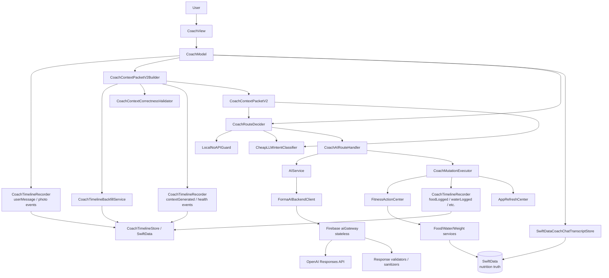
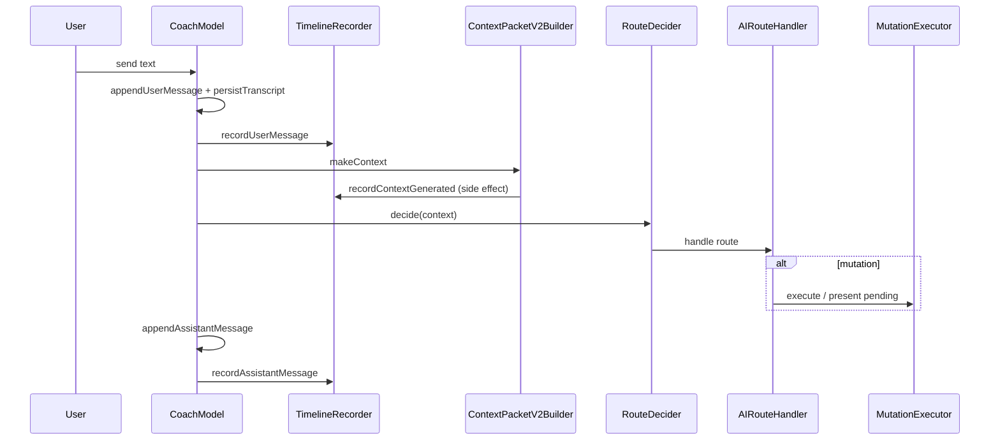
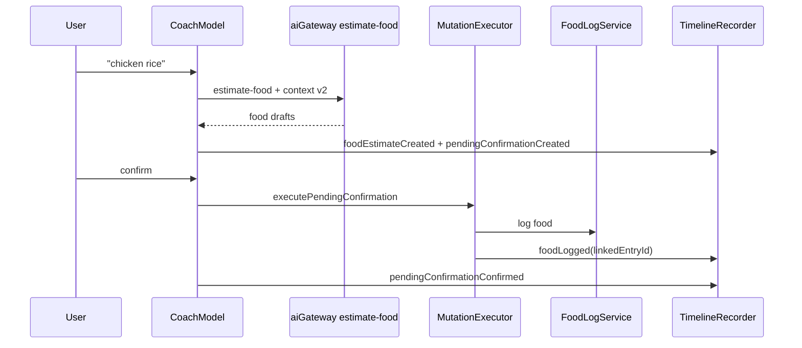
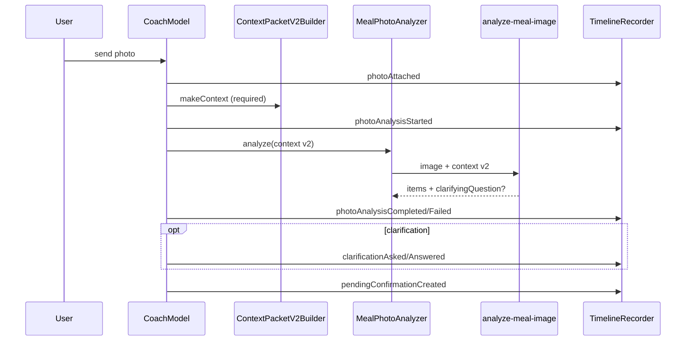
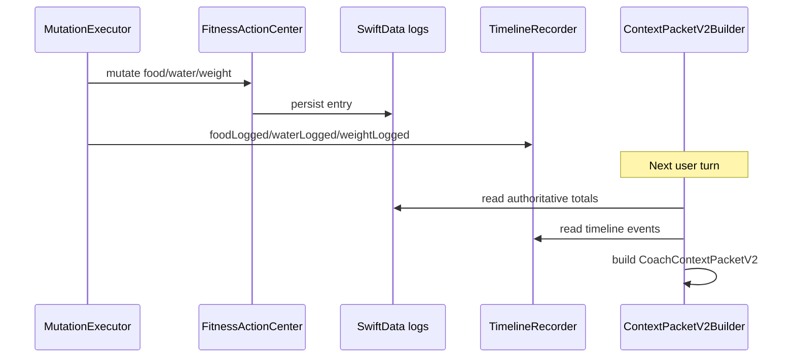
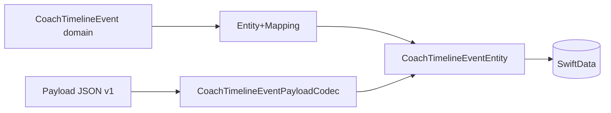
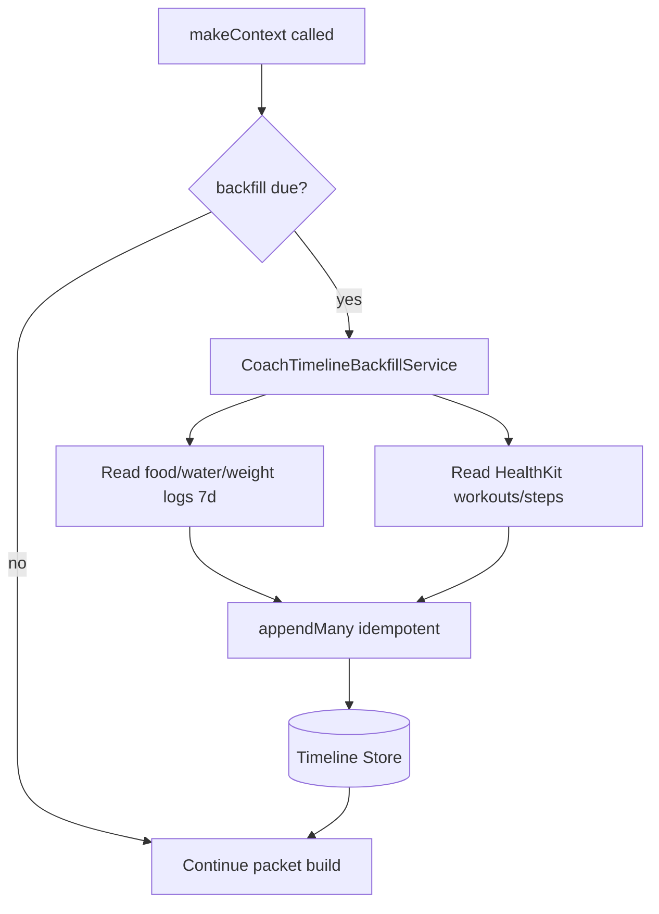
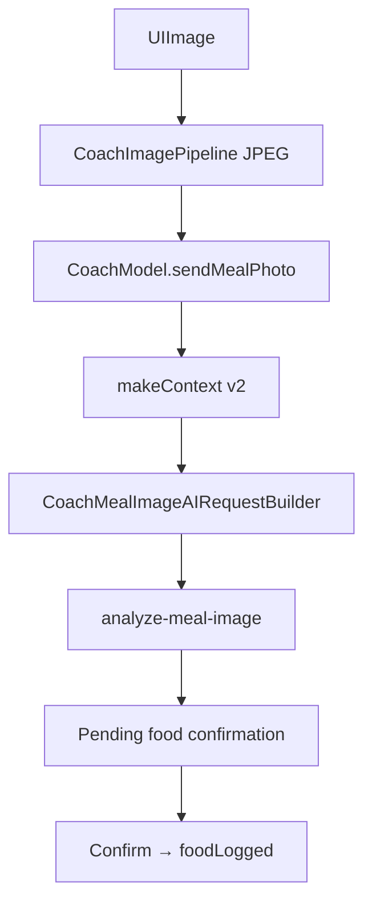
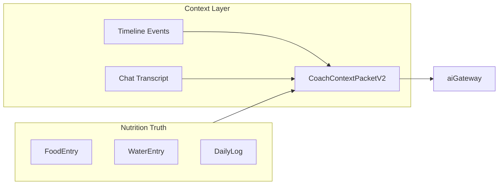

# Coach Full Context Packet — Post Timeline Context v2

**Generated:** 2026-07-04  
**Scope:** Post-v2 architecture audit + context packet  
**Repo:** FitnessCoach / Forma / FitPilot iOS + Firebase aiGateway  
**Purpose:** Document the current production Coach architecture after Coach Timeline Context v2, with emphasis on model accuracy, timeline context, mutation correctness, Health Intelligence, photo analysis, and backend prompt/schema behavior.

**Pre-v2 archive:** `Docs/Coach/archive/COACH_FULL_CONTEXT_PACKET_PRE_V2_2026-07-04.md`

---

## Legend

| Tag | Meaning |
|-----|---------|
| **CONFIRMED** | Directly evidenced in source code or tests |
| **RESOLVED** | A pre-v2 issue that is now fixed by v2 |
| **PARTIAL** | Improved, but not fully solved |
| **RISK** | Current likely failure mode |
| **HYPOTHESIS** | Reasonable inference not fully proven by code |
| **DEPRECATED** | Old pre-v2 path still present but no longer active |
| **REMOVED** | Old path fully removed |

---

## 1. Executive Summary

### What Coach does now after v2

**CONFIRMED:** Coach remains the app's conversational AI interface for fitness logging and coaching. It is still **not a nutrition state owner** — food, water, and weight truth lives in SwiftData via `FoodLogService`, `WaterLogService`, `WeightLogService`, and `DailyLogService`. Coach reads authoritative state, builds a structured `CoachContextPacketV2`, routes intent, calls Firebase `aiGateway` when needed, and mutates data only through `FitnessActionCenter` / `CoachMutationExecutor`.

**CONFIRMED (v2):** Coach now maintains a **persisted event timeline** (`CoachTimelineEvent` → `CoachTimelineEventEntity` in SwiftData) as an audit and model-context layer. Timeline events are **not** the source of nutrition totals; totals still come from log services and `DailyLog`.

**CONFIRMED:** `CoachContextPacketV2` (`schemaVersion = 2`) is the **exclusive** AI transport shape for all Coach gateway calls. `CoachContextPacketV2Builder.makeContext()` assembles the packet on every AI turn.

**DEPRECATED / REMOVED:** `CoachContextBuilder` / `CoachAIContextBuilder.swift` — **REMOVED**. `AIContext` — **DEPRECATED** (`Fitness Coach/Infrastructure/AI/AIContext.swift`); retained only for Codable compatibility, zero production Coach call sites.

**CONFIRMED:** Backend `aiGateway` remains **stateless for context** — full packet sent per request; no server-side session store. In-memory per-UID rate limits only (`functions/src/gatewayGuardrails.ts`).

**CONFIRMED:** Timeline v2 is **not AB-gated** — `AppContainer` always wires `SwiftDataCoachTimelineStore`, `CoachTimelineBackfillService`, `DefaultCoachTimelineRecorder`, and `CoachContextPacketV2Builder`. **PARTIAL:** Health Intelligence sections in the packet are gated by `FORMA_HEALTH_INTELLIGENCE_COACH_CONTEXT_ENABLED` (default **off**).

### Main user flows after v2

| Flow | Post-v2 behavior |
|------|------------------|
| Text message | User send → `recordUserMessage` → `makeContext` → route → AI/local → `recordAssistantMessage` |
| Food logging | Classify/estimate → `foodEstimateCreated` + `pendingConfirmationCreated` → confirm → mutation → `foodLogged` with `linkedEntryId` |
| Food confirmation | Bar or typed confirm → `pendingConfirmationConfirmed` → `CoachMutationExecutor` → `foodLogged` |
| Rejection | Bar or typed reject → `pendingConfirmationRejected` + `foodRejected` — excluded from totals/context |
| Edit/delete | `linkedEntryId` resolution → pending or immediate mutation → `foodEdited`/`foodDeleted` with `supersedesEventId` |
| Water logging | Local or AI → immediate or pending → `waterLogged` with `linkedEntryId` |
| Weight logging | Same pattern → `weightLogged` with `linkedEntryId` |
| Meal advice | Classifier → `generate-meal-advice` with full v2 context |
| Today summary | Local `.status` route → `CoachDailyStatusBuilder` / `CoachResponseBuilder` (deterministic) |
| Photo analysis | `photoAttached` → `makeContext` (required) → `analyze-meal-image` → clarification loop → pending → confirm → `foodLogged` |
| Clarification | `clarificationAsked` / `clarificationAnswered` timeline events |
| Apple Health / workout / steps | HealthKit query + optional HI snapshot → `training`, `today.steps`, `missingData`; timeline `workoutDetected`/`stepsUpdated` |
| Backend error | `recordBackendError` timeline event; user-facing error copy |
| Auth error | `recordAuthError` timeline event; auth retry UI |

### Top resolved v2 improvements

1. **RESOLVED:** True persisted event timeline with 33 event types and SwiftData storage.
2. **RESOLVED:** Structured `CoachContextPacketV2` replaces compact `AIContext`.
3. **RESOLVED:** 12 recent chat messages with timestamps and photo flags (was 5 role+text only).
4. **RESOLVED:** `recentMealsStructured` with macros, confidence, `linkedEntryId` (was 6 name strings).
5. **RESOLVED:** `commonFoods` populated from 30-day food history (was always empty).
6. **RESOLVED:** Cross-launch chat persistence via `SwiftDataCoachChatTranscriptStore`.
7. **RESOLVED:** Photo analysis receives full v2 context (backend requires it).
8. **RESOLVED:** Pending/rejected/failed events excluded from consumed totals and AI timeline export.
9. **RESOLVED:** Correction events (`foodEdited`, `foodDeleted`, `supersedesEventId`) visible to model.
10. **RESOLVED:** Live steps via HealthKit with explicit `source`/`asOf`/`missingData` (was stale `DailyLog.steps` only).

### Top remaining model accuracy risks

1. **RISK:** Health Intelligence in Coach context **off by default** — recovery/training-load sections absent unless flag enabled.
2. **RISK:** Context compaction may drop older timeline events on busy days.
3. **RISK:** Cheap classifier misroutes food vs advice before v2 context helps.
4. **RISK:** Compound dish estimates still depend on estimate-food quality.
5. **RISK:** Chat transcript retention (30 days / 300 messages) may truncate long corrections.
6. **RISK:** Backfill dedup window (60s) may miss edge-case duplicates.
7. **RISK:** No emergency kill-switch for timeline-in-context (documented future item only).
8. **RISK:** Weight undo not implemented.

### Summary table

| Area | Pre-v2 | Post-v2 | Status |
|------|--------|---------|--------|
| AI context | compact `AIContext` | `CoachContextPacketV2` | **RESOLVED** |
| Timeline | none | `CoachTimelineEvent` ledger | **RESOLVED** |
| Chat persistence | in-memory | `SwiftDataCoachChatTranscriptStore` (production) | **CONFIRMED** |
| Photo context | no full context | v2 required on `analyze-meal-image` | **CONFIRMED** |
| Steps | stale `DailyLog.steps` | HealthKit + HI fallback + `missingData` | **RESOLVED** |
| Health Intelligence | not wired | wired when `FORMA_HEALTH_INTELLIGENCE_COACH_CONTEXT_ENABLED=1` | **PARTIAL** |
| commonFoods | empty | populated from 30-day history | **RESOLVED** |
| Corrections | invisible | timeline correction events + `linkedEntryId` | **RESOLVED** |

---

## 2. Post-v2 Architecture Overview



**Key boundaries (CONFIRMED):**
- Timeline writes occur **before** AI calls (user messages, photos) and **after** successful mutations (`CoachMutationExecutor` + `CoachModel` lifecycle events).
- Context builds from **authoritative log state + timeline + transcript**, not from assistant chat text as truth.
- Backend stores **no** client context between requests.
- Coach does **not** own macro totals — `DailyLog` / food entries are authoritative.

---

## 3. Updated Coach Feature File Inventory

### 3.1 New v2 files (added by Timeline Context v2)

| Path | Responsibility | Key types/functions | Tags |
|------|----------------|---------------------|------|
| `Fitness Coach/Infrastructure/AI/CoachContextPacketV2.swift` | v2 transport schema | `CoachContextPacketV2`, `CoachContextMeta`, limits | CTX, NET |
| `Fitness Coach/Application/StateBuilders/Coach/CoachContextPacketV2Builder.swift` | Assembles full packet | `makeContext()`, timeline selector, compactor | CTX |
| `Fitness Coach/Application/StateBuilders/Coach/CoachContextCorrectnessValidator.swift` | Pre-send validation | `validateAndCorrect()` | CTX |
| `Fitness Coach/Application/StateBuilders/Coach/CoachContextFoodMemoryBuilder.swift` | Recent meals + common foods | `makeRecentMeals()`, `makeCommonFoods()` | CTX |
| `Fitness Coach/Application/StateBuilders/Coach/CoachAIResponseContextAdapter.swift` | Entry reference resolution | `CoachEntryReferenceResolver` | CTX, MUT |
| `Fitness Coach/Domain/CoachTimeline/CoachTimelineEvent.swift` | Domain event model | `CoachTimelineEvent` | TIMELINE |
| `Fitness Coach/Domain/CoachTimeline/CoachTimelineEventType.swift` | 33 event kinds | `CoachTimelineEventType` | TIMELINE |
| `Fitness Coach/Domain/CoachTimeline/CoachTimelineEventSource.swift` | Event origin | `coachUI`, `localPipeline`, `aiBackend`, etc. | TIMELINE |
| `Fitness Coach/Domain/CoachTimeline/CoachTimelineEventStatus.swift` | Lifecycle status | `pending`, `confirmed`, `rejected`, etc. | TIMELINE |
| `Fitness Coach/Domain/CoachTimeline/CoachTimelineEventPayload.swift` | Typed payloads | `FoodEstimatePayload`, `ConfirmationPayload`, etc. | TIMELINE |
| `Fitness Coach/Domain/CoachTimeline/CoachTimelineEventConfidence.swift` | Confidence enum | `.high`, `.medium`, `.low` | TIMELINE |
| `Fitness Coach/Domain/CoachTimeline/CoachTimelineEventLink.swift` | Entry/message links | `linkedEntryId`, `linkedMessageId` | TIMELINE |
| `Fitness Coach/Domain/CoachTimeline/CoachTimelineQuery.swift` | Query helpers | date/range filters | TIMELINE |
| `Fitness Coach/Domain/CoachTimeline/CoachTimelineCompactionPolicy.swift` | Per-day caps | 200 events/day default | TIMELINE |
| `Fitness Coach/Domain/CoachTimeline/CoachTimelinePruningPolicy.swift` | Retention | 30 detailed days | TIMELINE |
| `Fitness Coach/Infrastructure/Persistence/SwiftData/Entities/CoachTimelineEventEntity.swift` | SwiftData entity | indexed `localDate`, `eventTypeRaw` | TIMELINE, PERS |
| `Fitness Coach/Infrastructure/Persistence/SwiftData/Mapping/CoachTimelineEventEntity+Mapping.swift` | Entity ↔ domain | mapping extensions | TIMELINE, PERS |
| `Fitness Coach/Infrastructure/Persistence/SwiftData/Mapping/CoachTimelineEventPayloadCodec.swift` | JSON payload codec | encode/decode with unknown fallback | TIMELINE, PERS |
| `Fitness Coach/Infrastructure/Persistence/SwiftData/Mapping/CoachTimelineEventSummaryBuilder.swift` | Human summaries | event summary strings | TIMELINE |
| `Fitness Coach/Data/Repositories/CoachTimelinePersistenceRepository.swift` | Repository layer | CRUD, supersede, prune | TIMELINE, PERS |
| `Fitness Coach/Application/Services/CoachTimelineStore.swift` | Store protocol + SwiftData impl | `SwiftDataCoachTimelineStore` | TIMELINE, PERS |
| `Fitness Coach/Application/Services/CoachTimelineBackfillService.swift` | Hydrate timeline from logs | `runBackfill()` | TIMELINE |
| `Fitness Coach/Application/UseCases/CoachTimeline/CoachTimelineRecorder.swift` | Best-effort event writer | `DefaultCoachTimelineRecorder`, `NoOpCoachTimelineRecorder` | TIMELINE |
| `Fitness Coach/Application/UseCases/Coach/CoachMutationTimelineContext.swift` | Mutation metadata | photo/pending attribution | TIMELINE, MUT |
| `Fitness Coach/Features/Coach/Model/CoachModelTimelineSupport.swift` | Model ↔ timeline mapping | attribution helpers | TIMELINE |
| `Fitness Coach/Application/Services/SwiftDataCoachChatTranscriptStore.swift` | Persisted chat | `loadMessages()`, `saveMessages()` | PERS |
| `Fitness Coach/Infrastructure/Persistence/SwiftData/Entities/CoachChatTranscriptMessageEntity.swift` | Chat entity | role, text, image metadata | PERS |
| `Fitness Coach/Data/Repositories/CoachChatTranscriptPersistenceRepository.swift` | Chat repository | fetch, replace, prune | PERS |
| `Fitness Coach/Domain/Coach/CoachChatTranscriptRetentionPolicy.swift` | 30d / 300 msg cap | retention rules | PERS |
| `Fitness Coach/Infrastructure/AI/CoachContextPacketV2+Review.swift` | Daily review bridge | review context mapping | CTX |
| `functions/src/coachContextPacketV2.ts` | Backend validate/sanitize | `parseCoachContextForPrompt()` | BACKEND |
| `functions/src/coachContextPromptRules.ts` | Shared prompt rules | `coachContextV2Rules()` | BACKEND |

### 3.2 Removed / deprecated pre-v2 files

| Path | Status | Tags |
|------|--------|------|
| `Fitness Coach/Application/StateBuilders/Coach/CoachAIContextBuilder.swift` | **REMOVED** | DEPRECATED |
| `Fitness Coach/Infrastructure/AI/AIContext.swift` | **DEPRECATED** — no active Coach usage | DEPRECATED |

### 3.3 Active core Coach files (unchanged role, updated for v2)

| Path | Responsibility | Key types/functions | Tags |
|------|----------------|---------------------|------|
| `Fitness Coach/Features/Coach/CoachView.swift` | Root Coach tab | `CoachView` | UI |
| `Fitness Coach/Features/Coach/Model/CoachModel.swift` | Central orchestrator | `sendCurrentMessage()`, `confirmPendingFromBar()` | UI, CTX, MUT, NET |
| `Fitness Coach/Application/UseCases/Coach/CoachAIRouteHandler.swift` | Route execution | `handle()`, photo, pending presentation | MUT, NET |
| `Fitness Coach/Application/UseCases/Coach/CoachMutationExecutor.swift` | Canonical mutations | `executePendingConfirmation()`, dedup sets | MUT, TIMELINE |
| `Fitness Coach/Application/UseCases/Coach/Pipeline/CoachRouteDecider.swift` | Local guard → classify | `decide(context:)` | NET |
| `Fitness Coach/Application/UseCases/Coach/Pipeline/CheapLLMIntentClassifier.swift` | Intent classifier | `classify(context:)` | NET |
| `Fitness Coach/Application/UseCases/Coach/Pipeline/LocalNoAPIGuard.swift` | Deterministic shortcuts | local commands | NET |
| `Fitness Coach/Application/UseCases/Coach/CoachMealPhotoAnalyzer.swift` | Photo orchestration | `analyze(context:)` | PHOTO, NET |
| `Fitness Coach/Application/UseCases/Coach/CoachMealImageAIRequestBuilder.swift` | Image request builder | `buildAnalysisRequest(context:)` | PHOTO, NET |
| `Fitness Coach/Application/Services/AIService.swift` | All AI gateway calls | v2 context on every request | NET |
| `Fitness Coach/Infrastructure/AI/AIContracts.swift` | Request/response Codable | `AICoachIntentClassificationRequest`, etc. | NET |
| `Fitness Coach/App/AppContainer.swift` | DI wiring | timeline + builder + transcript | CTX, TIMELINE, PERS |
| `Fitness Coach/Application/StateBuilders/Coach/CoachTodayContextBuilder.swift` | **UI-only** today card | not AI transport | UI |
| `Fitness Coach/Application/StateBuilders/Coach/CoachHealthIntelligenceContextBuilder.swift` | HI → packet section | flag-gated | HEALTH, CTX |
| `Fitness Coach/Features/Coach/Model/CoachChatTranscriptStore.swift` | Protocol + in-memory | `CoachInMemoryChatTranscriptStore` (tests/previews) | PERS |

### 3.4 Backend files

| Path | Responsibility | Tags |
|------|----------------|------|
| `functions/src/index.ts` | `aiGateway` router, 90s timeout | BACKEND |
| `functions/src/mealImageAnalysis.ts` | `analyze-meal-image` handler | BACKEND, PHOTO |
| `functions/src/gatewayGuardrails.ts` | Auth, rate limits, body size | BACKEND |
| `functions/test/coachContextPacketV2.test.ts` | v2 validation tests | TEST |
| `functions/test/coachContextPromptRules.test.ts` | Prompt rule tests | TEST |
| `functions/test/aiGateway.contract.test.ts` | Endpoint contracts | TEST |

### 3.5 Key iOS test files (v2)

| Path | Tags |
|------|------|
| `Fitness CoachTests/CoachContextPacketV2Tests.swift` | TEST, CTX |
| `Fitness CoachTests/CoachContextPacketV2BuilderTests.swift` | TEST, CTX |
| `Fitness CoachTests/CoachContextCorrectnessValidatorTests.swift` | TEST, CTX |
| `Fitness CoachTests/CoachTimelineStoreTests.swift` | TEST, TIMELINE |
| `Fitness CoachTests/CoachTimelineRecorderTests.swift` | TEST, TIMELINE |
| `Fitness CoachTests/CoachTimelineBackfillServiceTests.swift` | TEST, TIMELINE |
| `Fitness CoachTests/CoachTimelineContextV2ComprehensiveTests.swift` | TEST, TIMELINE, CTX |
| `Fitness CoachTests/CoachMealPhotoContextV2Tests.swift` | TEST, PHOTO |
| `Fitness CoachTests/CoachChatTranscriptPersistenceTests.swift` | TEST, PERS |
| `Fitness CoachTests/CoachMutationExecutorTimelineTests.swift` | TEST, MUT, TIMELINE |
| `Fitness CoachTests/CoachAIHealthIntelligenceIntegrationTests.swift` | TEST, HEALTH |

---

## 4. Coach User Experience Map — Post-v2

### Opening Coach

| Step | Behavior | Tag |
|------|----------|-----|
| Load transcript | `CoachModel.init` → `transcriptStore.loadMessages()` | **CONFIRMED** |
| Backfill timeline | First `makeContext()` → `timelineBackfillService.runBackfill()` (60s rate limit) | **CONFIRMED** |
| Refresh Health/Today | `CoachView.onAppear` → `refreshTodayContext()` | **CONFIRMED** |
| System events | `contextGenerated` + optional `workoutDetected`/`stepsUpdated` on context build | **CONFIRMED** |

### Sending plain text

1. **User action:** Tap send.
2. **Timeline:** `recordUserMessage` (deduped by message ID).
3. **Context:** `prepareContextPacket` → `CoachContextPacketV2Builder.makeContext(recentMessages:, currentUserMessage:)`.
4. **Route:** `CoachRouteDecider.decide(context:)` → local guard or `CheapLLMIntentClassifier.classify(context:)`.
5. **Mutation:** Per route — local execute, pending food, or advice reply.
6. **Persistence:** Chat via `persistTranscript()` after each message append.
7. **Timeline follow-up:** `recordAssistantMessage`; optional `pendingConfirmationCreated`.
8. **UI:** Assistant bubble + optional confirmation bar.

### Food logging

| Event | When | Tag |
|-------|------|-----|
| `userMessage` | On send | CONFIRMED |
| `foodEstimateCreated` | After estimate-food returns | CONFIRMED |
| `pendingConfirmationCreated` | When pending bar shown | CONFIRMED |
| `pendingConfirmationConfirmed` | User confirms | CONFIRMED |
| `foodLogged` | After `FoodLogService` write with `linkedEntryId` | CONFIRMED |
| `foodRejected` | User rejects food pending | CONFIRMED |

### Editing food estimate before confirmation

**CONFIRMED:** `AIFoodConfirmationSheet` edits draft in memory. On confirm, `userEditedBeforeConfirm: true` passed via `CoachMutationTimelineContext`. `foodLogged` payload reflects edited values. **PARTIAL:** No separate `foodEstimateEdited` timeline event — edit state captured in confirmation metadata only.

### Rejecting estimate

**CONFIRMED:** Rejected estimates excluded from `today.nutrition` totals (`CoachContextCorrectnessValidator.pendingRejectedNotInTotals`). `foodRejected` + `pendingConfirmationRejected` appear in timeline but are **filtered out** of AI-exported timeline (`CoachContextPacketV2TimelineSelector`).

### Water / weight logging

**CONFIRMED:** `waterLogged` / `weightLogged` recorded by `CoachMutationExecutor` with `linkedEntryId`. Local deterministic commands execute immediately; AI may show pending for ambiguous parses.

### Edit/delete existing food

**CONFIRMED:** `linkedEntryId` resolved via `CoachEntryReferenceResolver` (explicit ID, meal name match, timeline event). `foodEdited`/`foodDeleted` with `supersedesEventId` on superseded events.

### Meal advice

**CONFIRMED:** Uses full v2 — `recentMealsStructured`, `timeline`, `today`, `training`, optional `healthIntelligence`, `missingData`.

### Meal photo

**CONFIRMED:** Full lifecycle — `photoAttached` → `photoAnalysisStarted` → `photoAnalysisCompleted`/`Failed` → optional `clarificationAsked`/`Answered` → `pendingConfirmationCreated` → confirm → `foodLogged` with photo session link. `analyze-meal-image` **requires** v2 context.

### Today summary

**CONFIRMED:** Deterministic local route (`.status` / `daily_summary`). `CoachDailyStatusBuilder` reads logs; excludes pending/rejected from consumed totals.

### Sequence diagrams

#### Text message flow



#### Food logging flow



#### Photo analysis flow



#### Mutation-to-timeline flow



---

## 5. CoachModel Deep Dive — Post-v2

**File:** `Fitness Coach/Features/Coach/Model/CoachModel.swift`

### Published state (CONFIRMED)

`messages`, `isSending`, `pendingConfirmation`, `todayContext`, `errorTitle`/`errorMessage`, `showsAuthRetry`, composer-related via `inputState`.

### Private collaborators (CONFIRMED)

`contextPacketBuilder: CoachContextPacketV2Builder?`, `transcriptStore: CoachChatTranscriptStore`, `timelineRecorder: CoachTimelineRecording`, `timelineStore`, `routeDecider`, `routeHandler`, `mutationExecutor`, `mealPhotoAnalyzer`, `imageAnalysisSessionStore`.

### Old paths

| Item | Status |
|------|--------|
| `CoachContextBuilder` | **REMOVED** |
| `AIContext` references | **None** in CoachModel |
| `CoachTodayContextBuilder` | **Active** — UI today card only |

### Send call graph (CONFIRMED)

```
sendCurrentMessage()
  → inputState.takeSendSnapshot()
  → send(text) / sendMealPhoto()
  → appendUserMessage + persistTranscript + recordUserMessage
  → handlePendingConfirmationInput / clarification branch
  → processCoachMessage()
      → prepareContextPacket() → contextPacketBuilder.makeContext()
      → routeDecider.decide(context: CoachContextPacketV2)
      → routeHandler.handle(route, context)
  → applyActionResult()
  → appendAssistantMessage + recordAssistantMessage
  → optional pendingConfirmationCreated
```

### Confirm call graph (CONFIRMED)

```
confirmPendingFromBar()
  → mutationExecutor.executePendingConfirmation(timelineContext:)
  → timelineRecordPendingConfirmed(entryId: lastAffectedEntryId)
  → clearPendingConfirmation()
  → appendAssistantMessage + persistTranscript
```

### Rejection call graph (CONFIRMED)

```
rejectPendingFromBar()
  → timelineRecordPendingRejected
  → recordFoodRejected (food only)
  → clearPendingConfirmation()
  → appendAssistantMessage(pendingRejected)
```

### Idempotency (CONFIRMED)

- `CoachMutationExecutor.completedPendingConfirmationIDs` — prevents double confirm.
- `recordedFoodLogEntryIDs` — prevents duplicate `foodLogged` timeline events.
- `CoachModel.recordedTimelineUserMessageIDs` / `recordedTimelineAssistantMessageIDs` — message dedup.

### MainActor (CONFIRMED)

`CoachModel` is `@MainActor`. Timeline recorder dispatches store writes on MainActor via `Task`.

### Thread-safety risks (RISK)

Timeline append is best-effort async; rapid confirm double-tap guarded by `isConfirmingPending` + executor dedup sets.

---

## 6. Coach Timeline v2 Model

### Is there a true timeline?

| Question | Answer | Tag |
|----------|--------|-----|
| True timeline? | Yes — ordered `CoachTimelineEvent` ledger | **CONFIRMED** |
| Persisted? | Yes — `CoachTimelineEventEntity` in SwiftData | **CONFIRMED** |
| Cross-launch? | Yes | **CONFIRMED** |
| User-facing? | Partially — chat shows messages; timeline is primarily model/context-facing | **CONFIRMED** |
| Source of nutrition truth? | **No** — logs are truth; timeline is audit/context | **CONFIRMED** |

### Event type table

| Event Type | Payload | Source | Status | Created By | Model-visible? |
|------------|---------|--------|--------|------------|----------------|
| `userMessage` | `message` | coachUI | confirmed | CoachModel | Yes |
| `assistantMessage` | `message` | localPipeline/aiBackend | confirmed | CoachModel | Yes (chat continuity) |
| `foodEstimateCreated` | `foodEstimate` | estimateFood/classifier | pending | Recorder | **No** (filtered) |
| `foodLogged` | `foodLogged` | userConfirmation | confirmed | MutationExecutor | **Yes** |
| `foodRejected` | `foodEstimate` | userConfirmation | rejected | CoachModel | **No** (filtered) |
| `foodEdited` | `foodLogged` | userConfirmation | confirmed | MutationExecutor | Yes |
| `foodDeleted` | `foodLogged` | userConfirmation | confirmed | MutationExecutor | Yes |
| `waterLogged` | `waterLogged` | localParser/classifier | confirmed | MutationExecutor | Yes |
| `weightLogged` | `weightLogged` | localParser/classifier | confirmed | MutationExecutor | Yes |
| `workoutDetected` | `workoutDetected` | healthSync | confirmed | Backfill/Builder | Yes |
| `stepsUpdated` | `steps` | healthSync | confirmed | Backfill/Builder | Yes (may deprioritize) |
| `photoAttached` | `photo` | coachUI | confirmed | CoachModel | Yes |
| `photoAnalysisStarted` | `photo` | localPipeline | pending→confirmed | CoachModel | Yes |
| `photoAnalysisCompleted` | `photo` | mealImage | confirmed | CoachModel | Yes |
| `photoAnalysisFailed` | `error` | mealImage | failed | CoachModel | Filtered |
| `clarificationAsked` | `message` | mealImage | confirmed | CoachModel | Yes |
| `clarificationAnswered` | `message` | coachUI | confirmed | CoachModel | Yes |
| `pendingConfirmationCreated` | `confirmation` | localPipeline | pending | CoachModel | **Yes** (only pending type exported) |
| `pendingConfirmationConfirmed` | `confirmation` | userConfirmation | confirmed | CoachModel | Filtered |
| `pendingConfirmationRejected` | `confirmation` | userConfirmation | rejected | CoachModel | Filtered |
| `undoPerformed` | `undo` | localPipeline | confirmed | MutationExecutor | Yes |
| `backendError` | `error` | aiBackend | failed | CoachModel | Filtered |
| `authError` | `error` | system | failed | CoachModel | Filtered |
| `systemRefresh` | `systemRefresh` | system | confirmed | Builder | Filtered |
| `healthDataUnavailable` | `healthAvailability` | healthSync | confirmed | Builder | Filtered |
| `contextGenerated` | `contextGeneration` | system | confirmed | Builder | Filtered |
| `unknown` | `empty` | system | confirmed | Codec fallback | Filtered |

### Source attribution table

| Attribution | Meaning | Example |
|-------------|---------|---------|
| `localParser` | Deterministic local command | "500ml water" |
| `classifier` | Cheap LLM intent | log_food routing |
| `estimateFood` | estimate-food endpoint | text food estimate |
| `mealImage` | analyze-meal-image | photo estimate |
| `commonFoodReference` | Matched common food history | "same as usual oatmeal" |
| `userConfirmation` | User confirmed pending | confirm bar |
| `healthKit` | Direct HealthKit read | steps, workouts |
| `healthIntelligence` | HI snapshot fallback | steps when HK denied |
| `system` | Internal | context generation |
| `systemBackfill` | Backfill from logs | historical foodLogged |

### Persistence diagram



### Duplicate prevention (CONFIRMED)

- Store `append` idempotent on event `id`.
- Backfill dedup: same type + localDate + linkedEntryId within 60s.
- CoachModel message ID dedup sets.

---

## 7. Timeline Persistence and Backfill

### SwiftData entity (CONFIRMED)

`CoachTimelineEventEntity` — fields include `eventTypeRaw`, `sourceRaw`, `statusRaw`, `utcCreatedAt`, `localDate`, `timezoneIdentifier`, `summary`, `payloadJSON`, `linkedEntryId`, `linkedMessageId`, `supersedesEventId`, `userId`. Indexed: `localDate`, `utcCreatedAt`, `eventTypeRaw`, `linkedEntryId`.

### Backfill behavior (CONFIRMED)

| Source | Backfilled as | Tag |
|--------|---------------|-----|
| Food logs | `foodLogged` confirmed, `linkedEntryId` = entry ID | CONFIRMED |
| Water logs | `waterLogged` | CONFIRMED |
| Weight logs | `weightLogged` | CONFIRMED |
| Health workouts | `workoutDetected` | CONFIRMED |
| Steps | `stepsUpdated` | CONFIRMED |
| Chat messages | **Not** backfilled | CONFIRMED |
| Pending/rejected | **Not** invented | CONFIRMED |

**When:** On `makeContext()` via `runBackfill()` (rate-limited 60s). **Idempotent:** Yes, with dedup keys.



---

## 8. Persistent Chat Transcript

| Question | Answer | Tag |
|----------|--------|-----|
| ChatMessage persisted? | Yes in production (`SwiftDataCoachChatTranscriptStore`) | **CONFIRMED** |
| Relaunch sees prior chat? | Yes — `CoachModel.init` loads transcript | **CONFIRMED** |
| AI references prior chat? | Yes — `recentChatMessages` (12) + timeline | **CONFIRMED** |
| Assistant messages = nutrition truth? | **No** — prompts + validator treat chat as continuity only | **CONFIRMED** |
| Raw images persist? | Thumbnail + optional JPEG ≤64KB in entity | **CONFIRMED** |
| Retention | 30 days, 300 messages max | **CONFIRMED** |
| In-memory store | `CoachInMemoryChatTranscriptStore` for tests/previews default in `CoachModel.init` | **CONFIRMED** |
| Links to timeline | `linkedMessageId` on timeline events; chat entity has photo session IDs | **CONFIRMED** |

---

## 9. CoachContextPacketV2

**Schema file:** `Fitness Coach/Infrastructure/AI/CoachContextPacketV2.swift`  
**Builder:** `Fitness Coach/Application/StateBuilders/Coach/CoachContextPacketV2Builder.swift`

### Field source table

| Field | Source | Trust Level | Missing Behavior | Notes |
|-------|--------|-------------|------------------|-------|
| `meta` | `CoachContextMeta.make()` | High | Always present | `schemaVersion=2`, localDate/timezone |
| `profile` | `UserProfileService` | High | Omitted if nil | `"profile"` attribution |
| `today.targets` | `DailyLog` | High | Optional fields | From daily log service |
| `today.nutrition` | Food entries + targets | High | Zeros possible | Excludes pending/rejected |
| `today.hydration` | Water entries | High | — | |
| `today.weight` | Daily log / latest weight | Medium | `missingData.weightMissing` | |
| `today.steps` | HealthKit → HI fallback | Medium | `missingData.stepsMissing` | Explicit `source`/`asOf` |
| `today.workoutCaloriesBurned` | Daily log + HK | Medium | — | |
| `training.workoutsToday` | `HealthActivityQueryService` | Medium | 0 + missing flags | |
| `training.workouts[]` | HealthKit workout details | Medium | Empty array | duration, energy, source |
| `training.trainingLoad` | `TrainingLoadEngine` + HI | Low-Medium | Omitted if HI off | |
| `healthIntelligence` | HI snapshot builder | Medium | Omitted if flag off | 24 fields when present |
| `timeline.recentEvents` | Timeline store + selector | High for confirmed mutations | Empty if no history | Max 20 selected, 40 transport cap |
| `recentChatMessages` | Transcript | Low (continuity) | Empty | Last 12, 180 char text |
| `currentUserMessage` | In-flight turn | Medium | nil after send | Deduped vs last message |
| `recentMealsStructured` | 30-day food history | High | `missingData.noRecentMeals` | Max 10, with `linkedEntryId` |
| `commonFoods` | Aggregated food history | Medium | Empty if <2 logs | Max 10, min freq 2 |
| `missingData` | Derived | High | Booleans default false | 13 flags |
| `assumptions` | Builder heuristics | Low | Empty | Workout/steps source notes |
| `generationMode` | `.live`/`.degraded`/`.backfill`/`.preview` | Meta | `.live` default | Degraded on read failures |
| `sourceAttribution` | Builder counts | Meta | Optional | Deduped source list |

### Endpoint context usage (CONFIRMED)

| Endpoint | Receives v2? |
|----------|--------------|
| `classify-coach-intent` | Optional — validated if present |
| `estimate-food` | Optional — validated if present |
| `generate-meal-advice` | Optional |
| `parse-edit-delete` | Optional |
| `parse-multi-action` | Optional |
| `generate-daily-review` | Optional (via `CoachContextPacketV2+Review`) |
| `analyze-meal-image` | **Required** |

**CONFIRMED:** Old `AIContext` is **not sent** anywhere in active Coach flow.

### Redacted example payload

```json
{
  "meta": {
    "generatedAt": "2026-07-04T01:53:00Z",
    "timezoneIdentifier": "Asia/Singapore",
    "localDate": "2026-07-04",
    "localTime": "09:53",
    "appVersion": "1.0.0",
    "schemaVersion": 2
  },
  "profile": { "age": 30, "sex": "male", "goalType": "fat_loss" },
  "today": {
    "targets": { "calorieTarget": 2000, "proteinTarget": 150 },
    "nutrition": { "caloriesConsumed": 820, "caloriesRemaining": 1180, "proteinConsumed": 45 },
    "hydration": { "waterConsumedMl": 1200, "waterRemainingMl": 800 },
    "steps": { "value": 6420, "source": "healthKit", "confidence": "high" }
  },
  "training": { "workoutsToday": 1, "workouts": [{ "title": "Run", "durationMinutes": 32, "source": "healthKit" }] },
  "timeline": {
    "recentEvents": [
      { "type": "foodLogged", "status": "confirmed", "summary": "Chicken rice lunch", "linkedEntryId": "…" }
    ]
  },
  "recentChatMessages": [
    { "role": "user", "text": "I had chicken rice for lunch", "hasPhotoAttachment": false }
  ],
  "recentMealsStructured": [
    { "name": "Chicken rice", "mealType": "lunch", "calories": 520, "linkedEntryId": "…" }
  ],
  "commonFoods": [
    { "name": "Chicken rice", "frequency": 5, "typicalCalories": 500 }
  ],
  "missingData": { "stepsMissing": false, "healthKitDenied": false },
  "assumptions": [{ "key": "stepsSource", "value": "healthKit" }],
  "generationMode": "live"
}
```

---

## 10. Context Correctness Rules

**File:** `Fitness Coach/Application/StateBuilders/Coach/CoachContextCorrectnessValidator.swift` — **CONFIRMED implemented**

| Rule | Severity | Debug Behavior | Production Behavior |
|------|----------|----------------|---------------------|
| `caloriesMatchConfirmedFood` | Error | Log all issues | Log redacted summary |
| `macrosNonNegative` | Error | Log + clamp | Log + clamp |
| `waterNonNegative` | Error | Log + clamp | Log + clamp |
| `remainingValuesConsistent` | Error | Recalculate | Recalculate |
| `pendingRejectedNotInTotals` | Error | Log | Log |
| `timelineSorted` | Warning | Sort in place | Sort in place |
| `localDateTimezoneConsistent` | Warning | Fix meta | Fix meta |
| `stepsSourceExplicit` | Warning | Default `healthKit` | Default `healthKit` |
| `workoutSourceExplicit` | Warning | Default source | Default source |
| `missingDataPopulated` | Warning | Log | Log |
| `contextSizeBelowThreshold` | Error | Run compactor | Run compactor |

**CONFIRMED:** Validator always returns corrected packet (does not block send). Issues logged; corrections applied inline.

---

## 11. AI Routing and Intent Classification — Post-v2

### Pre-v2 vs post-v2

| Aspect | Pre-v2 | Post-v2 |
|--------|--------|---------|
| Classifier context | `AIContext` compact snapshot | `CoachContextPacketV2` full structured packet |
| `linkedEntryId` | Not supported | Supported on actions + meals + timeline |
| Timeline references | Chat text only | `timeline.recentEvents` + `recentMealsStructured` |
| "same as breakfast" | **HYPOTHESIS** weak | `commonFoods` + structured meals + prompt rules |
| "delete that" | Name heuristics only | `linkedEntryId` + timeline event ID resolution |

### Decision tree (CONFIRMED)

```
User text
  → LocalNoAPIGuard (deterministic water/weight/status/undo?)
  → if pass: CheapLLMIntentClassifier.classify(text, context: v2)
  → CoachIntentConfidenceGate
  → CoachIntentRouter → CoachAIRouteHandler
```

### Remaining risks

- **RISK:** Classifier still uses current user text as primary signal — timeline helps references, not primary intent.
- **RISK:** False `log_food` on advice phrasing still possible at classifier tier.
- **PARTIAL:** `linkedEntryId` depends on backend returning it or client resolver finding match.

---

## 12. Food Parsing and Nutrition Mutation Pipeline — Post-v2

**CONFIRMED:** Food AI estimates always require confirmation (`ConfirmationPolicy`). Local deterministic food parses may execute immediately.

### Flow

```
User text → userMessage → context v2 → classifier → estimate-food (+ context v2)
  → foodEstimateCreated → pendingConfirmationCreated
  → confirm/reject/edit → mutation → foodLogged/foodRejected
  → next request gets updated context v2
```

### Edge cases

| Case | Behavior | Tag |
|------|----------|-----|
| Parsing wrong | User rejects; `foodRejected` excluded from totals | CONFIRMED |
| Invalid JSON | Backend 422; `recordBackendError` | CONFIRMED |
| Double confirm | `completedPendingConfirmationIDs` blocks re-execute | CONFIRMED |
| Backend timeout | Error UI + `backendError` event | CONFIRMED |
| Auth fail | Auth retry + `authError` event | CONFIRMED |

---

## 13. Water, Weight, Workout, Steps, and Other Mutations — Post-v2

| Mutation | Route | Timeline | Confirmation | Undo |
|----------|-------|----------|--------------|------|
| Water | local or AI | `waterLogged` | Usually immediate | Supported |
| Weight | local or AI | `weightLogged` | Usually immediate | **Not available** |
| Workout log | Redirect / not in Coach | `workoutDetected` read-only | N/A | N/A |
| Steps | Read-only context | `stepsUpdated` | N/A | N/A |
| Food edit | AI or local | `foodEdited` + supersede | Often pending | Via undo |
| Food delete | AI or local | `foodDeleted` + supersede | Often pending | Via undo |
| Daily status | Local `.status` | None | N/A | N/A |

---

## 14. Health Intelligence and Apple Health Context in Coach — Post-v2

### Health signal table

| Health Signal | Source | In Context v2? | Missing Behavior | Risk |
|---------------|--------|----------------|------------------|------|
| Live steps | HealthKit → HI fallback | Yes (`today.steps`) | `stepsMissing`, `stepsUnavailable` | PARTIAL if HK denied |
| Steps source/asOf | Builder | Yes | Explicit in `CoachContextSourcedInt` | RESOLVED |
| workoutsToday | HealthKit | Yes (`training`) | `workoutsUnavailable` | CONFIRMED |
| Workout details | HealthKit | Yes (`training.workouts[]`) | Empty + missing flags | CONFIRMED |
| Recovery score/status | HI snapshot | Only if flag on | Omitted | **RISK** default off |
| Training load | HI + engine | Only if flag on | Omitted | **RISK** default off |
| Adaptive nutrition | HI snapshot | Only if flag on | Omitted | **RISK** default off |
| HealthKit denied | Builder | `missingData.healthKitDenied` | Distinguishable from no workout | CONFIRMED |

**CONFIRMED:** `HealthIntelligenceEngine` / `CoachHealthIntelligenceContextBuilder` used when `shouldCoachLoadHealthIntelligence` is true (`FORMA_HEALTH_INTELLIGENCE_COACH_CONTEXT_ENABLED`, default **false**).

**PARTIAL:** Basic workout/steps still available via `HealthActivityQueryService` without HI flag.

**RISK:** `DailyLog.workoutCaloriesBurned` may coexist with HK workout data — builder uses sourced ints with attribution; double-count risk mitigated by source labeling but not fully eliminated.

---

## 15. Photo / Image Analysis Pipeline — Post-v2

| Question | Answer | Tag |
|----------|--------|-----|
| Old `workoutsToday=0` issue fixed? | Yes — full v2 context includes `training.workoutsToday` from HealthKit | **RESOLVED** |
| Meal image receives v2? | **Required** by backend | **CONFIRMED** |
| Model knows goals/recent meals? | Yes — `today.targets`, `recentMealsStructured`, `commonFoods` | **CONFIRMED** |
| Workout/recovery context? | `training` always; `healthIntelligence` if flag on | **PARTIAL** |
| Photo assumptions visible later? | `photoAnalysisCompleted` timeline + pending confirmation metadata | **CONFIRMED** |
| Raw image in timeline? | **No** — metadata only | **CONFIRMED** |
| Image bytes sent only to image field? | Yes — base64 in `image` field, not in context JSON | **CONFIRMED** |



---

## 16. Backend / Firebase / OpenAI Pipeline — Post-v2

**CONFIRMED:** Single Cloud Function `aiGateway` (`functions/src/index.ts`), 90s timeout, 512MiB.

### Endpoint table

| Endpoint | Accepts v2? | Uses timeline? | Uses health? | Uses linkedEntryId? | Response Schema Changed? |
|----------|-------------|----------------|--------------|---------------------|--------------------------|
| `classify-coach-intent` | Optional | Yes (sanitized) | Yes (`healthIntelligence`, `missingData`) | Yes (prompt rules) | No major change |
| `estimate-food` | Optional | Yes | Yes | Indirect via meals | No |
| `generate-meal-advice` | Optional | Yes | Yes | No | No |
| `generate-daily-review` | Optional | Yes | Yes | No | No |
| `parse-edit-delete` | Optional | Yes | Partial | **Yes** | No |
| `parse-multi-action` | Optional | Yes | Partial | **Yes** | No |
| `analyze-meal-image` | **Required** | Yes | Yes | Via meals | No |

**Models (CONFIRMED):** `gpt-5-nano` (cheap), `gpt-5.4-nano` (strong/photo). `estimate-food` photo uses strong tier. One validation repair retry on estimate-food only.

**Stateless:** Context not stored server-side. Logs use `coachContextLogFields()` — redacted aggregates only.

---

## 17. Prompt and System Instruction Audit — Post-v2

**File:** `functions/src/coachContextPromptRules.ts`

### Verified prompt rules (CONFIRMED via tests)

| Rule | Present in prompts? |
|------|---------------------|
| Structured context is source of truth | Yes — `coachContextV2Rules()` |
| Confirmed timeline overrides chat | Yes |
| Pending/rejected/failed not logged facts | Yes |
| Assistant messages conversational only | Yes |
| Missing data must be acknowledged | Yes — `coachContextHealthRules()` |
| Use `meta.localDate` / timezone | Yes |
| Use `recentEvents` for ordering | Yes |
| Use `recentMealsStructured` for food refs | Yes — `estimateFoodPromptRules()` |
| Health Intelligence for workout advice | Yes when present in context |
| Never diagnose medical conditions | Yes — `sharedRules()` |
| Never mutate app state | Yes |

### Prompt risk table

| Prompt Area | Pre-v2 Risk | Post-v2 Status | Remaining Risk |
|-------------|-------------|----------------|----------------|
| Chat vs truth | Model invented from chat | Rules + structured fields | Model may still ignore rules |
| Pending food | Could count as eaten | Explicit exclusion rules | Client validator is backstop |
| Photo context | No workout/meals | Full v2 required | HI off by default |
| Timezone | Ambiguous "today" | localDate in meta | Travel edge cases |
| Edit/delete refs | Weak targeting | linkedEntryId rules | Resolver miss if no match |

---

## 18. Persistence and Data Source Map — Post-v2

| Data Source | Source of Truth? | Read By | Written By | Persisted? | Synced Remote? | Timeline Link? |
|-------------|------------------|---------|------------|------------|----------------|----------------|
| `FoodEntryEntity` | **Yes** (food) | Context builder, Coach | MutationExecutor | Yes | No | `linkedEntryId` |
| `WaterEntryEntity` | **Yes** (water) | Context builder | MutationExecutor | Yes | No | `linkedEntryId` |
| `WeightEntryEntity` | **Yes** (weight) | Context builder | MutationExecutor | Yes | No | `linkedEntryId` |
| `DailyLogEntity` | **Yes** (daily rollup) | Context builder, Today UI | Log services | Yes | No | Indirect |
| `UserProfileEntity` | **Yes** (profile) | Context builder | Profile service | Yes | Optional | No |
| `CoachTimelineEventEntity` | Context/audit layer | Context builder | Recorder, backfill | Yes | No | Self |
| `CoachChatTranscriptMessageEntity` | Chat continuity | Context builder, UI | CoachModel | Yes | No | `linkedMessageId` |
| Health cache entities | Health reads | HI, activity query | Health sync | Yes | Optional | `workoutDetected`/`stepsUpdated` |
| Firebase backend | None for user data | — | — | No | N/A | No |

**Roles:**
- **Nutrition truth:** SwiftData log entities + `DailyLogService`
- **Timeline:** Audit + model context (not totals)
- **Chat:** UX continuity + recent messages in packet
- **Backend:** Stateless inference only
- **Health:** Apple Health / HI snapshot → `training`, `missingData`, optional `healthIntelligence`



---

## 19. Accuracy Failure Modes — Post-v2

### 1. Resolved by v2

| Failure Mode | Pre-v2 | Post-v2 | Files | Severity |
|--------------|--------|---------|-------|----------|
| No event timeline | Open | **RESOLVED** | `CoachTimelineEvent*` | — |
| 5 messages only | Open | **RESOLVED** (12) | `CoachContextPacketV2Builder` | — |
| 6 meal name strings | Open | **RESOLVED** structured meals | `CoachContextFoodMemoryBuilder` | — |
| commonFoods empty | Open | **RESOLVED** | `CoachContextFoodMemoryBuilder` | — |
| Chat in-memory only | Open | **RESOLVED** | `SwiftDataCoachChatTranscriptStore` | — |
| Photo no context | Open | **RESOLVED** | `CoachMealImageAIRequestBuilder` | — |
| Stale DailyLog steps only | Open | **RESOLVED** HK live | `CoachContextPacketV2Builder` | — |
| Pending counted as consumed | Open | **RESOLVED** | `CoachContextCorrectnessValidator` | — |
| Corrections invisible | Open | **RESOLVED** | Timeline edit/delete events | — |

### 2. Partially resolved

| Failure Mode | Post-v2 Status | Files | Severity | Reproduce | Test Coverage | Next Fix |
|--------------|----------------|-------|----------|-----------|---------------|----------|
| Health Intelligence not wired | **PARTIAL** — wired but flag off | `HealthIntelligenceFeatureFlags` | Medium | Default install post-workout advice | `CoachAIHealthIntelligenceIntegrationTests` | Enable flag or default on |
| Photo workout context | **PARTIAL** — training yes, HI no | Builder | Low | HI flag off | `CoachMealPhotoContextV2Tests` | Include baseline recovery without full HI |
| Conversation truncation | **PARTIAL** — 12 msgs + timeline | Builder limits | Medium | Long session | Partial | Summarize older chat |
| Compound dish errors | **PARTIAL** | estimate-food | High | "chicken rice" | `CoachFoodLoggingRegressionTests` | Better component extraction |
| Timezone day boundary | **PARTIAL** — localDate in meta | Builder | Medium | Travel at midnight | `CoachTimelineHardeningTests` | More TZ integration tests |

### 3. Still open after v2

| Failure Mode | Files | Severity | Reproduce | Test Coverage | Next Fix |
|--------------|-------|----------|-----------|---------------|----------|
| Classifier misroute food vs advice | `CheapLLMIntentClassifier` | High | "should I eat pizza" | `CoachRoutingTests` | Stronger gate or examples |
| Backend timeout | `AIService` | Medium | Slow network | Partial | Offline copy + retry UX |
| Context too large busy day | Size compactor | Medium | 50+ events/day | Partial | Smarter compaction |
| Weight undo missing | `CoachMutationExecutor` | Low | Undo weight | None | Implement undo |
| HealthKit denied = no workout | Builder | Medium | Deny Health | Partial | Clearer missingData UX |

### 4. New risks introduced by v2

| Failure Mode | Files | Severity | Reproduce | Test Coverage | Next Fix |
|--------------|-------|----------|-----------|---------------|----------|
| Timeline backfill duplicates | `CoachTimelineBackfillService` | Low | Rapid relaunch | `CoachTimelineBackfillServiceTests` | Tighten dedup |
| Unknown payload decode | `CoachTimelineEventPayloadCodec` | Low | Schema drift | `CoachTimelineDomainTests` | Versioned payloads |
| SwiftData migration | `FormaModelMigration` | Medium | App upgrade | Partial | Migration tests |
| Validator silent correction | `CoachContextCorrectnessValidator` | Low | Macro drift | `CoachContextCorrectnessValidatorTests` | Alerting on corrections |
| Assistant text in chat still tempts model | Prompt only | Medium | Ask "what did coach say I ate" | Partial | Stronger backend enforcement |

---

## 20. Testing Coverage — Post-v2

### iOS test inventory (representative)

| Test File | Covers | Missing |
|-----------|--------|---------|
| `CoachContextPacketV2Tests.swift` | Encoding, limits, redaction | Schema version migration |
| `CoachContextPacketV2BuilderTests.swift` | Full assembly, HI, backfill | Size compactor drop order |
| `CoachContextCorrectnessValidatorTests.swift` | All 11 rules | Live `makeContext` integration failures |
| `CoachTimelineStoreTests.swift` | Store operations | Production `SwiftDataCoachTimelineStore` E2E |
| `CoachTimelineBackfillServiceTests.swift` | Dedup, idempotency | Multi-user |
| `CoachTimelineContextV2ComprehensiveTests.swift` | End-to-end packet+timeline | — |
| `CoachMealPhotoContextV2Tests.swift` | Photo + v2 context | HI flag off matrix |
| `CoachChatTranscriptPersistenceTests.swift` | Persist/reload/retention | Corruption recovery |
| `CoachAIHealthIntelligenceIntegrationTests.swift` | HI flag gating | Real HealthKit device tests |
| `CoachRoutingTests.swift` | Routing decisions | v2-specific cache keys |
| `CoachMutationExecutorTimelineTests.swift` | Mutation events | Weight undo |

### Backend tests

| Test File | Covers | Missing |
|-----------|--------|---------|
| `coachContextPacketV2.test.ts` | Validate/sanitize | Swift/TS parity matrix |
| `coachContextPromptRules.test.ts` | Rule strings exist | Prompt drift snapshots |
| `aiGateway.contract.test.ts` | All endpoints + v2 400 on v1 | Load testing |
| `mealImageAnalysis.test.ts` | Image payload validation | Full multimodal content |

### Newly covered after v2

Timeline persistence, backfill, context validator, photo v2 context, transcript persistence, pending/rejected exclusion, `linkedEntryId` resolution, backend v2 schema rejection.

### Still missing after v2

Timeline emergency kill-switch, Swift gateway E2E from iOS, production SwiftData migration suite, HealthKit denied on physical device matrix, context compactor ordering integration test.

### Critical tests to add next

1. `CoachContextPacketV2SizeCompactor` integration with 40+ timeline events.
2. Cross-timezone day boundary with real calendar fixtures.
3. HI flag off vs on photo analysis parity.
4. SwiftData migration CoachTimeline + ChatTranscript entities.
5. Backend prompt snapshot tests (not just substring).

---

## 21. Build / Run / Debug Instructions — Post-v2

### iOS

```bash
xcodebuild -scheme "Fitness Coach" -destination "platform=iOS Simulator,name=iPhone 16" build

xcodebuild -scheme "Fitness Coach" -destination "platform=iOS Simulator,name=iPhone 16" test

# Targeted Coach tests
xcodebuild -scheme "Fitness Coach" -destination "platform=iOS Simulator,name=iPhone 16" \
  -only-testing:"Fitness CoachTests/CoachContextPacketV2BuilderTests" test
```

### Firebase functions

```bash
cd functions && npm run build
cd functions && npm test
```

### Debug subsystems (CONFIRMED)

| Subsystem | Logger category |
|-----------|-----------------|
| Context validator | `CoachContextCorrectnessValidator` |
| Pipeline trace | `FormaPipelineTracer` |
| Coach analytics | `OSLogCoachAnalyticsLogger` (DEBUG) |

### Inspection tips

1. **Timeline records:** Breakpoint on `DefaultCoachTimelineRecorder.append` or query `CoachTimelineEventEntity` in SwiftData debug.
2. **Context packet DEBUG:** Log `packet.redactedDebugDescription()` after `makeContext` (see `CoachAIRequestContextLogging`).
3. **Verify no AIContext:** Search codebase — only `AIContext.swift` definition remains.
4. **Verify backend v2:** Network trace `context.meta.schemaVersion == 2` on gateway requests.
5. **Verify photo v2:** `analyze-meal-image` body must include non-null `context` — 400 without it.

### Simulator limitations

HealthKit workouts/steps may be empty or simulated — use `missingData` flags to verify Coach handles absence without inventing data.

---

## 22. Manual QA Checklist — Post-v2

| # | Scenario | Expected | Timeline events | Context fields | Failure signal |
|---|----------|----------|-----------------|----------------|----------------|
| 1 | Fresh install open Coach | Empty or onboarding chat | Backfill may run | `generationMode: live` | Crash on load |
| 2 | Send greeting | Local/chat reply | `userMessage`, `assistantMessage` | `recentChatMessages` | Stuck sending |
| 3 | Ask daily status | Deterministic summary | Messages only | `today.nutrition` | AI call for status |
| 4 | Log simple food | Pending → confirm | `foodEstimateCreated`, `foodLogged` | `recentMealsStructured` updates | Auto-log without confirm |
| 5 | Reject food | Rejection copy | `foodRejected` | Totals unchanged | Rejected calories in totals |
| 6 | Confirm food | Logged + refresh | `foodLogged` + `linkedEntryId` | Calories increase | No `linkedEntryId` |
| 7 | Edit before confirm | Edited values logged | `foodLogged` metadata | — | Original values logged |
| 8 | "What did I eat earlier?" | References structured meals | — | `recentMealsStructured`, timeline | "I don't know" |
| 9 | "Protein from lunch?" | Uses meal macros | — | Structured meal protein | Hallucinated value |
| 10 | Add water | Immediate log | `waterLogged` | `today.hydration` | No event |
| 11 | Log weight | Immediate log | `weightLogged` | `today.weight` | — |
| 12 | Clear meal photo | Estimate pending | Photo lifecycle events | `training`, meals in context | `workoutsToday: 0` always |
| 13 | Ambiguous photo | Clarification question | `clarificationAsked` | — | Silent failure |
| 14 | Answer clarification | Re-analysis | `clarificationAnswered` | — | Stuck session |
| 15 | Confirm photo estimate | Food logged with photo link | `foodLogged` | Photo session link | Disconnected log |
| 16 | Post-workout meal advice | Advice uses workout context | — | `training.workoutsToday >= 1` | Generic advice only |
| 17 | Apple Health denied | Missing flags, no invented workout | `healthDataUnavailable`? | `missingData.healthKitDenied` | Fabricated workout |
| 18 | Steps missing | Acknowledged in reply | — | `missingData.stepsMissing` | Steps = 0 silently |
| 19 | Relaunch — chat persists | Prior messages visible | — | `recentChatMessages` on load | Empty chat |
| 20 | Relaunch — ask earlier food | Knows logged food | Backfilled `foodLogged` | `recentMealsStructured` | Forgot prior log |
| 21 | Delete/edit food | Entry removed/updated | `foodDeleted`/`foodEdited` | Totals decrease | Wrong entry targeted |
| 22 | Double confirm | Second tap no-op | Single `foodLogged` | — | Duplicate entries |
| 23 | Backend unavailable | Error message | `backendError` | — | Hang |
| 24 | Auth expired | Auth retry UI | `authError` | — | Silent fail |
| 25 | Midnight/localDate | Correct day boundary | Events on correct `localDate` | `meta.localDate` matches | Yesterday's totals |

---

## 23. Final Findings Summary — Post-v2

### Top 10 confirmed post-v2 architecture facts

1. `CoachContextPacketV2` is the sole Coach AI transport shape (`schemaVersion = 2`).
2. `CoachTimelineEvent` ledger persists in SwiftData with 33 event types.
3. `CoachContextPacketV2Builder.makeContext()` runs backfill, builds packet, validates, and records `contextGenerated`.
4. Production chat persists via `SwiftDataCoachChatTranscriptStore` (30d / 300 msg retention).
5. `analyze-meal-image` **requires** v2 context on backend.
6. Pending/rejected food excluded from nutrition totals via validator + timeline selector.
7. `recentMealsStructured` and `commonFoods` populated from 30-day food history.
8. Steps sourced from HealthKit with explicit `source`/`asOf` and `missingData` flags.
9. `CoachMutationExecutor` writes canonical `foodLogged`/`waterLogged`/`weightLogged` with `linkedEntryId`.
10. Backend `aiGateway` validates and sanitizes v2 before prompt embedding.

### Top 10 resolved pre-v2 issues

1. No true event timeline → **RESOLVED**
2. Compact `AIContext` only → **RESOLVED**
3. 5 prior messages → **RESOLVED** (12 with timestamps)
4. 6 meal name strings → **RESOLVED** (structured meals with macros)
5. `commonFoods` always empty → **RESOLVED**
6. Chat in-memory only → **RESOLVED**
7. Photo endpoint ignores context → **RESOLVED**
8. Stale DailyLog steps → **RESOLVED**
9. Health context not available to Coach → **PARTIAL/RESOLVED** (flag-gated HI)
10. Corrections invisible → **RESOLVED**

### Top 10 remaining risks

1. Health Intelligence coach context off by default.
2. Classifier misroutes advice as food logging.
3. Context compaction drops events on busy days.
4. Compound dish estimate accuracy.
5. Model may still over-trust chat despite rules.
6. No timeline-in-context emergency kill-switch.
7. Weight undo not implemented.
8. Backfill dedup edge cases.
9. SwiftData migration untested at scale.
10. No iOS↔backend E2E contract test in CI.

### Top 10 new files/services introduced by v2

1. `CoachContextPacketV2.swift`
2. `CoachContextPacketV2Builder.swift`
3. `CoachContextCorrectnessValidator.swift`
4. `CoachTimelineEvent` domain module
5. `SwiftDataCoachTimelineStore`
6. `CoachTimelineBackfillService`
7. `CoachTimelineRecorder`
8. `SwiftDataCoachChatTranscriptStore`
9. `CoachContextFoodMemoryBuilder.swift`
10. `functions/src/coachContextPacketV2.ts`

### Top 10 files to inspect first for future Coach work

1. `CoachContextPacketV2Builder.swift`
2. `CoachModel.swift`
3. `CoachTimelineRecorder.swift`
4. `CoachMutationExecutor.swift`
5. `CoachAIRouteHandler.swift`
6. `CoachContextCorrectnessValidator.swift`
7. `CoachRouteDecider.swift` + `CheapLLMIntentClassifier.swift`
8. `functions/src/coachContextPromptRules.ts`
9. `functions/src/coachContextPacketV2.ts`
10. `AppContainer.swift`

### Top 10 questions for next architecture review

1. Is 30-day timeline retention sufficient for "what did I eat last week" accuracy?
2. Is 24KB context cap optimal or causing silent compaction loss?
3. Does `commonFoods` measurably improve estimate accuracy in production?
4. Do prompt rules reduce hallucination enough without structured enforcement?
5. Should Health Intelligence coach context default to **on**?
6. Should more routes use deterministic local summaries instead of AI?
7. Is 300-message transcript retention appropriate for privacy and accuracy?
8. Are `foodEdited`/`supersedesEventId` sufficient for edit/delete audit?
9. Can backfill introduce duplicates across app versions?
10. Should every endpoint receive full v2 or endpoint-specific slices?

---

## 24. Post-v2 Copy-Paste Analysis Prompt

```
I have completed the Coach Timeline Context v2 upgrade. Analyze this post-v2 context packet and identify remaining weaknesses in model accuracy, timeline design, backend prompts, Health Intelligence integration, and test coverage. Propose the next production sprint. Do not propose a UI redesign unless the context layer is already correct.
```

---

## Verification Results

### Stale phrase search (updated document)

| Phrase | Status in post-v2 doc |
|--------|----------------------|
| "There is no true event timeline" | **Removed** — marked RESOLVED in summary table |
| "Chat is in-memory only" | **Removed** — marked RESOLVED; in-memory noted as test-only |
| "AIContext payload" (as current) | **Removed** — DEPRECATED/REMOVED only |
| "commonFoods always empty" | **Removed** — marked RESOLVED |
| "photo endpoint ignores AIContext" | **Removed** — marked RESOLVED |
| "Health Intelligence context not wired" | **Updated** — PARTIAL (flag-gated) |
| "Only 5 prior messages" | **Removed** — 12 confirmed |
| "Current timeline/context limitations" | **Replaced** with post-v2 risk section |

### Repo search: old vs new paths

| Symbol | Finding |
|--------|---------|
| `CoachContextBuilder` | **NOT FOUND** in Swift — REMOVED |
| `AIContext` | **DEPRECATED** — `AIContext.swift` only; no production Coach usage |
| `makeContext(recentMessages:` | **CONFIRMED** on `CoachContextPacketV2Builder` |
| `CoachContextPacketV2` | **CONFIRMED** — exclusive AI transport |
| `CoachTimelineEvent` | **CONFIRMED** — 33 types, persisted |
| `CoachTimelineStore` | **CONFIRMED** — `SwiftDataCoachTimelineStore` in AppContainer |
| `CoachTimelineRecorder` | **CONFIRMED** — `DefaultCoachTimelineRecorder` |
| `SwiftDataCoachChatTranscriptStore` | **CONFIRMED** — production transcript store |

---

## Current Truth

**As of 2026-07-04, the Coach Timeline Context v2 upgrade is implemented in production code paths with no AB gate on the timeline itself.**

| Layer | Current truth |
|-------|---------------|
| AI transport | `CoachContextPacketV2` only — `AIContext` deprecated |
| Timeline | Persisted `CoachTimelineEvent` ledger — audit/context, not nutrition truth |
| Nutrition truth | SwiftData food/water/weight logs + `DailyLogService` |
| Chat | Persisted cross-launch via SwiftData in production |
| Photo | Full v2 context required by `analyze-meal-image` |
| Health | Workouts/steps via HealthKit in packet; full HI when `FORMA_HEALTH_INTELLIGENCE_COACH_CONTEXT_ENABLED=1` (default off) |
| Backend | Stateless `aiGateway`; validates/sanitizes v2 per request |
| Pre-v2 archive | `Docs/Coach/archive/COACH_FULL_CONTEXT_PACKET_PRE_V2_2026-07-04.md` |

**PARTIAL / not complete:** Health Intelligence coach context rollout (flag off), weight undo, emergency timeline kill-switch, full E2E gateway tests from iOS CI.

**NOT FOUND:** `CoachContextBuilder`, active `AIContext` Coach transport, timeline v2 feature flag.
