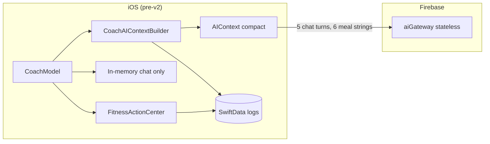
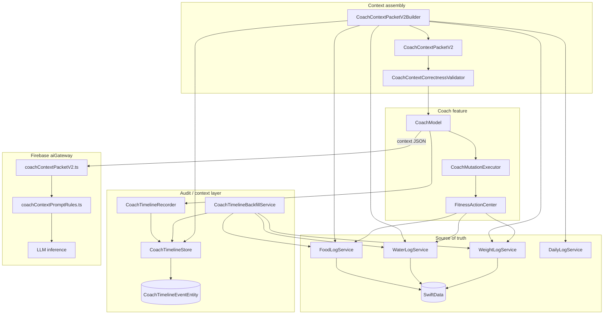
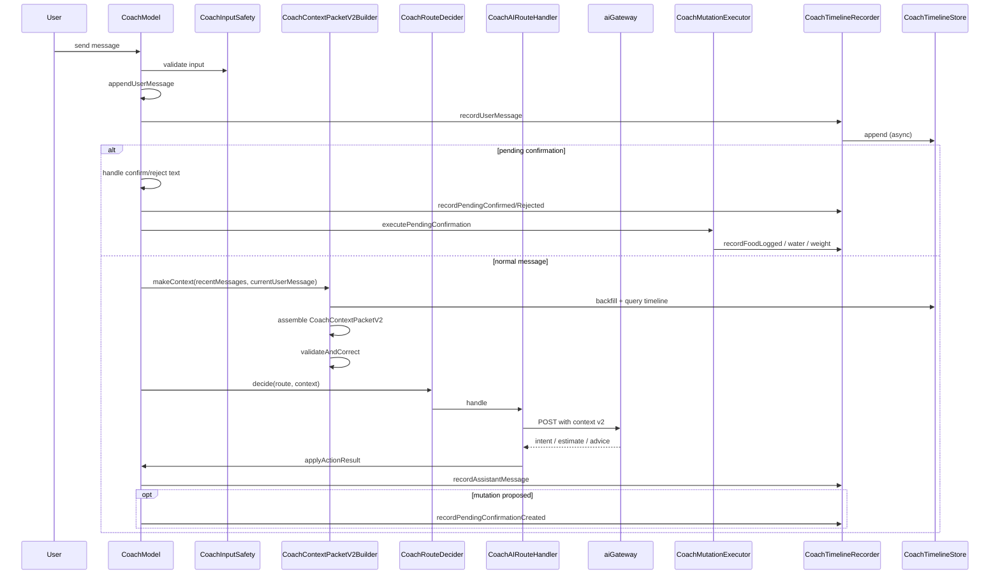
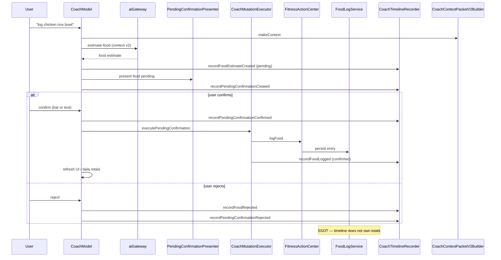
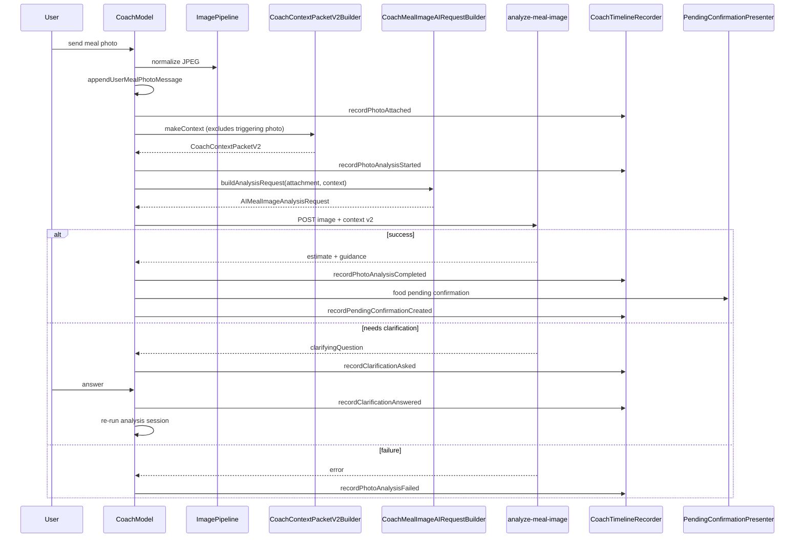
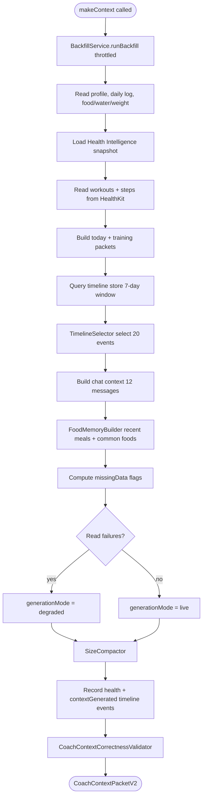
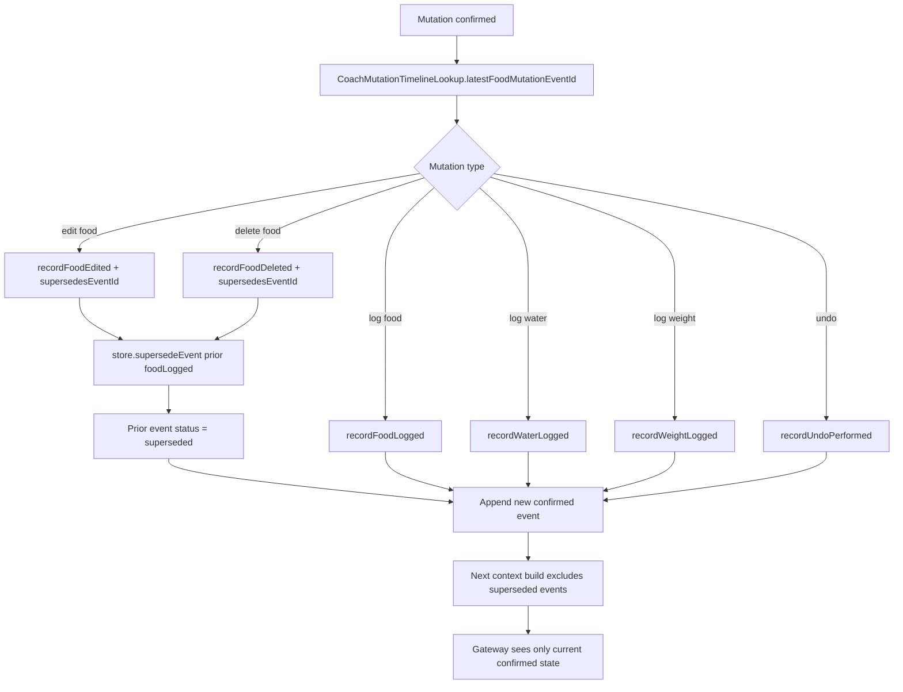

# Coach Timeline Context v2 — Implementation Documentation

**Status:** Production (2026-07-03)  
**Schema version:** `CoachContextPacketV2.meta.schemaVersion == 2`  
**Branch stack:** `cursor/coach-timeline-v2-hardening-1b75` (includes comprehensive tests + production hardening)

## Related documentation

| Document | Purpose |
|----------|---------|
| [COACH_TIMELINE_V2_ARCHITECTURE.md](./COACH_TIMELINE_V2_ARCHITECTURE.md) | Architecture overview and SSOT boundaries |
| [COACH_CONTEXT_PACKET_V2.md](./COACH_CONTEXT_PACKET_V2.md) | Field reference and size limits |
| [COACH_TIMELINE_V2_MIGRATION.md](./COACH_TIMELINE_V2_MIGRATION.md) | Rollout and migration notes |
| [COACH_TIMELINE_V2_PRE_IMPLEMENTATION_AUDIT.md](./COACH_TIMELINE_V2_PRE_IMPLEMENTATION_AUDIT.md) | Historical pre-migration audit |

---

## 1. Executive summary

Coach Timeline Context v2 replaces the legacy compact `AIContext` with a structured, auditable context pipeline for every Coach AI gateway call. The upgrade introduces:

- **`CoachTimelineStore`** — SwiftData-backed audit layer for user messages, mutations, photo analysis, Health signals, and errors
- **`CoachContextPacketV2`** — authoritative read-only transport contract (`schemaVersion: 2`) sent to Firebase `aiGateway`
- **`CoachContextPacketV2Builder`** — assembles context from SwiftData log services, timeline, Health Intelligence, and chat transcript
- **`CoachTimelineRecorder`** — best-effort, non-blocking event recording at every Coach interaction point
- **`CoachTimelineBackfillService`** — idempotent hydration of timeline from existing logs and Health reads
- **Gateway validation** — `validateCoachContextPacketV2` + `coachContextPromptRules` enforce structured-context precedence on the server

Nutrition truth remains in SwiftData log services (`FoodLogService`, `WaterLogService`, `WeightLogService`, `DailyLogService`). The timeline is an audit/context layer only. Mutations still flow:

```
CoachModel → CoachMutationExecutor → FitnessActionCenter → log services → SwiftData
```

There is no feature flag for v2. When Coach AI is enabled (`aiCommandParsingEnabled` + wired `contextPacketBuilder`), production always uses `CoachContextPacketV2`.

---

## 2. Why the upgrade was needed

The pre-v2 Coach AI path had structural gaps that caused incorrect or incomplete coaching:

| Gap | Impact |
|-----|--------|
| Compact `AIContext` was today-centric only | No multi-day meal history, no mutation audit trail |
| Chat limited to 5 turns, in-memory only | Poor reference resolution ("that lunch", "undo the chicken") |
| Photo analysis omitted structured context | `AIMealImageAnalysisRequest.userContext` was never populated |
| No distinction between pending vs confirmed food | Model could treat estimates as logged meals |
| Missing Health semantics | Zero steps conflated with permission denied |
| No outbound validation | Aggregate drift (calories vs confirmed food) could reach the gateway |
| No edit/delete audit trail | AI could not resolve `linkedEntryId` for corrections |

Timeline Context v2 addresses these without changing mutation ownership or user confirmation requirements.

---

## 3. Old architecture



**Key characteristics:**

- `CoachAIContextBuilder.makeContext()` produced `AIContext` with `todaySummary`, 5 `recentMessages`, empty `commonFoods`, optional Health Intelligence
- Photo analysis built `AIContext` internally but did **not** attach it to `AIMealImageAnalysisRequest`
- No persisted timeline; no mutation recording for AI
- Gateway accepted compact context with minimal validation

---

## 4. New architecture



**Layer responsibilities:**

| Layer | Owns | Does not own |
|-------|------|----------------|
| SwiftData log services | Food, water, weight entries; daily aggregates | Chat prose, AI estimates |
| Coach timeline store | Audit/context events | Committed nutrition totals |
| CoachContextPacketV2 | Read-only AI snapshot | Mutable app state |
| Firebase aiGateway | Stateless inference | User data persistence |

---

## 5. Timeline event schema

### Core model

`CoachTimelineEvent` (`Fitness Coach/Domain/CoachTimeline/CoachTimelineEvent.swift`) is the atomic persisted unit.

| Field | Type | Purpose |
|-------|------|---------|
| `id` | `UUID` | Stable event identifier |
| `type` | `CoachTimelineEventType` | Event kind (see below) |
| `source` | `CoachTimelineEventSource` | Broad origin channel |
| `sourceAttribution` | `CoachTimelineEventSourceAttribution` | Pipeline-specific detail |
| `confidence` | `CoachTimelineEventConfidence?` | Estimate/detection confidence |
| `status` | `CoachTimelineEventStatus` | Lifecycle state |
| `payload` | `CoachTimelineEventPayload` | Structured, persistence-safe data |
| `utcTimestamp` | `Date` | Canonical occurrence instant |
| `localTimestamp` | `String` | ISO-8601 with timezone offset |
| `timezoneIdentifier` | `String` | IANA timezone at recording |
| `localDate` | `String` | `yyyy-MM-dd` grouping key |
| `link` | `CoachTimelineEventLink` | Cross-links to chat, entries, photo sessions |
| `supersedesEventId` | `UUID?` | Prior event replaced by edit/delete |
| `recordedAt` | `Date` | Store append time |

### Event types

| Category | Types |
|----------|-------|
| Conversation | `userMessage`, `assistantMessage` |
| Food lifecycle | `foodEstimateCreated`, `foodLogged`, `foodRejected`, `foodEdited`, `foodDeleted` |
| Hydration & weight | `waterLogged`, `weightLogged` |
| Health activity | `workoutDetected`, `stepsUpdated` |
| Photo pipeline | `photoAttached`, `photoAnalysisStarted`, `photoAnalysisCompleted`, `photoAnalysisFailed` |
| Clarification | `clarificationAsked`, `clarificationAnswered` |
| Pending confirmation | `pendingConfirmationCreated`, `pendingConfirmationConfirmed`, `pendingConfirmationRejected` |
| Undo & errors | `undoPerformed`, `backendError`, `authError` |
| System | `systemRefresh`, `healthDataUnavailable`, `contextGenerated`, `unknown` |

### Status lifecycle

| Status | Counts as logged? | In AI context? |
|--------|-------------------|----------------|
| `confirmed` | Yes (if mutation type) | Yes (mutations, workouts, steps) |
| `pending` | No | Only `pendingConfirmationCreated` |
| `rejected` | No | No |
| `failed` | No | No |
| `superseded` | No (replaced) | No |

### Payload types

Discriminated union `CoachTimelineEventPayload` with kinds: `message`, `foodEstimate`, `foodLogged`, `waterLogged`, `weightLogged`, `workoutDetected`, `steps`, `photo`, `confirmation`, `error`, `healthAvailability`, `contextGeneration`, `undo`, `systemRefresh`, `empty`.

Payloads never contain image bytes, HealthKit sample objects, API tokens, or UI types.

---

## 6. SwiftData persistence

### Entity

`CoachTimelineEventEntity` (`Fitness Coach/Infrastructure/Persistence/SwiftData/Entities/CoachTimelineEventEntity.swift`):

- Indexed on `localDate`, `utcCreatedAt`, `eventTypeRaw`, `linkedEntryId`
- `@Attribute(.unique) id: UUID`
- `payloadJSON: String` — JSON envelope via `CoachTimelineEventPayloadCodec`
- `summary: String` — compact human-readable fallback
- `schemaVersion: Int` — envelope version (currently `1`)
- Optional `userId` for multi-profile support

### Store API

`SwiftDataCoachTimelineStore` implements `CoachTimelineStoring`:

| Operation | Behavior |
|-----------|----------|
| `append` / `appendMany` | Idempotent insert via repository |
| `events(forLocalDate:)` | Day query, capped at 250 events |
| `events(from:to:)` | Range query, capped at 250 events |
| `recentEvents(limit:before:)` | Recent fetch, capped at 250 events |
| `markEventStatus` | Status update (e.g. reject estimate) |
| `supersedeEvent` | Marks prior event `superseded`, appends replacement |
| `deleteEventsOlderThan` | Compaction per `CoachTimelineCompactionPolicy` |

### Mapping

- `CoachTimelineEventEntity+Mapping.swift` — entity ↔ domain
- `CoachTimelineEventPayloadCodec.swift` — payload JSON encode/decode
- `CoachTimelineEventSummaryBuilder.swift` — summary strings for lists and transport

### Corrupt row handling

Unknown `eventTypeRaw` decodes to `.unknown` with empty payload. Decode failures never crash context builds.

### Compaction

`CoachTimelineCompactionPolicy.default`:

- Retain 30 days; max 200 events/day
- Collapsible: `stepsUpdated`, `systemRefresh`, `contextGenerated`, `healthDataUnavailable`
- Confirmed mutations preserved (only superseded, never deleted)

---

## 7. Backfill strategy

`CoachTimelineBackfillService` hydrates timeline from existing persisted state.

### Trigger

Invoked at the start of `CoachContextPacketV2Builder.makeContext()` — **not** on app launch.

### Throttle

Minimum 60 seconds between runs during active context builds (`minBackfillInterval`).

### Lookback

7 calendar days including today (`previousDaysLookback = 7`).

### Sources backfilled

| Source | Event type | Notes |
|--------|------------|-------|
| `FoodLogService` | `foodLogged` | One event per entry, `linkedEntryId` set |
| `WaterLogService` | `waterLogged` | One event per entry |
| `WeightLogService` | `weightLogged` | Same-day entries |
| `HealthActivityQueryService` | `workoutDetected` | Aggregated per day |
| `HealthActivityQueryService` | `stepsUpdated` | Skipped on optional access failure |

### Deduplication

`CoachTimelineBackfillDeduplicator` compares against existing events:

- Food/water/weight: same `type`, `localDate`, `linkedEntryId`, timestamp within 60s
- Workouts/steps: one per day (type + localDate match)

### Attribution

Backfill events use `source: .system`, `sourceAttribution: .systemBackfill`, `status: .confirmed`.

### What backfill does **not** do

- Invent chat messages
- Create estimates or pending confirmations
- Write Health data when permission denied

---

## 8. CoachContextPacketV2 schema

Full field reference: [COACH_CONTEXT_PACKET_V2.md](./COACH_CONTEXT_PACKET_V2.md).

### Top-level sections

```json
{
  "meta": { "schemaVersion": 2, "localDate": "2026-07-03", "timezoneIdentifier": "America/Los_Angeles" },
  "profile": { },
  "today": { },
  "training": { },
  "healthIntelligence": { },
  "timeline": { "recentEvents": [] },
  "recentChatMessages": [],
  "currentUserMessage": "optional",
  "recentMealsStructured": [],
  "commonFoods": [],
  "missingData": { },
  "assumptions": [],
  "generationMode": "live",
  "sourceAttribution": { }
}
```

### Authoritative vs conversational

| Section | Use for facts? |
|---------|----------------|
| `today` | **Yes** — SwiftData daily log |
| `recentMealsStructured` | **Yes** — confirmed food entries |
| `timeline.recentEvents` (confirmed mutations) | **Yes** — overrides conflicting chat |
| `recentChatMessages` | **No** — continuity and tone only |
| `currentUserMessage` | Intent signal only |
| Assistant text | **Never** nutrition truth |

### Size limits

| Limit | Value |
|-------|-------|
| Encoded JSON | 24 KB |
| Timeline events (builder) | 20 |
| Timeline events (transport clamp) | 40 |
| Timeline events (gateway sanitize) | 20 |
| Chat messages | 12 |
| Recent meals | 10 |
| Common foods | 10 |
| Event summary | 180 chars |

### Generation modes

| Mode | Meaning |
|------|---------|
| `live` | Full reads succeeded |
| `degraded` | Partial read/permission failures; packet still sent with `missingData` |
| `preview` / `backfill` | Tests and tooling only |

---

## 9. Context building order

`CoachContextPacketV2Builder.makeContext()` executes in this order:

1. **Backfill** — `timelineBackfillService?.runBackfill()` (throttled)
2. **Profile** — `UserProfileReading.getCurrentProfile()`
3. **Today log** — `DailyLogService.getTodayLog()`
4. **Today's entries** — food, water, weight for current calendar day
5. **Health snapshot** — `HealthIntelligenceSnapshotServing.loadTodaySnapshot`
6. **Training load** — `TrainingLoadProviding.evaluate`
7. **Workouts** — `HealthActivityQueryService.readWorkoutsToday`
8. **Steps** — HealthKit first, Health Intelligence fallback
9. **Today packet** — targets, nutrition, hydration, weight, steps, workout calories
10. **Training context** — workouts, load, recovery, readiness
11. **Timeline load** — query store for lookback window
12. **Timeline selection** — `CoachContextPacketV2TimelineSelector` (20 events)
13. **Chat context** — last 12 messages + `currentUserMessage`
14. **Food history** — 30-day lookback for `recentMealsStructured` and `commonFoods`
15. **Missing data** — explicit gap flags
16. **Assumptions** — documented inference notes
17. **Source attribution** — generation metadata
18. **Generation mode** — `live` or `degraded` based on read failures
19. **Size compaction** — `CoachContextPacketV2SizeCompactor`
20. **Health timeline side-effects** — record workout/steps/unavailable events
21. **Context generated event** — audit metadata
22. **Validation** — `CoachContextCorrectnessValidator.validateAndCorrect`

### Timeline selection priority

`CoachContextPacketV2TimelineSelector.selectEvents()`:

1. Today's confirmed mutations (`foodLogged`, `waterLogged`, `weightLogged`)
2. Today's pending confirmation bars (`pendingConfirmationCreated`)
3. Today's photo pipeline events
4. Most recent `workoutDetected` and `stepsUpdated`
5. Cross-day events if today is sparse (< 4 events)
6. Fill to limit with remaining eligible events (chronological ascending in output)

---

## 10. Health Intelligence integration

### Data flow

```
HealthIntelligenceSnapshotServing
  → CoachHealthIntelligenceContextBuilder
  → CoachContextPacketV2.healthIntelligence

TrainingLoadProviding + HealthIntelligenceContextBuilding
  → CoachContextPacketV2.training
```

### Gating

`loadHealthIntelligence()` defaults to `HealthIntelligenceFeatureFlags.shouldCoachLoadHealthIntelligence`. When disabled or snapshot unavailable, `healthIntelligence` is omitted and `missingData` flags are set.

### Semantics

| Field | Value | Meaning |
|-------|-------|---------|
| `training.workoutsToday` | `0` | HealthKit available, confirmed no workouts today |
| `training.workoutsToday` | `nil` | Permission denied or Health unavailable |
| `missingData.stepsMissing` | `true` | No step value in packet |
| `missingData.stepsUnavailable` | `true` | HealthKit steps read failed |
| Zero steps in `today.steps` | `value: 0` | Actual zero, not missing |

### Timeline side-effects

Context builds may record `workoutDetected`, `stepsUpdated`, or `healthDataUnavailable` timeline events via `timelineRecorder` for audit continuity.

### Coach-safe strings

Health Intelligence context exposes coach-safe summaries only — no raw HRV/RHR values in the transport packet.

---

## 11. Photo analysis integration

### Before v2

`CoachMealPhotoAnalyzer` ran without structured context attached to the gateway request.

### After v2

1. `CoachModel.runImageAnalysisSession` calls `prepareAIContext(recentMessages:)` **before** the triggering photo message
2. `CoachMealImageAIRequestBuilder.buildAnalysisRequest(attachment:context:message:)` embeds full `CoachContextPacketV2`
3. Gateway `analyze-meal-image` receives `context` with today targets, recent meals, timeline photo events
4. Timeline records: `photoAttached` → `photoAnalysisStarted` → `photoAnalysisCompleted` | `photoAnalysisFailed`
5. Clarification loop records `clarificationAsked` / `clarificationAnswered`
6. Success creates pending food confirmation; `foodLogged` recorded only after user confirms

### Photo payload privacy

`PhotoPayload` stores metadata only: `sessionId`, `mimeType`, `compressedByteSize`, dimensions, `attachmentSource`, retry flags. No JPEG bytes in timeline or context.

### Prompt rules

`analyzeMealImagePromptRules()` instructs the model to use `context.today` and `recentMealsStructured` for personalization, never infer hidden foods from context, and always set `needsUserReview: true`.

---

## 12. Backend schema changes

### New modules

| File | Role |
|------|------|
| `functions/src/coachContextPacketV2.ts` | Validation, sanitization, prompt parsing |
| `functions/src/coachContextPromptRules.ts` | Shared authoritative-context prompt rules |

### Validation

`validateCoachContextPacketV2(context)`:

- Rejects missing/empty context
- Requires `meta.schemaVersion === 2` (HTTP 400 otherwise)
- Validates nested object shapes and string length bounds
- No stack traces returned to client

### Sanitization

`parseCoachContextForPrompt(context)`:

- Strips unknown top-level keys
- Filters timeline events by status and type (mirrors iOS `isContextEligible`)
- Clamps arrays and string fields per `COACH_CONTEXT_LIMITS`
- Compacts timeline event payloads to key-value strings

### Excluded timeline events (gateway)

**Statuses:** `rejected`, `failed`, `superseded`  
**Types:** `unknown`, `foodEstimateCreated`, `foodRejected`, `pendingConfirmationRejected`, `backendError`, `authError`  
**Pending:** only `pendingConfirmationCreated` allowed

### Endpoint changes

All Coach AI endpoints in `functions/src/index.ts` now require v2 context:

- `classify-coach-intent`
- `estimate-food`
- `analyze-meal-image`
- `meal-advice`
- `nutrition-estimate`
- `nutrition-comparison`
- `daily-review`

`mealImageAnalysis.ts` accepts `context` on analysis requests.

### Breaking change

Legacy `AIContext` / `legacyCompact` adapters removed. Clients sending `schemaVersion != 2` receive HTTP 400.

---

## 13. Prompt changes

Prompt rules live in `coachContextPromptRules.ts` and are injected per endpoint.

### Core rules (`coachContextV2Rules`)

1. Structured context is authoritative over chat text
2. Confirmed timeline events override conflicting chat
3. Pending/rejected/failed/superseded events are not logged facts
4. Never infer food/water/weight logged without confirmation
5. State missing data honestly — do not invent values
6. Use `meta.localDate` and `timezoneIdentifier` for "today"
7. Chat is continuity only; facts come from timeline and `today`

### Endpoint-specific rules

| Function | Focus |
|----------|-------|
| `classifyCoachIntentPromptRules` | Intent from current text; timeline for reference resolution |
| `estimateFoodPromptRules` | Re-estimate independently; use timeline for "same as usual" |
| `mealAdvicePromptRules` | Today aggregates + training/recovery for advice |
| `analyzeMealImagePromptRules` | Personalize from context; never infer off-image foods |
| `editDeletePromptRules` | Resolve targets from `linkedEntryId` on confirmed events |
| `dailyReviewPromptRules` | Deterministic totals primary; timeline enriches wording |
| `coachContextHealthRules` | Health Intelligence before asking about workouts |

---

## 14. Mutation recording

### Recording points

| Action | Recorder method | Caller |
|--------|-----------------|--------|
| User message | `recordUserMessage` | `CoachModel` (deduped by message ID) |
| Assistant message | `recordAssistantMessage` | `CoachModel` (deduped by message ID) |
| Food estimate | `recordFoodEstimateCreated` | Route handler / classifier |
| Food confirmed | `recordFoodLogged` | `CoachMutationExecutor` |
| Food rejected | `recordFoodRejected` | `CoachModel` on pending reject |
| Water logged | `recordWaterLogged` | `CoachMutationExecutor` |
| Weight logged | `recordWeightLogged` | `CoachMutationExecutor` |
| Pending bar shown | `recordPendingConfirmationCreated` | `CoachModel` (deduped by confirmation key) |
| Pending confirmed/rejected | `recordPendingConfirmationConfirmed/Rejected` | `CoachModel` |
| Undo | `recordUndoPerformed` | `CoachMutationExecutor` |
| Backend/auth error | `recordBackendError` / `recordAuthError` | `CoachModel` |
| Photo pipeline | `recordPhoto*` | `CoachModel` |
| Context build | `recordContextGenerated` | `CoachContextPacketV2Builder` |

### Non-blocking guarantee

`CoachTimelineRecorder` dispatches store writes in `Task { @MainActor }`. Failures are logged via `Logger` and `FormaPipelineTracer` (DEBUG) but never block chat, logging, or AI responses.

### Dedupe keys (`CoachModel`)

- User/assistant messages: `Set<UUID>` per message ID
- Pending confirmations: kind-specific keys; water/weight include session-scoped `pendingConfirmationTimelineKey` UUID to prevent duplicate bars within a session

---

## 15. Correction/edit/delete behavior

### Flow

1. AI proposes edit/delete with `linkedEntryId` from confirmed timeline event
2. `CoachPendingConfirmationPresenter` shows confirmation bar
3. On confirm, `CoachMutationExecutor` executes via `FitnessActionCenter`
4. `CoachMutationTimelineLookup.latestFoodMutationEventId` finds prior `foodLogged` event
5. `recordFoodEdited` or `recordFoodDeleted` called with `supersedesEventId`
6. `CoachTimelineRecorder` calls `store.supersedeEvent(id:by:)` — prior event marked `superseded`
7. New `foodEdited` / `foodDeleted` event appended with `status: .confirmed`

### Context impact

- Superseded `foodLogged` events excluded from AI context
- Replacement edit/delete events included if eligible
- `recentMealsStructured` reflects current SwiftData entries (authoritative)

### Gateway rules

`editDeletePromptRules()` requires confirmed `linkedEntryId`; ignores pending/rejected/superseded targets; asks for clarification when ambiguous.

---

## 16. Missing data handling

`CoachMissingDataContext` flags are set explicitly in the builder — never left ambiguous.

| Flag | When set |
|------|----------|
| `stepsMissing` | No step value in packet |
| `stepsUnavailable` | HealthKit steps read failed |
| `workoutPermissionDeniedOrUnavailable` | Cannot confirm workouts |
| `workoutsUnavailable` | Workout query failed |
| `healthKitDenied` | User denied Health access |
| `healthKitUnavailable` | HealthKit not available |
| `sleepMissing` / `hrvMissing` | HI signals absent |
| `sleepUnavailable` / `hrvUnavailable` | HI read failures |
| `weightMissing` | No weight entry today |
| `noRecentMeals` | No structured meals in lookback |
| `noTimelineHistory` | No eligible timeline events |

### Degraded mode

When SwiftData reads fail or Health is denied, `generationMode` becomes `degraded`. Coach remains usable for local commands (water, weight, status). The packet is still sent with populated `missingData`.

### Validator

`CoachContextCorrectnessValidator` rule `missingDataPopulated` ensures flags align with actual packet contents.

---

## 17. Source attribution

### Event-level

Every `CoachTimelineEvent` carries:

- `source` — `coachUI`, `localPipeline`, `aiBackend`, `healthSync`, `system`
- `sourceAttribution` — `localParser`, `classifier`, `estimateFood`, `mealImage`, `userConfirmation`, `healthKit`, `healthIntelligence`, `systemBackfill`, etc.

`CoachModelTimelineSupport.timelineAttribution(for:)` maps `CoachRouteDecision.chosenHandler` to attribution.

### Packet-level

`CoachContextSourceAttribution` on the outbound packet:

```swift
CoachContextSourceAttribution(
    generationMode: effectiveMode,
    timelineEventCount: timelineContextEvents.count,
    recentMealCount: recentMeals.count,
    commonFoodCount: commonFoods.count,
    healthIntelligenceIncluded: healthIntelligence != nil,
    sources: ["dailyLog", "foodLog", "coachTimeline", "healthKit", ...]
)
```

### Sourced metrics

`CoachContextSourcedInt` wraps steps and workout calories with `source`, `asOf`, and `confidence` fields.

---

## 18. Privacy and redaction

| Rule | Implementation |
|------|----------------|
| No raw images in timeline | `PhotoPayload` metadata only |
| No secrets in logs | `coachContextLogFields` / `redactedDebugDescription` |
| Gateway strips unknown keys | `parseCoachContextForPrompt` |
| Chat previews bounded | 180-char previews in timeline; 12 messages in context |
| Release logging | Validator reports rule names only, not meal names or health values |
| Transcript images | JPEG in memory / SwiftData transcript store; not in AI context JSON |

Use `CoachContextPacketV2.redactedDebugDescription()` for DEBUG tracing — never log full packet in production.

---

## 19. Testing coverage

### Firebase (`functions/`)

```bash
cd functions && npm run build && npm test
```

| Suite | Coverage |
|-------|----------|
| `coachContextPacketV2.test.ts` | Validation, sanitization, timeline filtering, size clamps |
| `coachContextPromptRules.test.ts` | Prompt rule string presence |
| `aiGateway.contract.test.ts` | v2 context required on endpoints |
| `mealImageAnalysis.test.ts` | Context field on image analysis |
| `gatewayGuardrails.test.ts` | Error handling |

**Result:** 85/85 tests passing (as of hardening PR).

### iOS (`Fitness CoachTests/`)

| Suite | Coverage |
|-------|----------|
| `CoachTimelineDomainTests` | Event types, payloads, timestamps |
| `CoachTimelinePersistenceTests` | Entity mapping, codec round-trip |
| `CoachTimelineStoreTests` | Query, supersede, compaction |
| `CoachTimelineRecorderTests` | All record methods, supersede wiring |
| `CoachTimelineBackfillServiceTests` | Deduplication, lookback, throttle |
| `CoachContextPacketV2Tests` | Transport types, redaction, limits |
| `CoachContextPacketV2BuilderTests` | Full assembly, HI, timeline selection |
| `CoachContextCorrectnessValidatorTests` | All validation rules |
| `CoachModelTimelineRecordingTests` | CoachModel → recorder wiring |
| `CoachMutationExecutorTimelineTests` | Mutation → timeline with supersede |
| `CoachMealPhotoContextV2Tests` | Photo analysis embeds v2 context |
| `CoachTimelineContextV2ComprehensiveTests` | End-to-end scenarios |
| `CoachTimelineRegressionTests` | Legacy behavior preservation |
| `CoachTimelineHardeningTests` | Eligibility, degraded mode, query caps |

Run on macOS:

```bash
xcodebuild test -scheme "Fitness Coach" -testPlan Fast-Core \
  -destination 'platform=iOS Simulator,name=iPhone 16'
```

**Note:** iOS tests were not executed in the Linux cloud agent environment.

---

## 20. Known limitations

| Limitation | Detail |
|------------|--------|
| Timeline not SSOT | Log services remain authoritative; timeline can lag or miss events on store failure |
| Backfill throttle | 60s minimum between backfills may delay hydration on rapid context builds |
| Query cap | 250 events per store query may truncate very active days before selection |
| Chat transcript images | Large JPEG blobs in SwiftData transcript; not sent to gateway but affect local storage |
| Workout mutation unavailable | Coach cannot log workouts via mutation; read-only from HealthKit |
| Weight undo unavailable | Explicit user messaging; no timeline undo event |
| `commonFoods` heuristic | 30-day frequency analysis; not personalized ML |
| Cross-timezone edge cases | `localDate` uses device timezone at event time; travel may split days |
| No AB gate | v2 is always on when Coach AI enabled — no rollback flag |
| iOS CI gap | `xcodebuild test` not run in cloud agent; macOS verification required |

---

## 21. Future improvements

| Area | Opportunity |
|------|-------------|
| Timeline compaction scheduling | Background compaction on app background, not only on-demand |
| Cross-launch chat context | Extend transcript retention policy for multi-session reference |
| Timeline search API | Query by `linkedEntryId` or `sessionId` without full day scan |
| Server-side context diff | Log `contextSchemaVersion` + event counts for drift monitoring |
| Workout logging | If product adds Coach workout mutations, extend timeline types |
| Incremental backfill | Track last backfill cursor per source instead of 7-day scan |
| Gateway context caching | Stateless today; could hash context for prompt token optimization |
| Feature flag (emergency) | Kill switch for timeline in context without removing log SSOT |

---

## Diagram A — Text message flow



---

## Diagram B — Food logging flow



---

## Diagram C — Photo analysis flow



---

## Diagram D — Context generation flow



---

## Diagram E — Mutation-to-timeline flow



---

## Files changed

**132 files** changed vs `main` (~18,800 insertions, ~880 deletions).

### iOS — Domain

| Path | Role |
|------|------|
| `Fitness Coach/Domain/CoachTimeline/*` | Event model, types, payloads, policies |
| `Fitness Coach/Domain/Coach/CoachChatTranscriptRetentionPolicy.swift` | Transcript retention |

### iOS — Application services

| Path | Role |
|------|------|
| `CoachTimelineStore.swift` | Store API + query caps |
| `CoachTimelineBackfillService.swift` | Log/Health hydration |
| `SwiftDataCoachChatTranscriptStore.swift` | Chat persistence |
| `AIService.swift` | v2 context on all AI calls |

### iOS — State builders

| Path | Role |
|------|------|
| `CoachContextPacketV2Builder.swift` | Context assembly |
| `CoachContextCorrectnessValidator.swift` | Outbound validation |
| `CoachContextFoodMemoryBuilder.swift` | Recent meals + common foods |
| `CoachDailyStatusBuilder.swift` | Status copy from v2 context |
| `CoachAIResponseContextAdapter.swift` | Response → UI context |

### iOS — Use cases

| Path | Role |
|------|------|
| `CoachTimelineRecorder.swift` | Event recording + supersede |
| `CoachMutationExecutor.swift` | Mutation → timeline wiring |
| `CoachMutationTimelineContext.swift` | Entry ID lookup |
| `CoachMealImageAIRequestBuilder.swift` | Photo request + v2 context |
| `CoachMealPhotoAnalyzer.swift` | Analysis orchestration |
| `CoachAIRouteHandler.swift` | Route handling with v2 |

### iOS — Infrastructure

| Path | Role |
|------|------|
| `CoachContextPacketV2.swift` | Transport contract |
| `AIContracts.swift` | Request types updated |
| `FormaAIBackendClient.swift` | Context serialization |
| `CoachTimelineEventEntity.swift` | SwiftData entity |
| `CoachChatTranscriptMessageEntity.swift` | Chat entity |
| Mapping + codec files | Entity ↔ domain |
| `FormaModelContainer.swift` / `FormaModelMigration.swift` | Schema registration |

### iOS — Features

| Path | Role |
|------|------|
| `CoachModel.swift` | Timeline recording integration |
| `CoachModelTimelineSupport.swift` | Payload mapping |
| `CoachTodayContextCard.swift` | Accuracy cues |
| `AppContainer.swift` | DI wiring |

### Firebase

| Path | Role |
|------|------|
| `functions/src/coachContextPacketV2.ts` | Validation + sanitization |
| `functions/src/coachContextPromptRules.ts` | Prompt rules |
| `functions/src/index.ts` | Endpoint context requirements |
| `functions/src/mealImageAnalysis.ts` | Image analysis context |
| `functions/src/gatewayGuardrails.ts` | Error handling |

### Documentation

| Path | Role |
|------|------|
| `Docs/Coach/COACH_TIMELINE_V2_ARCHITECTURE.md` | Architecture |
| `Docs/Coach/COACH_CONTEXT_PACKET_V2.md` | Field reference |
| `Docs/Coach/COACH_TIMELINE_V2_MIGRATION.md` | Migration |
| `Docs/Coach/COACH_TIMELINE_V2_PRE_IMPLEMENTATION_AUDIT.md` | Historical audit |

---

## Tests added

### New iOS test files

| File |
|------|
| `CoachTimelineDomainTests.swift` |
| `CoachTimelinePersistenceTests.swift` |
| `CoachTimelineStoreTests.swift` |
| `CoachTimelineRecorderTests.swift` |
| `CoachTimelineBackfillServiceTests.swift` |
| `CoachContextPacketV2Tests.swift` |
| `CoachContextPacketV2BuilderTests.swift` |
| `CoachContextCorrectnessValidatorTests.swift` |
| `CoachContextFoodMemoryBuilderTests.swift` |
| `CoachModelTimelineRecordingTests.swift` |
| `CoachMutationExecutorTimelineTests.swift` |
| `CoachMealPhotoContextV2Tests.swift` |
| `CoachTimelineContextV2ComprehensiveTests.swift` |
| `CoachTimelineRegressionTests.swift` |
| `CoachTimelineHardeningTests.swift` |
| `CoachChatTranscriptPersistenceTests.swift` |
| `CoachV2ResponseHandlingTests.swift` |
| `TestingSupport/CoachContextPacketV2TestFixtures.swift` |

### New Firebase test files

| File |
|------|
| `functions/test/coachContextPacketV2.test.ts` |
| `functions/test/coachContextPromptRules.test.ts` |
| `functions/test/fixtures/coachContextPacketV2.ts` |

### Extended test files

`CoachMealPhotoAnalysisTests`, `CoachRoutingTests`, `CoachFoodLoggingRegressionTests`, `aiGateway.contract.test.ts`, `mealImageAnalysis.test.ts`, `Fast-Core.xctestplan`, and others updated for v2 assertions.

---

## Remaining risks

| Risk | Mitigation | Residual |
|------|------------|----------|
| Timeline write failure | Non-blocking recorder; SSOT unaffected | AI context may lack recent audit events |
| iOS tests not run in cloud CI | macOS `xcodebuild test` before merge | Regressions possible on device-only paths |
| 24 KB context ceiling | SizeCompactor + validator | Very chatty days may lose older timeline events |
| Backfill vs live recording race | Deduplicator 60s tolerance | Rare duplicate events possible |
| Gateway prompt adherence | Structured rules in prompt | Model may still occasionally hallucinate |
| Branch not merged to `main` | PR #82 + #83 review | Production deploy blocked until merge |
| Transcript JPEG storage growth | Retention policy exists | Long-term storage budget unverified at scale |
| Timezone travel | `localDate` at event time | Cross-day grouping may confuse "today" briefly |

---

## Manual QA checklist

### Context and accuracy

- [ ] Send "what did I eat today?" after logging food — response matches Today tab totals
- [ ] Log food via Coach, confirm — `today` calories in gateway logs match app
- [ ] Reject food estimate — Coach does not claim food was logged
- [ ] Pending confirmation bar visible — AI context includes `pendingConfirmationCreated`
- [ ] Deny HealthKit — Coach says data unavailable; does not claim zero steps/workouts
- [ ] Grant HealthKit with zero steps — Coach reports zero, not "unavailable"

### Timeline and mutations

- [ ] Log water via Coach — water appears in Today; timeline records `waterLogged`
- [ ] Log weight via Coach — same-day upsert reflected in context
- [ ] Edit last food entry — prior `foodLogged` superseded; totals correct
- [ ] Delete food entry via Coach — entry removed; superseded in timeline
- [ ] Undo last food — entry removed; `undoPerformed` recorded

### Photo analysis

- [ ] Send meal photo — analysis uses today targets in response
- [ ] Ambiguous photo — clarifying question shown; clarification timeline events recorded
- [ ] Retry failed analysis — `photoAnalysisFailed` then success on retry
- [ ] Confirm photo estimate — food logged only after user confirms

### Chat and reference resolution

- [ ] "Same as breakfast" — resolves from confirmed `foodLogged` or `recentMealsStructured`
- [ ] "Delete the chicken rice" — targets correct `linkedEntryId`
- [ ] Cross-turn reference ("that meal") — uses timeline ordering

### Persistence and migration

- [ ] Existing user with food history — backfill populates timeline on first Coach open
- [ ] Fresh install — empty timeline sets `noTimelineHistory`; Coach still functional
- [ ] Kill app mid-chat — transcript persists (SwiftData); context rebuilds on return

### Backend

- [ ] Malformed context (wrong schema version) — HTTP 400 with safe error
- [ ] Oversized context — client compacts before send; no gateway crash
- [ ] `npm test` in `functions/` — all tests pass

### Regression

- [ ] Local water/weight commands work with AI disabled (`aiCommandParsingEnabled = false` path if testable)
- [ ] Daily review — numeric totals match deterministic input
- [ ] Status command — reflects current day without stale chat claims

---

*Document generated for the completed Coach Timeline Context v2 upgrade. Last updated: 2026-07-03.*
