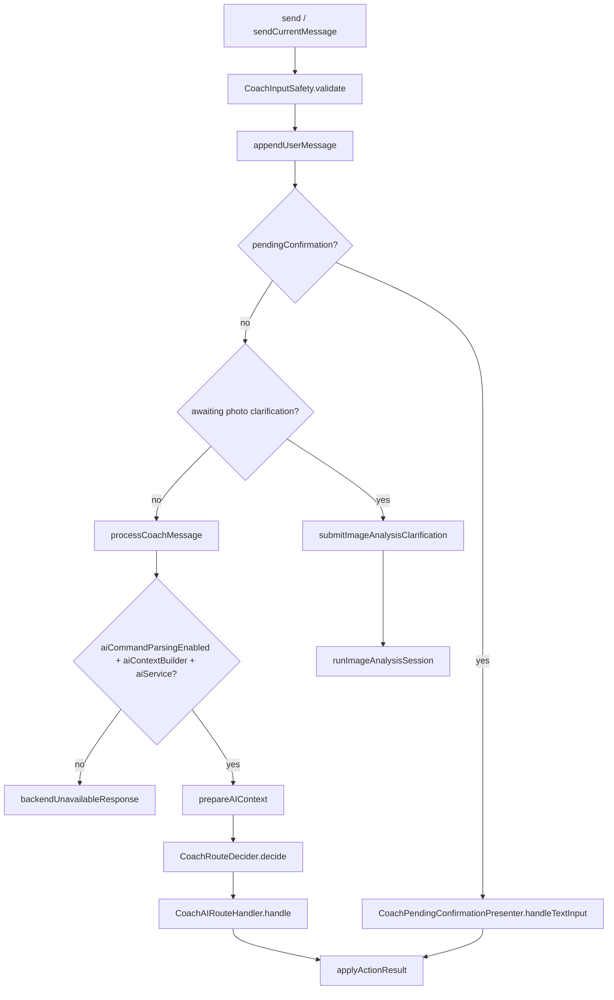
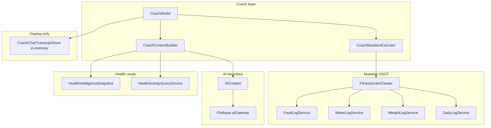

# Coach Timeline Context v2 — Pre-Implementation Audit

**Date:** 2026-07-03  
**Scope:** Audit-only. No production code changes in this document.  
**Branch baseline:** `main` @ detached HEAD `5a1c48da`

## Reference document status

`Docs/Coach/COACH_FULL_CONTEXT_PACKET.md` was **not found** in the repository at audit time. This audit is derived from live source inspection across Coach, AI infrastructure, persistence, Health Intelligence, and Firebase gateway code. If the context packet exists elsewhere, reconcile naming and field definitions before implementation.

---

## Executive summary

Coach today sends a **compact, today-centric** `AIContext` on every text-based AI call. Historical logging data is **not** included beyond six same-day meal name strings and five recent chat turns. Meal-photo analysis uses a **separate** `AIMealImageAnalysisRequest` that does **not** embed `AIContext` (the `userContext` field exists but is never populated). Mutations always flow through `FitnessActionCenter` → log services → SwiftData. Chat transcript persistence is **in-memory only** for the active session.

Timeline Context v2 will require extending the context contract, builders, gateway prompt rules, and tests — without changing mutation ownership boundaries.

---

## 1. CoachModel send flow

**Primary file:** `Fitness Coach/Features/Coach/Model/CoachModel.swift`

### Entry points

| Method | Trigger | Processing lock |
|--------|---------|-----------------|
| `sendCurrentMessage()` | Composer send | Yes (`beginProcessing` / `endProcessing`) |
| `send(_:managesProcessingLock:)` | Starter chips, example commands, clarification follow-ups | Optional |
| `sendMealPhoto` (private) | Image-only or text+image send | Yes |
| `retryMealPhotoAnalysis` | User retries failed photo analysis | Yes |
| `submitImageAnalysisClarification` | User answers clarifying question | Yes |

### Text send pipeline



### Photo send pipeline

1. `sendCurrentMessage` snapshots composer state (`CoachInputSendSnapshot`).
2. `sendMealPhoto` normalizes JPEG (pipeline-processed or legacy `prepareJPEG`).
3. `appendUserMealPhotoMessage` persists to in-memory transcript.
4. `ImageAnalysisSessionStore` creates session.
5. `runImageAnalysisSession` builds `AIContext` from **prior** messages (excludes triggering photo message), calls `CoachMealPhotoAnalyzer.analyze`.
6. Success → `applyPhotoAnalysisSuccess` (pending food confirmation + assistant analysis message).
7. Failure → session failed state + retryable failure message.

### Gating flags

- `aiCommandParsingEnabled` — `true` in `AppContainer` (`AppContainer.swift:282`).
- `aiContextBuilder` — `nil` when `userProfileReader` is absent (production `makeCoachModel()` always provides profile reader).
- `healthIntelligenceLoadEnabled` — defaults to `HealthIntelligenceFeatureFlags.shouldCoachLoadHealthIntelligence` (engines on → Coach loads HI snapshots).

### Observability

- `FormaPipelineTracer` trace per text send and photo analysis.
- `CoachRouteDebugLogger`, `CoachImageAnalysisDebugLogger`, `CoachFoodEstimateDebugLogger` (DEBUG).
- Auth failures surface `presentCoachSessionFailure()` with retry affordance.

---

## 2. CoachContextBuilder / AIContext construction

**Files:**

| File | Role |
|------|------|
| `Fitness Coach/Application/StateBuilders/Coach/CoachAIContextBuilder.swift` | `CoachContextBuilder` — assembles `AIContext` |
| `Fitness Coach/Infrastructure/AI/AIContext.swift` | Transport-shaped context contract |
| `Fitness Coach/Application/StateBuilders/Coach/CoachAIActivityContextResolver.swift` | Workouts/steps/HI from snapshot or HealthKit fallback |
| `Fitness Coach/Application/StateBuilders/Nutrition/TodayAISummaryMapper.swift` | `DailyLog` → `TodayAISummary` |
| `Fitness Coach/Application/StateBuilders/Coach/CoachHealthIntelligenceContextBuilder.swift` | `HealthIntelligenceSnapshot` → `CoachHealthIntelligenceContext` |

### Construction call chain

```
CoachModel.prepareAIContext(recentMessages:)
  → CoachAIActivityContextResolver.resolve(...)
  → CoachContextBuilder.makeContext(recentMessages:, activity:)
```

### Current `AIContext` fields

| Field | Source | Notes |
|-------|--------|-------|
| `date` | `Date()` at build time | Not calendar start-of-day |
| `timezoneIdentifier` | `TimeZone.current.identifier` | |
| `userProfileSummary` | `UserProfileReading.getCurrentProfile()` | Age, sex, height, weights, activity, training frequency |
| `todaySummary` | `TodayAISummaryMapper.from(dailyLog:, workoutsToday:, recentMeals:)` | Full macro/water/weight/steps/workout rollup for **today** |
| `commonFoods` | Hard-coded `[]` | Unused placeholder |
| `recentMessages` | Last **5** `ChatMessage` → `AIMessageContext` | Role + text only; no structured cards |
| `healthIntelligence` | `CoachHealthIntelligenceContextBuilder` when awareness gate passes | Coach-safe strings; no raw HRV/RHR |
| `healthIntelligenceAwarenessAvailable` | Gating from snapshot quality | Prevents false Health claims |

### Recent meals sub-context

`CoachContextBuilder.makeRecentMeals()` reads today's food entries via `FitnessActionCenter.getFoodEntries(for: Date())`, takes suffix(6), formats as `"<qty> <unit> <name>"` strings into `todaySummary.recentMeals`.

### Important gaps for Timeline v2

- **No multi-day history** in `AIContext`.
- `healthActivityQuery` is accepted in `CoachContextBuilder` init but **ignored** (`_ = healthActivityQuery`).
- `commonFoods` is dead weight in the contract.
- Photo analysis prepares `AIContext` in `CoachModel` but **does not attach it** to the gateway request (see §7).

---

## 3. ChatMessage model and transcript storage

**Files:**

| File | Role |
|------|------|
| `Fitness Coach/Domain/Models/ChatMessage.swift` | App-facing message model |
| `Fitness Coach/Domain/Models/ChatMessageImageAttachment.swift` | JPEG + thumbnail + source |
| `Fitness Coach/Domain/Models/Enums/ChatMessageRole.swift` | user / assistant |
| `Fitness Coach/Features/Coach/Model/CoachChatTranscriptStore.swift` | Persistence protocol + in-memory impl |
| `Fitness Coach/Infrastructure/Persistence/SwiftData/Entities/ChatMessageEntity.swift` | **Legacy v1 migration only** — no images |

### ChatMessage shape

- Core: `id`, `role`, `text`, `createdAt`, optional `relatedDailyLogId` / `relatedEntryId`.
- `imageAttachment` — meal-photo user messages (full JPEG in memory).
- `photoAnalysisLink` — assistant messages tied to photo sessions (result / failure / clarification).
- `structuredContent` — nutrition estimate / comparison cards.

**Explicit design note in source:** ChatMessage is display/history only — **not** SSOT for food/water/weight/workout logs.

### Transcript persistence

- Default: `CoachInMemoryChatTranscriptStore` (session-only).
- `CoachModel.persistTranscript()` called on every append/remove.
- TODO in `CoachChatTranscriptStore.swift` for `CoachSwiftDataChatTranscriptStore` with image blob/file storage.
- `ChatMessageEntity` removed from active schema in v2 migration (`Docs/PersistenceCleanupNotes.md`).

### Timeline v2 implications

- Recent chat context is capped at 5 turns in `AIContext`; full transcript may be longer in UI.
- Cross-launch persistence is unimplemented — timeline context cannot rely on transcript durability.
- Photo JPEG bytes live in memory; any future transcript persistence affects storage budget.

---

## 4. CoachMutationExecutor

**File:** `Fitness Coach/Application/UseCases/Coach/CoachMutationExecutor.swift`

### Responsibilities

- Execute `ParsedCommand` intents (water, weight, food, undo, status, daily review).
- Execute `CoachPendingConfirmation` from confirmation bar or text confirm words.
- Record session undo history via `CoachMutationHistory` (limit 25, in-memory).

### Mutation paths

| Intent / confirmation | Executor method | Action center call |
|----------------------|-------------------|-------------------|
| logWater | `executeLogWater` | `actionCenter.logWater` |
| logWeight | `executeLogWeight` | `actionCenter.logDailyWeight` |
| logFood | `executeLogFood` | `actionCenter.logFood` |
| undo | `executeUndo` / `executeUndoLastMutation` | `undoLastFoodEntry`, `undoLastWaterEntry`, `deleteFoodEntry` |
| edit | `executeEditAction` | `editFoodEntry` (last entry heuristic) |
| delete | `executeDeleteAction` | `deleteFoodEntry` |
| status | `executeStatus` | reads `dailyLogReader.getTodayLog()` + optional HI context |
| dailyReview | `executeDailyReview` | `actionCenter.generateDailyReview` |

### Non-mutation behaviors

- `logSteps` → placeholder copy.
- `logWorkout` / workout undo → `TrainingIntegrationCopy.coachWorkoutMutationUnavailable`.
- Weight undo → explicit "not available" message.

### Confirmation flow

```
CoachAIRouteHandler → CoachPendingConfirmationPresenter.present*Pending
  → CoachModel.setPendingConfirmation
  → User confirms (bar or text) → mutationExecutor.executePendingConfirmation
  → FitnessActionCenter → log services → AppRefreshCenter.notifyDataChanged
```

---

## 5. FitnessActionCenter

**File:** `Fitness Coach/Application/UseCases/FitnessActionCenter.swift`

Canonical mutation layer for Coach, Today quick capture, and (indirectly) Plan profile edits.

| Domain | Methods used by Coach |
|--------|----------------------|
| Food | `logFood`, `editFoodEntry`, `deleteFoodEntry`, `getFoodEntries`, `undoLastFoodEntry` |
| Water | `logWater`, `undoLastWaterEntry`, `deleteWaterEntry` |
| Weight | `logDailyWeight` |
| Reviews | `generateDailyReview` |
| Refresh | `notifyDataChanged()` after every mutation |

Coach **never** calls `FoodLogService` / `WaterLogService` / `WeightLogService` directly.

---

## 6. FoodLogService, WaterLogService, WeightLogService

**Files:**

- `Fitness Coach/Data/Repositories/FoodLogService.swift`
- `Fitness Coach/Data/Repositories/WaterLogService.swift`
- `Fitness Coach/Data/Repositories/WeightLogService.swift`

### Shared patterns

- SwiftData entities attached to `DailyLogEntity` for day-scoped entries.
- `DailyLogService.recalculateDailyTotals` after mutations.
- Validation via `ServiceError.invalidInput` surfaced to Coach copy.

### Service-specific behavior

| Service | Create policy | Undo |
|---------|---------------|------|
| FoodLogService | `FoodLogDraft` validation; components JSON for multi-item meals | Delete most recent entry for day |
| WaterLogService | Max 5000 ml per entry sanity ceiling | Delete most recent entry for day |
| WeightLogService | Same-day upsert (update existing day entry) | Not exposed to Coach undo |

### Reads relevant to Timeline v2

- `FoodLogService.getFoodEntries(for:)` — per-day.
- `WeightLogService.getWeightEntries(from:to:)`, `getLatestWeight()`.
- `DailyLogService.getLogs(from:to:)` — **primary multi-day read** (used by Journey, Today lookback, Plan).

---

## 7. Image / photo analysis pipeline

### Client pipeline (high level)


### Key files

| Layer | Files |
|-------|-------|
| UI / composer | `CoachComposer`, `CoachImagePickFlowController`, `CoachPhotoCapture` |
| Pipeline | `CoachImagePipeline+Camera.swift`, `CoachMealPhotoPipeline.swift`, `CoachImageUploadConfig` |
| Session FSM | `ImageAnalysisSession.swift`, `ImageAnalysisSessionStore` |
| AI request | `CoachMealImageAIRequestBuilder.swift`, `CoachMealImageUploadAttachment.swift` |
| Routing | `CoachMealPhotoAnalyzer.swift`, `CoachAIRouteHandler.analyzeMealPhoto` |

### Gateway request shape (`AIMealImageAnalysisRequest`)

```swift
message: String?
image: AIMealImagePayload  // mimeType, base64, filename, width, height
locale: String?            // unused in builder today
userContext: [String: String]?  // defined but NEVER populated
clarification: String?
previousAnalysis: AIMealImageAnalysisPreviousAnalysis?
```

**Critical:** Full `AIContext` is **not** sent on meal-image analysis. `CoachModel` builds context for tracing/consistency but `CoachMealImageAIRequestBuilder` does not accept or encode it. Timeline v2 must decide whether to extend `AIMealImageAnalysisRequest` or map a subset into `userContext`.

### Post-response validation

1. `MealImageAnalysisResponseValidator` (client).
2. `NutritionSanityValidator` + `ConfirmationPolicy`.
3. Always requires pending confirmation before log (`presentAIFoodEstimate` with `fromPhotoAnalysis: true`).

### Clarification / recommission loop

- Gateway may return `clarifyingQuestion`.
- Session → `.needsClarification`; user reply triggers recommission with `previousAnalysis` + `clarification`.
- Linked pending confirmation cleared on failure/retry.

---

## 8. HealthActivityQueryService

**File:** `Fitness Coach/Application/Queries/HealthActivityQueryService.swift`

| Query | Source when `repositoryReadRoutingEnabled` | Fallback |
|-------|---------------------------------------------|----------|
| `workouts(from:to:)` | `HealthDataRepository.getWorkouts` | `HealthKitWorkoutReading.fetchWorkouts` |
| `stepsToday` | `HealthDataRepository.getDailyMetrics` | `HealthKitStepReading.fetchStepCount` |
| `dailyTrainingActivity` | Derived workout list for calendar day | |

Used by:

- `CoachAIActivityContextResolver` (when HI snapshot unavailable).
- `CoachMutationExecutor.hasWorkoutToday()`.
- `ReviewService`, `TodayModel`, Journey builders.

Routing flag: `HealthIntelligenceFeatureFlags.isRepositoryReadRoutingEnabled` (default **true** when HI foundation enabled).

---

## 9. CoachHealthIntelligenceContextBuilder

**Present:** `Fitness Coach/Application/StateBuilders/Coach/CoachHealthIntelligenceContextBuilder.swift`

Pure mapper from `HealthIntelligenceSnapshot` → `CoachHealthIntelligenceContext`:

- Recovery status/score/explanation (conservative; strips risky metric language).
- Workout summary, demand, minutes, active calories (confidence-gated).
- Steps, adaptive nutrition advice, protein/hydration recommendations.
- Training load status, next-best-action title/reason.
- Missing signals as plain-language labels.
- `healthDataConfidenceLabel` for prompt injection via `toPromptContext()`.

**Awareness gate** (`CoachAIActivityContextResolver.healthIntelligenceAwarenessAvailable`) suppresses HI when connect-Health CTA is primary or core recovery signals are entirely missing.

**Coach HI load flag:** `shouldCoachLoadHealthIntelligence` = `healthIntelligenceEnginesEnabled` (default on; does **not** require HI UI flag).

---

## 10. FormaAIBackendClient and AIContracts

### Client

**File:** `Fitness Coach/Infrastructure/AI/FormaAIBackendClient.swift`

- POST JSON to `{FORMA_AI_BACKEND_URL}/{LLMEndpoint.rawValue}`.
- Auth: `Authorization: Bearer <Firebase ID token>`.
- Trace: `X-Forma-Trace-Id` header when active.
- Timeouts: 45s request / 90s resource.
- Error mapping: 401 → auth failed; 413 → payload too large; 429 → rate limited; 5xx → model unavailable.

### Endpoints (`LLMEndpoint.swift`)

| Endpoint | Request type | Response type |
|----------|--------------|---------------|
| `classify-coach-intent` | `AICoachIntentClassificationRequest` | `AICoachIntentClassificationResponse` |
| `parse-command` | `AIParseCommandRequest` | `AIParseCommandResponse` |
| `estimate-food` | `AIFoodEstimateRequest` | `AIFoodEstimateResponse` |
| `analyze-meal-image` | `AIMealImageAnalysisRequest` | `AIMealImageAnalysisResponse` |
| `generate-meal-advice` | `AIMealAdviceRequest` | `AIMealAdviceResponse` |
| `generate-nutrition-estimate` | `AINutritionEstimateRequest` | `AINutritionEstimateResponse` |
| `generate-nutrition-comparison` | `AINutritionComparisonRequest` | `AINutritionComparisonResponse` |
| `generate-daily-review` | `AIDailyReviewRequest` | `AIDailyReviewResponse` |
| `parse-workout` | `AIWorkoutParseRequest` | `AIWorkoutParseResponse` |
| `parse-edit-delete` | `AIEditDeleteParseRequest` | `AIEditDeleteParseResponse` |
| `parse-multi-action` | `AIMultiActionParseRequest` | `AIMultiActionParseResponse` |

### AIService boundary

**File:** `Fitness Coach/Application/Services/AIService.swift`

- Wraps `LLMClient` with validation retries (food estimate repair pass).
- `analyzeMealImage` validates base64 payload size before POST.
- All text routes embed full `AIContext` in request bodies.

---

## 11. Firebase functions AI gateway contracts

**Files:** `functions/src/index.ts`, `functions/src/gatewayGuardrails.ts`, `functions/src/mealImageAnalysis.ts`

### Gateway behavior

- Single HTTPS function `aiGateway` routes by path prefix.
- Firebase Auth required; per-UID burst (30/min) and daily (400/day) quotas.
- Body size: 512 KB default; 2 MB with image.
- `context` validated as object when present; **no schema enforcement** on nested `AIContext` fields server-side.
- Full request JSON stringified into OpenAI `input` for LLM calls.

### Prompt rules touching context

`healthIntelligenceRules()` in `index.ts` instructs the model to:

- Prefer `context.healthIntelligence` when `healthIntelligenceAwarenessAvailable` is true.
- Avoid claiming Health awareness when flag is false.
- Treat workout calories as estimates.

Timeline v2 will need **parallel gateway instructions** for any new `context.timeline` (or equivalent) fields.

### Meal image path

- Path: `/v1/ai/analyze-meal-image` (`MEAL_IMAGE_ANALYSIS_PATH`).
- Separate validation (`validateAnalyzeMealImagePayload`): JPEG/PNG only, base64 size limits, no HEIC.
- Response always includes `needsUserReview: true` at schema level.
- Contract tests: `functions/test/aiGateway.contract.test.ts`, `functions/test/mealImageAnalysis.test.ts`.

---

## 12. Current tests related to Coach

### iOS test inventory (31 `Coach*` test files)

| Area | Test files |
|------|------------|
| Routing / decider | `CoachRoutingTests.swift` |
| Context / today summary | `CoachNutritionSummaryTests.swift`, `CoachTodayContextBuilderTests.swift`, `CoachWorkoutAwareResponsesTests.swift` |
| Health Intelligence | `CoachHealthIntelligenceContextBuilderTests.swift`, `CoachHealthIntelligenceContextTests.swift`, `CoachAIHealthIntelligenceIntegrationTests.swift` |
| Photo / image | `CoachMealPhotoAnalysisTests.swift`, `CoachMealPhotoPipelineTests.swift`, `CoachMealImageAIRequestBuilderTests.swift`, `CoachImagePipeline*`, `CoachImageWorkflow*`, `CoachImagePickFlow*`, `CoachPhotoLibraryPipelineTests.swift`, `CoachMealPhotoRecoveryTests.swift`, `ImageAnalysisSessionTests.swift` |
| Input / composer | `CoachInputStateTests.swift`, `CoachInputHardeningTests.swift`, `CoachPendingImageStateTests.swift`, `CoachSpeechTests.swift` |
| Presentation | `CoachMessagePresenterTests.swift`, `CoachPendingConfirmationFormattingTests.swift`, `CoachPendingCopyTests.swift`, `CoachMutationFormattingTests.swift` |
| Food logging regression | `CoachFoodLoggingRegressionTests.swift` |
| Debug formatters | `CoachFoodEstimateDebugLogFormatterTests.swift`, `CoachImageAnalysisDebugLogFormatterTests.swift` |
| Manual QA gate | `CoachManualImageQAExecutionTests.swift` |

### Related non-Coach-prefix tests

- `FormaAIBackendClientTests.swift`, `AIBackendErrorMappingTests.swift`, `AIBackendConfigurationTests.swift`
- `FitnessActionCenterTests.swift` (Integration plan)
- `HealthActivityQueryServiceRepositoryRoutingTests.swift`
- `MealImageAnalysisResponseValidatorTests.swift`, `FoodEstimateResponseValidatorTests.swift`
- `AppleHealthTrainingStrategyTests.swift` (uses `CoachModel` stubs)

### Test plan placement (`Fitness CoachTests/TESTING.md`)

- **Fast-Core:** `CoachRoutingTests` unit methods, builders, formatters, most Coach* files.
- **Integration:** `CoachRoutingTests` integration methods, `FitnessActionCenterTests`, image workflow E2E subsets.
- **Full (CI):** All ~219 test classes via `Fitness Coach CI` scheme.

---

## Current files to modify (Timeline v2)

### iOS — context assembly (primary)

| File | Expected change |
|------|-----------------|
| `Infrastructure/AI/AIContext.swift` | Add timeline summary types (e.g. `CoachTimelineContext`, per-day rollups) |
| `Infrastructure/AI/AIContracts.swift` | Extend requests if photo path needs context; version nested fields carefully |
| `Application/StateBuilders/Coach/CoachAIContextBuilder.swift` | Build timeline from historical logs |
| **New** `Application/StateBuilders/Coach/CoachTimelineContextBuilder.swift` | Deterministic multi-day summarization (recommended) |
| `Features/Coach/Model/CoachModel.swift` | Pass lookback config; wire timeline into `prepareAIContext` |
| `Application/UseCases/Coach/CoachMealImageAIRequestBuilder.swift` | Optionally encode timeline into `userContext` or new field |
| `Application/UseCases/Coach/CoachAIRouteHandler.swift` | If photo analysis receives context |

### iOS — data reads (read-only)

| File | Expected change |
|------|-----------------|
| `Data/Repositories/DailyLogService.swift` | Possibly expose bounded lookback helper (or reuse `getLogs`) |
| `Application/Queries/HealthActivityQueryService.swift` | Optional per-day workout/steps for timeline window |
| `Data/Repositories/WeightLogService.swift` | Weight trend snippet for timeline |
| `Application/StateBuilders/Nutrition/TodayAISummaryMapper.swift` | Reuse mapping for historical days |

### Firebase gateway

| File | Expected change |
|------|-----------------|
| `functions/src/index.ts` | `timelineContextRules()` prompt section; pass-through of new context fields |
| `functions/src/gatewayGuardrails.ts` | Optional max array length / day count limits on `context.timeline` |
| `functions/test/aiGateway.contract.test.ts` | Fixture with timeline fields |

### Tests (new / extended)

| File | Expected change |
|------|-----------------|
| **New** `CoachTimelineContextBuilderTests.swift` | Deterministic rollup tests |
| `CoachNutritionSummaryTests.swift` | Assert timeline + todaySummary consistency |
| `CoachAIHealthIntelligenceIntegrationTests.swift` | Timeline does not duplicate HI unsafe fields |
| `CoachMealImageAIRequestBuilderTests.swift` | Context attachment if added |
| `FormaAIBackendClientTests.swift` | Encode/decode round-trip with timeline |

### Files that should **not** change for context-only v2

- `CoachMutationExecutor.swift` (unless new intents — out of scope)
- `FitnessActionCenter.swift` / log services (mutation SSOT unchanged)
- `ChatMessage.swift` / transcript store (unless product requires persisted history for timeline)

---

## Current source-of-truth boundaries



| Data | SSOT | Coach access |
|------|------|--------------|
| Food / water entries | SwiftData via log services | Read via `FitnessActionCenter` / `DailyLogReading`; write via `CoachMutationExecutor` |
| Weight entries | `WeightLogService` + daily log weight field | Read/write via action center |
| Workouts | Apple Health (+ HI cache) | Read-only; mutations redirected |
| User profile / targets | `UserProfileService` | Read in context builder |
| Chat history | In-memory transcript | Not authoritative for logs |
| HI snapshot | `HealthIntelligenceSnapshotServing` | Mapped to coach-safe context |
| AI intents / drafts | Gateway responses | Validated client-side; never auto-logged without confirmation policy |

---

## Current AI request schemas (context-bearing)

### Shared context object (`AIContext`)

Embedded in: `AIParseCommandRequest`, `AICoachIntentClassificationRequest`, `AIFoodEstimateRequest`, `AIMealAdviceRequest`, `AINutritionEstimateRequest`, `AINutritionComparisonRequest`, `AIDailyReviewRequest`, `AIWorkoutParseRequest`, `AIEditDeleteParseRequest`, `AIMultiActionParseRequest`.

```json
{
  "date": "ISO8601",
  "timezoneIdentifier": "America/Los_Angeles",
  "userProfileSummary": { "age", "sex", "heightCm", "currentWeightKg", "goalWeightKg", "activityLevel", "trainingFrequencyPerWeek" },
  "todaySummary": { "calorieTarget", "caloriesConsumed", "caloriesRemaining", "isOverCalorieTarget", "proteinTarget", "proteinConsumed", "proteinRemaining", "hasMetProteinTarget", "carbsTarget", "carbsConsumed", "carbsRemaining", "fatTarget", "fatConsumed", "fatRemaining", "waterTargetMl", "waterConsumedMl", "waterRemainingMl", "hasMetWaterTarget", "weightKg", "steps", "workoutCaloriesBurned", "workoutsToday", "recentMeals": ["string"] },
  "commonFoods": [],
  "recentMessages": [{ "role": "user|assistant", "text": "..." }],
  "healthIntelligence": { "...CoachHealthIntelligenceContext..." },
  "healthIntelligenceAwarenessAvailable": true
}
```

### Non-context photo request (`AIMealImageAnalysisRequest`)

```json
{
  "message": "optional caption",
  "image": { "mimeType": "image/jpeg", "base64": "...", "filename": "coach-image.jpg", "width": 1024, "height": 768 },
  "locale": null,
  "userContext": null,
  "clarification": "optional",
  "previousAnalysis": { "summary", "items", "total" }
}
```

---

## Current mutation flow

1. **Route decision** — `CoachRouteDecider`: local guard → local parser → cheap LLM classify → `CoachRoute`.
2. **Policy** — `ConfirmationPolicy` / `NutritionSanityValidator` decide execute vs pending vs reject.
3. **Pending UI** — `CoachPendingConfirmation` + confirmation bar / food edit sheet.
4. **Execute** — `CoachMutationExecutor` → `FitnessActionCenter` → SwiftData.
5. **Refresh** — `AppRefreshCenter.notifyDataChanged()` updates Today/Journey/Plan surfaces.
6. **Session undo** — `CoachMutationHistory` tracks last N food/water mutations for `undo last` (not weight).

---

## Current photo analysis flow

See §7 diagram. End-to-end latency budget: gateway 45/90s timeouts; UI `CoachProcessingPhase.mealPhoto` blocks composer.

---

## Current persistence model

| Artifact | Storage | Cross-launch |
|----------|---------|--------------|
| Food / water / weight | SwiftData `FormaSchemaV3` | Yes |
| Daily logs / reviews | SwiftData | Yes |
| Coach chat messages | In-memory `CoachInMemoryChatTranscriptStore` | **No** |
| Meal photo JPEGs | In-memory on `ChatMessage.imageAttachment` | **No** |
| Image analysis sessions | `ImageAnalysisSessionStore` (in-memory) | **No** |
| Coach mutation history | `CoachMutationHistory` in-memory (25 cap) | **No** |
| HI snapshots | Health cache / repository | Yes (cached) |

---

## Current missing test coverage

| Gap | Risk for Timeline v2 |
|-----|----------------------|
| No `CoachMutationExecutor` direct unit tests | Low for context work; medium if timeline drives new status copy |
| No `CoachModel.send` integration test (full pipeline) | Medium — regression on `prepareAIContext` call sites |
| No `CoachChatTranscriptStore` persistence tests | Low unless timeline reads transcript |
| No tests for `commonFoods` / empty timeline fields | N/A today; high once timeline ships |
| Photo analysis does not assert context attachment | **High** — silent gap if v2 adds context to image route |
| No gateway contract test for enriched `AIContext` shape | Medium — deploy coordination |
| No payload size budget test for expanded context | **High** — 512 KB gateway limit |
| No perf test for `getLogs` lookback on Coach send hot path | Medium — main-thread / async discipline |
| `CoachContextBuilder` ignores `healthActivityQuery` parameter | Low — dead param may confuse timeline workout rollup |

---

## Specific implementation plan — non-AB-gated rollout

**Goal:** Ship Timeline Context v2 to **all users** when Coach AI is enabled (no separate A/B flag). Align with existing pattern: HI Coach context uses engine flag, not UI flag.

### Phase 1 — Contract and builder (iOS only)

1. Define `CoachTimelineDaySummary` (or similar) — bounded fields per day: date, calorie/protein adherence flags, workout count, weight delta, optional one-line narrative seed.
2. Add `timeline: CoachTimelineContext?` to `AIContext` with explicit `lookbackDays` and `generatedAt`.
3. Implement `CoachTimelineContextBuilder` using:
   - `DailyLogReading.getLogs(from:to:)` for nutrition aggregates.
   - `WeightLogReading.getWeightEntries` for trend.
   - `HealthActivityQueryService.workoutDayStarts` or per-day `dailyTrainingActivity` for training consistency (cap HK reads).
4. Wire into `CoachContextBuilder.makeContext` with default **7-day** lookback (configurable constant).
5. Keep payload under gateway limits — target < 50 KB context JSON; trim meal names to counts not full lists for historical days.

### Phase 2 — Gateway prompts (deploy before or with iOS)

1. Add `timelineContextRules()` mirroring `healthIntelligenceRules()`:
   - Use timeline for trend questions ("how was my week", "am I improving").
   - Do not invent days missing from `timeline.days`.
   - Prefer `todaySummary` for same-day portion advice.
2. Deploy `functions:aiGateway` with backward-compatible pass-through (empty `timeline` ignored).
3. Extend `aiGateway.contract.test.ts` with timeline fixture.

### Phase 3 — Photo path parity (recommended)

1. Extend `AIMealImageAnalysisRequest` with optional `context: AIContext` **or** populate `userContext` via stable keys (`timelineSummary`, `todayCaloriesRemaining`).
2. Update `CoachMealImageAIRequestBuilder` + `CoachAIRouteHandler.analyzeMealPhoto` to pass trimmed context.
3. Gateway: merge timeline rules into `mealImageAnalysisInstructions()`.

### Phase 4 — Tests and observability

1. Unit: `CoachTimelineContextBuilderTests` — empty logs, partial weeks, timezone boundaries.
2. Integration: extend `CoachAIHealthIntelligenceIntegrationTests` for timeline + HI coexistence.
3. Pipeline tracer fields: `timelineDayCount`, `contextJsonBytes`.
4. Manual: week-review prompts in Coach with/without logged days.

### Phase 5 — Rollout checklist (no feature flag)

- [ ] iOS + gateway deployed (gateway first or same release train).
- [ ] `FORMA_AI_BACKEND_URL` unchanged; no new endpoints required if only `context` shape grows.
- [ ] Monitor gateway 413 rate and p95 latency on `classify-coach-intent` / `generate-meal-advice`.
- [ ] Verify Coach still respects `healthIntelligenceAwarenessAvailable` when timeline present.

### Explicit non-goals for v2

- Persisting chat transcript to SwiftData.
- Auto-logging from timeline-aware responses without confirmation.
- Journey `JourneyTimelineBuilder` event cards in AI prompts (different product surface).
- New Coach mutation types.

---

## Migration risks

| Risk | Severity | Mitigation |
|------|----------|------------|
| **Payload size** — multi-day context + 5 messages + HI exceeds 512 KB / slows LLM | High | Hard cap days; send aggregates not raw entries; measure encoded byte size in DEBUG |
| **Gateway / iOS version skew** — old gateway ignores new fields | Low | Additive JSON fields only; gateway tolerates unknown `context` keys |
| **Stale timeline on send** — context built once per message; user logs during typing | Medium | Rebuild context immediately before each AI call (already done); document no mid-flight cache |
| **Timezone boundary bugs** — `date` vs calendar day in lookback | High | Use `Calendar.current.startOfDay` consistently; test UTC± offsets |
| **HealthKit read amplification** — per-day workout queries for 7 days | Medium | Batch `workouts(from:to:)` once; group by day in builder |
| **False trend claims** — sparse logging looks like failure | Medium | Include `loggedDayCount` / `missingDayCount` in timeline metadata for prompt rules |
| **Photo path inconsistency** — text route has timeline, image route does not | Medium | Phase 3 parity |
| **Main actor / async** — `CoachContextBuilder` is `@MainActor`; log reads may block | Medium | Pre-fetch timeline in `prepareAIContext` async task; avoid sync HK on main thread |
| **Regression in cheap classifier** — larger context increases token cost | Low | Monitor OpenAI usage; trim timeline for classify vs advice tiers if needed |
| **Test harness instability** — CI crash restarts noted in TESTING.md | Medium | Run new tests in Fast-Core; full CI before release |

---

## Build / test commands

### iOS

```bash
DESTINATION='platform=iOS Simulator,name=iPhone 17'

# Fast local (default)
xcodebuild test -scheme "Fitness Coach" -destination "$DESTINATION" -testPlan Fast-Core

# Coach-focused subset
xcodebuild test -scheme "Fitness Coach" -destination "$DESTINATION" \
  -only-testing:"Fitness CoachTests/CoachRoutingTests" \
  -only-testing:"Fitness CoachTests/CoachNutritionSummaryTests" \
  -only-testing:"Fitness CoachTests/CoachAIHealthIntelligenceIntegrationTests" \
  -only-testing:"Fitness CoachTests/CoachHealthIntelligenceContextBuilderTests" \
  -only-testing:"Fitness CoachTests/CoachMealPhotoAnalysisTests" \
  -only-testing:"Fitness CoachTests/FormaAIBackendClientTests"

# Full CI regression
xcodebuild test -scheme "Fitness Coach CI" -destination "$DESTINATION"
```

### Firebase functions

```bash
cd functions
npm test
npm run lint
npm run build
```

### Gateway smoke (production)

```bash
FORMA_ID_TOKEN='…' npm --prefix functions run smoke:auth
```

See `Docs/ReleaseAI.md` and `Fitness CoachTests/TESTING.md` for full matrices.

---

## Appendix — Coach file map (audit reference)

| Concern | Primary files |
|---------|---------------|
| UI | `Features/Coach/CoachView.swift`, `Components/*` |
| Send / state | `Features/Coach/Model/CoachModel.swift`, `CoachInputState.swift` |
| Routing | `Application/UseCases/Coach/Pipeline/CoachRouteDecider.swift`, `CoachIntentRouter.swift` |
| AI handle | `Application/UseCases/Coach/CoachAIRouteHandler.swift` |
| Context | `Application/StateBuilders/Coach/CoachAIContextBuilder.swift` |
| DI | `App/AppContainer.swift` → `makeCoachModel()` |
| AI wire | `Application/Services/AIService.swift`, `Infrastructure/AI/FormaAIBackendClient.swift` |

---

*Audit completed without production code modifications.*
