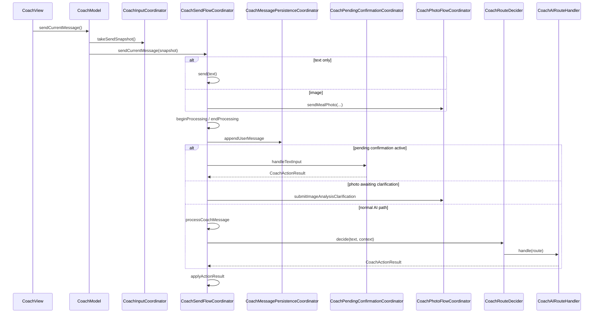
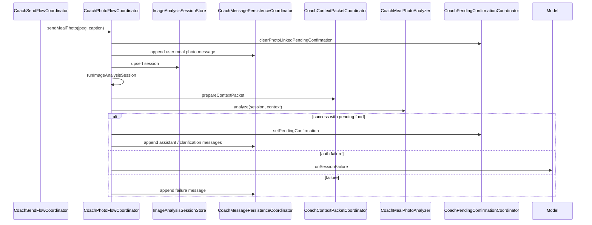
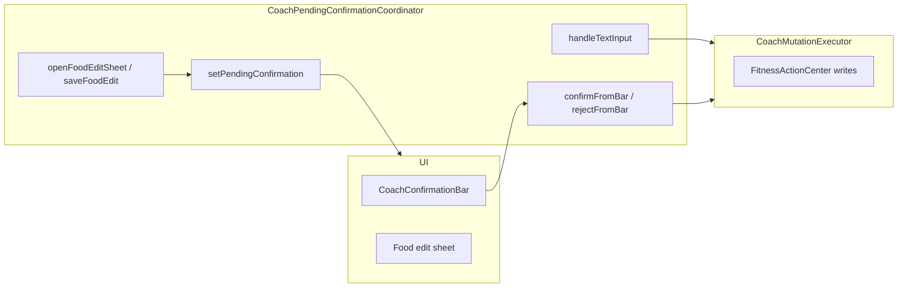

# Coach Architecture

**Last updated:** 2026-07-05  
**Audience:** Engineers working on Coach chat, logging, AI routing, or photo analysis  
**Related:** [CoachModelDecompositionV1.md](./CoachModelDecompositionV1.md), [COACH_FULL_CONTEXT_PACKET.md](./COACH_FULL_CONTEXT_PACKET.md), [COACH_CONTEXT_PACKET_V2.md](./COACH_CONTEXT_PACKET_V2.md), [../Architecture/DependencyInjectionMap.md](../Architecture/DependencyInjectionMap.md)

---

## 1. Role of `CoachModel`

`CoachModel` is the `@MainActor ObservableObject` bound by `CoachView`. After decomposition v1 it is a **thin orchestration layer**, not the owner of business rules.

| Responsibility | Owner |
|----------------|-------|
| `@Published` SwiftUI surface state | `CoachModel` |
| Public API expected by `CoachView` | `CoachModel` (thin forwarding) |
| Coordinator wiring in `init` | `CoachModel` |
| Send / photo / pending / persistence orchestration | Feature coordinators |
| AI routing, mutation execution, context packets | `Application/UseCases/Coach/` (assembled via `CoachDependencies`) |
| Canonical data writes | `CoachMutationExecutor` → `FitnessActionCenter` |

**Primary initializer:**

```swift
CoachModel(services: CoachServices, dependencies: CoachDependencies? = nil)
```

Tests that need the retired long-parameter list use `CoachModelTestFactory.makeModel(...)` in `Fitness CoachTests/TestingSupport/` (behavior-equivalent assembly, not production API).

**Line counts (approx., 2026-07-05):**

| File | LOC | Role |
|------|-----|------|
| `CoachModel.swift` | ~350 | Surface + wiring |
| `CoachModel+CoordinatorDelegates.swift` | ~75 | Delegate bridges for `@Published` fields |
| `CoachDependencies.swift` | ~140 | DI + pipeline assembly |
| Coordinators under `Features/Coach/Model/` | ~2,500 total | Flow ownership |

---

## 2. Layer map

```
CoachView (Features/Coach/)
  └── CoachModel (@Published surface)
        ├── CoachInputCoordinator              — composer draft, attachments, send snapshot
        ├── CoachSendFlowCoordinator           — text send, routing, processing lock
        ├── CoachPhotoFlowCoordinator          — meal photo send, analysis sessions
        ├── CoachPendingConfirmationCoordinator — pending bar, typed confirm, food edit
        ├── CoachMessagePersistenceCoordinator — transcript + timeline message events
        ├── CoachContextPacketCoordinator      — AI activity + context packet assembly
        ├── CoachTodayContextCoordinator       — empty-state today context
        ├── CoachLaunchChromeCoordinator       — launch intents, composer chrome
        ├── CoachNutritionEstimateActionCoordinator — nutrition card actions
        └── CoachModelStateReducer             — pure surface-state transitions

Application/UseCases/Coach/
  ├── CoachMutationExecutor, CoachAIRouteHandler, CoachRouteDecider
  ├── CoachMealPhotoAnalyzer, CoachPendingConfirmationPresenter
  └── Pipeline/ (intent routing, local parser)

Application/StateBuilders/Coach/
  └── CoachContextPacketV2Builder, CoachResponseBuilder, CoachTodayContextBuilder
```

---

## 3. Coordinator responsibilities

| Coordinator | File | Owns |
|-------------|------|------|
| **Input** | `CoachInputCoordinator.swift` | `CoachInputState` mutations, pending image staging, `takeSendSnapshot` / `restoreComposer`, sending-flag sync |
| **Send flow** | `CoachSendFlowCoordinator.swift` | `send` / `sendCurrentMessage`, input safety, pending-text routing, photo clarification routing, `CoachRouteDecider` + `CoachAIRouteHandler`, processing phase (`CoachProcessingPhaseControlling`) |
| **Photo flow** | `CoachPhotoFlowCoordinator.swift` | `ImageAnalysisSessionStore`, `sendMealPhoto`, retry, clarification/recommission, photo-linked messages, pending confirmation wiring for photos |
| **Pending confirmation** | `CoachPendingConfirmationCoordinator.swift` | Pending UI transitions, bar confirm/reject, typed yes/no, food edit sheet, timeline pending created/confirmed/rejected |
| **Message persistence** | `CoachMessagePersistenceCoordinator.swift` | Transcript restore/save, append user/assistant/structured messages, timeline message dedupe + recording |
| **Context packet** | `CoachContextPacketCoordinator.swift` | `CoachAIActivityContextResolver`, `CoachContextPacketV2Builder.makeContext`, HI analytics hooks |
| **Today context** | `CoachTodayContextCoordinator.swift` | `CoachTodayContextBuilder.build` for empty-state chrome |
| **Launch chrome** | `CoachLaunchChromeCoordinator.swift` | `CoachLaunchIntent` → presentation, composer focus/camera requests |
| **Nutrition estimate actions** | `CoachNutritionEstimateActionCoordinator.swift` | Nutrition card suggested actions (log, estimate another, follow-up queries) |
| **State reducer** | `CoachModelStateReducer.swift` | Pure transitions: processing phase, errors, launch chrome, pending UI, input sending sync |

Handlers in `Application/UseCases/Coach/` remain the **domain execution** layer; coordinators orchestrate when those handlers run and how results surface in UI state.

---

## 4. Message send flow



**Key behaviors (unchanged):**

1. `sendCurrentMessage` clears launch chrome, consumes launch presentation, then delegates to `CoachSendFlowCoordinator`.
2. Processing lock: `CoachProcessingPhase` + `isSending` derived via `CoachModelStateReducer`.
3. Pending confirmation text is handled before route classification.
4. Photo clarification re-enters photo flow without a second user-message append on the clarification path (preserved duplicate-append behavior where historically present).
5. Auth failures call `presentSessionFailure()` on the model surface; backend errors append assistant messages and record timeline events.

---

## 5. Photo flow



**Ownership:**

- In-memory session state: `ImageAnalysisSessionStore` inside `CoachPhotoFlowCoordinator`
- JPEG pipeline / compression: `CoachImagePipeline` (static), `CoachMealPhotoPipeline`
- Image pick UI: `CoachImagePickFlowController`, `CoachAttachmentImportCoordinator` (view-adjacent; not in coordinators)
- Processing phase during analysis: `CoachSendFlowCoordinator` via `CoachProcessingPhaseControlling`

---

## 6. Pending confirmation flow



**Surface state** (`pendingConfirmation`, `isConfirmingPending`, `foodEditErrorMessage`, `isShowingFoodEditSheet`) lives on `CoachModel` as `@Published` properties. Mutations go through `CoachModelStateReducer` via `CoachPendingConfirmationCoordinator` → `coachPendingConfirmationApplyUI`.

**Timeline:** pending created / confirmed / rejected events recorded in coordinator with dedupe keys (`CoachModelTimelineSupport`).

---

## 7. Transcript and timeline persistence

### Chat transcript

| Layer | Responsibility |
|-------|----------------|
| `CoachModel.messages` | In-memory `@Published` array for SwiftUI |
| `CoachMessagePersistenceCoordinator` | Mutations, `persistTranscript()`, timeline message dedupe |
| `CoachChatTranscriptStore` | `loadMessages()` / `saveMessages()` |
| Production store | `SwiftDataCoachChatTranscriptStore` (UID-scoped) |
| Test store | `CoachInMemoryChatTranscriptStore`, `CapturingCoachTranscriptStore` |

On init, `messagePersistenceCoordinator.restoreMessages()` hydrates `messages`. Every `mutateMessages` call persists to the transcript store.

### Coach timeline

| Layer | Responsibility |
|-------|----------------|
| `DefaultCoachTimelineRecorder` | Records domain events (user/assistant messages, photos, pending, errors) |
| `SwiftDataCoachTimelineStore` | Persisted timeline entities |
| `CoachTimelineBackfillService` | Historical backfill (AppContainer construction) |

Message-level dedupe sets live on `CoachMessagePersistenceCoordinator`. Photo and pending events are recorded from photo and pending coordinators respectively.

**Dual memory note:** transcript exists both in `CoachModel.messages` and SwiftData. `CoachMessagePersistenceCoordinator` is the write path; see [SourceOfTruthMap.md](../Architecture/SourceOfTruthMap.md).

---

## 8. Dependency construction

### Production (`AppContainer+FeatureFactories.swift`)

```
makeCoachServices()     → CoachServices (readers, health providers, action center)
makeCoachDependencies() → CoachDependencies (AI, stores, context builder, analytics)
makeCoachModel()        → CoachModel(services:dependencies:)
```

`CoachContextPacketV2Builder` is constructed in `makeCoachDependencies()` with the same inputs as before decomposition.

### Assembly (`CoachDependencies.assemble`)

Builds `CoachAssembledPipeline`:

- `CoachMutationExecutor`, `CoachAIRouteHandler`, `CoachRouteDecider`, `CoachMealPhotoAnalyzer`
- `CoachContextPacketCoordinator`, `CoachMessagePersistenceCoordinator`, `CoachPendingConfirmationCoordinator`, `CoachTodayContextCoordinator`

Any field on `CoachDependencies` can be overridden for tests (e.g. `aiService`, `transcriptStore`, `timelineRecorder`, `mutationExecutor`).

### Test harnesses

| Harness | Location | Pattern |
|---------|----------|---------|
| `CoachRoutingIntegrationTestSupport` | `Fitness CoachTests/TestingSupport/` | `makeCoachServices()` + `makeCoachDependencies()` + `CoachModel(services:dependencies:)` |
| `CoachModelCharacterizationTestSupport` | same | Full fakes: timeline, transcript, correction memory, analytics |
| `CoachModelTestFactory` | same | Retired long-parameter assembly for photo/pick-flow tests |

No globals: all injection is constructor-based.

---

## 9. Behavior preserved (decomposition v1)

- All `@Published` property names on `CoachModel` (SwiftUI bindings unchanged)
- Public API surface used by `CoachView`
- AI routing, `CoachRouteDecider` decisions, and `CoachAIRouteHandler` handlers
- `CoachContextPacketV2` schema and builder inputs
- `CoachMutationExecutor` → `FitnessActionCenter` mutation semantics
- Pending confirmation policy (confirm words, bar actions, food edit flow)
- Photo analysis session lifecycle, retry, clarification/recommission
- Transcript persistence timing and timeline event taxonomy
- Analytics event names and properties for nutrition cards and estimate actions
- Prompts, backend endpoint contracts, and Firebase `aiGateway` payloads

---

## 10. Intentionally not changed

- `Application/UseCases/Coach/Pipeline/` routing rules and classifier gates
- `CoachContextPacketV2Builder` field selection and compaction
- `FitnessActionCenter` as canonical write path
- SwiftData entity schemas for transcript and timeline
- `CoachImagePipeline` static API (not injected)
- `CoachView` structure and binding paths
- Account sync / outbox behavior for logged entries
- Feature flags governing AI and Health Intelligence in Coach

---

## 11. Tests

### Added for decomposition

| Test file | Covers |
|-----------|--------|
| `CoachModelStateReducerTests.swift` | Pure surface-state transitions |
| `CoachModelDecompositionCharacterizationTests.swift` | End-to-end behavior freeze (send, pending, photo, routing) |
| `CoachModelCharacterizationTests.swift` | Characterization suite with shared fakes |

### Updated harnesses

| File | Change |
|------|--------|
| `CoachRoutingIntegrationTestSupport.swift` | `makeCoachServices` / `makeCoachDependencies` helpers |
| `CoachModelCharacterizationTestSupport.swift` | Uses `CoachDependencies` assembly |

### Existing suites still relevant

`CoachRoutingTests`, `CoachMealPhotoAnalysisTests`, `CoachChatTranscriptPersistenceTests`, `CoachTimelineRegressionTests`, `CoachInputStateTests`, `CoachLaunchIntentTests`, `CoachFoodLoggingRegressionTests`, and context-packet test families.

**Run decomposition characterization:**

```bash
xcodebuild test -scheme "Fitness Coach" -destination "$DESTINATION" \
  -only-testing:"Fitness CoachTests/CoachModelDecompositionCharacterizationTests" \
  -only-testing:"Fitness CoachTests/CoachModelStateReducerTests"
```

See [TestCommandCheatsheet.md](../Testing/TestCommandCheatsheet.md).

---

## 12. Remaining debt

See [TechnicalDebtRegister.md](../TechnicalDebt/TechnicalDebtRegister.md) — TD-COACH-001 updated to **mostly closed** (v1 tail cleanup 2026-07-05).

Outstanding Coach items:

- `CoachImagePickFlowController` / attachment import still view-adjacent (not extracted to coordinator)
- Dual transcript memory (`messages` + SwiftData) — documented SSOT gap
- `Fitness CoachTests` target has unrelated compile failures blocking full CI green
- Further shrink legacy convenience initializer once tests migrate to `CoachDependencies`

---

## 13. Document index

| Doc | Contents |
|-----|----------|
| [CoachModelDecompositionV1.md](./CoachModelDecompositionV1.md) | Decomposition changelog and file map |
| [COACH_FULL_CONTEXT_PACKET.md](./COACH_FULL_CONTEXT_PACKET.md) | Context packet and timeline taxonomy |
| [COACH_TIMELINE_V2_ARCHITECTURE.md](./COACH_TIMELINE_V2_ARCHITECTURE.md) | Timeline v2 design |
| [DependencyInjectionMap.md](../Architecture/DependencyInjectionMap.md) | AppContainer Coach factories |

---

## Revision history

| Date | Change |
|------|--------|
| 2026-07-05 | Initial post-decomposition v1 architecture doc |
