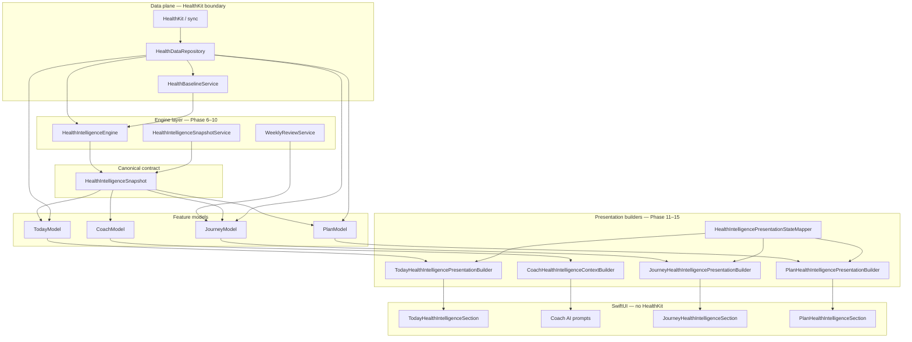

# Health Intelligence — Phase 11–15 UI Integration

Production documentation for Health Intelligence presentation and surface integration in Forma (Fitness Coach).

**Status:** UI integration complete behind feature flags. Engines run by default; visible UI, Coach context, and Weekly Review generation ship **off** until rollout confidence is high.

**Related:** [PHASE_6_10_IMPLEMENTATION.md](./PHASE_6_10_IMPLEMENTATION.md) · [PHASE_1_5_IMPLEMENTATION.md](./PHASE_1_5_IMPLEMENTATION.md) · [PHASE_6_10_ENGINE_AUDIT.md](./PHASE_6_10_ENGINE_AUDIT.md)

---

## 1. Overview

Phases 11–15 connect the Phase 6–10 engine layer to user-facing surfaces. The **canonical contract** between engines and UI remains `HealthIntelligenceSnapshot`. SwiftUI never reads repository models or HealthKit types directly.

### What shipped

| Phase | Deliverable | Primary file(s) |
|-------|-------------|-----------------|
| 11 | Today Health Intelligence section | `TodayHealthIntelligencePresentationBuilder.swift`, `TodayHealthIntelligenceSection.swift` |
| 12 | Coach Health Intelligence context | `CoachHealthIntelligenceContextBuilder.swift`, `CoachCompositionPolicy.swift` |
| 13 | Journey timeline, workout history, milestones | `JourneyHealthIntelligencePresentationBuilder.swift`, Journey HI cards |
| 14 | Weekly Review UI + cache-first loading | `WeeklyReviewPresentationBuilder.swift`, `JourneyHealthIntelligenceSectionLoader.swift` |
| 15 | Plan confidence, assumptions, data quality | `PlanHealthIntelligencePresentationBuilder.swift`, Plan HI cards |

### Core architecture rule

```
HealthIntelligenceEngine
→ HealthIntelligenceSnapshot
→ Presentation Builders
→ Today / Coach / Journey / Plan UI
```

**UI never imports HealthKit.** All HealthKit access stays in the data plane (`HealthDataRepository`, sync, cache). Presentation builders are pure mappers from snapshot + availability + app context into surface-specific **presentation state** structs.

### Resilience rule

**Snapshot composition failures must not break main app usage.** Each tab model loads its primary dashboard first (or in parallel) and treats Health Intelligence as an optional enrichment:

- Today / Plan / Journey dashboards still reach `.loaded` when HI fails.
- Fallback presentation sections render connect-health, limited-estimate, or empty-confidence states.
- Coach falls back to legacy activity query when snapshot load fails or awareness is suppressed.

### Legacy coexistence rule

**Old Health UI remains behind feature flags until rollout confidence is high.** When `FORMA_HEALTH_INTELLIGENCE_UI_ENABLED=1`:

- Today hides legacy Next Best Action and Activity sections when HI replaces them (`TodayReadOnlyCompositionPolicy`).
- Plan hides legacy Apple Health confidence card when HI section is present (`PlanDashboardCompositionPolicy`).
- Journey hides overlapping legacy insights when HI section renders.

Legacy sections are marked *pending removal after Health Intelligence rollout* in code. Do not delete until staged rollout completes and metrics confirm stability.

### Mermaid — end-to-end data flow



---

## 2. Feature flags

All flags live in `Fitness Coach/Health/HealthIntelligenceFeatureFlags.swift`. Values resolve from process environment or Info.plist via `FormaEnvironment.isTracingEnabled`. Legacy `FITPILOT_*` keys remain supported.

### Production defaults (safe release)

| Flag | Env key | Default | When off |
|------|---------|---------|----------|
| Foundation | `FORMA_HEALTH_INTELLIGENCE_ENABLED` | `true` | All HI wiring disabled |
| Engines | `FORMA_HEALTH_INTELLIGENCE_ENGINES_ENABLED` | `true` | No snapshot / review composition |
| **UI** | `FORMA_HEALTH_INTELLIGENCE_UI_ENABLED` | **`false`** | Today / Journey / Plan HI hidden |
| **Coach context** | `FORMA_HEALTH_INTELLIGENCE_COACH_CONTEXT_ENABLED` | **`false`** | Coach skips HI prompt injection |
| **Weekly review** | `FORMA_HEALTH_INTELLIGENCE_WEEKLY_REVIEW_ENABLED` | **`false`** | No weekly review generation |
| Sync | `FORMA_HEALTH_INTELLIGENCE_SYNC_ENABLED` | `true` | Background sync disabled |
| Repository reads | `FORMA_HEALTH_INTELLIGENCE_REPOSITORY_READS_ENABLED` | `true` | Read routing disabled |

### Derived load gates

| Property | Loads when |
|----------|------------|
| `shouldTodayModelLoadHealthIntelligence` | `enginesEnabled && (uiEnabled \|\| todayDebugFetch)` |
| `shouldJourneyModelLoadHealthIntelligence` | `enginesEnabled && (uiEnabled \|\| journeyDebugFetch)` |
| `shouldPlanModelLoadHealthIntelligence` | `enginesEnabled && (uiEnabled \|\| planDebugFetch)` |
| `shouldCoachLoadHealthIntelligence` | `enginesEnabled && coachContextEnabled` |

**Master switch:** `FORMA_HEALTH_INTELLIGENCE_ENABLED=0` disables all derived flags.

**Engines without UI:** With UI off but engines on, snapshot composition can still run internally (e.g. cache warming). Visible cards require `FORMA_HEALTH_INTELLIGENCE_UI_ENABLED=1`.

### DEBUG-only model fetch flags (default `false`; release always `false`)

| Flag | Env key | Purpose |
|------|---------|---------|
| Today debug fetch | `FORMA_HEALTH_INTELLIGENCE_TODAY_FETCH_ENABLED` | Load HI in TodayModel without showing UI |
| Journey debug fetch | `FORMA_HEALTH_INTELLIGENCE_JOURNEY_FETCH_ENABLED` | Same for Journey |
| Plan debug fetch | `FORMA_HEALTH_INTELLIGENCE_PLAN_FETCH_ENABLED` | Same for Plan |

### Test override

`HealthIntelligenceFeatureFlags.testOverride` accepts `TestHealthIntelligenceFeatureFlags` in `#if DEBUG`. Reset to `nil` in test `tearDown`.

### Recommended rollout flag sequence

1. `FORMA_HEALTH_INTELLIGENCE_UI_ENABLED=1` — surface cards only
2. `FORMA_HEALTH_INTELLIGENCE_COACH_CONTEXT_ENABLED=1` — Coach awareness
3. `FORMA_HEALTH_INTELLIGENCE_WEEKLY_REVIEW_ENABLED=1` — Journey weekly review generation

Keep foundation + engines on unless rolling back entirely.

---

## 3. Today integration

### Model

**File:** `Fitness Coach/Features/Today/Model/TodayModel.swift`

- **Published state:** `healthIntelligenceSectionState: TodayHealthIntelligenceSectionState?`
- **Load timing:** `refreshHealthIntelligenceSection` runs in parallel with training activity during `loadDashboard()`.
- **Inputs:** snapshot (`HealthIntelligenceSnapshotServing`), availability (`HealthDataRepositorying`), nutrition progress from today's log, Apple Health connection from `TodayActivityContext`.
- **Gates:** `healthIntelligenceLoadEnabled` / `healthIntelligenceUIEnabled` injected closures (default to feature flags).
- **Analytics:** `HealthIntelligenceAnalyticsCoordinator.logSnapshotLoaded` / `logSnapshotFailed` (surface `.today`).

When load is disabled → `healthIntelligenceSectionState = nil` (legacy Today layout unchanged).

### Presentation builder

**File:** `Fitness Coach/Application/StateBuilders/Today/TodayHealthIntelligencePresentationBuilder.swift`

| Output card | Source |
|-------------|--------|
| Recovery | `RecoverySummary` → plain-language copy; metric language sanitized |
| Daily Mission | Recovery + workout + nutrition progress; avoids duplicating Adaptive Nutrition |
| Next Best Action | `NextBestAction` or supplemental connect/ask-coach from lifecycle mapper |
| Workout | `WorkoutSummary` when `hasWorkout` |
| Adaptive Nutrition | `AdaptiveNutritionSummary` when actionable |
| Fallback banner | `HealthIntelligencePresentationStateMapper.bannerMessage` |

Returns **`nil` when UI flag is off** so existing Today output is unchanged.

### Composition policy

**File:** `Fitness Coach/Features/Today/Model/TodayReadOnlyCompositionPolicy.swift`

| Method | Behavior |
|--------|----------|
| `showsHealthIntelligenceSection` | `uiEnabled && sectionState != nil` |
| `showsLegacyNextBestAction` | Hidden when HI section visible |
| `showsActivitySection` | Hidden when HI shows workout card or mission includes workout-complete detail |

### UI section

**File:** `Fitness Coach/Features/Today/Components/HealthIntelligence/TodayHealthIntelligenceSection.swift`

Card order: **Recovery → Daily Mission → Next Best Action → Workout → Adaptive Nutrition → fallback banner**

- Uses `.formaThemeReactive()` for immediate theme updates.
- Analytics: recovery card viewed, next-best-action tapped (via `TodayActionCoordinator`).
- Accessibility ID: `today-health-intelligence-section`.

### Wiring

`AppContainer.makeTodayModel` injects snapshot service, `healthDataRepository`, and shared analytics coordinator. `MainTabView` passes HI section into `TodayReadOnlyView`.

---

## 4. Coach integration

### Model

**File:** `Fitness Coach/Features/Coach/Model/CoachModel.swift`

- **Load gate:** `shouldCoachLoadHealthIntelligence` (engines + coach context flag).
- **Resolver:** `CoachAIActivityContextResolver` loads snapshot when enabled; attaches `CoachHealthIntelligenceContext` to `CoachAIActivityContext`.
- **Prompt injection:** `CoachAIContextBuilder.makeContext` includes `activity.healthIntelligence.toPromptContext()`.
- **Fallback:** When snapshot fails or awareness suppressed → legacy `HealthActivityQueryService` only; Coach remains usable.

### Context builder

**File:** `Fitness Coach/Application/StateBuilders/Coach/CoachHealthIntelligenceContextBuilder.swift`

Maps `HealthIntelligenceSnapshot` → `CoachHealthIntelligenceContext` (Codable, prompt-safe):

- No raw HRV/RHR values; recovery score only when confidence moderate/high and not limited.
- Conservative confidence labels (`high` → `"moderate"` in prompts).
- Missing signals in plain language; deduped when limited recovery wording already covers sleep/heart gaps.
- Text sanitized via `HealthIntelligencePresentationTextSanitizer`.

### Composition policy

**File:** `Fitness Coach/Application/StateBuilders/Coach/CoachCompositionPolicy.swift`

- Suppresses legacy workout signal duplication when Coach HI context is active.
- `suggestedFocus` prefers NBA title → workout summary → recovery explanation over legacy focus builder.

### Awareness suppression

Coach **does not ask for information it already has.** `healthIntelligenceAwarenessAvailable` is false when:

- Connect-health is the primary NBA, or
- Recovery is unknown with missing sleep + heart signals and no steps/workout.

In those cases `healthIntelligence = nil` in AI context even if snapshot loaded (analytics may still record load).

### Medical claims

Coach copy paths strip metric language and avoid diagnosis/treatment framing. Engines produce observational guidance only.

---

## 5. Journey integration

### Model

**File:** `Fitness Coach/Features/Journey/Model/JourneyModel.swift`

- **Published state:** `journeyHealthIntelligenceSectionState`
- **Loader:** `JourneyHealthIntelligenceSectionLoader.loadInput` — snapshot, recovery days, workouts, weekly review, availability.
- **Builder:** `JourneyHealthIntelligencePresentationBuilder.buildSection(input:isUIEnabled:)`
- **Requires:** `healthActivityQuery` + `healthDataRepository`; otherwise minimal fallback section.
- **Refresh:** `refresh(forceWeeklyReviewRefresh:)` — normal refresh uses cache; force regenerates review.

### Presentation sub-sections

**File:** `Fitness Coach/Application/StateBuilders/Journey/JourneyHealthIntelligencePresentationBuilder.swift`

| Sub-section | Behavior |
|-------------|----------|
| Weekly Review card / detail | Latest completed week; sanitized summary/wins/focus |
| Recovery timeline | 7–14 days; missing days show limited/unknown states (no fabricated scores) |
| Workout history | 30-day window; empty state when no workouts |
| Milestones | Derived from real streaks/progress — not exaggerated |
| Progress | Plan/health progress summary |
| Connect Health CTA | When lifecycle is `noHealthPermission` |

Returns **`nil` when UI flag is off**.

### Legacy hiding

When HI section is visible, overlapping Journey legacy insights/training rows are suppressed via Journey composition policy (see `JourneyView`).

---

## 6. Weekly Review UI

### Service + cache

**File:** `Fitness Coach/Health/Intelligence/WeeklyReviewService.swift`

Operational when `enginesEnabled && weeklyReviewEnabled`.

| Path | Behavior |
|------|----------|
| Normal refresh | `getLatestCompletedWeeklyReview` — cache-first, no re-compose |
| Force refresh | `generateWeeklyReview(..., forceRefresh: true)` — bypasses cache |
| Preview | Requires `allowPreview: true` (not used in production UI path) |

Cache store: `LocalHealthCacheStore` / `HealthCacheStore` protocol.

### Journey loader

**File:** `Fitness Coach/Application/StateBuilders/Journey/JourneyHealthIntelligenceSectionLoader.swift`

- `loadWeeklyReview` respects `forceWeeklyReviewRefresh` from `JourneyModel.refresh`.
- Recovery timeline days use cache before engine `.preview` compose on cache miss.

### UI

- `JourneyHealthIntelligenceSection` renders weekly review card; detail opens on tap.
- Analytics: `weekly_review_card_viewed`, `weekly_review_detail_opened`.
- Copy sanitized — no raw metric values in wins/focus lines.

### Stability expectation

Normal pull-to-refresh must **not** regenerate weekly review (`generateCallCount` stays 0 in integration tests). Only explicit force refresh or new completed week triggers generation.

---

## 7. Plan integration

### Model

**File:** `Fitness Coach/Features/Plan/Model/PlanModel.swift`

- **Published state:** `planHealthIntelligenceSectionState`
- **Loader:** `PlanHealthIntelligenceSectionLoader.loadSection` — single parallel fetch of snapshot, baseline, availability (no duplicate snapshot compose per refresh).
- **Result:** `PlanHealthIntelligenceLoadResult` (section + snapshot + availability for analytics).
- **UI gate:** Section published only when `uiEnabled`; load may still occur under debug-fetch flag.
- **Fallback:** On error → conservative unknown confidence section; Plan dashboard stays `.loaded`.

### Presentation builder

**File:** `Fitness Coach/Application/StateBuilders/Plan/PlanHealthIntelligencePresentationBuilder.swift`

| Card | Purpose |
|------|---------|
| Confidence | Conservative label + reasons; disclaimer line |
| Assumptions | Steps, workouts, recovery trend, targets — `isLimited` when data sparse |
| Data quality | Signal grid (workouts, steps, energy, sleep, heart, weight, nutrition) |
| Missing data actions | Connect health, partial permissions, log weight/nutrition |

Partial-permissions action **suppresses** redundant sleep/HRV granular CTAs.

### Composition policy

**File:** `Fitness Coach/Features/Plan/Model/PlanDashboardCompositionPolicy.swift`

- `showsHealthIntelligenceSection`: `uiEnabled && sectionState != nil`
- `showsLegacyPlanConfidenceSection`: inverse — legacy Apple Health card hidden when HI present

---

## 8. Presentation model architecture

UI consumes **presentation state only**, never `HealthDataRepository`, `DailyHealthMetrics`, or HealthKit types.

### Surface state types

| Surface | State type | File |
|---------|------------|------|
| Today | `TodayHealthIntelligenceSectionState` | `TodayHealthIntelligencePresentationState.swift` |
| Journey | `JourneyHealthIntelligenceSectionState` | `JourneyHealthIntelligencePresentationState.swift` |
| Plan | `PlanHealthIntelligenceSectionState` | `PlanHealthIntelligencePresentationState.swift` |
| Coach | `CoachHealthIntelligenceContext` | `CoachHealthIntelligenceContext.swift` |

### Shared lifecycle

**Files:** `HealthIntelligencePresentationLifecycle.swift`, `HealthIntelligencePresentationStateMapper.swift`

`HealthIntelligencePresentationContext` bundles:

- `availability`, `snapshot`, `isAppleHealthConnected`, `cachedDayCount`
- `isLoading`, `explicitErrorMessage`, `syncPhase`

`HealthIntelligencePresentationStateMapper.resolve(context)` → lifecycle enum used for banners, CTAs, and analytics buckets.

### Builders (pure, deterministic)

| Builder | Input | Output |
|---------|-------|--------|
| `TodayHealthIntelligencePresentationBuilder` | Snapshot?, nutrition progress, availability | `TodayHealthIntelligenceSectionState?` |
| `JourneyHealthIntelligencePresentationBuilder` | `JourneyHealthIntelligenceBuildInput` | `JourneyHealthIntelligenceSectionState?` |
| `PlanHealthIntelligencePresentationBuilder` | `PlanHealthIntelligenceBuildInput` | `PlanHealthIntelligenceSectionState` |
| `CoachHealthIntelligenceContextBuilder` | `HealthIntelligenceSnapshot` | `CoachHealthIntelligenceContext` |

### Text sanitization

**File:** `HealthIntelligencePresentationTextSanitizer.swift`

Strips HRV, heart rate, BPM, baseline comparison language from user-facing and Coach prompt copy.

---

## 9. Data flow diagrams

### Per-tab refresh (simplified)

```
User opens tab / pull-to-refresh
        │
        ▼
Feature Model.refresh()
        │
        ├── Primary dashboard load (logs, profile, weights, …)  ──► .loaded (required)
        │
        └── HI branch (if load gate on)
                │
                ├── HealthIntelligenceSnapshotService.loadTodaySnapshot
                ├── HealthDataRepository.getHealthDataAvailability  (Today/Journey/Plan)
                ├── HealthBaselineService.buildContext              (Plan)
                ├── WeeklyReviewService.getLatest…                  (Journey)
                │
                ▼
        Presentation Builder.build…
                │
                ▼
        @Published *HealthIntelligenceSectionState
                │
                ▼
        SwiftUI section (if uiEnabled && state != nil)
```

### Coach message send

```
User sends Coach message
        │
        ▼
CoachModel.prepareAIContext()
        │
        ├── CoachAIActivityContextResolver (snapshot if coach flag on)
        ├── CoachHealthIntelligenceContextBuilder.build(from: snapshot)
        ├── CoachCompositionPolicy (focus, legacy suppression)
        │
        ▼
CoachAIContextBuilder → LLM prompt (includes healthIntelligence block when non-nil)
```

### Analytics side channel (read-only)

```
Model logs snapshot loaded/failed
        │
        ▼
HealthIntelligenceAnalyticsCoordinator
        │
        ▼
HealthIntelligenceAnalyticsContextBuilder (bucketed properties only)
        │
        ▼
NoOp (release) / OSLog (DEBUG)
```

---

## 10. Error / fallback states

### Lifecycle → user experience

| Lifecycle | User sees | Primary action |
|-----------|-----------|----------------|
| `loading` | Skeleton / loading placeholders | — |
| `ready` | Full HI cards | Engine NBA or none |
| `noHealthPermission` | Connect-health banner / CTA | Connect Apple Health |
| `partialHealthPermission` | Partial-data banner | Manage permissions |
| `noHealthDataYet` | Building-data message | Continue logging |
| `limitedEstimate` | Limited-estimate label + ask-coach option | Ask Coach |
| `syncFailed` | Safe error copy (logged data preserved) | Retry via pull-to-refresh |
| `unavailableOnDevice` | Health not available on device | — |

### Per-surface failure behavior

| Surface | Snapshot fails | UI flag off | Missing repository |
|---------|----------------|-------------|-------------------|
| **Today** | Fallback section; dashboard `.loaded` | `sectionState = nil`; legacy layout | Availability omitted; lifecycle from snapshot only |
| **Journey** | Fallback section; dashboard `.loaded` | `sectionState = nil` | Minimal fallback connect/progress |
| **Plan** | Fallback confidence unknown; dashboard `.loaded` | `sectionState = nil`; legacy confidence | Fallback via `PlanHealthConnectionState.resolve` |
| **Coach** | Legacy activity query; no HI in prompt | No snapshot load | N/A |

**Invariant:** No tab root `.error` state caused solely by Health Intelligence failure.

---

## 11. Privacy and analytics rules

### Analytics coordinator

**File:** `HealthIntelligenceAnalyticsCoordinator.swift`

Design: read-only, bucketed, privacy-safe. Default logger is `NoOpHealthIntelligenceAnalyticsLogger` in release; `OSLogHealthIntelligenceAnalyticsLogger` in DEBUG.

### Events (Phase 11–15)

| Event | When |
|-------|------|
| `snapshot_loaded` / `snapshot_failed` | Model HI refresh |
| `today_recovery_card_viewed` | Recovery card appear |
| `today_next_best_action_tapped` | NBA CTA tap |
| `coach_health_context_used` | Coach prompt includes HI context |
| `journey_recovery_timeline_viewed` | Timeline appear |
| `journey_workout_history_viewed` | History appear |
| `weekly_review_card_viewed` / `weekly_review_detail_opened` | Journey review UI |
| `plan_health_confidence_viewed` | Plan confidence card appear |
| `health_permission_cta_tapped` | Connect/manage permissions CTA |

### Allowed property buckets

`health_data_state`, `recovery_status`, `confidence_bucket`, `has_workout_today`, `missing_signal_count`, `feature_flag_state`, `surface`, `action_type`, `cta_surface`, `failure_reason`

### Never log

- Raw HealthKit samples or normalized metric values
- HRV or resting heart rate numbers
- Workout titles, food text, or raw snapshot JSON
- Metric strings containing `bpm`, `ms`, or baseline comparisons

Enforced in `HealthIntelligenceAnalyticsLoggingTests` and presentation sanitizers.

### Debug logging

Sensitive health details must not appear in non-DEBUG logs. HI analytics uses NoOp in release builds.

---

## 12. Testing strategy

### Test plans

See `Fitness CoachTests/TESTING.md`:

| Plan | HI coverage |
|------|-------------|
| **Fast-Core** | Presentation builders, composition policies, feature flags, sanitizers, analytics guardrails |
| **Integration** | AppContainer wiring, HealthKit mocks, Phase 11 end-to-end scenarios |
| **Full (CI)** | Complete regression |

```bash
DESTINATION='platform=iOS Simulator,name=iPhone 17'

# Fast local
xcodebuild test -scheme "Fitness Coach" -destination "$DESTINATION" -testPlan Fast-Core

# Phase 11 integration scenarios
xcodebuild test -scheme "Fitness Coach" -destination "$DESTINATION" \
  -only-testing:Fitness\ CoachTests/HealthIntelligencePhase11IntegrationTests

# Full CI
xcodebuild test -scheme "Fitness Coach CI" -destination "$DESTINATION"
```

### Key test files

| File | Covers |
|------|--------|
| `HealthIntelligencePhase11IntegrationTests.swift` | 9 scenarios: flag off, full data, partial, no data, denied, snapshot failure, theme, pull-to-refresh, weekly review cache |
| `HealthIntelligencePresentationStateMapperTests.swift` | Lifecycle resolution, shared copy |
| `TodayHealthIntelligencePresentationBuilderTests.swift` | Today cards, sanitization, mission dedupe |
| `JourneyHealthIntelligencePresentationBuilderTests.swift` | Timeline, milestones, workout empty states |
| `PlanHealthIntelligencePresentationBuilderTests.swift` | Confidence, partial permissions, signal grid |
| `CoachHealthIntelligenceContextBuilderTests.swift` | Prompt safety, missing-signal dedupe |
| `HealthIntelligenceAnalyticsLoggingTests.swift` | Privacy property bans |
| `HealthIntelligenceFeatureFlagsTests.swift` | Flag defaults and derived gates |
| `PlanModelHealthIntelligenceTests.swift` | Single snapshot load, fallback resilience |

### Integration scenario matrix

| Scenario | Assert |
|----------|--------|
| Flags off | Nil HI state, zero snapshot loads, legacy sections visible |
| Full rollout | All surfaces render expected cards |
| Partial data | Limited-estimate lifecycle, no raw metrics in UI |
| Permission denied | Connect CTAs; tabs still usable |
| Snapshot failure | Dashboard loaded + fallback section |
| Theme change | `.formaThemeReactive()` sections update |
| Weekly review cache | Normal refresh does not regenerate |

---

## 13. Known limitations

| Limitation | Detail |
|------------|--------|
| UI off by default | Requires explicit env flag for user-visible HI |
| Coach context off by default | Separate from UI flag |
| Weekly review off by default | Journey review card empty until flag enabled |
| Legacy sections coexist | Hidden only when HI section present; not deleted |
| Recovery timeline compose cost | Cache miss may compose up to 7–14 daily snapshots |
| Weekly review scope | Completed weeks only in production path |
| DEBUG-only fetch flags | Allow engine validation without UI in debug builds only |
| Simulator | Health data mocked; permission flows differ from device |
| Partial permissions | Qualitative signals only — no raw HRV/RHR in UI |
| Milestones | Conservative — derived from logged/synced data only |
| Dynamic Type | HI cards use shared typography; verify large content sizes on device |
| Cloud agent / Linux CI | `xcodebuild` not available — run Full plan on macOS |

---

## 14. Rollout checklist

### Pre-enable (staging / TestFlight)

- [ ] `FORMA_HEALTH_INTELLIGENCE_ENABLED=1` and `FORMA_HEALTH_INTELLIGENCE_ENGINES_ENABLED=1` confirmed
- [ ] Full test plan passes on iPhone simulator and physical device
- [ ] Manual QA: Today logging (meal, water, weight) with HI on and off
- [ ] Manual QA: denied, partial, and full Health permissions
- [ ] Manual QA: airplane mode / snapshot failure — tabs remain usable
- [ ] Verify no HRV/RHR in analytics logs (DEBUG OSLog review)
- [ ] Theme switch while on Today/Journey/Plan HI sections

### Stage 1 — UI only

- [ ] Set `FORMA_HEALTH_INTELLIGENCE_UI_ENABLED=1`
- [ ] Confirm legacy NBA/Activity/Plan confidence hidden when HI renders
- [ ] Monitor `snapshot_failed` rate and user support tickets

### Stage 2 — Coach context

- [ ] Set `FORMA_HEALTH_INTELLIGENCE_COACH_CONTEXT_ENABLED=1`
- [ ] Spot-check Coach does not duplicate known recovery/workout info
- [ ] Monitor `coach_health_context_used` vs. Coach error rate

### Stage 3 — Weekly review

- [ ] Set `FORMA_HEALTH_INTELLIGENCE_WEEKLY_REVIEW_ENABLED=1`
- [ ] Confirm cache-stable behavior on Journey refresh
- [ ] Review generated copy for conservative tone

### Post-rollout

- [ ] Compare engagement on HI NBA vs. legacy NBA
- [ ] Plan removal of legacy sections after stable metrics (separate PR)

---

## 15. Rollback plan

Rollback is **flag-only** — no migration or data loss required.

### Immediate UI rollback

```
FORMA_HEALTH_INTELLIGENCE_UI_ENABLED=0
```

Effect: HI sections hidden; legacy Today NBA/Activity and Plan confidence return automatically.

### Coach rollback

```
FORMA_HEALTH_INTELLIGENCE_COACH_CONTEXT_ENABLED=0
```

Effect: Coach reverts to legacy activity query and focus builder.

### Weekly review rollback

```
FORMA_HEALTH_INTELLIGENCE_WEEKLY_REVIEW_ENABLED=0
```

Effect: No new review generation; cached reviews remain in local store but UI may show stale card until hidden by UI rollback.

### Full HI rollback

```
FORMA_HEALTH_INTELLIGENCE_ENABLED=0
```

Effect: All HI wiring disabled — engines, sync, UI, Coach context, weekly review.

### Emergency validation after rollback

1. Open Today → confirm mission hero, meals, quick actions work
2. Open Coach → send message without Health connected
3. Open Plan → confirm strategy/status load
4. Open Journey → confirm progress chart loads

Cached snapshot data in `LocalHealthCacheStore` is inert when engines are off.

---

## 16. Next phase recommendations

| Priority | Recommendation |
|----------|----------------|
| **P0** | Remove legacy Today NBA, Activity, and Plan confidence sections after 2+ weeks stable full rollout |
| **P1** | Remote config / Firebase for HI flags (replace env-only toggles) |
| **P1** | On-device permission deep-link from partial-permissions CTAs |
| **P2** | Recovery timeline cache warming to reduce multi-compose on first Journey open |
| **P2** | Coach explicit "health data used" disclosure in UI (not just prompt injection) |
| **P2** | Snapshot composition dedupe across tabs (shared in-flight task in `HealthIntelligenceSnapshotService`) |
| **P3** | Widget / Live Activity using snapshot contract (reuse presentation builders) |
| **P3** | Localized HI copy audit (currently EN-first in `FormaProductCopy`) |

---

## File index

| Area | Path |
|------|------|
| Feature flags | `Fitness Coach/Health/HealthIntelligenceFeatureFlags.swift` |
| Lifecycle mapper | `Fitness Coach/Health/Models/HealthIntelligencePresentationStateMapper.swift` |
| Analytics | `Fitness Coach/Features/HealthIntelligence/HealthIntelligenceAnalyticsCoordinator.swift` |
| Text sanitizer | `Fitness Coach/Domain/HealthIntelligence/HealthIntelligencePresentationTextSanitizer.swift` |
| Today builder | `Fitness Coach/Application/StateBuilders/Today/TodayHealthIntelligencePresentationBuilder.swift` |
| Coach builder | `Fitness Coach/Application/StateBuilders/Coach/CoachHealthIntelligenceContextBuilder.swift` |
| Journey builder | `Fitness Coach/Application/StateBuilders/Journey/JourneyHealthIntelligencePresentationBuilder.swift` |
| Plan builder | `Fitness Coach/Application/StateBuilders/Plan/PlanHealthIntelligencePresentationBuilder.swift` |
| Plan loader | `Fitness Coach/Application/StateBuilders/Plan/PlanHealthIntelligenceSectionLoader.swift` |
| App wiring | `Fitness Coach/App/AppContainer.swift`, `Fitness Coach/App/MainTabView.swift` |
| Integration tests | `Fitness CoachTests/HealthIntelligencePhase11IntegrationTests.swift` |
| Prior engine docs | [PHASE_6_10_IMPLEMENTATION.md](./PHASE_6_10_IMPLEMENTATION.md) |

---

## Build verification

```bash
# Build
xcodebuild -scheme "Fitness Coach" -destination "platform=iOS Simulator,name=iPhone 17" build

# Full regression
xcodebuild test -scheme "Fitness Coach CI" -destination "platform=iOS Simulator,name=iPhone 17"
```

**Note:** Cloud/Linux agents do not have Xcode. Run the commands above on macOS before production rollout.

*Last updated: Phase 11–15 production hardening pass (commits through `5a66e93`).*
