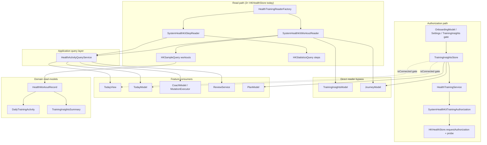

# Phase 1.5 — Apple Health / HealthKit Integration Audit

**App:** Forma (Fitness Coach) iOS  
**Audit date:** 2026-07-03  
**Scope:** Read-only inventory of existing HealthKit integration before expansion. No implementation changes.

---

## Executive summary

Forma has a **read-only** Apple Health integration focused on **workouts** and **step count**. Authorization and connection state are centralized in `HealthTrainingService` + `TrainingInsightsStore`. Data reads flow through protocol-based readers (`HealthKitWorkoutReading`, `HealthKitStepReading`) with a single application query layer (`HealthActivityQueryService`) for most surfaces.

**There is no local persistence of HealthKit samples.** Workout/step data is fetched on demand from HealthKit. Legacy SwiftData workout logging (`WorkoutEntryEntity`) was retired; `DailyLogEntity.workoutCaloriesBurned` remains as a stale manual field merged with live Health data.

**Authorization is requested in onboarding and settings**, not at cold app launch. UI layers do not import HealthKit directly.

Primary expansion risks: **duplicate fetch paths**, **three separate `HKHealthStore` instances**, **inconsistent error handling** (workouts degrade to empty vs steps throw), **no background sync**, and **Journey/Training Insights bypassing** the shared query service.

---

## Current architecture

### Layering

| Layer | Responsibility |
|-------|----------------|
| **Infrastructure/Health** | HealthKit I/O, authorization, mocks, debug logging |
| **Application** | `HealthActivityQueryService`, `TrainingInsightsStore`, onboarding coordinator |
| **Domain** | `HealthWorkoutRecord`, `DailyTrainingActivity`, `TrainingIntegrationState`, aggregators |
| **Features** | Today, Journey, Plan, Coach, Training Insights, Onboarding, Settings — consume domain/read-models only |
| **AppContainer** | Composition root: wires readers, query service, store, models |

### Composition root (`AppContainer`)

On init, the app creates:

1. `HealthTrainingService()` — authorization + connection API (`TrainingIntegrationProviding`)
2. `TrainingInsightsStore(integration: healthTrainingService)` — published connection state
3. `HealthTrainingReaderFactory.makeWorkoutReader()` / `makeStepReader()` — platform readers
4. `HealthActivityQueryService(workoutReader:, stepReader:)` — shared query facade
5. `TrainingInsightsModel(workoutReader:)` — 28-day workout aggregation UI

`TrainingInsightsStore` and `TrainingInsightsModel` are injected as `@EnvironmentObject` from `MainTabView`.

### Authorization model

- **Read types requested:** `HKWorkoutType`, `HKQuantityType.activeEnergyBurned`, `HKQuantityType.appleExerciseTime`, `HKQuantityType.stepCount`
- **Write types:** none (`writeTypes` is empty)
- **Status resolution:** `resolveWorkoutReadAccess()` uses `getRequestStatusForAuthorization` + a **probe query** (limit 1 workout sample). Legacy `authorizationStatus(for:)` is documented as unreliable for read-only access.
- **Mapped states:** `HealthTrainingAuthorizationStatus` → `TrainingIntegrationState` (`.connected`, `.denied`, `.notConnected`, `.unavailable`)

### Entitlements & Info.plist

| Item | Location | Value |
|------|----------|-------|
| HealthKit capability | `Fitness Coach/Fitness Coach.entitlements` | `com.apple.developer.healthkit = true` |
| Health share usage | `Fitness Coach.xcodeproj/project.pbxproj` | `INFOPLIST_KEY_NSHealthShareUsageDescription` |
| Health update usage | Not configured | Intentionally absent (read-only) |

### Permissions requested (read-only)

From `SystemHealthKitTrainingAuthorization.readTypes`:

- Workouts (`HKObjectType.workoutType()`)
- Active energy burned
- Apple Exercise Time
- Step count

---

## Files found

### Infrastructure — HealthKit core (15 files)

| File | Role |
|------|------|
| `Infrastructure/Health/HealthKitWorkoutReading.swift` | Workout reader protocol + `HealthKitOptionalAccessPolicy` |
| `Infrastructure/Health/HealthKitStepReading.swift` | Step reader protocol |
| `Infrastructure/Health/HealthKitTrainingAuthorizing.swift` | Authorization protocol |
| `Infrastructure/Health/SystemHealthKitWorkoutReader.swift` | Live `HKSampleQuery` for workouts → `HealthWorkoutRecord` |
| `Infrastructure/Health/SystemHealthKitStepReader.swift` | Live `HKStatisticsQuery` for step sum |
| `Infrastructure/Health/SystemHealthKitTrainingAuthorization.swift` | `requestAuthorization`, probe, read types |
| `Infrastructure/Health/UnavailableHealthKitTrainingAuthorization.swift` | Non-iOS / no-HealthKit fallback |
| `Infrastructure/Health/HealthTrainingService.swift` | `TrainingIntegrationProviding` implementation |
| `Infrastructure/Health/HealthTrainingReaderFactory.swift` | Platform vs mock reader factory |
| `Infrastructure/Health/HealthTrainingAuthorizationStatus.swift` | Auth status → integration state |
| `Infrastructure/Health/HealthTrainingDebugLogger.swift` | `[HealthTraining]` debug logging |
| `Infrastructure/Health/HealthWorkoutActivityFormatter.swift` | `HKWorkoutActivityType` → display name |
| `Infrastructure/Health/HealthAppSettingsNavigator.swift` | Opens Health app / Settings |
| `Infrastructure/Health/TrainingIntegrationProviding.swift` | Integration boundary protocol |
| `Infrastructure/Health/MockHealthKit*.swift` (3) | Test/preview doubles |

### Application layer (4 files)

| File | Role |
|------|------|
| `Application/Queries/HealthActivityQueryService.swift` | Central workout/step queries |
| `Application/Services/TrainingInsightsStore.swift` | `@Published` connection state, `connectAppleHealth()` |
| `Application/UseCases/Onboarding/OnboardingAppleHealthCoordinator.swift` | Onboarding permission orchestration |

### Domain models & logic (7 files)

| File | Role |
|------|------|
| `Domain/Training/HealthWorkoutRecord.swift` | Workout DTO + `TrainingInsightsSummary` types |
| `Domain/Training/DailyTrainingActivity.swift` | Per-day workout count/calories/hasWorkout |
| `Domain/Training/TrainingIntegrationState.swift` | Connection lifecycle + `TrainingDataSource` |
| `Domain/Training/TrainingIntegrationCopy.swift` | User-facing integration copy |
| `Domain/Training/TrainingInsightsAggregator.swift` | 7/14/28-day workout aggregation |
| `Domain/Onboarding/OnboardingAppleHealthFlow.swift` | Permission request + analytics mapping |
| `Domain/Onboarding/OnboardingAppleHealthPresentationState.swift` | Onboarding UI state machine |

### State builders consuming health data (10+ files)

| File | Health usage |
|------|--------------|
| `Application/StateBuilders/Today/TodayPresentationBuilder.swift` | Activity phase, workout-completed-today |
| `Application/StateBuilders/Today/TodayGoalsBuilder.swift` | Workout goal row |
| `Application/StateBuilders/Today/TodayMissionControlStateBuilder.swift` | Wires activity context |
| `Application/StateBuilders/Journey/JourneyTrainingSummaryBuilder.swift` | Weekly training status from workouts |
| `Application/StateBuilders/Plan/PlanConfidenceStateBuilder.swift` | Apple Health connection CTA |
| `Application/StateBuilders/Reviews/DailyReviewSummaryBuilder.swift` | Review workout summary |
| `Application/StateBuilders/Coach/CoachAIContextBuilder.swift` | `workoutsToday` for AI context |
| `Application/StateBuilders/Coach/CoachTodayContextBuilder.swift` | Coach header context |
| `Application/StateBuilders/Coaching/DailyBriefBuilder.swift` | `hasWorkoutToday` |
| `Application/StateBuilders/Nutrition/TodayAISummaryMapper.swift` | Maps workout counts to AI summary |

### Feature views & models (20+ files)

**Today**

- `Features/Today/TodayView.swift` — fetches workout count + steps on refresh
- `Features/Today/Model/TodayModel.swift` — `dailyTrainingActivity` when connected
- `Features/Today/Model/TodayDashboardState.swift` — `TodayActivityContext`
- `Features/Today/Formatting/TodayActivitySectionFormatting.swift` — steps/workout display lines
- `Features/Today/Components/TodayActivitySection.swift`, `TodayReadOnlyView.swift`

**Training Insights**

- `Features/TrainingInsights/TrainingInsightsView.swift`
- `Features/TrainingInsights/Model/TrainingInsightsModel.swift`
- `Features/TrainingInsights/Components/*` (Gate, Connected, Empty)

**Journey**

- `Features/Journey/Model/JourneyModel.swift` — direct `workoutReader.fetchWorkouts`
- `Features/Journey/Model/JourneyCTA.swift` — `connectAppleHealth` CTA

**Plan**

- `Features/Plan/Model/PlanModel.swift` — reads `trainingInsightsStore.integrationState`
- `Features/Plan/PlanView.swift` — refreshes store on appear/refresh

**Coach**

- `Features/Coach/Model/CoachModel.swift` — `healthActivityQuery.dailyTrainingActivity`
- `Application/UseCases/Coach/CoachMutationExecutor.swift` — `hasWorkoutToday()`
- `Application/UseCases/Coach/CoachAIRouteHandler.swift` — meal advice uses workout flag

**Onboarding**

- `Features/Onboarding/Model/OnboardingModel.swift` — `connectAppleHealth()`, step prep
- `Features/Onboarding/UI/OnboardingAppleHealthStepView.swift`
- `Features/Onboarding/Components/OnboardingAppleHealth*.swift` (5 components)

**Settings**

- `Features/Settings/UI/AppleHealthIntegrationView.swift`
- `Features/Settings/Model/AppleHealthSettings*.swift` (4 files)

### Data / persistence (legacy only)

| File | Status |
|------|--------|
| `Infrastructure/Persistence/SwiftData/Entities/WorkoutEntryEntity.swift` | **Retired** — v2 migration only, not in active schema |
| `Infrastructure/Persistence/SwiftData/Entities/DailyLogEntity.swift` | `workoutCaloriesBurned` field still present (legacy manual logging) |
| `Data/Repositories/ReviewService.swift` | Queries HealthKit at review generation time |

### Tests (10+ files)

- `Fitness CoachTests/AppleHealthTrainingStrategyTests.swift`
- `Fitness CoachTests/OnboardingAppleHealthTests.swift`
- `Fitness CoachTests/TrainingIntegrationTests.swift`
- `Fitness CoachTests/TodayActivityStateTests.swift`
- `Fitness CoachTests/TodayModelHydrationTests.swift`
- `Fitness CoachTests/JourneyTrainingSummaryBuilderTests.swift`
- Others referencing mocks

### Project configuration

- `Fitness Coach.xcodeproj/project.pbxproj` — links `HealthKit.framework`
- `Fitness Coach/Fitness Coach.entitlements` — HealthKit capability

---

## 1. Where steps are currently pulled

### Source

`SystemHealthKitStepReader.fetchStepCount(from:to:)`:

- Guard: `HKHealthStore.isHealthDataAvailable()` + `HKQuantityType.stepCount`
- Query: `HKStatisticsQuery` with `.cumulativeSum` and `.strictStartDate` predicate
- Returns: `Int` (rounded, clamped ≥ 0)
- On unavailable platform: returns `0` (no throw)

### Call chain

```
SystemHealthKitStepReader
  → HealthActivityQueryService.stepsToday(on:calendar:)
    → dayStart..dayEnd window (calendar start of day)
```

### Consumers

| Consumer | Gating | Error handling |
|----------|--------|----------------|
| **`TodayView.refreshDashboard()`** | Only when `trainingInsightsStore.integrationState.isConnected` | `try?` → `stepsToday` becomes `nil` |
| **Tests** | Mock readers | — |

**Steps are not pulled by:** Journey, Plan, Coach (directly), Training Insights, ReviewService, Onboarding.

### Display

- `TodayView` → `TodayActivityContext.stepsToday` → `TodayPresentationBuilder` → `TodayActivitySectionFormatting.stepsLine`
- Shown only when connected and fetch succeeds; `nil` steps affects activity phase (`.empty` vs `.hasData`)

---

## 2. Where workout-completed-today is currently pulled

“Workout completed today” is derived from **workout count > 0** for the current calendar day, with multiple redundant sources merged at presentation time.

### Primary data sources

| Path | Method | Connection gate? |
|------|--------|------------------|
| **TodayView** | `healthActivityQuery.workoutCountToday()` | Yes — only when `.isConnected` |
| **TodayModel** | `healthActivityQuery.dailyTrainingActivity(on:)` | Yes — `optionalDailyTrainingActivity` returns `.empty` if not connected |
| **CoachModel** | `healthActivityQuery.dailyTrainingActivity()` | **No** — always queries |
| **CoachMutationExecutor** | `healthActivityQuery.dailyTrainingActivity().hasWorkout` | **No** |
| **ReviewService** | `healthActivityQuery.dailyTrainingActivity(on: dailyLog.date)` | **No** |
| **Coach AI routing** | `healthActivityQuery.dailyTrainingActivity().workoutCount` | **No** |

### Low-level reader

`SystemHealthKitWorkoutReader.fetchWorkouts(from:to:)`:

- `HKSampleQuery` on `HKObjectType.workoutType()`
- Predicate: `.strictStartDate` for day window
- Maps to `HealthWorkoutRecord` (id, activity name, dates, duration, active calories)

`HealthActivityQueryService.workouts()` **swallows errors** and returns `[]` (logs optional-access failures).

### “Completed” determination (UI)

```swift
// TodayPresentationBuilder.activity(from:)
let hasWorkout = inputs.workoutSummary.hasWorkout
    || (context.appleHealthWorkoutCount ?? 0) > 0

// Phase when connected + has workout:
phase = .workoutCompleted
```

Also used in:

- `NextBestActionEngine.hasWorkoutToday()` — `workoutSummary.hasWorkout || appleHealthWorkoutCount > 0`
- `TodayGoalsBuilder` — `workoutCount > 0` when connected
- `TodayActivitySectionFormatting.workoutStatus` — `.completed` when `hasWorkoutToday`
- `DailyBriefBuilder` / `CoachResponseBuilder` — `hasWorkoutToday` boolean

### Legacy merge

`TodayModel` and `DailyReviewSummaryBuilder` use:

```swift
workoutCaloriesBurned: max(dailyLog.workoutCaloriesBurned, training.workoutCaloriesBurned)
```

`dailyLog.workoutCaloriesBurned` is a **legacy SwiftData field** from manual workout logging (no longer written by UI). It can still affect calorie display if non-zero from old data.

---

## 3. Views that consume Apple Health data today

| Surface | What it consumes | How |
|---------|------------------|-----|
| **Today** | Steps today, workout count, connection state, activity phase | `TodayView` + `TodayModel` + state builders |
| **Training Insights** | 28-day workouts, weekly summary, consistency | `TrainingInsightsModel` → `workoutReader` |
| **Journey** | Week/month/year workout analytics, training CTAs | `JourneyModel` → `workoutReader` + `trainingInsightsStore` |
| **Plan** | Connection status, confidence CTA | `PlanModel` → `trainingInsightsStore.integrationState` |
| **Coach** | `hasWorkout`, `workoutsToday` for context & routing | `CoachModel`, `CoachMutationExecutor`, `CoachAIContextBuilder` |
| **Daily Review** (generated) | Workout count/calories in summary | `ReviewService` → `healthActivityQuery` |
| **Onboarding** | Permission flow, device availability | `OnboardingAppleHealthStepView` + `OnboardingModel` |
| **Settings → Apple Health** | Connection status, last sync, connect/manage | `AppleHealthIntegrationView` |

**Indirect consumers:** Plan confidence section, Journey CTAs, Today empty states, Training Insights gate/connected subviews linking to Settings.

---

## 4. Local persistence for HealthKit data

### HealthKit samples: **No**

Workouts and steps are **not cached** in SwiftData, Core Data, UserDefaults, or files. Every refresh issues new HealthKit queries.

### Connection metadata: **Partial / in-memory**

| Data | Persisted? | Notes |
|------|------------|-------|
| `TrainingInsightsStore.lastSyncedAt` | **No** | Set in memory on `refresh()` / `connectAppleHealth()` when connected; shown in Settings UI |
| `TrainingIntegrationState` | **No** | Re-derived from HealthKit on each `refreshState()` |
| Debug stub flags (`forma.trainingIntegration.stub*`) | UserDefaults | DEBUG/test only via `HealthTrainingService.setStubConnected/Denied` |
| Generated daily reviews | SwiftData | **Snapshot** of workout count/calories at generation time — not a HealthKit cache |

### Legacy workout persistence (retired)

- `WorkoutEntryEntity` — removed from active schema (`FormaSchemaV3`); migration-only
- `DailyLogEntity.workoutCaloriesBurned` — still on disk; merged with live HealthKit calories
- `WorkoutLogService` — removed (per `Docs/Architecture.md`)

### Implications

- No offline Health data
- No historical backfill without re-querying HealthKit
- Review snapshots may diverge from live Today if Health data changes after review generation
- `lastSyncedAt` reflects **authorization refresh time**, not last successful data pull

---

## 5. When HealthKit access is requested

| Trigger | Location | Behavior |
|---------|----------|----------|
| **Onboarding** | `OnboardingStep.appleHealth` (step 306) | Primary CTA → `OnboardingModel.connectAppleHealth()` → `TrainingInsightsStore.connectAppleHealth()` → `HKHealthStore.requestAuthorization` |
| **Settings** | `AppleHealthIntegrationView` | "Connect Apple Health" → `insightsStore.connectAppleHealth()` |
| **Training Insights gate** | `TrainingInsightsView.handlePrimaryAction()` | Connect or open Health app if denied |
| **App launch** | `Fitness_CoachApp` / `MainTabView` | **Does not request permission** — only `trainingInsightsStore.refresh()` (status probe) |
| **Today tab** | `TodayView.task` / `refreshDashboard` | **Does not request** — refresh state + conditional data fetch |

Onboarding also:

- Calls `prepareAppleHealthStep()` → `refreshDeviceState()` on step entry
- Supports skip (`skipAppleHealth()`)
- Reconciles on foreground return (`handleAppleHealthForegroundReturn()`)

Denied users are directed to **Health app** (`x-apple-health://`) via `HealthAppSettingsNavigator`, not iOS Settings → Forma.

---

## 6. Direct HealthKit calls from UI files

**None found** in `Features/**/*.swift`.

All `import HealthKit` usage is confined to:

- `Infrastructure/Health/SystemHealthKit*.swift`
- `Infrastructure/Health/HealthKitWorkoutReading.swift` (optional access policy)
- `Infrastructure/Health/HealthWorkoutActivityFormatter.swift`
- `Infrastructure/Health/HealthTrainingDebugLogger.swift`
- Tests (`OnboardingAppleHealthTests.swift`, `TodayModelHydrationTests.swift`)

UI depends on `TrainingInsightsStore`, `HealthActivityQueryService`, and domain types only. ✅ Aligns with architecture rules in `Docs/Architecture.md`.

---

## 7. Risk areas

### High priority

| Risk | Detail |
|------|--------|
| **Duplicate `HKHealthStore` instances** | `SystemHealthKitWorkoutReader`, `SystemHealthKitStepReader`, and `SystemHealthKitTrainingAuthorization` each default to `HKHealthStore()`. Three stores in one process — Apple recommends a shared instance. |
| **Duplicate Today fetches** | On refresh when connected: `TodayView` calls `workoutCountToday()` + `stepsToday()`, then `TodayModel` calls `dailyTrainingActivity()` — **two workout queries** for the same day. |
| **Split query paths** | `JourneyModel` and `TrainingInsightsModel` call `workoutReader` directly, bypassing `HealthActivityQueryService` and its optional-access degradation. Journey **throws** on reader errors → full Journey error state. |
| **Inconsistent error policy** | Workouts: swallow auth errors → `[]`. Steps: **throw** on auth failure. TodayView masks steps with `try?`; workout path silent. |
| **No background sync** | No `HKObserverQuery`, `HKAnchoredObjectQuery`, or `enableBackgroundDelivery`. Data is stale until user pulls to refresh or revisits a tab. |
| **Coach/Review ungated queries** | `CoachModel`, `CoachMutationExecutor`, `ReviewService` query HealthKit even when not connected (returns empty, but still hits HealthKit / logs errors). |

### Medium priority

| Risk | Detail |
|------|--------|
| **`lastSyncedAt` semantics** | Updated on auth `refresh()`, not on data fetch success — misleading "last sync" in Settings. |
| **Legacy `workoutCaloriesBurned`** | `DailyLogEntity.workoutCaloriesBurned` merged via `max()` — old manual data can inflate totals; Journey timeline also checks this field for historical days. |
| **`@unchecked Sendable`** | All System HealthKit classes use `@unchecked Sendable` with shared `HKHealthStore` — potential data race if queries overlap (continuations are per-call). |
| **Probe misclassification** | `probeReadAccess()` treats non-`HKError` failures as `.sharingAuthorized` (optimistic). |
| **TrainingInsights error vs Today degrade** | `TrainingInsightsModel.refresh()` surfaces `.error` on fetch failure; Today keeps loaded state with empty workouts. |
| **Connection state not persisted** | Cold start always begins `.notConnected` until async `refresh()` — brief UI flicker possible. |

### Low priority / assumptions

| Risk | Detail |
|------|--------|
| **Hardcoded lookback** | Training Insights: 28 days (`TrainingInsightsAggregator.defaultLookbackDays`). Journey: up to 365 days. |
| **Duration minimum** | `max(durationMinutes, 1)` — sub-minute workouts show as 1 min. |
| **Activity type mapping** | `HealthWorkoutActivityFormatter` manual switch — unknown types fall through to generic label. |
| **Week window** | "This week" = rolling 7 days (`-6` days), not calendar week. |
| **Strict start date** | `.strictStartDate` may exclude workouts spanning midnight. |
| **Force unwraps** | No production force-unwraps in Health infrastructure; previews use `try! AppContainer` (DEBUG only). |
| **Simulator** | Tests use mocks; live HealthKit behavior device-dependent. |

---

## Data flow diagram



### Today refresh sequence (connected)

```
TodayView.refreshDashboard()
  ├─ trainingInsightsStore.refresh()          // auth state only
  ├─ healthActivityQuery.workoutCountToday()  // HK query #1
  ├─ healthActivityQuery.stepsToday()         // HK query #2
  └─ todayModel.refresh(activityContext:)
       └─ healthActivityQuery.dailyTrainingActivity()  // HK query #3 (duplicate)
            └─ TodayPresentationBuilder → workoutCompleted phase
```

---

## Gaps

1. **No Health Intelligence persistence layer** — no cached samples, aggregates, or sync cursors for expansion (sleep, HRV, resting HR, etc.).
2. **No unified `HealthStore` singleton** — authorization and reads use separate store instances.
3. **No single query coordinator** — Journey and Training Insights bypass `HealthActivityQueryService`.
4. **No observer / background delivery** — real-time updates absent.
5. **No typed permission surface per data category** — all-or-nothing read bundle (workouts + energy + exercise time + steps).
6. **No analytics pipeline for HealthKit errors** — debug logger only (`HealthTrainingDebugLogger`).
7. **Legacy data model drift** — `workoutCaloriesBurned` on `DailyLog` and Journey timeline heuristics still reference manual-era signals.
8. **Steps only on Today** — not in Coach AI context, reviews, or Journey.
9. **No HealthKit on watchOS / macOS** — iOS-only via `#if canImport(HealthKit) && os(iOS)`.
10. **`TrainingIntegrationProviding` comment** still says "stub until Stage 3" — implementation is live but metadata persistence was never added.

---

## Recommended migration plan (for expansion)

### Phase A — Consolidate foundation (low risk)

1. **Introduce shared `HealthKitStoreProvider`** — single `HKHealthStore` injected into authorization + both readers via `AppContainer`.
2. **Route all reads through `HealthActivityQueryService`** (or rename to `HealthQueryService`) — migrate `JourneyModel` and `TrainingInsightsModel` off direct `workoutReader`.
3. **Unify error policy** — apply `HealthKitOptionalAccessPolicy` to steps; consistent `HealthQueryResult<T>` with `.unavailable`, `.denied`, `.success`.
4. **Deduplicate Today refresh** — pass `DailyTrainingActivity` from one query into `TodayActivityContext` (remove parallel `workoutCountToday` + `dailyTrainingActivity`).
5. **Gate Coach/Review queries** on `integrationState.isConnected` (match TodayModel).

### Phase B — Persistence & sync (Health Intelligence)

1. **Define SwiftData entities** for daily health snapshots (steps, workout count, active energy, source sync date).
2. **Write-through on fetch** — cache after successful HealthKit read; serve UI from cache first.
3. **Add `HKObserverQuery` + anchored queries** for workouts/steps with debounced refresh → `AppRefreshCenter`.
4. **Persist `lastSyncedAt` + per-type sync cursors** in UserDefaults or SwiftData.
5. **Separate authorization state from data freshness** in Settings UI.

### Phase C — Expand data types

1. **Split read types into feature flags** — e.g. training bundle vs activity bundle vs sleep bundle.
2. **Add protocol-per-domain readers** (sleep, heart rate, etc.) behind factory.
3. **Extend `HealthActivityQueryService`** with date-range APIs and aggregation hooks.
4. **Retire `DailyLogEntity.workoutCaloriesBurned`** or stop merging — single source of truth from Health cache.

### Phase D — UX & observability

1. **Onboarding**: optional granular permission education per new type.
2. **Structured analytics** — auth result, query latency, optional-access failures (`DebugCategory.healthKitSyncFailure` exists but unused in production).
3. **Stale-data indicators** on Today when cache age exceeds threshold.

---

## Specific files likely needing changes

### Must touch (foundation)

| File | Change |
|------|--------|
| `App/AppContainer.swift` | Shared HealthKit store, expanded services |
| `Infrastructure/Health/HealthTrainingReaderFactory.swift` | Accept shared store |
| `Infrastructure/Health/SystemHealthKit*.swift` (3) | Inject shared `HKHealthStore` |
| `Application/Queries/HealthActivityQueryService.swift` | Unified results, new types, caching hooks |
| `Application/Services/TrainingInsightsStore.swift` | Persist sync metadata, data freshness |

### Should touch (dedup & consistency)

| File | Change |
|------|--------|
| `Features/Today/TodayView.swift` | Single health fetch path |
| `Features/Today/Model/TodayModel.swift` | Receive pre-fetched activity or shared cache |
| `Features/Journey/Model/JourneyModel.swift` | Use query service, not raw reader |
| `Features/TrainingInsights/Model/TrainingInsightsModel.swift` | Use query service |
| `Features/Coach/Model/CoachModel.swift` | Connection gate |
| `Data/Repositories/ReviewService.swift` | Connection gate + cached snapshots |
| `Application/UseCases/Coach/CoachMutationExecutor.swift` | Connection gate |

### New files (likely)

| Path | Purpose |
|------|---------|
| `Infrastructure/Health/HealthKitStoreProvider.swift` | Shared store |
| `Infrastructure/Persistence/SwiftData/Entities/HealthDailySnapshotEntity.swift` | Local cache |
| `Application/Services/HealthSyncCoordinator.swift` | Observers + refresh orchestration |
| `Domain/Health/HealthQueryResult.swift` | Typed fetch outcomes |
| `Docs/HealthIntelligence/PHASE_2_*.md` | Implementation spec |

### Legacy cleanup (when safe)

| File | Change |
|------|--------|
| `Infrastructure/Persistence/SwiftData/Entities/DailyLogEntity.swift` | Deprecate `workoutCaloriesBurned` |
| `Application/StateBuilders/Journey/JourneyTimelineBuilder.swift` | Use Health cache only |
| `Infrastructure/Persistence/SwiftData/Entities/WorkoutEntryEntity.swift` | Already dormant — remove in future schema version |

---

## Test coverage notes

Existing tests provide good **mock-based** coverage:

- Authorization mapping (`TrainingIntegrationTests`, `OnboardingAppleHealthTests`)
- Today activity presentation (`TodayActivityStateTests`, `TodayGoalsBuilderTests`)
- Optional access degradation (`TodayModelHydrationTests`)
- Settings/onboarding presentation builders

**Gaps for expansion:**

- No integration tests against live HealthKit (expected)
- No tests for duplicate-fetch behavior
- No persistence round-trip tests (none exist yet)
- No observer/background sync tests

---

## References

- `Docs/Architecture.md` — Phase 8 HealthKit wiring, layer rules
- `Docs/PersistenceCleanupNotes.md` — WorkoutEntryEntity retirement
- `Docs/JourneyArchitecture.md` — Journey + HealthKit reader diagram

---

*End of Phase 1.5 audit. No code was modified as part of this document.*
