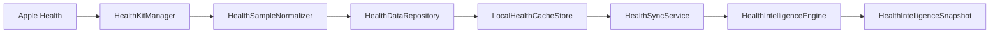

# Health Intelligence — Phase 1–5 Implementation

Production documentation for the completed Health Intelligence foundation in Forma (Fitness Coach).

**Status:** Foundation complete. Internal sync/cache enabled by default. UI wiring deferred behind feature flags.

**Related PR:** [#51](https://github.com/isaacchua0309/FitnessCoach/pull/51)

---

## 1. Architecture overview

Health Intelligence is a layered stack that isolates all HealthKit I/O behind a single manager, normalizes data into stable domain models, caches locally per user, syncs in the background, and composes daily snapshots for future UI consumption.

### Design principles

| Principle | Implementation |
|-----------|----------------|
| Single HealthKit boundary | Only `HealthKitManager` imports HealthKit |
| Normalized domain models | `HealthSampleNormalizer` converts HK results → Forma types |
| No raw HK persistence | Only normalized models are cached (see §9) |
| Partial permissions | Each signal fetched independently |
| Legacy compatibility | `HealthActivityQueryService` can route through repository |
| Feature-flagged rollout | Sync on by default; UI off by default |

### Layer diagram



### ASCII pipeline

```
Apple Health
    ↓
HealthKitManager          ← sole HealthKit I/O
    ↓
HealthSampleNormalizer    ← HK-agnostic domain models
    ↓
HealthDataRepository      ← read-through cache + graceful degradation
    ↓
LocalHealthCacheStore     ← file-backed JSON + in-memory L1
    ↓
HealthSyncService         ← background sync orchestration (actor)
    ↓
HealthIntelligenceEngine  ← snapshot composition (Phase 5 baseline)
    ↓
HealthIntelligenceSnapshot ← UI contract (not wired to screens yet)
```

### Parallel legacy path (existing UI)

Today, Coach, Journey, and Plan still use the **legacy training stack** for steps/workouts:

```
TodayView → HealthActivityQueryService → SystemHealthKitStepReader / WorkoutReader → HealthKitManager
```

When `HealthIntelligenceFeatureFlags.isRepositoryReadRoutingEnabled` is true, `HealthActivityQueryService` optionally routes through `HealthDataRepository` while preserving the same public API.

---

## 2. Data flow

### Read path (UI / queries)

1. Caller invokes `HealthDataRepository` or `HealthActivityQueryService`.
2. Repository checks `LocalHealthCacheStore` for a fresh day bundle or aggregate index.
3. On cache miss or stale entry, `HealthKitManager` fetches from Apple Health.
4. `HealthSampleNormalizer` converts raw fetch results into domain models.
5. Normalized data is stored in cache and returned to caller.

### Sync path (background)

1. **Triggers:** initial connect, app foreground (15 min throttle), calendar day change, manual.
2. `HealthSyncStateStore` (MainActor) delegates to `HealthSyncService` (actor).
3. Sync checks `HealthDataAvailability` and per-signal permission status.
4. **Bulk refresh:** `refreshHealthData(days:)` uses range queries (not per-day loops).
5. Aggregate signals (workouts, sleep, heart, body mass) sync in parallel via `TaskGroup`.
6. Cache pruned to 90-day retention; state published as `HealthSyncState`.

### Snapshot path (intelligence)

1. `HealthIntelligenceEngine.composeSnapshot(for:)` reads from repository.
2. Sub-engines / baseline helpers produce summary sections.
3. Returns non-throwing `HealthIntelligenceSnapshot` for the requested day.

---

## 3. Folder structure

```
Fitness Coach/Health/
├── HealthKit/
│   ├── HealthKitManager.swift           # Sole HK I/O
│   ├── HealthKitManager+Fetching.swift  # Fetch implementations
│   ├── HealthKitReadTypeRegistry.swift  # HK type ↔ signal mapping
│   └── HealthKitSampleMapper.swift      # HK sample → raw records
├── Permissions/
│   ├── HealthPermissionService.swift
│   ├── HealthPermissionCopy.swift
│   └── HealthPermissionLogger.swift
├── Repository/
│   ├── HealthDataRepository.swift
│   ├── HealthDataRepositoryDefaults.swift
│   ├── HealthDataAvailability.swift
│   └── HealthDataRepositoryLogger.swift
├── Sync/
│   ├── HealthSyncService.swift          # actor
│   ├── HealthSyncStateStore.swift       # MainActor bridge
│   ├── HealthSyncState.swift
│   └── HealthSyncError.swift
├── Cache/
│   ├── HealthCacheStore.swift           # protocol + MemoryHealthCacheStore
│   ├── LocalHealthCacheStore.swift      # file-backed production store
│   ├── HealthCachePolicy.swift
│   ├── HealthCacheRecords.swift
│   └── AuthUIDCache.swift
├── Models/
│   ├── DailyHealthMetrics.swift
│   ├── HealthKitRecords.swift
│   ├── HealthSampleNormalizer.swift
│   ├── HealthStableIdentifier.swift
│   ├── HealthSignalKind.swift
│   ├── HealthPermissionStatus.swift
│   └── HealthIntelligenceSnapshot.swift
├── Intelligence/
│   ├── HealthIntelligenceEngine.swift
│   ├── HealthIntelligenceBaseline.swift
│   ├── RecoveryEngine.swift             # implemented (Phase 6+)
│   ├── WorkoutIntelligenceEngine.swift  # implemented (Phase 7+)
│   ├── AdaptiveNutritionEngine.swift    # implemented (Phase 8+)
│   └── HealthNextBestActionEngine.swift # implemented (Phase 9+)
├── Compatibility/
│   └── NormalizedWorkout+HealthWorkoutRecord.swift
└── HealthIntelligenceFeatureFlags.swift

Fitness Coach/Infrastructure/Health/     # Legacy training integration (still active for UI)
├── HealthTrainingService.swift
├── SystemHealthKitStepReader.swift
├── SystemHealthKitWorkoutReader.swift
└── HealthTrainingReaderFactory.swift

Fitness Coach/Application/Queries/
└── HealthActivityQueryService.swift     # Legacy query API + optional repository routing

Fitness CoachTests/
├── HealthDataRepositoryTests.swift
├── HealthDataRepositoryHardeningTests.swift
├── HealthSyncServiceTests.swift
├── HealthIntelligenceEngineTests.swift
├── HealthSampleNormalizerTests.swift
├── LocalHealthCacheStoreTests.swift
└── HealthActivityQueryServiceRepositoryRoutingTests.swift
```

**On-disk cache location:**

```
Application Support/Forma/HealthCache/<userID>/
├── days/           # Per-day JSON bundles (yyyy-MM-dd.json)
├── workouts.json   # Aggregate workout index
├── sleep.json
├── heart.json
├── body-mass.json
├── recovery/       # Placeholder for Phase 6
├── snapshots/      # Placeholder for cached snapshots
└── metadata.json
```

---

## 4. Permission model

### Per-signal access

Permissions are modeled as `HealthPermissionStatus` with a `HealthSignalAccess` value per `HealthSignalKind`:

| Access | Meaning |
|--------|---------|
| `.available` | Probe query succeeded; reads allowed |
| `.denied` | User denied this category |
| `.notDetermined` | Authorization not yet requested |
| `.unavailable` | Signal not supported on device |
| `.unknown` | Probe failed for non-auth reason |

### Aggregated helpers

- `hasTrainingReadAccess` — workouts **or** steps readable (Today-critical).
- `hasAnyAvailableReadAccess` — at least one signal available (sync gate).
- `availableSignals` / `deniedSignals` — explicit sets for diagnostics and future UI.

### Partial authorization is valid

Users may grant steps and workouts but deny sleep or heart metrics. Sync and repository reads treat each signal independently — denied signals return empty data without failing the entire day bundle.

### Permission flow

1. **Onboarding / Settings:** `HealthTrainingService` → `TrainingInsightsStore.connectAppleHealth()`.
2. **Health Intelligence:** `HealthPermissionService` → `HealthKitManager.requestAuthorization()`.
3. **Status probe:** `getAuthorizationStatus()` with 45s TTL cache; concurrent per-signal probes.
4. **Legacy:** `SystemHealthKitTrainingAuthorization` for training integration UX.

### Info.plist

`NSHealthShareUsageDescription` (read-only, no write types):

> Forma reads steps, workouts, active energy, exercise time, sleep, heart rate and variability, and weight from Apple Health to show activity on Today, training insights, recovery guidance, and plan confidence. Forma does not write to Apple Health.

Copy is mirrored in `HealthPermissionCopy.healthShareUsageDescription`.

---

## 5. HealthKit types requested

### Required signals (requested on connect)

| Signal | HealthKit identifier |
|--------|---------------------|
| Steps | `HKQuantityTypeIdentifierStepCount` |
| Active energy | `HKQuantityTypeIdentifierActiveEnergyBurned` |
| Exercise time | `HKQuantityTypeIdentifierAppleExerciseTime` |
| Workouts | `HKWorkoutType` |
| Resting heart rate | `HKQuantityTypeIdentifierRestingHeartRate` |
| HRV (SDNN) | `HKQuantityTypeIdentifierHeartRateVariabilitySDNN` |
| Sleep | `HKCategoryTypeIdentifierSleepAnalysis` |
| Body mass | `HKQuantityTypeIdentifierBodyMass` |

**Write types:** none (`writeTypes = []`).

### Future optional (declared, not requested by default)

| Signal | HealthKit identifier |
|--------|---------------------|
| Walking heart rate avg | `HKQuantityTypeIdentifierWalkingHeartRateAverage` |
| VO₂ max | `HKQuantityTypeIdentifierVO2Max` |
| Distance | `HKQuantityTypeIdentifierDistanceWalkingRunning` |
| Stand time | `HKQuantityTypeIdentifierAppleStandTime` |

Enable via `requestAuthorization(includingFutureTypes: true)` when needed in a future phase.

---

## 6. Cache strategy

### What is cached

- **Day bundles** (`HealthNormalizedDayBundle`): daily metrics + signal records for one calendar day.
- **Aggregate indexes**: workouts, sleep, heart metrics, body mass (for range queries).
- **Placeholders**: recovery summaries, intelligence snapshots (schema ready, minimal population).

### What is NOT cached

- Raw `HKSample`, `HKStatistics`, or `HKWorkout` objects.
- HealthKit authorization tokens or probe query results (permission status uses a short in-memory TTL only).

### Freshness TTLs (`HealthCachePolicy`)

| Data | TTL |
|------|-----|
| Today | 15 minutes |
| Historical days | 24 hours |

### Retention

- **90 days** rolling window (`HealthCachePolicy.retentionDays`).
- Pruned at end of sync and on individual day stores outside batch mode.

### Read-through behavior

1. Check L1 memory → disk day file → fetch from HealthKit.
2. Multi-day aggregate reads require per-day freshness coverage (`dayCoverageIsFresh`).
3. On fetch failure, serve stale cache if available.

### Batch writes

During bulk sync, `beginBatchWrite()` / `endBatchWrite()` defer aggregate index disk persistence until sync completes, reducing write amplification.

### User scoping

Cache paths are keyed by Firebase Auth UID via `AuthUIDCache`. UID changes cancel in-flight sync and re-bootstrap storage.

---

## 7. Sync strategy

### `HealthSyncService` (actor)

| Method | Trigger | Behavior |
|--------|---------|----------|
| `syncInitialHealthData()` | Apple Health connect | Bulk 90-day refresh |
| `syncToday()` | Day change, manual | 1-day refresh |
| `syncLastNDays(_:)` | Manual | Bulk N-day refresh |
| `refreshOnAppForeground()` | App active | 1-day refresh, 15 min throttle |

### Sync phases (`HealthSyncPhase`)

- `idle` → `syncing` → `succeeded` | `partialSuccess` | `failed`

### Per-signal results

Each aggregate signal reports `HealthSyncSignalResult` (success/failure + record count). Partial signal failure yields `partialSuccess` without wiping existing cache.

### Performance (post-hardening)

| Scenario | HK queries (approx.) |
|----------|---------------------|
| 90-day initial sync (before) | ~450 (90 days × 5 signals) |
| 90-day initial sync (after) | ~5 (1 metrics range + 4 aggregate range) |

### Wiring (`AppContainer`)

- Shared `HealthKitManager` for repository and legacy readers.
- `HealthSyncStateStore` published to environment (no UI consumer yet).
- Gated by `HealthIntelligenceFeatureFlags.isSyncEnabled`.

---

## 8. Snapshot composition

### `HealthIntelligenceSnapshot` structure

```swift
struct HealthIntelligenceSnapshot {
    let date: Date
    let recovery: RecoverySummary
    let workout: WorkoutSummary?
    let activity: ActivitySummary
    let nutritionAdjustment: AdaptiveNutritionSummary
    let weeklyReview: WeeklyHealthReview?
    let planConfidence: PlanHealthConfidence
    let nextBestAction: NextBestAction
}
```

### Composition flow (`HealthIntelligenceEngine.composeSnapshot`)

1. Load `HealthDataAvailability` and `DailyHealthMetrics` for the day.
2. Load recent week workouts and metrics from repository.
3. **Baseline helpers** (`HealthIntelligenceBaseline`) produce deterministic Phase 5 summaries:
   - Activity, workout, recovery, weekly review, plan confidence, next best action.
4. `AdaptiveNutritionEngine` called (stub returns baseline adjustment).
5. Assemble and return snapshot (non-throwing).

### Why UI should consume snapshots later

- **Stable contract** — screens depend on one composed model, not repository aggregates.
- **Testability** — snapshots are deterministic and mockable.
- **Decoupling** — sync/cache changes do not ripple to SwiftUI.
- **Feature flags** — `isUIEnabled` gates snapshot-driven UI independently of sync.

---

## 9. Error and fallback behavior

### Graceful degradation matrix

| Condition | Behavior |
|-----------|----------|
| HealthKit unavailable (simulator stub, iPad without HK) | Empty metrics/arrays; no crash |
| Permission denied (per signal) | That signal returns empty; others proceed |
| Permission not determined | Training integration shows connect UX; sync skipped |
| Fetch query failed | Log warning; stale cache fallback if available |
| Corrupted cache JSON | Returns `nil`; re-fetch on next read |
| Sync already in progress | Second sync skipped (actor guard) |
| UID change mid-sync | `cancelActiveSync()`; cache re-bootstrapped |
| Master flag off (`FORMA_HEALTH_INTELLIGENCE_ENABLED=0`) | Sync no-ops; legacy readers used |

### Logging

- `HealthDataRepositoryLogger`, `HealthSyncLogger`, `HealthPermissionLogger`
- Production `os.Logger` includes structured key=value metadata via `HealthOSLogFormatting`.
- No sensitive health values logged.

### Why raw HealthKit samples are not stored

1. **PHI surface area** — raw samples may contain identifiers and fine-grained timestamps.
2. **Bounded cache size** — normalized daily aggregates are orders of magnitude smaller.
3. **Schema stability** — domain models decouple from HealthKit API revisions.
4. **Deduplication** — stable IDs and normalizer logic operate on domain types, not HK UUIDs.

---

## 10. Testing strategy

### Unit tests (mock-based, no HK permissions required)

| Test file | Coverage |
|-----------|----------|
| `HealthDataRepositoryTests` | Cache hits, range queries, graceful empty |
| `HealthDataRepositoryHardeningTests` | Bulk refresh, partial auth, unavailable HK |
| `HealthSyncServiceTests` | Phases, partial success, throttling, concurrency |
| `HealthSampleNormalizerTests` | Normalization, dedup, stable IDs |
| `LocalHealthCacheStoreTests` | Disk persistence, dedup, corruption, prune |
| `HealthIntelligenceEngineTests` | Snapshot composition determinism |
| `HealthIntelligenceBaselineTests` | Baseline helper logic |
| `HealthActivityQueryServiceRepositoryRoutingTests` | Legacy ↔ repository adapter |
| `HealthPermissionRegistryTests` | Signal ↔ HK type mapping |
| `OnboardingAppleHealthTests` | Plist copy alignment |

### Test patterns

- Inject `MemoryHealthCacheStore` for fast isolated tests.
- `MockHealthKitManager` / `MockSyncRepository` implement protocols without HealthKit.
- Fixed `Calendar` with `GMT` timezone for deterministic day boundaries.

### Manual QA checklist

- [ ] Simulator launch (no crash without HealthKit data)
- [ ] Denied HealthKit permission — Today, Journey, Plan, Coach still render
- [ ] Partial permission (steps only) — Today steps appear; workouts empty
- [ ] Connect Apple Health — initial sync completes without UI freeze
- [ ] Travel/timezone change — day boundaries remain consistent
- [ ] Sign out / sign in — cache isolated per UID

---

## 11. Known limitations

| Limitation | Notes |
|------------|-------|
| UI not wired | `HealthIntelligenceSnapshot` not consumed by Today/Coach/Journey/Plan |
| Phase 5 baseline only | Sub-engines return deterministic placeholders, not ML/rules |
| Legacy UI path active | Steps/workouts still flow through `HealthActivityQueryService` |
| No HK write support | Read-only integration by design |
| Simulator uses real HK | No dedicated simulator mock; empty data + slow probes possible |
| Permission probe cost | Mitigated by 45s cache; still 8 probe queries on cold start |
| Recovery/snapshot cache placeholders | Schema exists; population deferred to Phase 6+ |
| Cloud agent CI | Full `xcodebuild` not available in Linux CI; macOS build required |
| Future optional signals | Declared but not requested unless `includingFutureTypes: true` |

---

## 12. Next phases

### Phase 6 — Recovery Engine

- Implement `RecoveryEngine` with sleep + HRV + resting HR signals.
- Populate `RecoverySummary` and cache via `storeRecoverySummary`.
- Wire recovery hints into Coach context (behind `isUIEnabled`).

### Phase 7 — Workout Intelligence

- Implement `WorkoutIntelligenceEngine` with training load trends.
- Enhance `WorkoutSummary` with category intelligence and load scoring.
- Integrate with Journey training chapters.

### Phase 8 — Adaptive Nutrition

- Implement `AdaptiveNutritionEngine` using activity + workout + plan targets.
- Surface `AdaptiveNutritionSummary` adjustments in Plan and Coach.

### Phase 9 — Next Best Action

- Implement `HealthNextBestActionEngine` with cross-signal reasoning.
- Replace heuristic `NextBestActionEngine` paths in Today where appropriate.

### UI wiring (Today, Coach, Journey, Plan)

Rollout order (all behind `FORMA_HEALTH_INTELLIGENCE_UI_ENABLED`):

| Screen | Integration |
|--------|-------------|
| **Today** | Replace direct `HealthActivityQueryService` reads with `HealthIntelligenceSnapshot.activity` / `.workout` |
| **Coach** | Inject snapshot into `CoachAIContextBuilder` for recovery and training context |
| **Journey** | Use snapshot `weeklyReview` and workout intelligence for chapters |
| **Plan** | Use `planConfidence` and `nutritionAdjustment` for target coaching |

### Feature flags reference

| Flag | Env var | Default |
|------|---------|---------|
| Master | `FORMA_HEALTH_INTELLIGENCE_ENABLED` | `true` |
| UI | `FORMA_HEALTH_INTELLIGENCE_UI_ENABLED` | `false` |
| Sync | `FORMA_HEALTH_INTELLIGENCE_SYNC_ENABLED` | `true` |
| Repository reads | `FORMA_HEALTH_INTELLIGENCE_REPOSITORY_READS_ENABLED` | `true` |

---

## Appendix: App wiring reference

```swift
// AppContainer.swift (simplified)
let sharedHealthKitManager = HealthKitManager()
healthCacheStore = LocalHealthCacheStore(userProvider: authUIDCache)
healthDataRepository = HealthDataRepository(
    healthKitManager: sharedHealthKitManager,
    cacheStore: healthCacheStore
)
healthSyncService = HealthSyncService(
    repository: healthDataRepository,
    cacheStore: healthCacheStore
)
healthSyncStateStore = HealthSyncStateStore(
    syncService: healthSyncService,
    syncEnabled: HealthIntelligenceFeatureFlags.isSyncEnabled
)
healthActivityQueryService = HealthActivityQueryService(
    workoutReader: workoutReader,
    stepReader: stepReader,
    healthDataRepository: healthDataRepository
)
```

**Sync triggers:**

- `TrainingInsightsStore.connectAppleHealth()` → `syncInitialHealthData()`
- `MainTabView` foreground → `refreshOnAppForeground()`
- `AppRefreshCenter` day change → `refreshOnDayChange()`
- `OnboardingAppleHealthCoordinator` connect → `syncInitialHealthData()`

---

*Last updated: July 2026 — Phase 1–5 foundation complete.*
