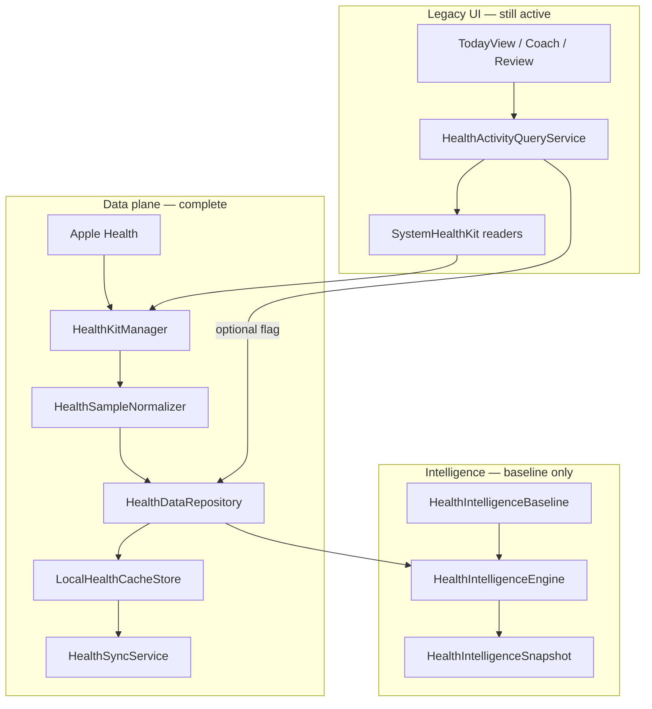

# Health Intelligence — Phase 6–10 Engine Audit

Pre-implementation audit of the Phase 1–5 foundation before building Health Intelligence Phases 6–10.

**Status:** Audit only — no Phase 6–10 code implemented.  
**Related:** [PHASE_1_5_IMPLEMENTATION.md](./PHASE_1_5_IMPLEMENTATION.md) · [PHASE_1_5_VERIFICATION.md](./PHASE_1_5_VERIFICATION.md) · PR [#51](https://github.com/isaacchua0309/FitnessCoach/pull/51)

---

## Executive summary

Phase 1–5 delivered a production-ready **data plane** (HealthKit I/O → normalization → repository → cache → sync) and a **snapshot contract** (`HealthIntelligenceSnapshot`). Phase 5 composition is intentionally **baseline-only**: `HealthIntelligenceBaseline` produces deterministic summaries from repository aggregates; seven sub-engines are **injected but not invoked** (except `AdaptiveNutritionEngine`, which is called but returns `.none`).

**Critical gaps before Phase 6–10:**

| Gap | Impact |
|-----|--------|
| Sub-engines are stubs with TODOs; orchestrator bypasses most of them | Phase 6–10 must refactor `HealthIntelligenceEngine.composeSnapshot` |
| `HealthIntelligenceEngine` not wired in `AppContainer` | No app-level snapshot access; sync does not compose or cache snapshots |
| Recovery/snapshot cache APIs exist but are never populated | Disk schema ready; engines must write on compose |
| `WeeklyStats` type does not exist | Must be designed or mapped to `WeeklyHealthReview` / `TrainingInsightsWeeklySummary` |
| Dual NBA systems (`NextBestActionEngine` vs `HealthNextBestActionEngine`) | Phase 9 must define merge/replace strategy for Today |
| Dual workout types (`HealthWorkoutRecord` vs `NormalizedWorkout`) | Compatibility adapter exists; UI migration needs care |
| Legacy UI still reads via `HealthActivityQueryService` | Snapshot UI wiring is a separate rollout behind `isUIEnabled` |

---

## 1. Current Phase 1–5 architecture

### Layer diagram



### What works today

- **Single HealthKit boundary:** `HealthKitManager` (+ extensions/mappers) is the only production Health module importer of HealthKit.
- **Normalized persistence:** `LocalHealthCacheStore` persists day bundles and aggregate indexes (workouts, sleep, heart, body mass). No raw `HKSample` storage.
- **Partial permissions:** Repository fetches signals independently; availability gates snapshot fields.
- **Background sync:** `HealthSyncService` (actor) + `HealthSyncStateStore` (MainActor bridge) refresh up to 90 days on connect, foreground, and day change.
- **Legacy compatibility:** `HealthActivityQueryService` optionally routes through `HealthDataRepository` when `isRepositoryReadRoutingEnabled` is true.
- **Snapshot contract:** `HealthIntelligenceSnapshot` is `Equatable`, `Sendable`, `Codable` with preview factories and 10 unit tests on baseline composition.

### What is intentionally deferred

- Real engine logic (recovery scoring, load windows, nutrition rules, narrative review, cross-signal NBA).
- `AppContainer` registration of `HealthIntelligenceEngine`.
- Post-sync snapshot composition and cache population.
- Any Feature UI consumption of snapshots (`isUIEnabled` defaults to `false`).

---

## 2. Audit findings (requested items)

### 2.1 `HealthIntelligenceSnapshot` model and composition

| Item | Location | Notes |
|------|----------|-------|
| Model | `Fitness Coach/Health/Models/HealthIntelligenceSnapshot.swift` | Eight fields: `date`, `recovery`, `workout?`, `activity`, `nutritionAdjustment`, `weeklyReview?`, `planConfidence`, `nextBestAction` |
| Preview helpers | `Fitness Coach/Health/Models/HealthIntelligenceSnapshot+Preview.swift` | `placeholder`, `previewUnavailable`, `previewConnected`, `previewLimitedData` |
| **Composition** | `Fitness Coach/Health/Intelligence/HealthIntelligenceEngine.swift` → `composeSnapshot(for:calendar:)` | Sole production composer |
| Baseline helpers | `Fitness Coach/Health/Intelligence/HealthIntelligenceBaseline.swift` | Deterministic Phase 5 logic for activity, workout, recovery labels, weekly review gate, plan confidence tiers, permission-aware NBA |
| Tests | `Fitness CoachTests/HealthIntelligenceEngineTests.swift`, `HealthIntelligenceBaselineTests.swift` | Cover permission masking, workout selection, 7-day gates, determinism |
| UI consumers | **None** | No Feature file imports or displays snapshots |

**Composition flow (today):**

1. `repository.getHealthDataAvailability()`
2. `repository.getDailyMetrics(for:)` → `HealthIntelligenceBaseline.activitySummary`
3. `repository.getRecentWorkouts(days: 7)` → `HealthIntelligenceBaseline.workoutSummary`
4. `HealthIntelligenceBaseline.recoverySummary(availability:)` — label only, no score
5. `adaptiveNutritionEngine.nutritionAdjustment(..., trainingLoad: .empty)` — returns `.none`
6. Week metrics → `HealthIntelligenceBaseline.weeklyReview` / `planConfidence`
7. `HealthIntelligenceBaseline.nextBestAction` — permission/heuristic only

---

### 2.2 `HealthIntelligenceEngine` implementation

| Item | Detail |
|------|--------|
| Protocol | `HealthIntelligenceEngineing` — `composeSnapshot`, `generateSnapshot` (throws but currently delegates to non-throwing compose) |
| Dependencies | `HealthDataRepositorying` + 7 sub-engine protocols |
| **Critical:** Injected engines **not called** | `recoveryEngine`, `workoutEngine`, `trainingLoadEngine`, `weeklyReviewEngine`, `planConfidenceEngine`, `nextBestActionEngine` are stored but unused |
| Only engine call | `adaptiveNutritionEngine.nutritionAdjustment` with hard-coded `trainingLoad: .empty` |
| Sample bridge unused | Engines accept `[HealthNormalizedSample]`; orchestrator never calls `repository.normalizedSamples(for:)` |

---

### 2.3 Domain models

| Model | File | Status |
|-------|------|--------|
| `RecoverySummary` | `HealthIntelligenceSummaryModels.swift` | `score: Double?`, `readinessLabel: String`; `.placeholder` |
| `WorkoutSummary` | same | Today-focused primary workout fields + `FormaWorkoutCategory`; `.empty` |
| `ActivitySummary` | same | `steps?`, `activeEnergyKcal?`, `exerciseMinutes?`; permission-masked in baseline |
| `AdaptiveNutritionSummary` | same | `calorieAdjustment`, `rationale`; `.none` |
| `WeeklyHealthReview` | same | `headline`, `workoutDays`, `narrative?`; baseline headline is static |
| `PlanHealthConfidence` | same | `score`, `label`; baseline uses 0 / 0.2 / 0.45 / 0.75 tiers |
| `NextBestAction` | typealias → `HealthIntelligenceNextBestAction` | Distinct from Today `NextBestActionState` |
| `DailyHealthMetrics` | `DailyHealthMetrics.swift` | `date`, `steps`, `activeEnergyKcal`, `exerciseMinutes` (non-optional aggregates) |
| `WorkoutRecord` | `HealthCacheRecords.swift` | typealias → `NormalizedWorkout` |
| `SleepRecord` | same | typealias → `NormalizedSleepRecord` |
| `HeartMetricRecord` | same | typealias → `NormalizedHeartMetric` |
| **`WeeklyStats`** | **Does not exist** | Closest analogues: `TrainingInsightsWeeklySummary` (legacy training UI), fields inside `WeeklyHealthReview` |

**Supporting record types:**

- `NormalizedWorkout` — `id`, `category`, `activityLabel`, dates, `durationMinutes`, `activeEnergyKcal`, `sourceName?`
- `NormalizedSleepRecord` — `asleepMinutes`, `inBedMinutes?`
- `NormalizedHeartMetric` — `kind` (`restingHeartRate` \| `heartRateVariabilitySDNN`), `value`, `unitSymbol`
- `TrainingLoadSummary` — in `TrainingLoadEngine.swift`; `acuteLoad`, `chronicLoad`, `strainRatio?`; `.empty`
- `HealthNormalizedSample` — generic sample envelope for engine inputs; not yet fed by orchestrator

**Legacy parallel type:** `HealthWorkoutRecord` (`Domain/Training/HealthWorkoutRecord.swift`) — used by Today, Journey, Training Insights; mapped from `NormalizedWorkout` via `NormalizedWorkout+HealthWorkoutRecord.swift`.

---

### 2.4 Existing engines

All live under `Fitness Coach/Health/Intelligence/`.

| Engine | Protocol | Input | Output | Implementation |
|--------|----------|-------|--------|----------------|
| `RecoveryEngine` | `RecoveryEngineing` | `date`, `[HealthNormalizedSample]` | `RecoverySummary` | TODO stub → `.placeholder` |
| `WorkoutIntelligenceEngine` | `WorkoutIntelligenceEngineing` | `date`, samples, `calendar` | `WorkoutSummary?` | TODO stub → `nil` |
| `TrainingLoadEngine` | `TrainingLoadEngineing` | `date`, samples, `calendar` | `TrainingLoadSummary` | TODO stub → `.empty` |
| `AdaptiveNutritionEngine` | `AdaptiveNutritionEngineing` | `date`, activity, workout?, trainingLoad | `AdaptiveNutritionSummary` | TODO stub → `.none` (called from orchestrator) |
| `WeeklyReviewEngine` | `WeeklyReviewEngineing` | `endingOn`, samples, `calendar` | `WeeklyHealthReview?` | TODO stub → `nil` |
| `PlanConfidenceEngine` | `PlanConfidenceEngineing` | `date`, recovery, activity, trainingLoad | `PlanHealthConfidence` | TODO stub → `.unknown` |
| `HealthNextBestActionEngine` | `HealthNextBestActionEngineing` | `date`, full `HealthIntelligenceSnapshot` | `NextBestAction` | TODO stub → `.none` |

**Baseline substitute:** `HealthIntelligenceBaseline` currently implements simplified versions of recovery, workout, weekly review, plan confidence, and NBA without the sub-engines.

---

### 2.5 Local cache and repository APIs

#### `HealthDataRepositorying` (`HealthDataRepository.swift`)

| API | Purpose |
|-----|---------|
| `normalizedSamples(for:calendar:)` | Legacy bridge; builds samples from day bundle (engines expect this shape) |
| `getDailyMetrics(for:)` / `getDailyMetrics(from:to:)` | Activity aggregates |
| `getRecentWorkouts(days:)` / `getWorkouts(from:to:)` | Workout index |
| `getRecentSleep(days:)` | Sleep records |
| `getRecentHeartMetrics(days:)` | Resting HR + HRV |
| `getBodyMassHistory(days:)` | Body mass trend |
| `getHealthDataAvailability()` | Permission + cache metadata |
| `refreshHealthData(days:endingOn:)` | Bulk or single-day cache refresh |

**Defaults** (`HealthDataRepositoryDefaults.swift`): workouts 14d, sleep 14d, heart 30d, body mass 90d, refresh 7d. Sync uses `HealthCachePolicy.retentionDays` (90) for initial sync.

#### `HealthCacheStore` (`HealthCacheStore.swift` + `LocalHealthCacheStore.swift`)

| API | Populated today? |
|-----|------------------|
| Day bundles (`entry`, `store`) | Yes — via sync |
| Typed aggregates (`workouts`, `sleepRecords`, `heartMetrics`, `bodyMassRecords`) | Yes |
| `upsert*` batch paths | Yes — bulk sync |
| `recoverySummary` / `storeRecoverySummary` | **No** — schema + disk paths exist (`recovery/`) |
| `intelligenceSnapshot` / `storeIntelligenceSnapshot` | **No** — schema + disk paths exist (`snapshots/`) |
| Freshness, prune, invalidate, batch write | Yes |

**On-disk layout:** `Application Support/Forma/HealthCache/<userID>/` with `days/`, aggregate JSON indexes, `recovery/`, `snapshots/`, `metadata.json`.

---

### 2.6 UI files importing HealthKit directly

**No `import HealthKit` under `Fitness Coach/Features/`.**

HealthKit imports are isolated to:

| Path | Role |
|------|------|
| `Fitness Coach/Health/HealthKit/*` | Production HK boundary |
| `Fitness Coach/Infrastructure/Health/HealthKitWorkoutReading.swift` | Legacy reader protocol + HK types |
| `Fitness Coach/Infrastructure/Health/HealthTrainingDebugLogger.swift` | Debug-only HK import (conditional) |
| `Fitness CoachTests/*` | Test doubles |

Feature screens reach Health data through `HealthActivityQueryService`, injected readers, or domain types — not direct HealthKit.

---

### 2.7 Today step/workout dependency on `HealthActivityQueryService`

**Yes — legacy path remains primary for UI.**

| Consumer | Usage |
|----------|-------|
| `Features/Today/TodayView.swift` | Injected `healthActivityQuery` |
| `Features/Today/Model/TodayModel.swift` | Steps/workout counts via query service |
| `Features/Coach/Model/CoachModel.swift` | Activity context for coach |
| `Data/Repositories/ReviewService.swift` | Review aggregation |
| `Application/UseCases/Coach/CoachMutationExecutor.swift` | Coach mutations |
| `Application/StateBuilders/Coach/CoachAIContextBuilder.swift` | Optional injection |

When `HealthIntelligenceFeatureFlags.isRepositoryReadRoutingEnabled` is true (default), reads can flow `HealthActivityQueryService` → `HealthDataRepository` → cache/HK, preserving the same `HealthWorkoutRecord` / step APIs.

**Today NBA** uses `Features/Today/Model/NextBestActionEngine` (food/water/workout heuristics) — **not** `HealthNextBestActionEngine`.

---

### 2.8 `AppContainer` wiring

**Wired (Health Intelligence data plane):**

```swift
// AppContainer.swift (simplified)
sharedHealthKitManager → HealthDataRepository → LocalHealthCacheStore
healthActivityQueryService(workoutReader, stepReader, healthDataRepository)
healthSyncService(repository, cacheStore)
healthSyncStateStore(syncService, syncEnabled: isSyncEnabled)
```

**Not wired:**

- `HealthIntelligenceEngine` (no property, no factory, no lifecycle)
- Post-sync snapshot composition
- Snapshot or recovery cache writes

Sync triggers (via `healthSyncStateStore`): Training Insights connect, `MainTabView` foreground, day change, onboarding Apple Health connect.

---

### 2.9 Compile warnings, duplicated types, TODOs, fragile architecture

#### TODOs (all in `Health/Intelligence/`)

Every sub-engine body contains a `// TODO:` and returns a placeholder. Seven TODOs total.

#### Duplicated / parallel concepts

| Concept | Health Intelligence | Legacy / Today |
|---------|---------------------|----------------|
| Next best action | `HealthIntelligenceNextBestAction` / `HealthNextBestActionEngine` | `NextBestActionState` / `NextBestActionEngine` |
| Workout record | `NormalizedWorkout` / `WorkoutRecord` | `HealthWorkoutRecord` |
| Weekly summary | `WeeklyHealthReview` | `TrainingInsightsWeeklySummary` |
| Weekly stats type | **Missing `WeeklyStats`** | — |

#### Architectural fragility

1. **Orchestrator bypass:** Sub-engines are DI-ready but dead code paths; Phase 6–10 must replace baseline calls incrementally without breaking tests.
2. **Dual sample models:** Engines take `[HealthNormalizedSample]`; repository exposes rich typed records. Orchestrator must assemble samples or engines should accept typed inputs.
3. **`generateSnapshot` throws but never fails:** Misleading API for future error propagation.
4. **`permissionService` in `HealthSyncService` injected but sync gates on `repository.getHealthDataAvailability()`** — redundant dependency.
5. **`@unchecked Sendable`:** `HealthKitManager`, `LocalHealthCacheStore`, `MemoryHealthCacheStore`, `AuthUIDCache` — manual lock discipline required.
6. **Training load not in snapshot:** `TrainingLoadSummary` exists but is not a snapshot field; passed only internally (currently hard-coded `.empty`).
7. **Weekly review date range:** `recentWeekWorkouts` uses `getRecentWorkouts(days: 7)` without anchoring `endingOn` — may include future workouts relative to composed day in edge cases.
8. **No macOS CI build:** Linux agents cannot run `xcodebuild`; regressions require local/Xcode Cloud verification.

#### Compile warnings

Not verifiable in Linux cloud environment. Prior Phase 1–5 pass reported clean build on macOS; re-verify before merging Phase 6+.

---

## 3. Phase 6–10 mapping (proposed)

`PHASE_1_5_IMPLEMENTATION.md` documents Phases 6–9 explicitly. This audit adds **Phase 10** as orchestration, caching, and app wiring — the glue required to make engines production-usable.

| Phase | Scope | Primary files |
|-------|-------|---------------|
| **6 — Recovery** | Sleep + resting HR + HRV → `RecoverySummary.score`; cache via `storeRecoverySummary` | `RecoveryEngine.swift`, `HealthIntelligenceEngine.swift`, `LocalHealthCacheStore.swift` |
| **7 — Workout + load** | `WorkoutIntelligenceEngine`, `TrainingLoadEngine`; acute/chronic windows; optional `TrainingLoadSummary` on snapshot or internal pipe | `WorkoutIntelligenceEngine.swift`, `TrainingLoadEngine.swift` |
| **8 — Adaptive nutrition** | Activity + workout + load → calorie adjustment; Plan/Coach inputs | `AdaptiveNutritionEngine.swift` |
| **9 — Review + NBA** | `WeeklyReviewEngine` narrative; `HealthNextBestActionEngine` cross-signal ranking; define `WeeklyStats` or extend `WeeklyHealthReview` | `WeeklyReviewEngine.swift`, `HealthNextBestActionEngine.swift` |
| **10 — Confidence + orchestration** | `PlanConfidenceEngine`; refactor `composeSnapshot` to call all engines; `AppContainer` wiring; post-sync snapshot cache; read-through cache in engine | `PlanConfidenceEngine.swift`, `HealthIntelligenceEngine.swift`, `HealthSyncService.swift`, `AppContainer.swift` |

**UI wiring** (Today, Coach, Journey, Plan) remains behind `FORMA_HEALTH_INTELLIGENCE_UI_ENABLED` and should follow Phase 10 orchestration, not precede it.

---

## 4. Engine implementation plan

### 4.1 Shared prerequisites (before any engine)

1. **Sample assembly helper** in `HealthIntelligenceEngine` (or repository extension):
   - Build `[HealthNormalizedSample]` from `DailyHealthMetrics`, workouts, sleep, heart for a date range.
   - Reuse `HealthDataRepository.normalizedSamples(for:)` or add `samples(from:to:calendar:)` for multi-day windows.
2. **Define `WeeklyStats`** (if still desired):
   - Option A: New struct in `HealthIntelligenceSummaryModels.swift` (steps/workout/energy aggregates per week).
   - Option B: Extend `WeeklyHealthReview` with nested stats; avoid duplicating `TrainingInsightsWeeklySummary`.
3. **Snapshot evolution decision:**
   - Add `trainingLoad: TrainingLoadSummary?` to `HealthIntelligenceSnapshot`? (Codable migration + cache schema bump.)
   - Or keep load internal to nutrition/confidence engines only.

### 4.2 Phase 6 — RecoveryEngine

**Inputs:** `getRecentSleep`, `getRecentHeartMetrics`, week workouts (for training stress).  
**Output:** `RecoverySummary` with 0–100 `score` and human `readinessLabel`.  
**Rules (suggested):** Weighted blend of last-night sleep duration vs baseline, resting HR delta, HRV delta; degrade gracefully per permission.  
**Cache:** `storeRecoverySummary` after compose.  
**Tests:** Fixture sleep/HR series; denied permissions; insufficient nights.

### 4.3 Phase 7 — WorkoutIntelligenceEngine + TrainingLoadEngine

**Workout engine:** Enhance `WorkoutSummary` beyond baseline primary selection — intensity proxy, category mix, streak signals.  
**Load engine:** Rolling 7d acute / 28d chronic load from duration × energy (or TRIMP proxy); `strainRatio = acute/chronic`.  
**Orchestrator:** Compute load once; pass to nutrition (Phase 8) and plan confidence (Phase 10).  
**Tests:** Single/multi workout days; empty history; category mapping.

### 4.4 Phase 8 — AdaptiveNutritionEngine

**Inputs:** `ActivitySummary`, `WorkoutSummary?`, `TrainingLoadSummary`, optional plan calorie target (future: Plan domain).  
**Output:** Signed `calorieAdjustment` + `rationale` string.  
**Integration point:** `CoachAIContextBuilder`, Plan target coaching (UI flag).  
**Tests:** Rest day vs hard training day; zero load; missing workout.

### 4.5 Phase 9 — WeeklyReviewEngine + HealthNextBestActionEngine

**Weekly review:** Replace static baseline headline; produce `narrative` from 7-day trends (steps, energy, workout days).  
**NBA:** Rank actions (recover, train, connect Health, log food) from composed snapshot; priority integer for ordering.  
**Today coexistence:** Document which surfaces use which NBA; avoid replacing `NextBestActionEngine` until `isUIEnabled` coordinates both.  
**Tests:** Ranking stability; permission-aware fallbacks.

### 4.6 Phase 10 — PlanConfidenceEngine + orchestration

**Plan confidence:** Replace baseline tier table with engine using recovery, activity completeness, load trend, logging consistency (if available).  
**Orchestrator refactor:**

```text
availability, metrics, workouts, sleep, heart
    → samples[]
    → trainingLoad = trainingLoadEngine.trainingLoad(...)
    → recovery = recoveryEngine.recoverySummary(...)
    → workout = workoutEngine.workoutSummary(...) ?? baseline.workoutSummary(...)
    → activity = baseline.activitySummary(...)  // keep permission masking
    → nutrition = adaptiveNutritionEngine.nutritionAdjustment(...)
    → weeklyReview = weeklyReviewEngine.weeklyReview(...) ?? baseline.weeklyReview(...)
    → planConfidence = planConfidenceEngine.planConfidence(...)
    → partialSnapshot (without NBA)
    → nextBestAction = nextBestActionEngine.nextBestAction(snapshot:)
    → storeRecoverySummary + storeIntelligenceSnapshot
```

**AppContainer:** `let healthIntelligenceEngine: HealthIntelligenceEngine` sharing `healthDataRepository`.  
**Sync hook (optional):** After successful `refreshHealthData`, compose today’s snapshot on background priority.

---

## 5. Data dependencies

| Engine | Repository APIs | Cache | External domain |
|--------|-----------------|-------|-----------------|
| Recovery | `getRecentSleep`, `getRecentHeartMetrics`, `getRecentWorkouts` | Read day bundles | — |
| Workout | `getWorkouts(from:to:)`, `getDailyMetrics` | Workout index | `FormaWorkoutCategory` mapping |
| Training load | `getRecentWorkouts`, `getDailyMetrics(from:to:)` | 7–28d windows | — |
| Nutrition | Activity/workout/load from orchestrator | — | Plan calorie targets (not yet injected) |
| Weekly review | `getDailyMetrics(from:to:)`, workouts | 7d coverage | — |
| Plan confidence | Availability, recovery, activity, load | `cachedDayCount` | Food logging consistency (Today/Plan — not in Health module) |
| NBA | Full snapshot | — | — |

**Permission matrix:** Each summary field must remain `nil` or label-degraded when `HealthPermissionStatus` denies the signal — preserve Phase 5 test guarantees.

---

## 6. Files likely needing changes

### Core (all phases)

| File | Change |
|------|--------|
| `Health/Intelligence/HealthIntelligenceEngine.swift` | Invoke engines; sample assembly; cache writes |
| `Health/Intelligence/HealthIntelligenceBaseline.swift` | Retain as fallback/degraded mode |
| `Health/Models/HealthIntelligenceSummaryModels.swift` | Possible `WeeklyStats`; snapshot field additions |
| `Health/Models/HealthIntelligenceSnapshot.swift` | Optional `trainingLoad` field |
| `App/AppContainer.swift` | Wire engine; expose to models if needed |

### Per-phase

| Phase | Files |
|-------|-------|
| 6 | `RecoveryEngine.swift`, `LocalHealthCacheStore.swift`, new `RecoveryEngineTests.swift` |
| 7 | `WorkoutIntelligenceEngine.swift`, `TrainingLoadEngine.swift`, tests |
| 8 | `AdaptiveNutritionEngine.swift`, `CoachAIContextBuilder.swift` (later, UI flag) |
| 9 | `WeeklyReviewEngine.swift`, `HealthNextBestActionEngine.swift`, tests |
| 10 | `PlanConfidenceEngine.swift`, `HealthSyncService.swift`, `HealthSyncStateStore.swift` |

### UI (post-Phase 10, behind `isUIEnabled`)

| File | Change |
|------|--------|
| `Features/Today/TodayView.swift`, `TodayModel.swift` | Snapshot-driven activity/workout |
| `Features/Coach/Model/CoachModel.swift` | Snapshot in context |
| `Application/StateBuilders/Coach/CoachAIContextBuilder.swift` | Recovery + load fields |
| `Features/Journey/Model/JourneyModel.swift` | Weekly review / workout intelligence |
| Plan surfaces | `planConfidence`, `nutritionAdjustment` |

### Tests to extend

- `HealthIntelligenceEngineTests.swift` — mock sub-engines; cache persistence
- New per-engine test files
- `HealthSyncServiceTests.swift` — optional post-sync compose
- `LocalHealthCacheStoreTests.swift` — recovery/snapshot round-trip

---

## 7. Risks before implementation

| Risk | Severity | Mitigation |
|------|----------|------------|
| Breaking Phase 5 baseline tests when switching to engines | High | Feature-flag per engine; keep baseline fallback path until parity tests pass |
| `WeeklyStats` naming collision with removed SwiftData `WeeklyReview` | Medium | Use `HealthWeeklyStats` or nest inside `WeeklyHealthReview` |
| Today NBA regression if `HealthNextBestActionEngine` replaces `NextBestActionEngine` prematurely | High | Keep systems separate; UI flag coordinates surfacing |
| Snapshot schema change invalidates cached `snapshots/` JSON | Medium | Bump `HealthCachePolicy.schemaVersion`; migration or clear |
| Engine inputs (`HealthNormalizedSample`) too coarse for sleep/HRV | Medium | Prefer typed records in engine APIs or enrich sample kinds |
| Plan confidence without food-log signals | Medium | Phase 10 confidence uses health-only subset; document limitation |
| Orchestrator latency (7 engine calls + repository reads) | Medium | Compose on sync/background; cache snapshot; read cache first |
| `getRecentWorkouts(days:)` not anchored to composed date | Low | Add `endingOn` parameter to repository API |
| Dual workout types during UI migration | Medium | Keep `NormalizedWorkout+HealthWorkoutRecord` adapter |
| No Linux CI `xcodebuild` | High | Require macOS build/test before merge |

---

## 8. Existing file inventory (Phase 1–5)

### Health module (`Fitness Coach/Health/`) — 44 Swift files

| Area | Files |
|------|-------|
| HealthKit | `HealthKitManager.swift`, `+Fetching`, `ReadTypeRegistry`, `SampleMapper` |
| Permissions | `HealthPermissionService`, `Copy`, `Logger` |
| Repository | `HealthDataRepository`, `Defaults`, `Availability`, `Logger`, `HealthOSLogFormatting` |
| Sync | `HealthSyncService`, `HealthSyncStateStore`, `State`, `Error`, `Logger` |
| Cache | `HealthCacheStore`, `LocalHealthCacheStore`, `Policy`, `Records`, `AuthUIDCache` |
| Models | `DailyHealthMetrics`, `HealthKitRecords`, `Normalizer`, `StableIdentifier`, `SignalKind`, `PermissionStatus`, `NormalizedSample`, `IntelligenceSnapshot`, `SummaryModels`, `+Preview` |
| Intelligence | `HealthIntelligenceEngine`, `Baseline`, 7 engines |
| Compatibility | `NormalizedWorkout+HealthWorkoutRecord` |
| Flags | `HealthIntelligenceFeatureFlags` |

### Tests — 13 Health-related test files

`HealthIntelligenceEngineTests`, `HealthIntelligenceBaselineTests`, `HealthDataRepositoryTests`, `HealthDataRepositoryHardeningTests`, `HealthSyncServiceTests`, `HealthSampleNormalizerTests`, `LocalHealthCacheStoreTests`, `HealthActivityQueryServiceRepositoryRoutingTests`, plus onboarding/permission/training tests.

---

## 9. Recommended implementation order

1. **Phase 10a (orchestration skeleton):** Sample assembly + engine invocation with stubs returning baseline-equivalent values → proves wiring without logic risk.
2. **Phase 6:** Recovery — highest user value; uses already-synced sleep/heart cache.
3. **Phase 7:** Training load — unblocks nutrition and confidence.
4. **Phase 8:** Nutrition adjustments.
5. **Phase 9:** Weekly review + NBA.
6. **Phase 10b:** Plan confidence + `AppContainer` + snapshot cache on sync.
7. **UI rollout:** Enable `FORMA_HEALTH_INTELLIGENCE_UI_ENABLED` per screen.

---

## 10. Verification checklist (post-implementation)

- [ ] All seven sub-engines called from `composeSnapshot` (or documented fallback)
- [ ] `HealthIntelligenceEngine` registered in `AppContainer`
- [ ] `storeRecoverySummary` / `storeIntelligenceSnapshot` populated after compose
- [ ] Phase 5 tests updated or duplicated for engine paths
- [ ] Per-engine unit tests with fixtures
- [ ] Today steps/workouts unchanged with `isUIEnabled == false`
- [ ] No new `import HealthKit` under `Features/`
- [ ] macOS `xcodebuild build test` clean
- [ ] `PHASE_1_5_IMPLEMENTATION.md` cross-linked and phase table updated

---

*Audit completed: July 2026 — Phase 1–5 foundation reviewed; Phase 6–10 not implemented.*
