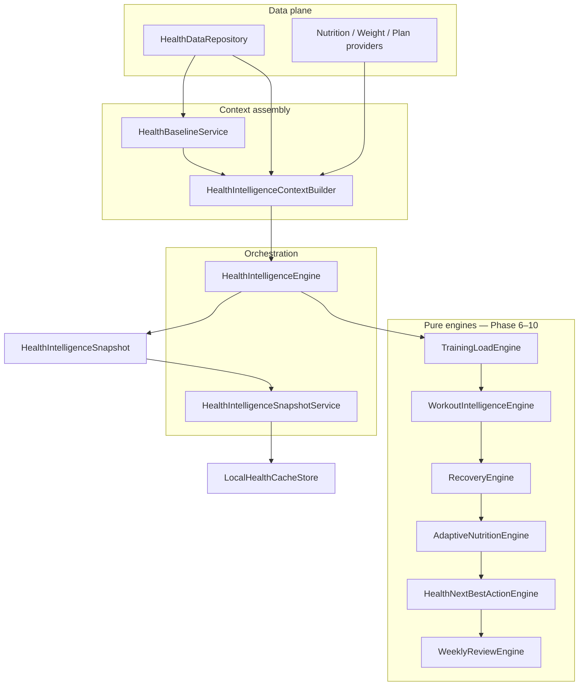

# Health Intelligence — Phase 6–10 Implementation

Production documentation for the completed Health Intelligence engine layer in Forma (Fitness Coach).

**Status:** Engines complete, wired in `AppContainer`, internal snapshot composition enabled by default. UI wiring deferred behind `HealthIntelligenceFeatureFlags.isUIEnabled`.

**Related:** [PHASE_1_5_IMPLEMENTATION.md](./PHASE_1_5_IMPLEMENTATION.md) · [PHASE_6_10_ENGINE_AUDIT.md](./PHASE_6_10_ENGINE_AUDIT.md) · PR [#59](https://github.com/isaacchua0309/FitnessCoach/pull/59)

---

## 1. Overview

Phases 6–10 extend the Phase 1–5 data plane with a **pure, deterministic engine layer** that composes a daily `HealthIntelligenceSnapshot` from normalized repository data, app nutrition/weight/plan providers, and rolling baselines.

### What shipped

| Phase | Deliverable | Primary file(s) |
|-------|-------------|-----------------|
| 6 | Rolling baselines | `HealthBaselineService.swift` |
| 7 | Training load scoring | `TrainingLoadEngine.swift` |
| 8 | Workout + recovery intelligence | `WorkoutIntelligenceEngine.swift`, `RecoveryEngine.swift` |
| 9 | Adaptive nutrition + next best action | `AdaptiveNutritionEngine.swift`, `HealthNextBestActionEngine.swift` |
| 10 | Weekly review synthesis | `WeeklyReviewEngine.swift` |

### Design principles

| Principle | Implementation |
|-----------|----------------|
| Single HealthKit boundary | Engines never import HealthKit; only `HealthDataRepository` reads cache/sync data |
| Pure engines | No repository, UI, or network calls inside engine `evaluate` methods |
| Deterministic output | Same inputs → same snapshot (fixed clock in tests; `generatedAt` from context) |
| Graceful degradation | Per-section fallbacks; one engine failure does not crash the snapshot |
| Conservative confidence | High confidence requires sufficient core signals; scores quantized where appropriate |
| No medical claims | Observational copy only; no diagnosis or treatment language |
| Feature-flagged UI | Engines on by default; visible UI off by default |

### Canonical pipeline

```
HealthDataRepository
→ HealthIntelligenceContextBuilder
→ HealthBaselineService
→ TrainingLoadEngine
→ WorkoutIntelligenceEngine
→ RecoveryEngine
→ AdaptiveNutritionEngine
→ HealthNextBestActionEngine
→ WeeklyReviewEngine
→ HealthIntelligenceSnapshot
```

### Mermaid diagram



---

## 2. Engine architecture

### Protocol layer

All engines are behind injectable protocols defined in `HealthIntelligenceProviding.swift`:

| Protocol | Engine | Output |
|----------|--------|--------|
| `TrainingLoadProviding` | `TrainingLoadEngine` | `TrainingLoadSummary` |
| `WorkoutIntelligenceProviding` | `WorkoutIntelligenceEngine` | `WorkoutSummary` |
| `RecoveryEngineProviding` | `RecoveryEngine` | `RecoverySummary` |
| `AdaptiveNutritionProviding` | `AdaptiveNutritionEngine` | `AdaptiveNutritionSummary` |
| `NextBestActionProviding` | `HealthNextBestActionEngine` | `NextBestAction` |
| `WeeklyReviewProviding` | `WeeklyReviewEngine` | `WeeklyHealthReview?` |

`HealthIntelligenceEngineDependencies` groups production implementations and enables test doubles.

### Layer responsibilities

| Layer | Responsibility | HealthKit? | Repository? |
|-------|----------------|------------|-------------|
| `HealthDataRepository` | Normalized reads, availability, cache | Indirect | Yes |
| `HealthBaselineService` | 7d/28d rolling averages | No | Yes (when used standalone) |
| `HealthIntelligenceContextBuilder` | Single fetch pass, input assembly | No | Yes |
| Engines | Pure scoring/synthesis | No | No |
| `HealthIntelligenceEngine` | Ordered orchestration + fallbacks | No | No |
| `HealthIntelligenceSnapshotService` | Compose + cache + DEBUG verify | No | No |

### App wiring (`AppContainer`)

When `HealthIntelligenceFeatureFlags.healthIntelligenceEnginesEnabled` is true:

1. `HealthIntelligenceContextBuilder` is constructed with `HealthDataRepository`, nutrition/weight/plan providers, and a clock.
2. `HealthIntelligenceEngine` receives the context builder and `HealthIntelligenceEngineDependencies.production()`.
3. `HealthIntelligenceSnapshotService` composes today's snapshot on main-tab bootstrap via `refreshHealthIntelligenceSnapshotIfNeeded()`.
4. DEBUG: Settings → Developer → **Health intelligence snapshot** runs `HealthIntelligenceSnapshotVerifier`.

---

## 3. Data flow

### End-to-end read path

1. **Sync** (background): `HealthSyncService` refreshes normalized cache via `HealthKitManager` → `HealthSampleNormalizer` → `LocalHealthCacheStore`.
2. **Context build** (per snapshot): `HealthIntelligenceContextBuilder.buildContext(for:calendar:)` fetches:
   - 28-day metrics, workouts, sleep, heart, body mass from repository
   - Today's nutrition log + week logs from `HealthIntelligenceNutritionProviding`
   - Weight entries + recent-weight flag from `HealthIntelligenceWeightProviding`
   - User plan from `HealthIntelligenceUserPlanProviding`
   - Availability + permission status from repository
3. **Baselines**: `HealthBaselineService.buildContext` computes rolling averages from prefetched 28-day window **ending before target date**.
4. **Engine evaluation**: `HealthIntelligenceEngine` runs engines in dependency order (see §12).
5. **Snapshot cache**: `HealthIntelligenceSnapshotService` stores result in `LocalHealthCacheStore`.

### Partial authorization

Each signal respects `HealthPermissionStatus`:

- Activity fields (`steps`, `activeEnergyKcal`, `exerciseMinutes`) are `nil` when the corresponding Health type is not readable.
- Recovery falls back to permission-aware baseline summaries when heart/sleep are denied.
- Engines continue to run with available signals; missing signals are recorded explicitly.

### Legacy UI path (unchanged)

Today, Coach, Journey, and Plan still use the legacy training stack (`HealthActivityQueryService`, `TodayMissionControlStateBuilder`, `NextBestActionEngine`) unless/until Phase 11 UI wiring lands behind `isUIEnabled`.

---

## 4. Input/output contracts

### Top-level snapshot

```swift
struct HealthIntelligenceSnapshot {
    let date: Date
    let recovery: RecoverySummary
    let workout: WorkoutSummary?
    let activity: ActivitySummary
    let nutritionAdjustment: AdaptiveNutritionSummary
    let weeklyReview: WeeklyHealthReview?
    let planConfidence: PlanHealthConfidence
    let nextBestAction: NextBestAction
}
```

### Context (`HealthIntelligenceContext`)

Built once per composition. Contains prefetched repository data, `HealthBaselineContext`, engine inputs, nutrition progress, weekly review context, and `generatedAt` timestamp.

Key fields:

| Field | Used by |
|-------|---------|
| `trainingLoadInput` | `TrainingLoadEngine` |
| `baselineContext` | Workout, recovery, adaptive nutrition, weekly review |
| `nutritionProgress` | Adaptive nutrition, next best action |
| `weeklyReviewContext` | Weekly review (when mode allows) |
| `availability` | Activity fallback, NBA availability gate, plan confidence |
| `dataGaps` | Diagnostics (nutrition/weight/plan/samples failures) |

### Compose modes

| Mode | Weekly review |
|------|---------------|
| `.today` | Included only on calendar week-ending day when ≥7 active days |
| `.weeklyReview` | Always attempted when activity threshold met |
| `.preview` | Skipped (lightweight) |

---

## 5. TrainingLoadEngine logic

**File:** `Fitness Coach/Health/Intelligence/TrainingLoadEngine.swift`

### Input

```swift
struct TrainingLoadEngineInput {
    let targetDate: Date
    let workoutsToday: [NormalizedWorkout]
    let workoutsLast7Days: [NormalizedWorkout]
    let workoutsLast28Days: [NormalizedWorkout]
    let baselineAverageWeeklyLoad: Double?  // from baseline × 7
    let calendar: Calendar
}
```

### Scoring

Per-workout load = `durationMinutes × intensityMultiplier × categoryMultiplier`, capped at **200**.

Intensity inferred from calories/minute:

| Calories/min | Intensity | Multiplier |
|--------------|-----------|------------|
| < 6 | Low | 1.0 |
| 6–10 | Moderate | 1.5 |
| > 10 | High | 2.0 |
| Missing calories | Unknown | 1.2 |

Category multipliers: HIIT 1.4, running 1.3, strength 1.2, cycling 1.1, walking 0.75, etc.

### Status buckets

`loadRatio = sevenDayLoad / baselineWeekly` (capped at **2.5×**; baseline floored at **75**):

| Ratio | Status |
|-------|--------|
| < 0.70 | `.light` |
| 0.70–1.30 | `.normal` |
| 1.31–1.70 | `.high` |
| > 1.70 | `.overreaching` |
| Insufficient history | `.unknown` |

### Output (`TrainingLoadSummary`)

`status`, `todayLoad`, `sevenDayLoad`, `twentyEightDayAverageWeeklyLoad`, `loadRatio`, `workoutDays7d`, `workoutDays28d`, `explanation`, `confidence`, `missingSignals`.

---

## 6. WorkoutIntelligenceEngine logic

**File:** `Fitness Coach/Health/Intelligence/WorkoutIntelligenceEngine.swift`

### Input

```swift
struct WorkoutIntelligenceInput {
    let targetDate: Date
    let workoutsToday: [NormalizedWorkout]
    let recentWorkouts: [NormalizedWorkout]
    let trainingLoadSummary: TrainingLoadSummary
    let baselineContext: HealthBaselineContext
    let calendar: Calendar
}
```

### Behavior

1. Filters workouts overlapping target day.
2. Picks primary workout by highest `TrainingLoadScorer` load.
3. Aggregates duration, calories (nil if any workout lacks energy), intensity, demand.
4. Emits hydration/nutrition advice by demand tier.
5. Rest-day path: if no workout today but training load is high/overreaching, suggests a lighter day.

### Demand tiers

| Demand | Typical trigger |
|--------|-----------------|
| `.high` | Demanding category (HIIT/running/strength) ≥45 min at moderate+ intensity, or >60 min moderate+ |
| `.moderate` | 30–60 min sessions |
| `.low` | Short/low-intensity sessions |
| `.unknown` | No duration |

### Output (`WorkoutSummary`)

Includes `hasWorkout`, `primaryWorkoutType`, `title`, `totalDurationMinutes`, `totalActiveCalories`, `demand`, `hydrationAdviceMl`, `nutritionAdvice`, `confidence`, `sourceSummary` (notes calories are estimates).

---

## 7. RecoveryEngine logic

**File:** `Fitness Coach/Health/Intelligence/RecoveryEngine.swift`

### Input

```swift
struct RecoveryEngineInput {
    let targetDate: Date
    let todayMetrics: DailyHealthMetrics
    let yesterdayMetrics: DailyHealthMetrics
    let sleepRecordsRecent: [NormalizedSleepRecord]
    let heartMetricsRecent: [NormalizedHeartMetric]
    let workoutsLast7Days: [NormalizedWorkout]
    let workoutsLast28Days: [NormalizedWorkout]
    let trainingLoadSummary: TrainingLoadSummary
    let baselineContext: HealthBaselineContext
    let calendar: Calendar
}
```

### Scoring model

- Base score: **70**
- Adjustments from sleep, resting HR, HRV, training load status, consecutive workout days, yesterday activity
- Final score quantized to **nearest 5**
- Score omitted when no core sleep/heart signals are present

### Status buckets

| Score | Status |
|-------|--------|
| ≥ 75 (and not limited) | `.ready` |
| 55–74 | `.moderate` |
| < 55 | `.low` |
| No meaningful signals | `.unknown` |

### Limited estimates

When fewer than **2** of sleep / resting HR / HRV are available, output is flagged as a limited estimate in copy and confidence is capped.

### Output (`RecoverySummary`)

`score`, `status`, `title`, `explanation`, `recommendedTraining`, `recommendedNutrition`, `confidence`, `contributingFactors`, `missingSignals`.

---

## 8. AdaptiveNutritionEngine logic

**File:** `Fitness Coach/Health/Intelligence/AdaptiveNutritionEngine.swift`

### Input

```swift
struct AdaptiveNutritionEngineInput {
    let targetDate: Date
    let nutritionProgress: AdaptiveNutritionProgress
    let userPlan: AdaptiveNutritionUserPlan
    let workoutSummary: WorkoutSummary
    let recoverySummary: RecoverySummary
    let activitySummary: ActivitySummary
    let trainingLoadSummary: TrainingLoadSummary
    let baselineContext: HealthBaselineContext
    let calendar: Calendar
}
```

### Behavior

- **Does not change calorie/macro targets** (`shouldChangeTarget` is always `false`).
- Provides post-workout protein guidance (gram ranges by demand), water increase suggestions, and calorie advice strings.
- Priority escalates for low recovery, overreaching load, high demand, or low post-workout calorie progress.
- Records missing signals when nutrition, plan, workout, recovery, or training load are unavailable.

### Protein guidance (after workout)

| Demand | Guidance range |
|--------|----------------|
| High | 30–45 g |
| Moderate | 20–35 g |

Ranges widen when recovery is low or training load is elevated.

### Output (`AdaptiveNutritionSummary`)

`proteinRecommendationGrams`, `suggestedProteinRemaining`, `waterIncreaseMl`, `suggestedWaterRemainingMl`, `calorieAdvice`, `priority`, `confidence`, `missingSignals`, `adjustmentReason`.

---

## 9. HealthNextBestActionEngine logic

**File:** `Fitness Coach/Health/Intelligence/HealthNextBestActionEngine.swift`

> **Note:** Renamed from `NextBestActionEngine` to avoid collision with Today Mission Control's `Features/Today/Model/NextBestActionEngine`.

### Priority-ordered rules

| Priority | Reason | Trigger (summary) |
|----------|--------|-------------------|
| 1 | `.postWorkoutRecovery` | Workout today, moderate/high demand, protein remaining ≥15 g, not yet hit |
| 2 | `.hydration` | Water behind schedule (remaining ≥750 ml or <55% of target) |
| 3 | `.lowRecovery` | Recovery status `.low` |
| 4 | `.noMealLogged` | After 11:00, zero calories logged |
| 5 | `.stepEncouragement` | After 16:00, no workout, steps readable and <3,500 |
| 6 | `.missingWeight` | After 17:00, food logged, no recent weight, not low recovery, no workout |
| 7 | `.stayOnPlan` | Default steady state |

### Anti-nag principles

- Hydration only when water is actually behind (not merely because a workout occurred).
- Weight reminders deferred to evening and skipped on workout/low-recovery days.
- Post-workout protein action expires after **3 hours**.

### Availability gate (before engine)

`HealthIntelligenceBaseline.nextBestAction` returns connect/waiting actions when Health is unavailable or activity reads are missing. Uses `context.generatedAt` for deterministic timestamps.

### Output (`NextBestAction`)

`id`, `title`, `message`, `ctaTitle`, `destination` (`.logMeal`, `.addWater`, `.askCoach`, etc.), `priority`, `reason`, `createdAt`, `expiresAt`.

---

## 10. WeeklyReviewEngine logic

**File:** `Fitness Coach/Health/Intelligence/WeeklyReviewEngine.swift`

### Input

```swift
struct WeeklyReviewEngineInput {
    let weekStartDate: Date
    let weekEndDate: Date
    let dailyMetrics: [DailyHealthMetrics]
    let workouts: [NormalizedWorkout]
    let recoverySummaries: [DailyRecoverySummary]
    let nutritionDailySummaries: [WeeklyNutritionDailySummary]
    let weightRecords: [NormalizedBodyMass]
    let userPlan: WeeklyReviewUserPlan
    let calendar: Calendar
    let generatedAt: Date
}
```

### Synthesis

1. Builds `WeeklyStats` (workouts, steps, protein/calorie hit days, recovery averages, weight change).
2. Derives **wins** and **risks** with stable priority ordering.
3. Builds **nextWeekFocus** (max **3** items) from risks and missing signals.
4. Assigns confidence from health, nutrition, weight, and recovery coverage.

### Confidence

| Level | Requirements |
|-------|--------------|
| `.high` | ≥4 health days, ≥4 nutrition days, ≥2 weight records, ≥3 recovery days with known status |
| `.moderate` | Health + nutrition thresholds met |
| `.low` | Otherwise |

### Output (`WeeklyHealthReview`)

`title`, `summary`, `stats`, `wins`, `risks`, `nextWeekFocus`, `confidence`, `missingSignals`, `generatedAt`.

---

## 11. HealthIntelligenceContextBuilder role

**File:** `Fitness Coach/Health/Intelligence/HealthIntelligenceContextBuilder.swift`

The context builder is the **only** place engines get repository and app data. Responsibilities:

1. **Single fetch pass** — parallel async loads for 28-day health window + week nutrition/weight.
2. **Calendar-safe windows** — `inclusiveDayRange`, `startOfDay` normalization, baseline window ending **before** target date.
3. **Baseline assembly** — delegates to `HealthBaselineService.buildContext(prefetched:)`.
4. **Training load input** — sets `baselineAverageWeeklyLoad = averageWorkoutLoad28d × 7`.
5. **Nutrition progress** — maps `DailyLog` → `AdaptiveNutritionProgress` via `DailyNutritionSummaryBuilder`.
6. **Weekly review context** — bundles week metrics, workouts, logs, merged weight records, activity threshold flag.
7. **Data gap tracking** — `nutritionUnavailable`, `weightUnavailable`, `userPlanUnavailable`, `normalizedSamplesFailed`.
8. **Provider adapters** — `DailyLogNutritionProvider`, `WeightLogWeightProvider`, `UserProfilePlanProvider` hop to MainActor for SwiftData reads.

Engines receive immutable `HealthIntelligenceContext` and never call back to the repository.

---

## 12. HealthIntelligenceSnapshot composition order

**File:** `Fitness Coach/Health/Intelligence/HealthIntelligenceEngine.swift`

```
1. Build context          HealthIntelligenceContextBuilder.buildContext
2. Training load          TrainingLoadEngine.evaluate(trainingLoadInput)
3. Workout                WorkoutIntelligenceEngine.evaluate(workoutInput)
4. Recovery               RecoveryEngine.evaluate(recoveryInput)
5. Activity               context.activitySummary()  [permission-aware]
6. Adaptive nutrition     AdaptiveNutritionEngine.evaluate(adaptiveNutritionInput)
7. Next best action       availability gate OR HealthNextBestActionEngine.evaluate
8. Weekly review          WeeklyReviewEngine.evaluate (mode-dependent)
9. Plan confidence        HealthIntelligenceBaseline.planConfidence
10. Assemble snapshot     HealthIntelligenceSnapshot(...)
```

### Weekly review sub-pipeline

When weekly review is included:

1. `HealthIntelligenceWeeklyReviewSupport.recoverySummariesForWeek` evaluates recovery for each day in the week (reuses training load + recovery providers).
2. `context.weeklyReviewInput` assembles `WeeklyReviewEngineInput`.
3. `WeeklyReviewEngine.evaluate` or baseline weekly review fallback.

---

## 13. Fallback behavior

Each section uses `runSection` / `runOptionalSection` with try/catch logging via `HealthIntelligenceEngineLogger.sectionFailure`.

| Section | On failure / missing |
|---------|---------------------|
| Training load | `TrainingLoadSummary.unknown` |
| Workout | `WorkoutSummary.noWorkout` (nil in snapshot) |
| Recovery | Permission-aware `HealthIntelligenceBaseline.recoverySummary` or `.unknown` |
| Activity | Permission-filtered metrics via `activityFallback` |
| Adaptive nutrition | `AdaptiveNutritionSummary.none` |
| Next best action | `stayOnPlanAction` or availability connect/waiting action |
| Weekly review | `HealthIntelligenceBaseline.weeklyReview` or `nil` |
| Plan confidence | Baseline plan confidence from availability + activity days |

**Guarantee:** `composeSnapshot` never throws to callers; it always returns a snapshot.

---

## 14. Confidence scoring principles

| Domain | Conservative rules |
|--------|-------------------|
| **Recovery** | High requires ≥3 reliable signals, ≥2 core sleep/heart signals, and not a limited estimate |
| **Training load** | High requires ≥3 workouts in 28d, reliable baseline, and no missing intensity data |
| **Workout** | High requires duration, type, and calories; moderate without calories |
| **Adaptive nutrition** | High only when workout confidence is `.high` and calories present |
| **Weekly review** | High requires health + nutrition + weight + recovery coverage |
| **Plan confidence** | Tied to availability and count of active days (7 days → "Moderate" label) |

### Precision rules

- Recovery scores quantized to 5-point steps; hidden without core sleep/heart signals.
- Training load ratios capped at 2.5×; sparse baselines floored at 75 weekly load units.
- Weekly recovery averages rounded to whole numbers.
- Calorie displays use integer rounding with explicit "estimates" copy in workout summaries.

---

## 15. Missing signal handling

Each summary type carries an explicit `missingSignals` set (or equivalent fields):

| Model | Example signals |
|-------|-----------------|
| `RecoverySummary` | `.sleep`, `.restingHeartRate`, `.hrv`, `.trainingLoad`, `.workouts`, `.activity` |
| `TrainingLoadSummary` | `.workoutHistory`, `.baseline`, `.intensityData`, `.calories` |
| `AdaptiveNutritionSummary` | `.nutritionProgress`, `.userPlan`, `.workout`, `.recovery`, `.trainingLoad` |
| `WeeklyHealthReview` | `.activity`, `.workouts`, `.nutrition`, `.weight`, `.recovery`, `.sleep`, `.hrv` |
| `HealthBaselineContext` | `HealthBaselineSignal` per metric |

UI should surface missing signals rather than hiding gaps. Confidence is downgraded when signals are missing; status may still be computed from partial data with limited-estimate copy.

---

## 16. Testing strategy

### Unit tests (per engine)

| Test file | Coverage |
|-----------|----------|
| `HealthBaselineServiceTests` | Rolling averages, insufficient history |
| `TrainingLoadEngineTests` | Load ratios, outliers, missing intensity |
| `RecoveryEngineTests` | Signal adjustments, confidence, quantization |
| `WorkoutIntelligenceEngineTests` | Demand tiers, rest days |
| `AdaptiveNutritionEngineTests` | Protein/water guidance, priorities |
| `HealthNextBestActionEngineTests` | Priority conflicts, anti-nag |
| `WeeklyReviewEngineTests` | Wins/risks/focus, confidence, determinism |

### Orchestration tests

| Test file | Coverage |
|-----------|----------|
| `HealthIntelligenceEngineTests` | Full compose, unavailable health, partial failure |
| `HealthIntelligenceContextBuilderTests` | Fetch assembly, data gaps, date windows |
| `HealthIntelligenceCompositionTests` | Protocol wiring, compose modes |
| `HealthIntelligenceBaselineTests` | Baseline helpers, plan confidence |

### Integration tests

| Test file | Coverage |
|-----------|----------|
| `HealthIntelligencePipelineIntegrationTests` | 16 end-to-end scenarios with fake repository/providers |
| `HealthIntelligenceProductionHardeningTests` | Stable ordering, anti-nag, load caps, partial auth |
| `HealthIntelligenceSnapshotVerifierTests` | DEBUG verification report shape |

### Test harness

`HealthIntelligencePipelineTestHarness` (`Fitness CoachTests/TestingSupport/HealthIntelligencePipelineTestSupport.swift`) runs the full pipeline without HealthKit:

- `PipelineMockRepository` — configurable availability, metrics, workouts, heart, sleep
- `PipelineMockNutritionProvider` / `PipelineMockWeightProvider` / `PipelineMockUserPlanProvider`
- `PipelineFailingTrainingLoadProvider` / `PipelineFailingRecoveryProvider` — degradation tests

### Running tests (macOS)

```bash
xcodebuild -scheme "Fitness Coach" \
  -destination 'platform=iOS Simulator,name=iPhone 16' \
  test
```

Targeted:

```bash
xcodebuild -scheme "Fitness Coach" \
  -destination 'platform=iOS Simulator,name=iPhone 16' \
  test \
  -only-testing:"Fitness CoachTests/HealthIntelligencePipelineIntegrationTests" \
  -only-testing:"Fitness CoachTests/HealthIntelligenceProductionHardeningTests"
```

### DEBUG tooling

- `HealthIntelligenceSnapshotVerifier` — safe log of snapshot shape (no raw HealthKit payloads)
- `HealthIntelligenceMocks` — scenario factories (`mockReadyDay`, `mockLowRecoveryDay`, etc.)
- Settings → Developer → **Health intelligence snapshot**

---

## 17. Known limitations

| Limitation | Notes |
|------------|-------|
| **UI not wired** | `isUIEnabled` defaults to `false`; Today still uses legacy Mission Control NBA |
| **Dual NBA systems** | `HealthNextBestActionEngine` vs `Features/Today/Model/NextBestActionEngine` — merge strategy required for Phase 11 |
| **Baseline vs scorer load** | `HealthBaselineService` uses `HealthTrainingLoadCalculator`; `TrainingLoadEngine` uses `TrainingLoadScorer` — intentional separation, ratios are approximate |
| **No AI backend** | Weekly review is rule-based synthesis, not LLM-generated |
| **MainActor nutrition reads** | Context builder hops to MainActor for SwiftData providers |
| **Weekly review cost** | Week mode evaluates recovery × 7 days — acceptable for daily/weekly refresh, not per-frame |
| **Plan confidence is Phase 5 baseline** | Uses activity-day count; does not yet incorporate logging consistency or load trends (`PlanConfidenceEngine` TODO) |
| **Repository routing flag** | Legacy UI may still bypass repository depending on `isRepositoryReadRoutingEnabled` |
| **Single-user cache** | Snapshot cache is local per device user |

---

## 18. Next phase UI wiring plan

Enable with `FORMA_HEALTH_INTELLIGENCE_UI_ENABLED=1` after screen-level integration and QA.

### Today — Recovery

| Source | `HealthIntelligenceSnapshot.recovery` |
|--------|---------------------------------------|
| Target surface | Today dashboard recovery card / header |
| Fields | `status`, `title`, `explanation`, `confidence`, `missingSignals` |
| Fallback | Show "Recovery unclear" when `.unknown`; never show precise score when `score == nil` |
| Flag | `isUIEnabled` |

### Today — Daily Mission

| Source | `activity`, `workout`, `trainingLoad` (via cached snapshot or live compose) |
|--------|---------------------------------------------------------------------------|
| Target surface | `TodayMissionControlState` enrichment |
| Approach | Add optional `HealthIntelligenceSnapshot` input to `TodayMissionControlInputs`; map `activity.steps` when permission allows |
| Constraint | Do not replace existing step/workout detection — supplement only |

### Today — Nutrition

| Source | `nutritionAdjustment` + `nutritionProgress` from context |
|--------|----------------------------------------------------------|
| Target surface | Today nutrition card / post-workout hints |
| Fields | `proteinRecommendationGrams`, `waterIncreaseMl`, `calorieAdvice`, `priority` |
| Constraint | `shouldChangeTarget` remains `false` — display guidance only |

### Today — Next Best Action

| Source | `nextBestAction` |
|--------|------------------|
| Target surface | Replace or merge with `TodayNextBestActionState` |
| Approach | Introduce `TodayHealthNextBestActionAdapter` mapping `NextBestActionDestination` → `TodayNextBestActionCTA` |
| Priority | Health NBA wins when `isUIEnabled` and snapshot is fresh; legacy `NextBestActionEngine` remains fallback |
| Conflict | Map `.postWorkoutRecovery` / `.hydration` / `.lowRecovery` to existing analytics reasons |

### Coach — workout-aware responses

| Source | `workout`, `recovery`, `nutritionAdjustment`, `trainingLoad` |
|--------|--------------------------------------------------------------|
| Target surface | Coach context packet / system prompt assembly |
| Approach | Pass summarized snapshot fields into coach context (no raw HealthKit samples) |
| Copy | Use `workout.explanation`, `recovery.recommendedNutrition`, `nutritionAdjustment.adjustmentReason` |

### Journey — Weekly Reviews

| Source | `weeklyReview` |
|--------|----------------|
| Target surface | Journey weekly recap card |
| Trigger | `.weeklyReview` mode on week-ending day or Journey pull-to-refresh |
| Fields | `title`, `summary`, `wins`, `risks`, `nextWeekFocus`, `confidence` |

### Journey — Recovery Timeline

| Source | Per-day `RecoverySummary` history from cached snapshots |
|--------|--------------------------------------------------------|
| Target surface | Journey timeline chart |
| Approach | Store daily snapshots in cache; render `status` + optional quantized `score` |

### Journey — Workout History

| Source | `workout` + repository workouts |
|--------|----------------------------------|
| Target surface | Journey workout list |
| Approach | Prefer `WorkoutSummary` for today; repository `NormalizedWorkout` for history |
| Constraint | Keep existing workout detection path until repository routing is universal |

### Plan — Confidence / Assumptions

| Source | `planConfidence`, `recovery.missingSignals`, `nutritionAdjustment.missingSignals` |
|--------|----------------------------------------------------------------------------------|
| Target surface | `PlanDashboardContent` `.planConfidence` entry (already scaffolded) |
| Fields | `planConfidence.label`, `planConfidence.score`, missing-signal explanations |
| Approach | Wire `HealthIntelligenceSnapshot` reader in Plan view model; show assumptions when confidence < high |

### Recommended rollout order

1. Cache read API exposed to Today/Plan view models (read-only).
2. Today Recovery + Nutrition hints (lowest NBA conflict).
3. Plan Confidence card.
4. Journey Weekly Review (week-end compose mode).
5. Today NBA merge (highest UX risk — requires analytics mapping).
6. Coach context enrichment.
7. Journey timeline + workout history polish.

---

## File index

| Path | Role |
|------|------|
| `Fitness Coach/Health/Intelligence/HealthIntelligenceEngine.swift` | Orchestrator |
| `Fitness Coach/Health/Intelligence/HealthIntelligenceContextBuilder.swift` | Context assembly |
| `Fitness Coach/Health/Intelligence/HealthIntelligenceContext+Composition.swift` | Input builders + weekly review support |
| `Fitness Coach/Health/Intelligence/HealthIntelligenceProviding.swift` | Protocols + dependencies |
| `Fitness Coach/Health/Intelligence/Baselines/HealthBaselineService.swift` | Rolling baselines |
| `Fitness Coach/Health/Intelligence/TrainingLoadEngine.swift` | Training load |
| `Fitness Coach/Health/Intelligence/WorkoutIntelligenceEngine.swift` | Workout summary |
| `Fitness Coach/Health/Intelligence/RecoveryEngine.swift` | Recovery scoring |
| `Fitness Coach/Health/Intelligence/AdaptiveNutritionEngine.swift` | Nutrition guidance |
| `Fitness Coach/Health/Intelligence/HealthNextBestActionEngine.swift` | Next best action |
| `Fitness Coach/Health/Intelligence/WeeklyReviewEngine.swift` | Weekly review |
| `Fitness Coach/Health/Intelligence/HealthIntelligenceBaseline.swift` | Phase 5 fallback helpers |
| `Fitness Coach/Health/Intelligence/HealthIntelligenceSnapshotService.swift` | Compose + cache |
| `Fitness Coach/Health/Models/HealthIntelligenceSnapshot.swift` | Output contract |
| `Fitness Coach/Health/HealthIntelligenceFeatureFlags.swift` | Rollout flags |
| `Fitness Coach/App/AppContainer.swift` | DI wiring |

---

*Last updated: July 2026 — Phase 6–10 engine implementation complete.*
