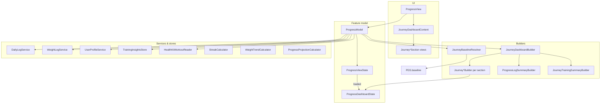

# Journey — Architecture & Product Contract

**Tab label:** Journey  
**Navigation title:** Journey  
**Code names (legacy, intentional):** `ProgressView`, `ProgressModel`, `ProgressDashboardState`, `AppTab.progress`

The product surface is **Journey**. Types and folders still use `Progress*` in places; do not rename without a dedicated migration — treat `Progress*` as the Journey implementation layer.

**Related:** [Architecture.md](./Architecture.md) (app shell), [FormaCalculationSpec.md](./FormaCalculationSpec.md) (plan targets), `Fitness CoachTests/JourneyManualQAChecklistTests.swift` (executable QA matrix).

---

## 1. Product purpose

Journey answers: **“What is my fitness story so far?”**

It is **not** a passive analytics spreadsheet. It is a narrative dashboard:

- **Transformation** — where you started, where you are, where you’re headed
- **Consistency** — this week’s habits and streaks
- **Milestones & timeline** — checkpoints and memorable moments
- **Insight** — what habits likely helped, what to focus on next
- **Motivation** — level/XP from real behaviors (not vanity metrics)

Journey **surfaces** insight and routes CTAs. It does **not** own logging mutations (see [Read-only rule](#5-read-only-rule)).

---

## 2. Section order (canonical)

Order is defined in `JourneyProductLayout.sectionOrder` and rendered by `JourneyDashboardContent`. User-facing titles come from `FormaProductCopy.Journey`.

| # | `JourneyProductSection` | UI title | Builder / state field |
|---|-------------------------|----------|------------------------|
| 1 | `transformation` | Transformation hero | `JourneyTransformationHeroBuilder` → `transformation` |
| 2 | `weeklyReview` | **This week** | `JourneyWeeklyReviewBuilder` → `weeklyReview` |
| 3 | `milestones` | Milestones | `JourneyMilestonesBuilder` → `milestones` |
| 4 | `storyTimeline` | Your story | `JourneyTimelineBuilder` → `storyTimeline` |
| 5 | `habitInsights` | Habit insights | `JourneyHabitInsightsBuilder` → `habitInsights` |
| 6 | `whyProgress` | What's driving your progress | `JourneyProgressAttributionBuilder` → `progressAttribution` |
| 7 | `beforeToday` | Before vs today | `JourneyBeforeTodayBuilder` → `beforeToday` |
| 8 | `personalRecords` | Personal records | `JourneyPersonalRecordsBuilder` → `personalRecords` |
| 9 | `monthlyRecap` | Monthly recap | `JourneyMonthlyRecapBuilder` → `monthlyRecap` |
| 10 | `journeyLevel` | Your level | `JourneyLevelBuilder` → `journeyLevel` |
| 11 | `detailedAnalytics` | Detailed analytics | `JourneyDashboardBuilder.detailedAnalytics` → `detailedAnalytics` |

**Notes:**

- “Why Progress Happened” in product language maps to `whyProgress` / `JourneyWhyProgressSection` / `JourneyProgressAttributionState`.
- Detailed analytics is **collapsed by default** at the bottom; expanding it logs `journey_analytics_expanded`.
- There is **no** consistency calendar, achievements gallery, or coach-insights section in the live scroll — one implementation only.

---

## 3. Data flow



### Layer responsibilities

| Layer | Types | Role |
|-------|--------|------|
| **View** | `ProgressView`, `JourneyDashboardContent`, `Journey*Section` | Layout, pull-to-refresh, CTA routing, accessibility, analytics `onAppear` |
| **Model** | `ProgressModel`, `ProgressViewState` | Async load/refresh, date windows, service calls, assemble `ProgressDashboardState` |
| **State** | `ProgressDashboardState`, `JourneyDashboardTypes` | Immutable dashboard payload for one render |
| **Orchestration** | `JourneyDashboardBuilder` | Fan-out to section builders; shared `Context` |
| **Baseline** | `JourneyBaselineResolver` | Single source of truth for start weight, chart points, progress % |
| **Metrics** | `JourneyLogMetrics`, `ProgressLogSummaryBuilder` | Shared day/week aggregations |
| **Training** | `JourneyTrainingSummaryBuilder` | Apple Health weekly status + workout analytics display |
| **Analytics** | `JourneyAnalyticsCoordinator`, `JourneyAnalyticsLogging` | Bucketed, privacy-safe events |

### `ProgressModel.makeDashboardState` pipeline

1. **Read logs** — `DailyLogService` (range, week, previous week, month, maturity/all-time window).
2. **Read weights** — `WeightLogService` (range + all-time for baseline).
3. **Training** — `TrainingInsightsStore` + `HealthKitWorkoutReading` for connected workout days.
4. **Profile** — `UserProfileService.getCurrentProfile()`.
5. **Summaries** — `WeightTrendCalculator`, `ProgressLogSummaryBuilder`, `JourneyTrainingSummaryBuilder`.
6. **Baseline** — `JourneyBaselineResolver.resolve` (includes `ProgressProjectionCalculator` for pace forecast).
7. **Streaks** — `StreakCalculator` → `JourneyStreakBuilder`.
8. **Sections** — `JourneyDashboardBuilder.*` for each `ProgressDashboardState` field.
9. **Publish** — `ProgressViewState.loaded(ProgressDashboardState)`.

### Refresh triggers

- `.task` on first appear → `loadProgress()`
- Pull-to-refresh → `refresh()`
- `AppRefreshCenter.refreshToken` change (after Coach / Action Center mutations)
- Range selector → `selectRange(days:)` → `refresh()`
- Re-appear when already loaded → `refresh()` (keeps tab fresh)

### CTA routing

`JourneyCTA` → `JourneyCTAHandler` → `onOpenCoach` / `onOpenPlan` (injected from `MainTabView`). Journey never calls `FitnessActionCenter` directly.

### File locations

```
Fitness Coach/Features/Journey/
  ProgressView.swift
  Components/JourneyDashboardContent.swift
  Components/Journey*Section.swift
  Model/ProgressModel.swift
  Model/ProgressDashboardState.swift
  Model/JourneyDashboardBuilder.swift
  Model/Journey*Builder.swift
  Model/JourneyBaselineResolver.swift
  Model/JourneyProductLayout.swift
  Model/JourneyAnalyticsCoordinator.swift

Fitness Coach/Domain/Journey/
  JourneyAnalyticsLogging.swift
```

---

## 4. Baseline rules

Implemented in `JourneyBaselineResolver` — **do not duplicate** progress % or chart-point logic elsewhere.

### Journey start date

`journeyStartDate` = earliest of profile `createdAt`, first food log, first weight entry (start of day).

### Onboarding / profile baseline

- `onboardingBaselineWeightKg` — profile/onboarding anchor for chart lead-in when it differs from earliest log.
- `usesSyntheticBaselinePoint` — start weight comes from profile, not earliest `WeightEntry`.

### Synthetic first point

When there are **no** weight logs, chart can still render from profile anchor + optional “today” point (`showsWeightChart` — **no two-log gate**).

When logs exist, a **synthetic lead-in** at `startDate` is added if the first log is on a different day or weight than the onboarding anchor (deduped per day; real log wins over synthetic on same day).

### Real `WeightEntry` precedence

- **Start weight (0 logs):** profile `currentWeightKg` (synthetic).
- **Start weight (1 log):** earliest log, or profile anchor if trusted onboarding weight differs materially.
- **Start weight (2+ logs):** earliest log only — profile edits must not move the historical anchor.
- **Current weight:** latest `WeightEntry`, else profile `currentWeightKg`.

### Goal direction

`JourneyGoalDirection.resolve(startWeightKg, goalWeightKg)` → `.lose` | `.gain` | `.maintain` (±0.1 kg tolerance for maintain).

### Progress percent

`goalProgressPercent(start, current, goal, direction)` — clamped 0…100 toward goal; `nil` when start ≈ goal or weights missing.

### Detailed analytics range

`JourneyBaselineResolver.chartPointsInRange` filters chart points for the selected range while preserving synthetic lead-in when needed.

---

## 5. Read-only rule

| Allowed on Journey | Not allowed on Journey |
|------------------|-------------------------|
| Read via log/profile services | `FoodLogService` / `WaterLogService` / `WeightLogService` writes |
| CTAs that **navigate** to Coach or Plan | `FitnessActionCenter` mutations |
| Range selection (re-query only) | Plan target edits |
| Analytics logging | Direct HealthKit permission requests (Plan handles connect) |

**Mutation owners:** `FitnessActionCenter` (Coach tab, capture flows), Plan edit wizard for goals/Health connect.

**Today tab** is also read-mostly for mutations; Coach is the primary write path.

---

## 6. XP rules (`JourneyLevelBuilder`)

XP reflects **consistency behaviors**, not app opens or vanity actions.

### Daily behavior XP (per calendar day, capped)

| Behavior | XP | Condition |
|----------|-----|-----------|
| Food logged | 10 | `totals.calories > 0` |
| Protein goal | 10 | ≥90% of protein target |
| Water goal | 5 | ≥80% of water target |
| Calorie adherence | 10 | within 10% of calorie target |
| Workout day | 15 | Apple Health connected + workout on that day |

- **Daily cap:** 50 XP per day (sum of behaviors above).
- **Same-day edits:** multiple log rows on one day use the **latest** representative log only — no XP stacking from repeated edits.

### Weight XP

- **10 XP per calendar week** with at least one weight log (one award per week, not per entry).

### Milestone XP

- **25 XP per unlocked milestone** (count passed from `JourneyMilestonesBuilder`).

### Not awarded

- App open / screen view
- Pull-to-refresh
- Expanding detailed analytics
- Synthetic baseline or profile-only state (level stays empty copy until `totalXP > 0`)

---

## 7. Analytics events

Implementation: `Domain/Journey/JourneyAnalyticsLogging.swift`, wired via `AppContainer.makeJourneyAnalyticsCoordinator()` and `ProgressView`.

### Events

| Event key | When fired |
|-----------|------------|
| `journey_screen_viewed` | First appear per dashboard session |
| `journey_transformation_viewed` | Transformation section appears |
| `journey_weekly_review_viewed` | This week section appears |
| `journey_milestone_rail_viewed` | Milestones section appears |
| `journey_timeline_viewed` | Story timeline section appears |
| `journey_habit_insight_viewed` | Habit insights section appears |
| `journey_weight_cta_tapped` | Log weight CTA |
| `journey_coach_cta_tapped` | Log food / water / protein CTA |
| `journey_analytics_expanded` | Detailed analytics expanded |
| `journey_range_changed` | Range selector (7 / 14 / 28 days) |

Section events fire **once per session** per section (`JourneyAnalyticsCoordinator` dedupes). Context refresh resets session counters.

### Properties (all optional strings / ints — bucketed)

| Property | Meaning |
|----------|---------|
| `has_profile` | Profile exists |
| `has_weight_logs` | Real `WeightEntry` rows |
| `uses_synthetic_baseline` | Baseline uses profile/synthetic anchor |
| `progress_percent_bucket` | `none`, `1_10`, `11_25`, `26_50`, `51_75`, `76_99`, `complete` |
| `current_streak_bucket` | `0`, `1_3`, `4_7`, `8_14`, `15_plus` |
| `unlocked_milestone_count` | Integer count |
| `health_connected` | Apple Health connected |
| `journey_level` | Current level number |
| `range_days` | 7, 14, or 28 |
| `cta_type` | `log_weight`, `log_food`, etc. |
| `expanded` | Detailed analytics toggle |

### Privacy rules

- **Never** log raw weight (kg/lb), calories, macros, or meal identifiers.
- **Never** log free-text copy or PII.
- Use **buckets** for progress and streaks only.
- Default logger is `NoOpJourneyAnalyticsLogger`; production wiring swaps in a real `JourneyAnalyticsLogging` adapter at the app boundary.

`connectAppleHealth` and `updateGoal` CTAs are **not** logged as Journey analytics events (handled on Plan / Health flows).

---

## 8. Out of scope (current Journey)

Explicitly **not** part of the live Journey contract:

| Topic | Status |
|-------|--------|
| **Dynamic Calories** | Plan/Today concern; Journey shows summaries only |
| **Cloud log sync** | Local SwiftData + profile cloud; Journey reads local services |
| **Full achievements gallery** | Removed; milestones rail is the checkpoint UX |
| **Manual gym logging** | Training on Journey is **Apple Health only**; no manual workout entry |
| **AI-generated runtime recaps** | Copy is deterministic from builders; no LLM recap on scroll |
| **`WeeklyReviewEntity` persistence** | “This week” is built from `DailyLog` via `JourneyWeeklyReviewBuilder`, not SwiftData `WeeklyReviewEntity` |
| **Consistency calendar grid** | Removed from product |
| **Feature flags** for Journey layout | Single canonical layout only |

---

## Code name cheat sheet

| Product term | Code / file (keep unless migrating) |
|--------------|-------------------------------------|
| Journey tab | `AppTab.progress`, `MainTabView` Journey tab |
| Journey screen | `ProgressView` |
| Journey model | `ProgressModel` |
| Dashboard state | `ProgressDashboardState` |
| Why Progress Happened | `JourneyProductSection.whyProgress`, `JourneyWhyProgressSection` |
| This Week | `weeklyReview`, `JourneyWeeklyReviewSection` |

---

## Document history

| Date | Change |
|------|--------|
| 2026-06-28 | Initial Journey architecture doc (post-redesign, single implementation) |
