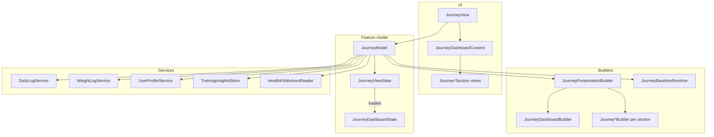

# Journey — Architecture & Product Contract

**Tab label:** Journey  
**Navigation title:** `FormaProductCopy.Journey.Header.title` ("Your journey")  
**Code names:** `JourneyView`, `JourneyModel`, `JourneyDashboardState`, `AppTab.journey`

**Related:** [ANALYTICS.md](./ANALYTICS.md), [WeeklyProgressLoopV1.md](./WeeklyProgressLoopV1.md)

---

## 1. Product purpose

Journey answers: **"What is my fitness story so far?"**

It is a narrative dashboard — transformation, weekly consistency, milestones, story timeline, personal insights, monthly recap, and chapter progression. Journey **surfaces** insight and routes CTAs; it does **not** own logging mutations.

Removed from the live scroll (revamp 2026): habit-insights cards, progress attribution, before-vs-today, personal records, cosmetic level/XP display, and collapsible detailed analytics.

---

## 2. Section order (canonical)

Defined in `JourneyProductLayout.sectionOrder`, rendered by `JourneyDashboardContent`, gated by `JourneyDashboardState` visibility helpers.

| # | `JourneyProductSection` | Builder / state field |
|---|-------------------------|------------------------|
| 1 | `header` | `JourneyPresentationBuilder.header` → `header` |
| 2 | `transformation` | `JourneyHeroBuilder` → `transformation` |
| 3 | `goalProjection` | `JourneyGoalProjectionBuilder` → `goalProjection` |
| 4 | `weeklyProgress` | `UnifiedWeeklyReviewPresentationBuilder` → hero via `WeeklyProgressHeroSection`; summary on `JourneyDashboardState.weeklyProgressSummary` |
| 5 | `healthIntelligence` | `JourneyHealthIntelligenceSectionLoader` (optional; flag + HK) |
| 6 | `milestones` | `JourneyNextMilestoneBuilder` → `milestone` |
| 7 | `weeklyReview` | `JourneyWeeklyPatternBuilder` → `weeklyHabit` (legacy rows; collapsed when weekly progress hero visible) |
| 8 | `storyTimeline` | `JourneyTimelineBuilder` → `storyEvents` |
| 9 | `insights` | `JourneyPersonalizedInsightsBuilder` → `insight` |
| 10 | `monthlyRecap` | `JourneyMonthlyRecapBuilder` → `monthlyRecap` |
| 11 | `chapters` | `JourneyChapterBuilder` → `chapter` |
| 12 | `startingEmptyState` | `JourneyStartingEmptyStateView` when `!hasMeaningfulJourneyData` |

`hasMeaningfulJourneyData` hides data-rich sections for brand-new users; they see header, transformation hero, next milestone, and the "Go to Today" empty state.

### Weekly Progress Loop v1 (hero)

The **`weeklyProgress`** section is the primary week-2 ritual surface (see [`Docs/WeeklyProgress/WeeklyProgressLoopV1.md`](WeeklyProgress/WeeklyProgressLoopV1.md)):

- Built from `WeeklyProgressSummary` via `WeeklyProgressSummaryBuilder` (local `DailyLog` + `WeightEntry` — **no HealthKit required** for the core loop).
- `WeeklyProgressHeroSection` shows maintenance estimate, plan recommendation, weight spike education, and CTAs.
- Tap opens `WeeklyReviewDetailView` (canonical weekly detail sheet).
- Legacy `weeklyReview` habit rows remain for training fallback but collapse when the hero is shown.

---

## 3. Data flow

```mermaid
flowchart TB
    subgraph ui [UI]
        JV[JourneyView]
        JDC[JourneyDashboardContent]
        Sections[Journey*Section views]
    end

    subgraph model [Feature model]
        JM[JourneyModel]
        JVS[JourneyViewState]
        JDS[JourneyDashboardState]
    end

    subgraph orchestration [Builders]
        JPB[JourneyPresentationBuilder]
        JDB[JourneyDashboardBuilder]
        JBR[JourneyBaselineResolver]
        Sub[Journey*Builder per section]
    end

    subgraph services [Services]
        DLS[DailyLogService]
        WLS[WeightLogService]
        UPS[UserProfileService]
        TIS[TrainingInsightsStore]
        HK[HealthKitWorkoutReader]
    end

    JV --> JM
    JM --> JVS
    JVS -->|loaded| JDS
    JV --> JDC
    JDC --> Sections

    JM --> DLS & WLS & UPS & TIS & HK
    JM --> JBR
    JM --> JPB
    JPB --> JDB
    JPB --> Sub
```

`JourneyModel` loads logs, weights, profile, and training status, resolves baseline, then calls `JourneyPresentationBuilder.buildDashboard`.

---

## 4. Copy & design

- User-facing strings: `FormaProductCopy.Journey.*`
- Layout tokens: `JourneyLayout`, `JourneyDesign`
- Previews: `JourneyPreviewData` (brand-new, week-one, strong momentum, sparse, food-only, weight-no-loss)

---

## 5. Analytics (revamp)

Canonical events (`JourneyAnalyticsEvent`): `journey_viewed`, `journey_hero_viewed`, `journey_projection_viewed`, `journey_milestone_viewed`, `journey_milestone_cta_tapped`, `journey_weekly_consistency_viewed`, `journey_story_viewed`, `journey_insights_viewed`, `journey_monthly_recap_viewed`, `journey_chapter_viewed`, `journey_go_to_today_tapped`, plus weight/coach CTA events.

Properties are bucketed (`user_stage`, `has_projection`, `milestone_type`, `chapter`, `insight_count`, `weekly_completion_bucket`, etc.) — no raw weights or calories.

Pre-revamp event names remain in the enum for adapter compatibility but are **not emitted** from Journey UI.

---

## 6. Chapter progression

`JourneyChapterBuilder` awards XP from real logged behaviors (meals, protein, water, workouts, weight, milestones). Chapters advance every 200 XP. UI shows chapter number, title, and progress bar — not raw "Level X / Y XP" labels.

---

## 7. QA guardrails

- `JourneyRevampQAChecklistTests` — eight executable product scenarios
- `JourneyCleanupTests` — layout regression, banned copy across preview personas
- `JourneyCopyTests` — tone and removed-legacy phrase checks
